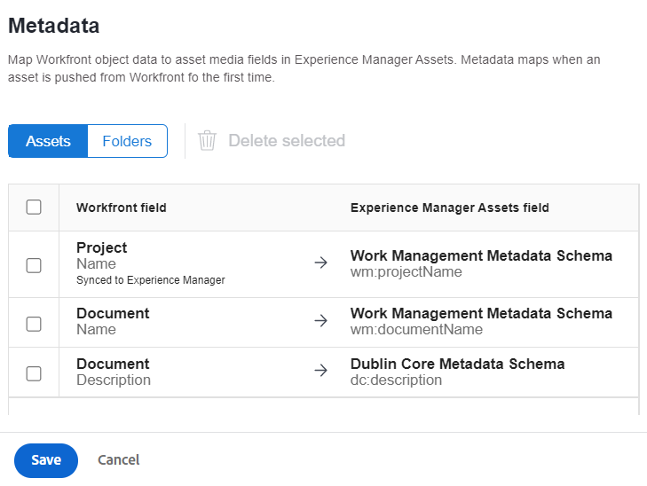
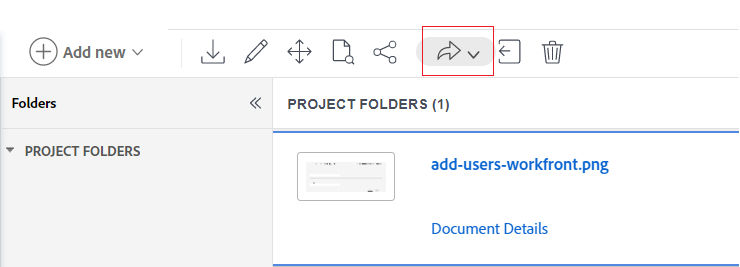
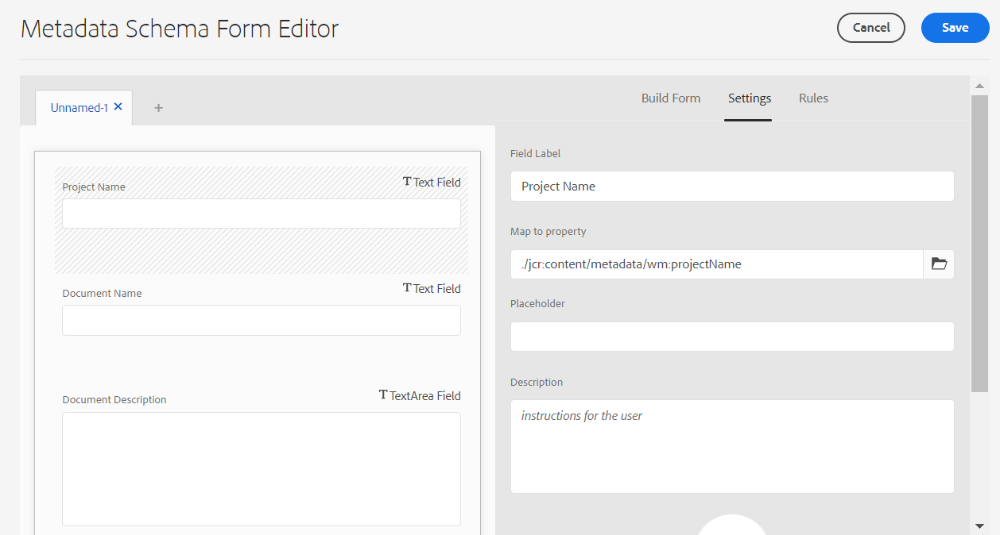

# Configure asset metadata mapping between Adobe Workfront and Experience Manager Assets {#asset-metadata-mapping-workfront-aem-assets}

<table>
    <tr>
        <td>
            <i>New</i> <a href="/help/assets/dynamic-media/dm-prime-ultimate.md"><b>Dynamic Media Prime and Ultimate</b></a>
        </td>
        <td>
            <i>New</i> <a href="/help/assets/assets-ultimate-overview.md"><b>AEM Assets Ultimate</b></a>
        </td>
        <td>
            <i>New</i> <a href="/help/assets/integrate-aem-assets-edge-delivery-services.md"><b>AEM Assets integration with Edge Delivery Services</b></a>
        </td>
        <td>
            <i>New</i> <a href="/help/assets/aem-assets-view-ui-extensibility.md"><b>UI Extensibility</b></a>
        </td>
          <td>
            <i>New</i> <a href="/help/assets/dynamic-media/enable-dynamic-media-prime-and-ultimate.md"><b>Enable Dynamic Media Prime and Ultimate</b></a>
        </td>
    </tr>
    <tr>
        <td>
            <a href="/help/assets/search-best-practices.md"><b>Search Best Practices</b></a>
        </td>
        <td>
            <a href="/help/assets/metadata-best-practices.md"><b>Metadata Best Practices</b></a>
        </td>
        <td>
            <a href="/help/assets/product-overview.md"><b>Content Hub</b></a>
        </td>
        <td>
            <a href="/help/assets/dynamic-media-open-apis-overview.md"><b>Dynamic Media with OpenAPI capabilities</b></a>
        </td>
        <td>
            <a href="https://developer.adobe.com/experience-cloud/experience-manager-apis/"><b>AEM Assets developer documentation</b></a>
        </td>
    </tr>
</table>

You can map the asset metadata fields between Adobe Workfront and Experience Manager as a Cloud Service applications. As a result of mapping metadata fields, when you send an asset from Workfront to Experience Manager Assets, you can view the mapped asset metadata in Experience Manager Assets.

For example, if you need to retain the metadata fields for an image such as name, description, and the project it belongs to in Workfront when you send the image to Experience Manager Assets, configure and map these fields to Experience Manager Assets properties.

**Use Case**

An image `add-users-workfront.png` exists in the `Metadata Syncs` project in Adobe Workfront application. You need to send that image to Experience Manager Assets as a Cloud Service with the following metadata:

* Project Name

* Document Name

* Document description

## Prerequisites {#prerequisites}

* An administrator access to Workfront and Experience Manager Assets as a Cloud Service applications.

* An integration between [Workfront and Experience Manager Assets as a Cloud Service applications](https://one.workfront.com/s/document-item?bundleId=the-new-workfront-experience&topicId=Content%2FDocuments%2FAdobe_Workfront_for_Experience_Manager_Assets_Essentials%2Fsetup-asset-essentials.htm&_LANG=enus).

## Set up metadata mapping in Workfront {#set-up-metadata-mapping}

To set metadata mapping for the Project Name, Document Name, and Document Description fields in Workfront:

1. Click the Main Menu icon  available in the upper-right corner of the Adobe Workfront application, then click **[!UICONTROL Setup]**.

1. Select **[!UICONTROL Documents]** in the left panel, then select **[!UICONTROL Experience Manager Assets]**.

1. Select the Experience Manager Assets integration and click **[!UICONTROL Edit]**.

1. Click **[!UICONTROL Metadata]**. In the **[!UICONTROL Assets]** tab, map the [!UICONTROL Project] > [!UICONTROL Name] Workfront field to the `wm:projectName` Experience Manager Assets field. If you do not find the exact match, Adobe recommends that you look for the best match to map the Workfront and Experience Manager Assets field. You can avoid mapping fields of different data types. For example, mapping a date Workfront field to a description Assets field.
1. Map the [!UICONTROL Document] > [!UICONTROL Name] Workfront field to the `wm:documentName` Experience Manager Assets field.

   

1. Map the [!UICONTROL Document] > [!UICONTROL Description] Workfront field to the `dc:description` Experience Manager Assets field.

   >[!VIDEO](https://video.tv.adobe.com/v/344255)

## Send the image from Workfront to Experience Manager Assets {#send-image-workfront-assets}

To send the image from Workfront to Experience Manager Assets:

1. Click the Main Menu icon  available in the upper-right corner of the Adobe Workfront application, then click **[!UICONTROL Projects]**.

1. Click **[!UICONTROL New Project]** to create a project.

1. Click **[!UICONTROL Documents]** option available in the left pane, drag and then select the image that you need to send to Experience Manager Assets.

1. Click **[!UICONTROL Send to]**, then choose the Experience Manager Assets Essentials integration name.

   

1. Choose the destination folder for the asset and then click **[!UICONTROL Select Folder]**.

1. Click **[!UICONTROL Save]**.

## Configure asset metadata mapping in Experience Manager as a Cloud Service {#metadata-mapping-aem}

After [configuring the asset metadata mapping in Adobe Workfront](#set-up-metadata-mapping), you must use the same mapping in Experience Manager Assets as a Cloud Service application to display appropriate metadata results for the image.

Metadata mapping is performed using Metadata Schemas in Experience Manager Assets. You can edit a newly added or existing metadata schema form. The metadata schema form includes tabs and form items within tabs. You can map/configure these form items to a field within a metadata node in the CRX repository. You can add tabs or form items to the metadata schema form. For more information, see [Metadata Schemas](metadata-schemas.md).

To configure metadata mapping using a new metadata form in Experience Manager Assets as a Cloud Service:

1. Navigate to **[!UICONTROL Tools]** > **[!UICONTROL Assets]** > **[!UICONTROL Metadata Schemas]**.

1. Click **[!UICONTROL Create]** from the toolbar. In the dialog, provide the title of the schema form and click **[!UICONTROL Create]** to complete the form creation process.

1. Select the schema form and click **[!UICONTROL Edit]**.

1. (Optional) On the Metadata Schema Form Editor, click `+` to create a tab for the Workfront fields.

1. Click the **[!UICONTROL Build Form]** tab and drag the **[!UICONTROL Single Line Text]** component to the form. Click the component in the form. In the **[!UICONTROL Build Form]** tab:

   1. Specify `Project Name` in the **[!UICONTROL Field Label]** field.

   1. Specify `./jcr:content/metadata/wm:projectName` in the **[!UICONTROL Map to property]** field. As a guideline, use the following template to define the field mappings in Experience Manger Assets:
   `./jcr:content/metadata/<mapping defined for the field in workfront>`.

      While configuring mappings in Workfront, you mapped `wm:projectName` Experience Manager Assets field to Project > Name Workfront field.

      `wm` refers to the namespace name and `projectName` refers to the property title. Use the `namespace:propertyTitle` format to define metadata field mappings.

      

1. Click the **[!UICONTROL Build Form]** tab and drag the **[!UICONTROL Single Line Text]** component to the form. Click the component in the form. In the **[!UICONTROL Build Form]** tab:

   1. Specify `Document Name` in the **[!UICONTROL Field Label]** field.

   1. Specify `./jcr:content/metadata/wm:documentName` in the **[!UICONTROL Map to property]** field. 
      While configuring mappings in Workfront, you mapped `wm:documentName` Experience Manager Assets field to Document > Name Workfront field.

1. Click the **[!UICONTROL Build Form]** tab and drag the **[!UICONTROL Multi Line Text]** component to the form. Click the component in the form. In the **[!UICONTROL Build Form]** tab:

   1. Specify `Document Description` in the **[!UICONTROL Field Label]** field.

   1. Specify `./jcr:content/metadata/dc:description` in the **[!UICONTROL Map to property]** field. 
      While configuring mappings in Workfront, you mapped `dc:description` Experience Manager Assets field to Document > Description Workfront field.

1. Click **[!UICONTROL Save]** to save the changes.

   >[!VIDEO](https://video.tv.adobe.com/v/344314)

## Apply metadata settings to image folder {#apply-metadata-settings-image-folder}

After configuring the metadata settings in Experience Manager as a Cloud Service application, apply those settings to the [folder that contains the image that is sent from the Workfront application](#send-image-workfront-assets).

To apply metadata settings to the image folder:

1. Navigate to **[!UICONTROL Tools]** > **[!UICONTROL Assets]** > **[!UICONTROL Metadata Schemas]**.

1. Select the metadata schema from the available list and click **[!UICONTROL Apply to Folders]**.

1. Select the destination folder to which [the image is sent from the Adobe Workfront application](#send-image-workfront-assets) and click **[!UICONTROL Apply]**.

You can navigate to the image in Experience Manager Assets and view the metadata associated with the image. Select the image and click **[!UICONTROL Properties]** to view the image metadata.

**See also**

* [Translate Assets](translate-assets.md)
* [Assets HTTP API](mac-api-assets.md)
* [Assets supported file formats](file-format-support.md)
* [Search assets](search-assets.md)
* [Connected assets](use-assets-across-connected-assets-instances.md)
* [Asset reports](asset-reports.md)
* [Metadata schemas](metadata-schemas.md)
* [Download assets](download-assets-from-aem.md)
* [Manage metadata](manage-metadata.md)
* [Search facets](search-facets.md)
* [Manage collections](manage-collections.md)
* [Bulk metadata import](metadata-import-export.md)
* [Publish Assets to AEM and Dynamic Media](/help/assets/publish-assets-to-aem-and-dm.md)
