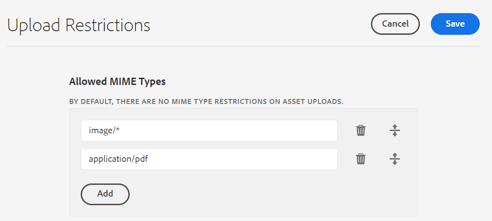
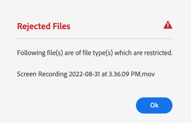
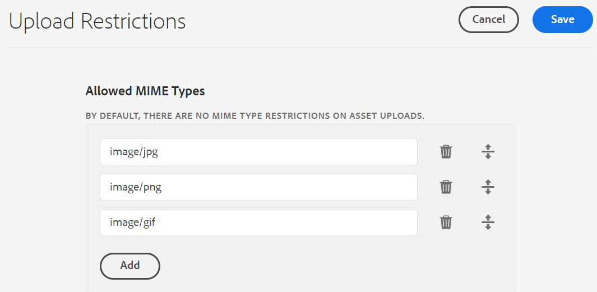

# Configure asset upload restrictions {#configure-asset-upload-restrictions}

| [Search Best Practices](/help/assets/search-best-practices.md) |[Metadata Best Practices](/help/assets/metadata-best-practices.md)|[Content Hub](/help/assets/product-overview.md)|[Dynamic Media with OpenAPI capabilities](/help/assets/dynamic-media-open-apis-overview.md)|[AEM Assets developer documentation](https://developer.adobe.com/experience-cloud/experience-manager-apis/)|
| ------------- | --------------------------- |---------|----|-----|

You can configure Adobe Experience Manager Assets to restrict the type of assets that users can upload based on the MIME type. 

>[!IMPORTANT]
>
>By default, Experience Manager Assets allows users to upload assets of all MIME types. However, you can configure the settings to restrict users to upload files of specific MIME types only.

## Prerequisites {#prerequisites-asset-upload-restrictions}

You must have administrator privileges to configure asset upload restrictions.

## Apply restrictions for asset uploads {#apply-restrictions-asset-uploadsssssss}

To configure [!DNL Experience Manager] to restrict users to upload files of specific MIME types:

1. Navigate to **[!UICONTROL Tools > Assets > Assets Configurations]**.

1. Click **[!UICONTROL Upload Restrictions]**.

1. Click **[!UICONTROL Add]** to define the allowed MIME types.

1. Specify the MIME type in the text box. You can click **[!UICONTROL Add]** again to specify more allowed MIME types. You can also click  to delete any MIME type from the list.

1. Click **[!UICONTROL Save]**.

**Example 1: Allow upload of all images and PDF files to Experience Manager Assets**

To allow the upload of images in all formats and PDF files to Experience Manager Assets, do the following settings:

   

`image/*` as the MIME type allows the upload of images in all formats. `application/pdf` as the MIME type allows the upload of PDF files to Experience Manager Assets.

If you attempt to upload a file that is not included in the list of allowed MIME types, Experience Manager Assets displays the following error message:

   

`Screen Recording 2022-08-31 at 3.36.09 PM.mov` refers to a file name that is not included in the allowed MIME types.

**Example 2: Allow upload of specific image formats to Experience Manager Assets**

To add specific image formats to the allowed MIME types and to restrict uploading all other asset formats, do the following settings:

Based on the settings depicted in the image, you can upload images in .JPG, .PNG, and .GIF formats to Experience Manager Assets.

**See also**

* [Translate Assets](translate-assets.md)
* [Assets HTTP API](mac-api-assets.md)
* [Assets supported file formats](file-format-support.md)
* [Search assets](search-assets.md)
* [Connected assets](use-assets-across-connected-assets-instances.md)
* [Asset reports](asset-reports.md)
* [Metadata schemas](metadata-schemas.md)
* [Download assets](download-assets-from-aem.md)
* [Manage metadata](manage-metadata.md)
* [Search facets](search-facets.md)
* [Manage collections](manage-collections.md)
* [Bulk metadata import](metadata-import-export.md)
* [Publish Assets to AEM and Dynamic Media](/help/assets/publish-assets-to-aem-and-dm.md)
