# Configure Content Hub user interface {#configure-content-hub-user-interface}

<table>
    <tr>
        <td>
            <i>New</i> <a href="/help/assets/dynamic-media/dm-prime-ultimate.md"><b>Dynamic Media Prime and Ultimate</b></a>
        </td>
        <td>
            <i>New</i> <a href="/help/assets/assets-ultimate-overview.md"><b>AEM Assets Ultimate</b></a>
        </td>
        <td>
            <i>New</i> <a href="/help/assets/integrate-aem-assets-edge-delivery-services.md"><b>AEM Assets integration with Edge Delivery Services</b></a>
        </td>
        <td>
            <i>New</i> <a href="/help/assets/aem-assets-view-ui-extensibility.md"><b>UI Extensibility</b></a>
        </td>
          <td>
            <i>New</i> <a href="/help/assets/dynamic-media/enable-dynamic-media-prime-and-ultimate.md"><b>Enable Dynamic Media Prime and Ultimate</b></a>
        </td>
    </tr>
    <tr>
        <td>
            <a href="/help/assets/search-best-practices.md"><b>Search Best Practices</b></a>
        </td>
        <td>
            <a href="/help/assets/metadata-best-practices.md"><b>Metadata Best Practices</b></a>
        </td>
        <td>
            <a href="/help/assets/product-overview.md"><b>Content Hub</b></a>
        </td>
        <td>
            <a href="/help/assets/dynamic-media-open-apis-overview.md"><b>Dynamic Media with OpenAPI capabilities</b></a>
        </td>
        <td>
            <a href="https://developer.adobe.com/experience-cloud/experience-manager-apis/"><b>AEM Assets developer documentation</b></a>
        </td>
    </tr>
</table>

>[!CONTEXTUALHELP]
>id="configure_content_hub"
>title="Configure Content Hub user interface"
>abstract="Experience Manager Assets enables administrators to configure the options available on the Content Hub user interface. Based on the configuration options selected by the administrators, the Content Hub users are able to view fields on Content Hub. The configuration options include metadata while importing assets, filters, asset properties, metadata while searching assets, personalized branding, and any custom links."
>additional-url="https://images-tv.adobe.com/mpcv3/4477/74a81d1c-0cfe-41f4-8a06-18ff70604e45_1732023385.854x480at800_h264.mp4" text="Watch Video"

<!--  -->

>[!AVAILABILITY]
>
>Content Hub guide is now available in PDF format. Download the entire guide and use Adobe Acrobat AI Assistant to answer your queries. 
>
>[!BADGE Content Hub Guide PDF]{type=Informative url="https://helpx.adobe.com/content/dam/help/en/experience-manager/aem-assets/content-hub.pdf"}

Experience Manager Assets enables administrators to configure the options available on the Content Hub user interface. Based on the configuration options selected by the administrators, the Content Hub users are able to view fields on Content Hub. The configuration options include:

* Filters available to users while searching for assets.

* Asset details or properties available for each asset.

* Metadata fields available to users while adding assets to Content Hub.

* Asset metadata fields that are available for search on Content Hub.

* Branding content that you need to display for your organization.

* Any custom links that you need to include on Content Hub in addition to assets, collections, and insights.

## Prerequisites {#prerequisites-configuration-ui}

[Content Hub administrators](/help/assets/deploy-content-hub.md#step-3-onboard-content-hub-administrator) can set the configuration options for other users within your organization. 

## Access configuration options on Content Hub {#access-configuration-options-content-hub}

To access configuration options on Content Hub:

1. Click the user icon in the right pane.

1. In the **[!UICONTROL Product Settings]** section, select **[!UICONTROL Configurations]**.

   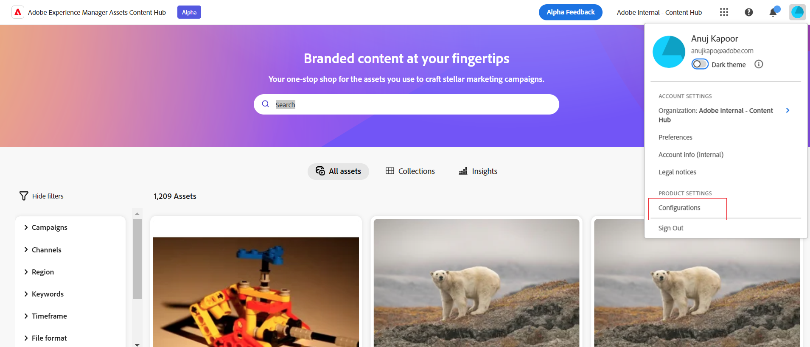

## Manage configuration options on Content Hub {#manage-configuration-options}

As an administrator, manage the following configuration options for your users:

* [Import](#configure-import-options-content-hub)

* [Filters](#configure-filters-content-hub)

* [Asset details](#configure-asset-details-content-hub)
* [Asset Card](#asset-card)

* [Search](#configure-metadata-search-content-hub)

* [Branding](#configure-branding-content-hub)

* [Expired Assets](#expired-assets-content-hub)

* [Renditions](#renditions-content-hub)

* [Custom Links](#configure-custom-links-content-hub)

### Import {#configure-import-options-content-hub}

You can configure the metadata fields that display to the users while uploading or importing assets to the Content Hub portal, such as Campaign Name, Keywords, Channels, Timeframe, Region, and so on. To do so, execute the following steps:

1. On the [Configurations](#access-configuration-options-content-hub) user interface, click **[!UICONTROL Import]**.

1. Click **[!UICONTROL Add metadata]**. 

1. Specify a label for the property, map it to a property using the **[!UICONTROL Metadata]** field, and select the input type for the new asset metadata.

1. Click the **[!UICONTROL Required field]** toggle to make the new metadata field mandatory to specify for users while uploading new assets.

1. Click **[!UICONTROL Confirm]**. The new metadata displays in the list of the existing asset properties.

1. Click **[!UICONTROL Save]** to apply the changes.

Similarly, you can click , available next to each available property, to edit the labels, make these fields mandatory or non-mandatory to users while uploading assets using the **[!UICONTROL Required field]** toggle, or click the Delete icon to delete any metadata property. 

Click the **[!UICONTROL Auto-approval]** toggle if you need all assets that you add to the Experience Manager Assets repository to be auto-approved so that they are available in Content Hub immediately. Else, DAM authors or administrators need to manually approve the assets to make them available on Content Hub. The toggle is set to Off state by default.

Click **[!UICONTROL Save]** after making all modifications to apply the changes.

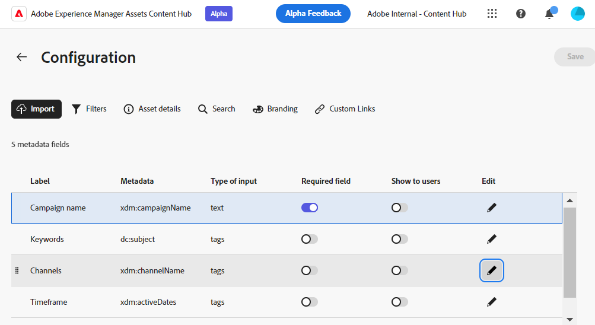

Metadata enabled on the Configuration User Interface display on the asset upload page:

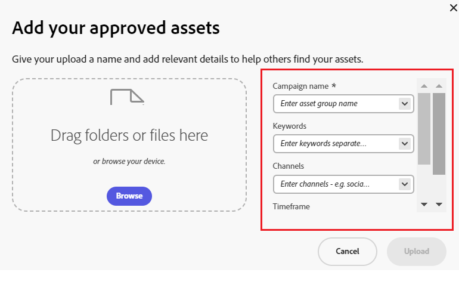

### Filters {#configure-filters-content-hub}

Content Hub allows administrators to configure filters that display while searching for assets. Execute the following steps to add a new filter:

1. On the [Configurations](#access-configuration-options-content-hub) user interface, click **[!UICONTROL Filters]**.

1. Click **[!UICONTROL Add filters]**. 

1. Specify a label for the filter, map it to a property using the **[!UICONTROL Metadata]** field, and select the input type for the new filter.
1. Click **[!UICONTROL Confirm]**. The new filter displays in the list of the existing filters.

1. Click **[!UICONTROL Save]** to apply the changes so that the new filter gets displayed on the Search page while filtering assets.

   >[!NOTE]
   >
   >The new filter gets displayed on the Search page only if there is alteast one asset in the repository matching the filter criteria.

Similarly, you can click , available next to each available filter, to edit the labels or click the delete icon to delete any existing filter. Click **[!UICONTROL Save]** after making all modifications to apply the changes.

   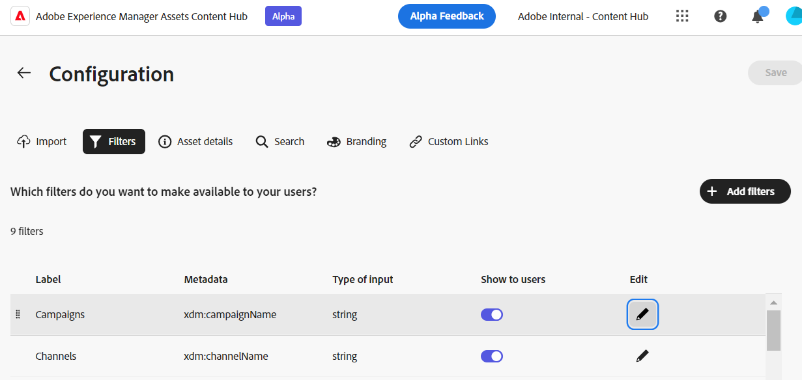

The filters enabled on the Configuration User Interface display on the Search page:

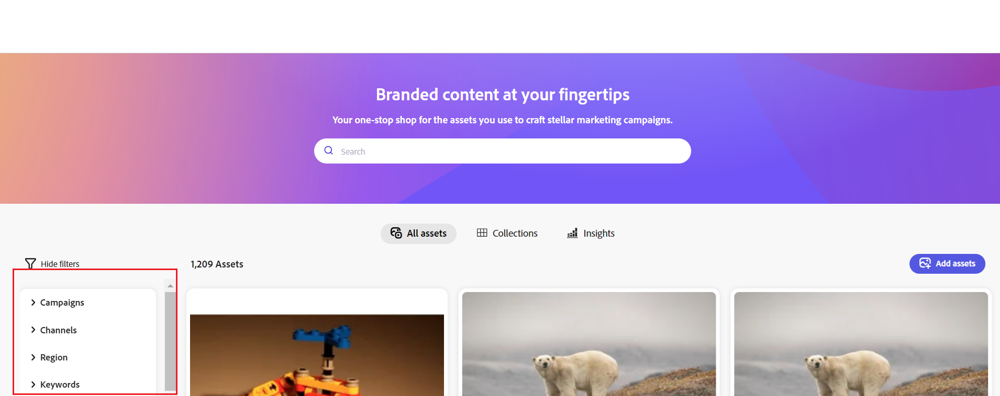

### Asset details {#configure-asset-details-content-hub}

You can also configure the asset properties that display for each asset, such as file name, title, format, size, and so on. To do so, execute the following steps:

1. On the [Configurations](#access-configuration-options-content-hub) user interface, click **[!UICONTROL Asset details]**.

1. Click **[!UICONTROL Add metadata]**. 

1. Specify a label for the property, map it to a property using the **[!UICONTROL Metadata]** field, and select the input type for the new asset metadata.
1. Click **[!UICONTROL Confirm]**. The new metadata displays in the list of the existing asset properties.

1. Click **[!UICONTROL Save]** to apply the changes so that the new property gets displayed on the asset details page.

Similarly, you can click , available next to each available property, to edit the labels or click the delete icon to delete any existing asset detail. Click **[!UICONTROL Save]** after making all modifications to apply the changes.

   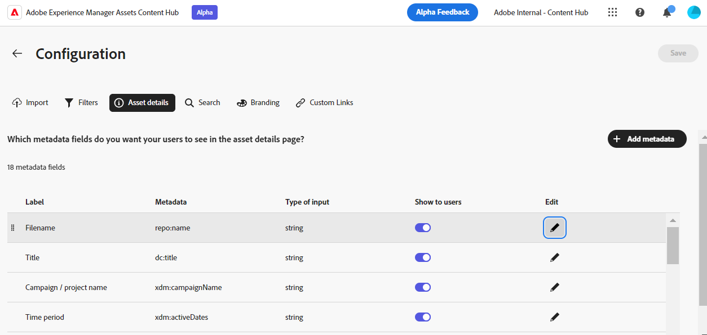

The properties enabled on the Configuration User Interface display on the Asset Details page:

### Asset Card {#asset-card}

You can also configure the key metadata fields that you need to display on the **Asset Card** upto a maximum of 6 fields. To do so, execute the following steps:

1. On the [Configurations](#access-configuration-options-content-hub) user interface, click **Asset Card**.
2. Click **Add metadata**. The **Add asset card metadata** dialog box displays.
3. Specify the metadata name in the **Label** field and select a metadata property in the **Metadata** field.
4. Click **Confirm** and then click **Save** to apply the changes so that the new property display on the asset details page.

Similarly, click  that is available next to each available property, to make any required modifications or click  to delete any existing metadata property. Click **Save** after making all modifications to apply the changes.

### Search {#configure-metadata-search-content-hub}

Administrators can define the metadata fields that are searched when a user specifies a search criteria on Content Hub. Execute the following steps:

1. On the [Configurations](#access-configuration-options-content-hub) user interface, click **[!UICONTROL Add metadata]**.

1. Specify the metadata field and click **[!UICONTROL Confirm]**.

1. Click **[!UICONTROL Save]** to apply the changes so that the new metadata property gets displayed in the list of metadata fields.

Similarly, you can click , available next to each available metadata property, to edit the property or click the delete icon to delete any existing property. Click **[!UICONTROL Save]** after making all modifications to apply the changes.

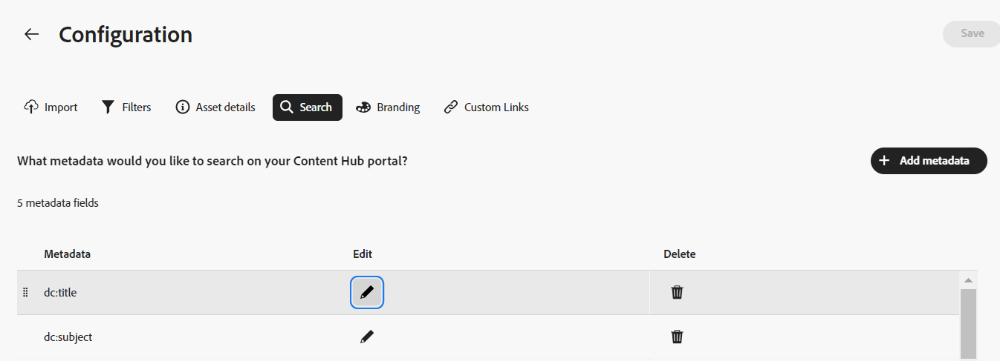

### Branding {#configure-branding-content-hub}

Administrators can also personalize the title and body text on the banner of the Content Hub portal, as per your branding requirements. To do so, execute the following steps:

1. On the [Configurations](#access-configuration-options-content-hub) user interface, click **[!UICONTROL Branding]**.

1. Specify text in **[!UICONTROL Title text on banner]** and **[!UICONTROL Body text on banner]** fields.

1. Click **[!UICONTROL Save]** to apply the changes.

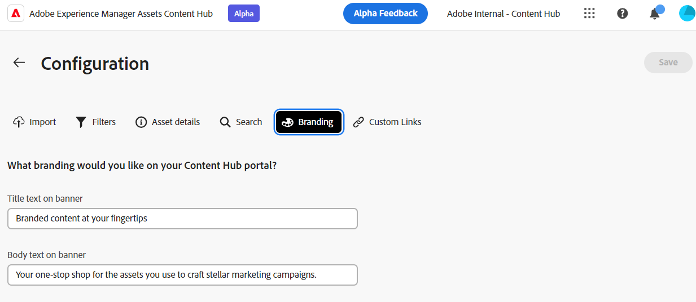

The branding updates enabled on the Configuration User Interface display on the Content Hub portal banner:

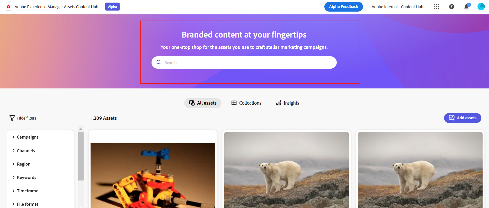

### Expired assets{#expired-assets-content-hub}

Administrators can control if they need expired assets to be visible on Content Hub. If the expired assets are made visible, they can also define if users can download them.

Expired assets do not display in Content Hub by default.

To do so, execute the following steps:

1. On the [Configurations](#access-configuration-options-content-hub) user interface, click **[!UICONTROL Expired Assets]**.

1. In the **[!UICONTROL Visible]** section, enable the **[!UICONTROL Allow users to view expired assets]** toggle to make all expired assets visible on Content Hub.

1. After enabling the visibility of assets, you can enable or disable the ability to download expired assets using the **[!UICONTROL Allow users to download expired assets]** toggle. 

1. Click **[!UICONTROL Save]** to apply the changes.

   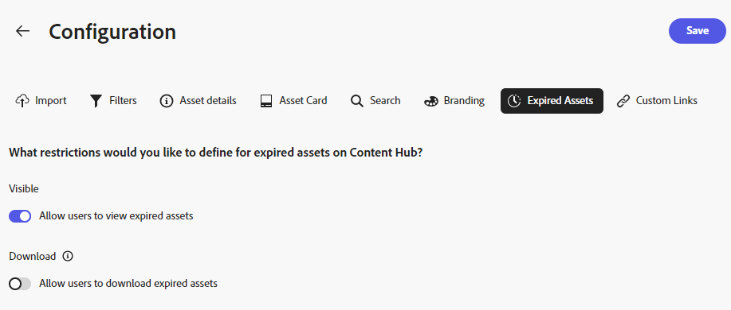

After enabling the visibility of assets, you can view the expired assets on Content Hub, as depicted in the following image:

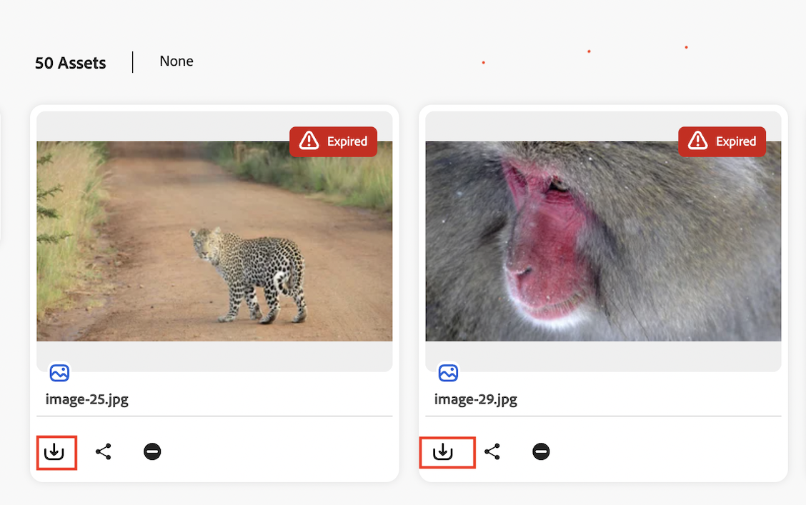

If the administrator has enabled download, the Content Hub users can also download them, as highlighted in the image.

If the visibility of expired assets is enabled, Content Hub also highlights assets expiring within the next 15 days using the `Expiring in n days` message on the Asset Card.

### Renditions {#renditions-content-hub}

Renditions are customized versions of digital assets, such as images, documents, and so on designed for different devices and platforms to ensure optimal performance. See more about [renditions in Adobe Experience Manager Assets](https://experienceleague.adobe.com/en/docs/experience-manager-cloud-service/content/assets/assets-view/renditions).

To do so, execute the following steps:

On the [Configurations](#access-configuration-options-content-hub) user interface, click **[!UICONTROL Renditions]**. The following options are available:

* Enable  the [!UICONTROL Enable availability of renditions] toggle to make all renditions visible on Content Hub.

* Enable or disable **[!UICONTROL Allow users to download original assets]** toggle to control the availability to download original assets.

   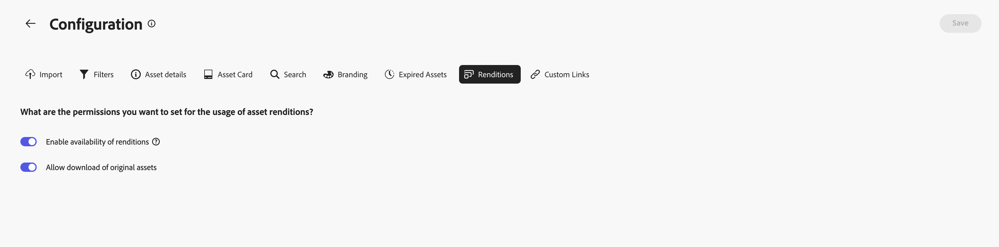

For information on how to view and download renditions in Content Hub, see [download assets in Content Hub](/help/assets/download-assets-content-hub.md).

### Custom Links {#configure-custom-links-content-hub}

You can also add custom tabs in addition to standard **[!UICONTROL All Assets]**, **[!UICONTROL Collections]**, and **[!UICONTROL Insights]** tabs on the Content Hub portal just below the banner. To do so, execute the following steps:

1. On the [Configurations](#access-configuration-options-content-hub) user interface, click **[!UICONTROL Custom Links]**.

1. Click **[!UICONTROL Add link]**.

1. Specify text in **[!UICONTROL Label]** and **[!UICONTROL URL]** fields. The label that you define display as a tab and when you click the label, you navigate to the URL defined in the **[!UICONTROL URL]** field.

1. Click **[!UICONTROL Confirm]**.

1. Click **[!UICONTROL Save]** to apply the changes.

Similarly, you can click , available next to each URL, to edit the links or click the delete icon to delete any existing URL. Click **[!UICONTROL Save]** after making all modifications to apply the changes.

   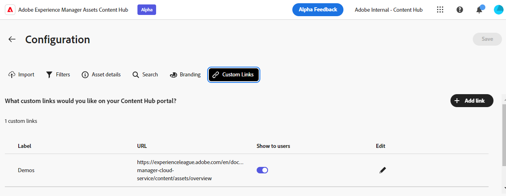

   The custom link display as a new tab next to Insights tab on the Content Hub home page.

   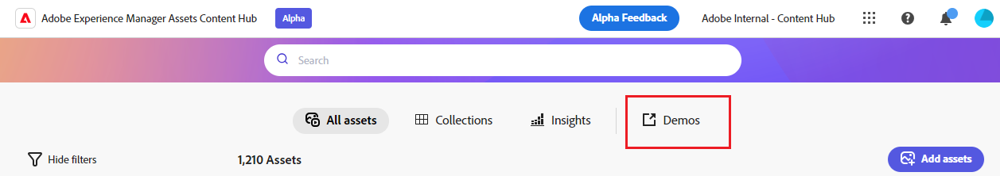
