# Configure Content Hub user interface {#configure-content-hub-user-interface}

>[!CONTEXTUALHELP]
>id="configure_content_hub"
>title="Configure Content Hub user interface"
>abstract="Experience Manager Assets enables administrators to configure the options available on the Content Hub user interface. Based on the configuration options selected by the administrators, the Content Hub users are able to view fields on Content Hub. The configuration options include metadata while importing assets, filters, asset properties, metadata while searching assets, personalized branding, and any custom links."
>additional-url="https://images-tv.adobe.com/mpcv3/4477/74a81d1c-0cfe-41f4-8a06-18ff70604e45_1732023385.854x480at800_h264.mp4" text="Watch Video"

<!--  -->

Experience Manager Assets enables administrators to configure the options available on the Content Hub user interface. Based on the configuration options selected by the administrators, the Content Hub users are able to view fields on Content Hub. The configuration options include:

* Filters available to users while searching for assets.

* Asset details or properties available for each asset.

* Metadata fields available to users while adding assets to Content Hub.

* Asset metadata fields that are available for search on Content Hub.

* Branding content that you need to display for your organization.

* Any custom links that you need to include on Content Hub in addition to assets, collections, and insights.

## Prerequisites {#prerequisites-configuration-ui}

[Content Hub administrators](/help/assets/deploy-content-hub.md#step-3-onboard-content-hub-administrator) can set the configuration options for other users within your organization. 

## Access configuration options on Content Hub {#access-configuration-options-content-hub}

To access configuration options on Content Hub:

1. Click the user icon in the right pane.

1. In the **[!UICONTROL Product Settings]** section, select **[!UICONTROL Configurations]**.

   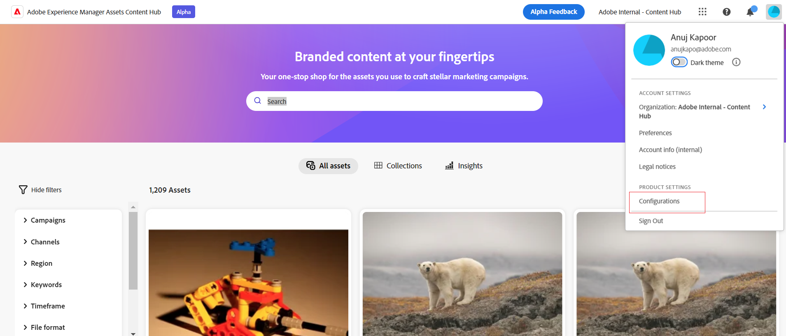

## Manage configuration options on Content Hub {#manage-configuration-options}

As an administrator, manage the following configuration options for your users:

* [Import](#configure-import-options-content-hub)

* [Filters](#configure-filters-content-hub)

* [Asset details](#configure-asset-details-content-hub)
* [Asset Card](#asset-card)

* [Search](#configure-metadata-search-content-hub)

* [Branding](#configure-branding-content-hub)

* [Expired Assets](#expired-assets-content-hub)

* [Renditions](#renditions-content-hub)

* [Custom Links](#configure-custom-links-content-hub)

* [Collections and Sharing](#configure-collections-content-hub)

<!--* [Enable public link sharing](#enable-public-link-sharing)-->

### Import {#configure-import-options-content-hub}

You can configure the metadata fields that display to the users while uploading or importing assets to the Content Hub portal, such as Campaign Name, Keywords, Channels, Timeframe, Region, and so on. To do so, execute the following steps:

1. On the [Configurations](#access-configuration-options-content-hub) user interface, click **[!UICONTROL Import]**.

1. Click **[!UICONTROL Add metadata]**. 

1. Specify a label for the property, map it to a property using the **[!UICONTROL Metadata]** field, and select the input type for the new asset metadata.

1. Click the **[!UICONTROL Required field]** toggle to make the new metadata field mandatory to specify for users while uploading new assets.

1. Click **[!UICONTROL Confirm]**. The new metadata displays in the list of the existing asset properties.

1. Click **[!UICONTROL Save]** to apply the changes.

Similarly, you can click , available next to each available property, to edit the labels, make these fields mandatory or non-mandatory to users while uploading assets using the **[!UICONTROL Required field]** toggle, or click the Delete icon to delete any metadata property. 

Click the **[!UICONTROL Auto-approval]** toggle if you need all assets that you add to the Experience Manager Assets repository to be auto-approved so that they are available in Content Hub immediately. Else, DAM authors or administrators need to manually approve the assets to make them available on Content Hub. The toggle is set to Off state by default.

Click **[!UICONTROL Save]** after making all modifications to apply the changes.

Metadata enabled on the Configuration User Interface display on the asset upload page:
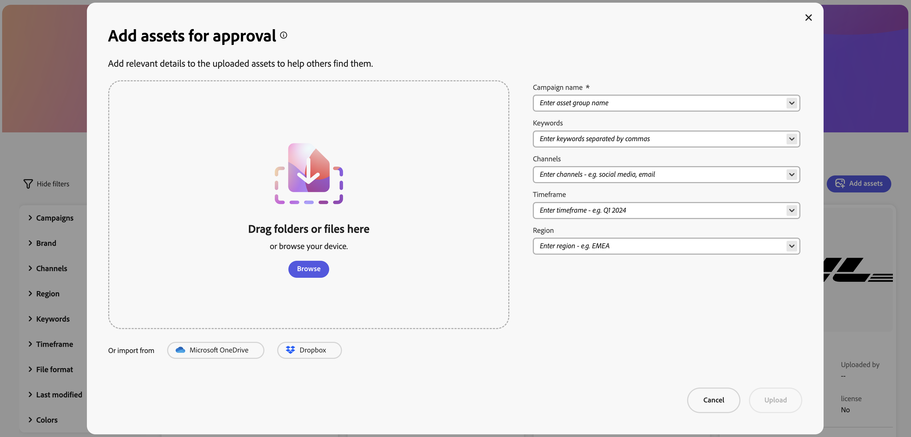

### Filters {#configure-filters-content-hub}

Content Hub allows administrators to configure filters that display while searching for assets. Execute the following steps to add a new filter:

1. On the [Configurations](#access-configuration-options-content-hub) user interface, click **[!UICONTROL Filters]**.

1. Click **[!UICONTROL Add filters]**. 

1. Specify a label for the filter, map it to a property using the **[!UICONTROL Metadata]** field, and select the input type for the new filter.
1. Click **[!UICONTROL Confirm]**. The new filter displays in the list of the existing filters.

1. Click **[!UICONTROL Save]** to apply the changes so that the new filter gets displayed on the Search page while filtering assets.

   >[!NOTE]
   >
   >The new filter gets displayed on the Search page only if there is at least one asset in the repository matching the filter criteria.

Similarly, you can click , available next to each available filter, to edit the labels or click the delete icon to delete any existing filter. Click **[!UICONTROL Save]** after making all modifications to apply the changes.
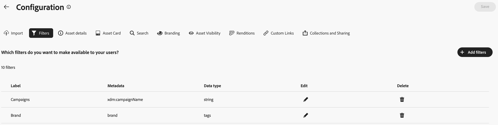

The filters enabled on the Configuration User Interface display on the Search page:
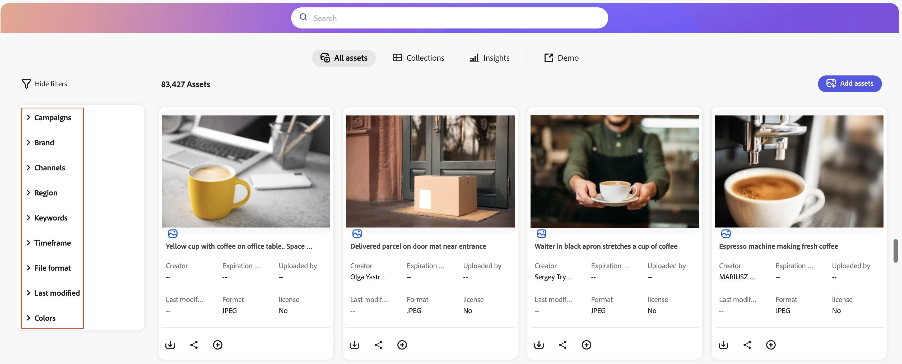

#### Bulk Search {#bulk-search-configuration}

To enable search of multiple assets at once in [!DNL Content Hub], execute the steps below:

1. On the [Configurations](#access-configuration-options-content-hub) user interface, click **[!UICONTROL Filters]**.

1. Click , available next to each available filter.

1. Enable **[!UICONTROL Bulk Search]** toggle. The default delimiters list `[ , | \t | \r\n | \r | \n ]` are displayed automatically. Moreover, you can also add additional delimiters. To to this, specify delimiters in the input box separated by a `pipe symbol (|)`.

   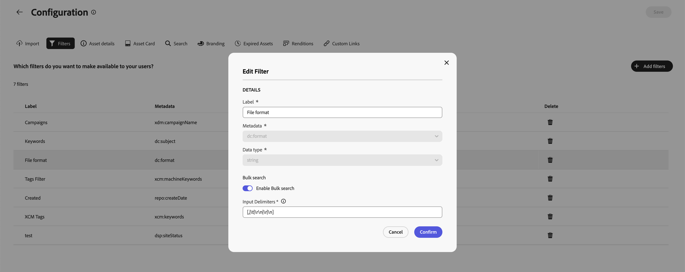

1. Click **[!UICONTROL Confirm]** to save the changes.

### Asset details {#configure-asset-details-content-hub}

You can also configure the asset properties that display for each asset, such as file name, title, format, size, and so on. To do so, execute the following steps:

1. On the [Configurations](#access-configuration-options-content-hub) user interface, click **[!UICONTROL Asset details]**.

1. Click **[!UICONTROL Add metadata]**. 

1. Specify a label for the property, map it to a property using the **[!UICONTROL Metadata]** field, and select the input type for the new asset metadata.
1. Click **[!UICONTROL Confirm]**. The new metadata displays in the list of the existing asset properties.

1. Click **[!UICONTROL Save]** to apply the changes so that the new property gets displayed on the asset details page.

Similarly, you can click , available next to each available property, to edit the labels or click the delete icon to delete any existing asset detail. Click **[!UICONTROL Save]** after making all modifications to apply the changes.

   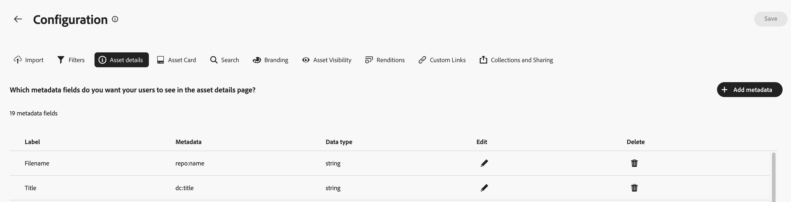

The properties enabled on the Configuration User Interface display on the Asset Details page:

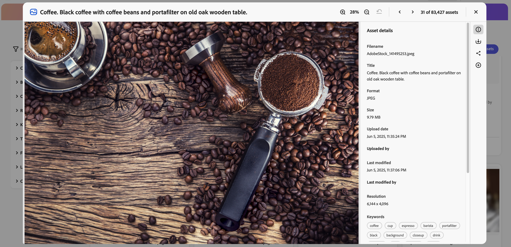

### Asset Card {#asset-card}

You can also configure the key metadata properties that you need to display on the **Asset Card** up to a maximum of 6 fields. 

Execute the following steps to configure the metadata properties to display them on the **[!UICONTROL Asset card]**:

1. On the [Configurations](#access-configuration-options-content-hub) user interface, click **Asset Card**.
2. Click **Add metadata**. The **Add asset card metadata** dialog box displays.
3. Specify the metadata name in the **Label** field and select a metadata property in the **Metadata** field.
4. Click **Confirm** and then click **Save** to apply the changes so that the new property display on the asset details page.

Similarly, click  that is available next to each available property, to make any required modifications or click  to delete any existing metadata property. Click **Save** after making all modifications to apply the changes.

### Search {#configure-metadata-search-content-hub}

Administrators can define the metadata fields that are searched when a user specifies a search criteria on Content Hub. Execute the following steps:

1. On the [Configurations](#access-configuration-options-content-hub) user interface, click **[!UICONTROL Add metadata]**.

1. Specify the metadata field and click **[!UICONTROL Confirm]**.

1. Click **[!UICONTROL Save]** to apply the changes so that the new metadata property gets displayed in the list of metadata fields.

Similarly, you can click , available next to each available metadata property, to edit the property or click the delete icon to delete any existing property. Click **[!UICONTROL Save]** after making all modifications to apply the changes.
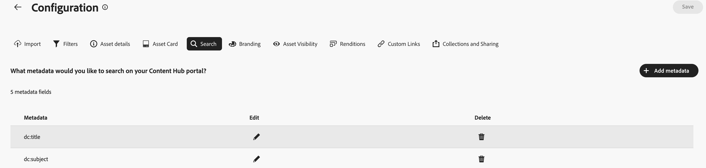

### Branding {#configure-branding-content-hub}

As an administrator, customize your [!DNL Content Hub] portal to meet your branding requirements. 

On the  **[!UICONTROL Branding]** page use **[!UICONTROL Banner]**, **[!UICONTROL Colors]** and **[!UICONTROL Banner image]** sections to execute the following customizations:

1. [Change the logo image from [!UICONTROL Logo image] section](#Change-the-logo-image)
1. [Change the banner image from [!UICONTROL Banner image] section](#Change-the-banner-image)
1. [Update the title and body text on the banner and change the text color from the [!UICONTROL Banner] section](#Add-title-and-body-text-to-your-banner-and-change-the-text-color)
1. [Change the primary and secondary color from the [!UICONTROL Colors] section to apply a color scheme that aligns with your brand's theme](#Change-the-primary-and-secondary-color) 

Select the **[!UICONTROL Reset Defaults]** option to revert your changes and restore the default theme.

#### Change the logo image{#change-the-logo-image}

On the  **[!UICONTROL Branding]** page, execute the following steps to change the logo image of your [!DNL Content Hub] deployment:

1. Click  **[!UICONTROL Select Image]** to select a logo image using the asset selector dialog box. The asset selector displays only approved images.
1. Select the image, click **[!UICONTROL Select]**, and then click **[!UICONTROL Save]** to display it as the logo image of your [!DNL Content Hub] deployment.

#### Change the banner image{#Change-the-banner-image}

On the  **[!UICONTROL Branding]** page, execute the following steps to change the banner image of your [!DNL Content Hub] deployment:

1. Click  **[!UICONTROL Select from gallery]** to select a banner image using the asset selector dialog box. The asset selector displays only approved images.
1. Select the image, click **[!UICONTROL Select]**, and then click **[!UICONTROL Save]** to display it as the banner image of your [!DNL Content Hub] deployment.

>[!NOTE]
>
> * The recommended size for **Banner Image** is `height = 200 to 450px` and `width = 1920 to 2560px`.
> * The recommended size for **Logo Image** is `height = 80 to 120px` and `width = 120 to 200px`.
> * The **supported MIME types** for both Banner and Logo images are `'JPG', value: 'image/jpeg'`, `'PNG', value: 'image/png'`, `'WEBP', value: 'image/webp'`, `'TIFF', value: 'image/tiff'`, `'SVG', value: 'image/svg+xml'`, `'GIF', value: 'image/gif'`.

#### Add title and body text to your banner and change the text color{#Add-title-and-body-text-to-your-banner-and-change-the-text-color}

On the  **[!UICONTROL Branding]** page, use the respective fields in the **[!UICONTROL Banner]** section to add title and body texts to your banner.
Click the square box next to the **[!UICONTROL Banner text color]** to select a text color from the color picker for your banner text or specify the color's hex code in the field next to the color picker square box.

#### Change the primary and secondary color{#Change-the-primary-and-secondary-color}

On the  **[!UICONTROL Branding]** page, use the **[!UICONTROL Colors]** section to set primary and secondary colors by either selecting them using color picker or defining the color's hex code. These colors set the background, text, and icon colors of UI elements to align your [!DNL Content Hub] UI with your brand's theme.

**[!UICONTROL Primary color]:** The primary color scheme applies to selection actions, interactive elements such as checkboxes, search bars, and toggle switches across [!DNL Content Hub] including [!DNL Content Hub] home page and [!UICONTROL Configuration] page. It also applies to action options available on primary [!DNL Content Hub] interfaces such as options available on **[!UICONTROL All Assets]** and **[!UICONTROL Collections]** pages. 

**[!UICONTROL Secondary color]:** On the [!DNL Content Hub] home page, the secondary color scheme applies to UI options and input fields that are available within dialog boxes. It applies to all configuration menu options available on the [!UICONTROL Configuration] page except selection actions, checkboxes, search bars, and toggle switches.

### Asset Visibility{#asset-visibility-content-hub}

Administrators can control if they need expired assets to be visible on Content Hub. If the expired assets are made visible, they can also define if users can download them.

Expired assets do not display in Content Hub by default.

To do so, execute the following steps:

1. On the [Configurations](#access-configuration-options-content-hub) user interface, click **[!UICONTROL Asset Visibility]**.

1. In the **[!UICONTROL Visible]** section, enable the **[!UICONTROL Allow users to view expired assets]** toggle to make all expired assets visible on Content Hub.

1. After enabling the visibility of assets, you can enable or disable the ability to download expired assets using the **[!UICONTROL Allow users to download expired assets]** toggle. 
1. Enable the **[!UICONTROL Allow users to view assets approved for delivery]** toggle to display all assets approved for delivery in Content Hub.
1. Click **[!UICONTROL Save]** to apply the changes.

   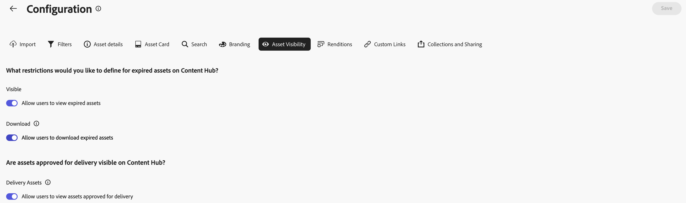

After enabling the visibility of assets, you can view the expired assets on Content Hub, as depicted in the following image:

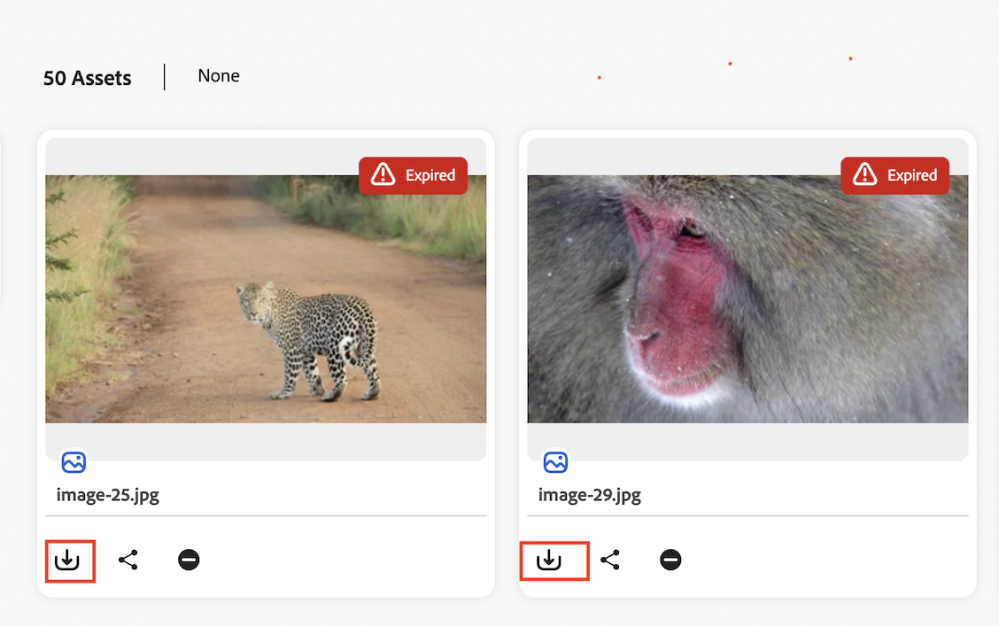

If the administrator has enabled download, the Content Hub users can also download them, as highlighted in the image.

If the visibility of expired assets is enabled, Content Hub also highlights assets expiring within the next 15 days using the `Expiring in n days` message on the Asset Card.

### Renditions {#renditions-content-hub}

Renditions are customized versions of digital assets, such as images, documents, and so on designed for different devices and platforms to ensure optimal performance. See more about [renditions in Adobe Experience Manager Assets](https://experienceleague.adobe.com/en/docs/experience-manager-cloud-service/content/assets/assets-view/renditions).

To do so, execute the following steps:

On the [Configurations](#access-configuration-options-content-hub) user interface, click **[!UICONTROL Renditions]**. The following options are available:

* Enable  the [!UICONTROL Enable availability of renditions] toggle to make all renditions visible on Content Hub.

* Enable or disable **[!UICONTROL Allow users to download original assets]** toggle to control the availability to download original assets.

   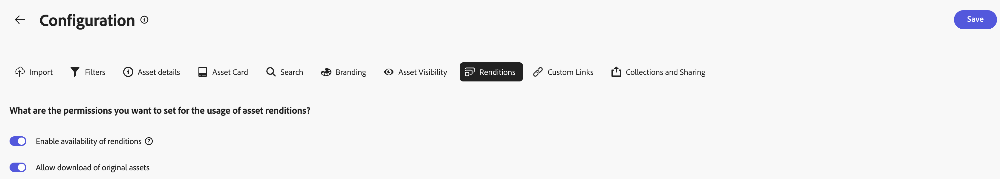

For information on how to view and download renditions in Content Hub, see [download assets in Content Hub](/help/assets/download-assets-content-hub.md).

### Custom Links {#configure-custom-links-content-hub}

You can also add custom tabs in addition to standard **[!UICONTROL All Assets]**, **[!UICONTROL Collections]**, and **[!UICONTROL Insights]** tabs on the Content Hub portal just below the banner. To do so, execute the following steps:

1. On the [Configurations](#access-configuration-options-content-hub) user interface, click **[!UICONTROL Custom Links]**.

1. Click **[!UICONTROL Add link]**.

1. Specify text in **[!UICONTROL Label]** and **[!UICONTROL URL]** fields. The label that you define display as a tab and when you click the label, you navigate to the URL defined in the **[!UICONTROL URL]** field.

1. Click **[!UICONTROL Confirm]**.

1. Click **[!UICONTROL Save]** to apply the changes.

Similarly, you can click , available next to each URL, to edit the links or click the delete icon to delete any existing URL. Click **[!UICONTROL Save]** after making all modifications to apply the changes.
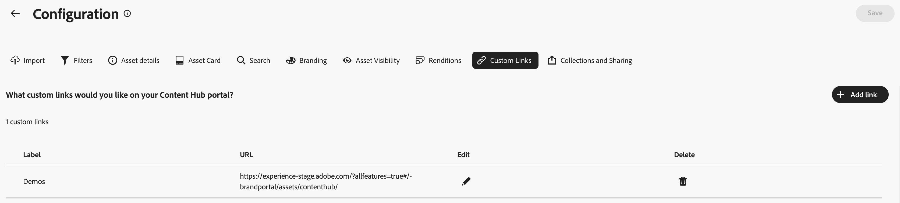

The custom link display as a new tab next to Insights tab on the Content Hub home page.
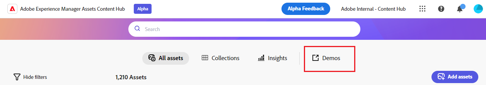

### Collections and Sharing {#configure-collections-content-hub}

Administrators can define user permissions while crating collections. To enable these settings, follow these steps:

1. On the [Configurations](#access-configuration-options-content-hub) user interface, click **[!UICONTROL Collections]**.

1. Enable the **[!UICONTROL Enable Public Link]** toggle to allow creation of public links that external users can use to access and download assets without logging in to the Content Hub.

1. Enable  the **[!UICONTROL View Only Collections]** toggle to allow collections that are accessible to everyone but editable only by the creator and administrator.

1. Enable the **[!UICONTROL Public Collections]** toggle to allow collections that are both accessible and editable by everyone. If **[!UICONTROL View Only Collections]** and **[!UICONTROL Public Collections]** toggles are disabled, then by default, non-admin users can create only private collections.

1. Click **[!UICONTROL Save]** to apply the changes. 

    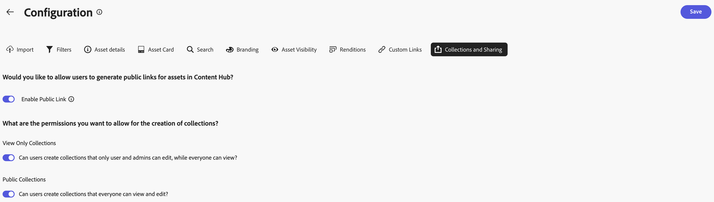

<!--
### Enable public link sharing {#enable-public-link-sharing}

Enable the following setting on the Configurations user interface to allow Content Hub users to generate a public link:

1. On the [Configurations](#access-configuration-options-content-hub) user interface, click **[!UICONTROL Collections and Sharing]**.

1. Enable the **[!UICONTROL Enable Public Link]** toggle and click **[!UICONTROL Save]** to apply the changes.

    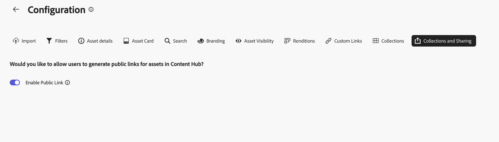

-->

Learn more about [sharing assets in the [!DNL Content Hub]](share-assets-content-hub.md).

