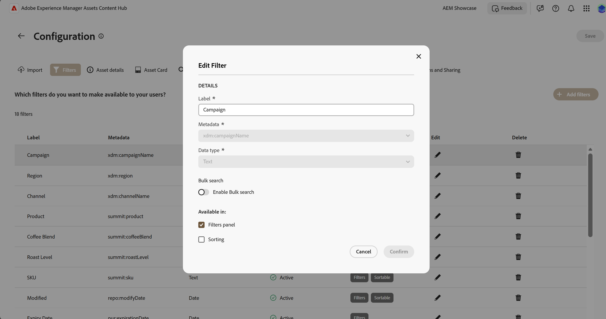

# Configure [!DNL Content Hub] user interface {#configure-content-hub-user-interface}

>[!CONTEXTUALHELP]
>id="configure_content_hub"
>title="Configure [!DNL Content Hub] user interface"
>abstract="Experience Manager Assets enables administrators to configure the options available on the [!DNL Content Hub] user interface. Based on the configuration options selected by the administrators, the [!DNL Content Hub] users are able to view fields on [!DNL Content Hub]. The configuration options include metadata while importing assets, filters, asset properties, metadata while searching assets, personalized branding, and any custom links."
>additional-url="https://images-tv.adobe.com/mpcv3/4477/74a81d1c-0cfe-41f4-8a06-18ff70604e45_1732023385.854x480at800_h264.mp4" text="Watch Video"

<!--  -->

![Configure assets on [!DNL Content Hub]](assets/configure-assets.png)

Experience Manager Assets enables administrators to configure the options available on the [!DNL Content Hub] user interface. Based on the configuration options selected by the administrators, [!DNL Content Hub] users see and interact with the fields that administrators enable. **Administrators configure the following options** for the [!DNL Content Hub] user interface:

* **Search filters** available to users while searching for assets. This narrows large asset libraries to relevant results quickly.

* **Asset details and properties** displayed for each asset, giving users the metadata they need to evaluate and reuse content.

* **Metadata fields** available to users while adding assets to [!DNL Content Hub], ensuring assets are catalogued consistently at import.

* **Searchable metadata fields** on [!DNL Content Hub], which determine how assets can be discovered.

* **Personalized branding content** that the organization displays to align [!DNL Content Hub] with its brand identity.

* **Custom links** added to [!DNL Content Hub], supplementing the default assets, collections, and insights navigation.

>[!VIDEO](https://video.tv.adobe.com/v/3472917/?learn=on&enablevpops){transcript=true}

## Prerequisites {#prerequisites-configuration-ui}

[Content Hub administrators](/help/assets/deploy-content-hub.md#step-3-onboard-content-hub-administrator) can set the configuration options for other users within your organization. These configuration options govern how users access and interact with [!DNL Content Hub]. This ensures consistent access, permissions, and behavior across all [!DNL Content Hub] users, because centralized administration lets the designated administrator apply settings once rather than requiring each user to configure them individually.

## Access configuration options on [!DNL Content Hub] {#access-configuration-options-content-hub}

The configuration options on [!DNL Content Hub] control product-level settings, allowing administrators to review and adjust how the environment is set up. Follow these steps to open the configuration options:

1. Click the user icon in the right pane. This opens the user menu, where account and product-level settings are grouped for quick access.

   ![Access configuration options on [!DNL Content Hub]](assets/access-content-hub-configuration-ui-new.png)

2. In the **[!UICONTROL Product Settings]** section, select **[!UICONTROL Configurations]**. This opens the configuration options, where the available product-level settings are displayed and can be reviewed or modified.

## Manage configuration options on [!DNL Content Hub] {#manage-configuration-options}

As an administrator, you control how [!DNL Content Hub] looks and behaves for your users by managing the following configuration options. These settings determine how assets are imported, discovered, displayed, branded, and shared across your organization:

* [Import](#configure-import-options-content-hub) — controls how assets are brought into [!DNL Content Hub].

* [Filters](#configure-filters-content-hub) — defines the criteria users apply to narrow down assets.

* [Asset details](#configure-asset-details-content-hub) — sets which metadata and properties appear for each asset.
* [Asset Card](#asset-card) — configures how individual assets are represented in the interface.

* [Search](#configure-metadata-search-content-hub) — governs metadata-based search behavior for locating assets.

* [Branding](#configure-branding-content-hub) — customizes the visual identity presented to users.

* [Asset Visibility](#asset-visibility-content-hub) — determines which assets users can see and access.

* [Renditions](#renditions-content-hub) — manages the available output versions and formats of assets.

* [Custom Links](#configure-custom-links-content-hub) — adds tailored navigation links for users.

* [Collections and Sharing](#configure-collections-content-hub) — enables grouping and distribution of assets among users.

<!--* [Enable public link sharing](#enable-public-link-sharing)-->

### Import {#configure-import-options-content-hub}

Configure the metadata fields that display to users while uploading or importing assets to the [!DNL Content Hub] portal—such as **Campaign Name**, **Keywords**, **Channels**, **Timeframe**, and **Region**. These fields determine exactly what descriptive information contributors must supply, ensuring assets are consistently classified and easy to find. To configure the import metadata fields, execute the following steps:

1. On the [Configurations](#access-configuration-options-content-hub) user interface, click **[!UICONTROL Import]**.

1. Click **[!UICONTROL Add metadata]**.

1. Specify a label for the property, map it to a property using the **[!UICONTROL Metadata]** field, and select the appropriate input type for the new asset metadata. The input type labels are updated to align with Adobe Experience Manager (AEM). The available input types include **Text**, **Tags**, **Date**, **Number**, **Dropdown**, **Multi Value Text**, **Smart Tags**, and **Smart Color Tags**. For certain metadata fields (**xcm:colorDistribution**, **xcm:machineKeywords**), the input type is automatically assigned and cannot be modified, because these system-managed fields rely on predefined data structures.

1. Click the **[!UICONTROL Required field]** toggle to make the new metadata field mandatory for users to specify while uploading new assets.

1. Click **[!UICONTROL Confirm]**. The new metadata displays in the list of the existing asset properties.

1. Click **[!UICONTROL Save]** to apply the changes.

Similarly, click the  available next to each available property to edit the labels, use the **[!UICONTROL Required field]** toggle to make these fields mandatory or non-mandatory for users while uploading assets, or click the Delete icon to delete any metadata property.

![Configuration UI upload details on [!DNL Content Hub]](assets/filter.png)

**Auto-approval control:** Click the **[!UICONTROL Auto-approval]** toggle if you need all assets that you add to the Experience Manager Assets repository to be auto-approved, so that they become available in [!DNL Content Hub] immediately without additional review. When auto-approval is disabled, Digital Asset Management (DAM) authors or administrators must manually approve the assets, and only after this approval do the assets become available on [!DNL Content Hub]. The toggle is set to the **Off** state by default.

Click **[!UICONTROL Save]** after making all modifications to apply the changes.

The metadata fields you enable on the Configuration user interface display directly on the asset upload page, where users see and complete them when uploading or importing assets into [!DNL Content Hub].

![Upload metadata on [!DNL Content Hub]](assets/add-assets-for-approval-new.png)

### Filters {#configure-filters-content-hub}

[!DNL Content Hub] enables administrators to configure the filters that appear when searching for assets, controlling which metadata-driven refinement options are exposed on the Search page.

Execute the following steps to add a new filter:

1. On the [Configurations](#access-configuration-options-content-hub) user interface, click **[!UICONTROL Filters]**.
1. Click **[!UICONTROL Add filters]**. 
1. Specify a label for the filter, map it to a property using the **[!UICONTROL Metadata]** field, and select the appropriate input type for the new filter. The input type labels are updated to align with Adobe Experience Manager (AEM). The available input types include Text, Tags, Date, Number, Dropdown, Multi Value Text, Smart Tags, and Smart Color Tags. For certain metadata fields (xcm:colorDistribution, xcm:machineKeywords), the input type is automatically assigned and cannot be modified, because these fields rely on system-generated values.
1. Click **[!UICONTROL Confirm]**. The new filter displays in the list of the existing filters.
1. Click **[!UICONTROL Save]** to apply the changes so that the new filter is displayed on the Search page during asset filtering, making the newly configured refinement option available to end users.

   >[!NOTE]
   >
   >The new filter is displayed on the Search page only because at least one asset in the repository must match the filter criteria; if no matching asset exists, the filter remains hidden. The maximum number of fields available in the filter panel on the Search page is **40**.

![Configuration UI filters on [!DNL Content Hub]](assets/add-filters-new.png)

Similarly, administrators can click , available next to each available filter, to edit the labels or click the delete icon to delete any existing filter. Click **[!UICONTROL Save]** after making all modifications to apply the changes.

Administrators can also define whether a filter available on the **Configurations** page is displayed on the Filter panel on the Search page. Click , available next to each available filter, and select the **Filter Panel** checkbox in the **Available in** section to make it available on the Search page.

![Configure sorting filter panel on [!DNL Content Hub]](assets/sorting-new.png)

To make a metadata field available as a sorting option on the Search page, select the **Sorting** checkbox. This exposes the field as a sort control, allowing users to order results by that metadata value. For more information, see [Add custom metadata fields as sorting options](/help/assets/search-assets-content-hub.md#add-custom-metadata-fields-for-sorting). Click **[!UICONTROL Save]** after making all modifications to apply the changes.

The filters enabled on the Configuration User Interface display on the Search page:

![Search on [!DNL Content Hub]](assets/content-hub-filters-new.png)

#### Bulk Search {#bulk-search-configuration}

To enable searching multiple assets at once in [!DNL Content Hub], execute the steps below:

1. On the [Configurations](#access-configuration-options-content-hub) user interface, click **[!UICONTROL Filters]**.

1. Click available next to each available filter.

   

1. Enable the **[!UICONTROL Bulk Search]** toggle. The default delimiters `[ , | \t | \r\n | \r | \n ]` are displayed automatically. You can also add additional delimiters. To do this, specify delimiters in the input box separated by a `pipe symbol (|)`, which lets [!DNL Content Hub] interpret each delimiter as a separate value boundary during bulk searches.

1. Click **[!UICONTROL Confirm]** to save the changes. See [Bulk Search in [!DNL Content Hub]](search-assets-content-hub.md#bulk-search) in action.

### Asset details {#configure-asset-details-content-hub}

Configure the asset properties that display for each asset — including **file name**, **title**, **format**, and **size** — to control exactly which metadata appears on the Asset Details page. To do so, execute the following steps:

1. On the [Configurations](#access-configuration-options-content-hub) user interface, click **[!UICONTROL Asset details]**.

1. Click **[!UICONTROL Add metadata]**.
1. Specify a label for the property, map it to a property using the **[!UICONTROL Metadata]** field, and select the appropriate input type for the new asset metadata. The input type labels are updated to align with Adobe Experience Manager (AEM). The available input types include **Text**, **Tags**, **Date**, **Number**, **Dropdown**, **Multi Value Text**, **Smart Tags**, and **Smart Color Tags**. For certain metadata fields (**xcm:colorDistribution**, **xcm:machineKeywords**), the input type is automatically assigned and cannot be modified, because these fields are system-generated and rely on a fixed data structure.
1. Click **[!UICONTROL Confirm]**. The new metadata displays in the list of the existing asset properties.

   ![Configuration UI asset details on [!DNL Content Hub]](assets/asset-details-new.png)

1. Click **[!UICONTROL Save]** to apply the changes. This persists the configuration so that the new property is displayed on the asset details page.

Similarly, click the  available next to each property to edit its label, or click the delete icon to remove any existing asset detail. Click **[!UICONTROL Save]** after making all modifications to apply the changes.

The properties enabled on the Configuration User Interface are the ones rendered on the Asset Details page, so any property added, edited, or removed in the configuration directly controls what appears for each asset on that page.

![Asset properties on [!DNL Content Hub]](assets/asset-details-page-content-hub-new.png)

### Asset Card {#asset-card}

The **Asset Card** displays up to a **maximum of 6 key metadata fields**, letting you surface the most important properties—such as title, format, or status—directly on each asset without opening the full details page. Configuring these fields helps users quickly identify and evaluate assets at a glance, improving browsing efficiency across large asset libraries.

Execute the following steps to configure the metadata properties displayed on the **[!UICONTROL Asset card]**:

1. On the [Configurations](#access-configuration-options-content-hub) user interface, click **Asset Card**.
2. Click **Add metadata**. The **Add asset card metadata** dialog box displays.
3. Specify the metadata name in the **Label** field and select a metadata property in the **Metadata** field.
4. Click **Confirm**, and then click **Save** to apply the changes so that the new property displays on the asset details page.

Because the Asset Card is limited to **6 fields**, select the metadata properties that are most useful for identifying and distinguishing assets in your workflow.

Next to each available property, use the following controls to manage existing metadata:

- Click  to make any required modifications to a property.
- Click  to delete an existing metadata property.

After making all modifications, click **Save** to apply the changes.

### Search {#configure-metadata-search-content-hub}

[!DNL Content Hub] provides two search options: **AI Search**, which interprets intent and context to return semantically relevant assets, and **Keyword Search**, which matches on the exact terms specified. For more information about these search capabilities, see [AI Search in [!DNL Content Hub]](/help/assets/search-assets-content-hub.md#ai-search-aem-assets-content-hub).

Administrators can define the metadata fields that are searched when a user specifies a search criteria on [!DNL Content Hub]. Execute the following steps:

>[!CAUTION]
>
>Carefully select the fields you mark as searchable. Include only those fields that users are likely to search for and that help return meaningful results. Fields such as dates and numbers are better suited for filtering and sorting rather than as searchable content. Marking too many fields as searchable or filterable degrades the quality and performance of search results, because the search engine must evaluate a larger set of fields per query.
> 
> You can configure a **maximum of 30 search fields** using the Configuration User Interface.
>
>Tag properties are enabled for filtering only and are not searchable.

1. On the [Configurations](#access-configuration-options-content-hub) user interface, click **[!UICONTROL Add metadata]**.

1. Specify the metadata field and click **[!UICONTROL Confirm]**.

1. Click **[!UICONTROL Save]** to apply the changes so that the new metadata property gets displayed in the list of metadata fields.

![Configuration UI Search on [!DNL Content Hub]](assets/configuration-search-new.png)

Similarly, administrators can click , available next to each available metadata property, to edit the property or click the delete icon to delete any existing property. Click **[!UICONTROL Save]** after making all modifications to apply the changes.

Add the list of Search fields in order of relevance, because this order directly impacts the ranking of search results—fields placed higher carry greater weight in matching.

>[!NOTE]
>
>You must keep the [!DNL Content Hub] Configuration page in sync with the fields you intend to use. Do not remove fields using the UI, especially if those fields are being used in ABAC rules or direct Search API usage.

### Branding {#configure-branding-content-hub}

As an administrator, you can customize your [!DNL Content Hub] portal to meet your branding requirements directly from the Branding page, which serves as the central control for the portal's visual identity.

On the  **[!UICONTROL Branding]** page use **[!UICONTROL Banner]**, **[!UICONTROL Colors]** and **[!UICONTROL Banner image]** sections to execute the following customizations:

1. [Change the logo image from [!UICONTROL Logo image] section](#Change-the-logo-image)
1. [Change the banner image from [!UICONTROL Banner image] section](#Change-the-banner-image)
1. [Update the title and body text on the banner and change the text color from the [!UICONTROL Banner] section](#Add-title-and-body-text-to-your-banner-and-change-the-text-color)
1. [Change the primary and secondary color from the [!UICONTROL Colors] section to apply a color scheme that aligns with your brand's theme](#Change-the-primary-and-secondary-color)

Select the **[!UICONTROL Reset Defaults]** option to revert your changes and restore the default theme. This restores the original branding without requiring you to manually undo each individual customization.

#### Change the logo image{#change-the-logo-image}

On the  **[!UICONTROL Branding]** page, complete the following steps to change the logo image of your [!DNL Content Hub] deployment:

1. Click  **[!UICONTROL Select Image]** to select a logo image using the asset selector dialog box. The asset selector displays only approved images. This ensures that only assets cleared for use appear as branding options.
1. Select the image, click **[!UICONTROL Select]**, and then click **[!UICONTROL Save]** to display it as the logo image of your [!DNL Content Hub] deployment. Once saved, the updated logo takes effect across your [!DNL Content Hub] deployment.

#### Change the banner image{#Change-the-banner-image}

On the  **[!UICONTROL Branding]** page, complete the following steps to change the banner image of your [!DNL Content Hub] deployment:

1. Click  **[!UICONTROL Select from gallery]** to select a banner image using the asset selector dialog box. The asset selector displays only approved images, so that only assets cleared for branding use are available for selection.
1. Select the image, click **[!UICONTROL Select]**, and then click **[!UICONTROL Save]** to display it as the banner image of your [!DNL Content Hub] deployment. Once saved, the updated banner takes effect across your [!DNL Content Hub] deployment.

>[!NOTE]
>
> * The recommended size for **Banner Image** is `height = 200 to 450px` and `width = 1920 to 2560px`.
> * The recommended size for **Logo Image** is `height = 80 to 120px` and `width = 120 to 200px`.
> * The **supported MIME types** for both Banner and Logo images are `'JPG', value: 'image/jpeg'`, `'PNG', value: 'image/png'`, `'WEBP', value: 'image/webp'`, `'TIFF', value: 'image/tiff'`, `'SVG', value: 'image/svg+xml'`, `'GIF', value: 'image/gif'`.

#### Add title and body text to your banner and change the text color{#Add-title-and-body-text-to-your-banner-and-change-the-text-color}

On the  **[!UICONTROL Branding]** page, use the respective fields in the **[!UICONTROL Banner]** section to add title and body texts to your banner.
Click the square box next to the **[!UICONTROL Banner text color]** to select a text color from the color picker for your banner text, or specify the color's hex code in the field next to the color picker square box. Choosing a text color that contrasts with the banner image improves readability of the title and body text.

#### Change the primary and secondary color{#Change-the-primary-and-secondary-color}

On the  **[!UICONTROL Branding]** page, use the **[!UICONTROL Colors]** section to set primary and secondary colors by either selecting them using the color picker or defining the color's hex code. These colors set the background, text, and icon colors of UI elements, creating a cohesive brand identity so that the [!DNL Content Hub] UI consistently reflects your brand's theme.
**[!UICONTROL Primary color]:** The primary color scheme applies to selection actions and interactive elements such as checkboxes, search bars, and toggle switches across [!DNL Content Hub], including the [!DNL Content Hub] home page and the [!UICONTROL Configuration] page. It also applies to action options available on primary [!DNL Content Hub] interfaces, such as the options available on the **[!UICONTROL All Assets]** and **[!UICONTROL Collections]** pages.

**[!UICONTROL Secondary color]:** On the [!DNL Content Hub] home page, the secondary color scheme applies to UI options and input fields that are available within dialog boxes. It applies to all configuration menu options available on the [!UICONTROL Configuration] page, except selection actions, checkboxes, search bars, and toggle switches.

### Asset Visibility{#asset-visibility-content-hub}

Administrators control whether expired assets remain visible on [!DNL Content Hub]. If expired assets are made visible, administrators can also define whether users are permitted to download them.

**By default, expired assets do not display in [!DNL Content Hub].**

To configure expired asset visibility and download permissions, complete the following steps:

1. On the [Configurations](#access-configuration-options-content-hub) user interface, click **[!UICONTROL Asset Visibility]**.

1. In the **[!UICONTROL Visible]** section, enable the **[!UICONTROL Allow users to view expired assets]** toggle to make all expired assets visible on [!DNL Content Hub]. This makes all expired assets visible to [!DNL Content Hub] users so that teams can continue to reference or repurpose them after their expiration date.

1. After enabling the visibility of assets, administrators can enable or disable the ability for users to download expired assets using the **[!UICONTROL Allow users to download expired assets]** toggle.

1. Enable the **[!UICONTROL Allow users to view assets approved for delivery]** toggle to display all assets approved for delivery in [!DNL Content Hub].

1. Click **[!UICONTROL Save]** to apply the changes.

   ![Expired assets on [!DNL Content Hub]](assets/asset-visibility-content-hub-new.png)

After enabling the visibility of assets, you can view the expired assets on [!DNL Content Hub], as depicted in the following image:

![Expired assets on [!DNL Content Hub]](assets/view-download-expired-assets-new.png)

Because the administrator enabled download, [!DNL Content Hub] users can also download the expired assets, as highlighted in the image.

If the visibility of expired assets is enabled, [!DNL Content Hub] proactively highlights assets **expiring within the next 15 days** using the `Expiring in n days` message on the Asset Card, helping users act before assets lapse.

### Renditions {#renditions-content-hub}

**Renditions are customized versions of digital assets** — including images, documents, videos, and other media files — automatically generated to serve diverse devices, screen sizes, channels, and delivery platforms. Each rendition is optimized so that the right variant of an asset is delivered in the right format and resolution, which improves load speed, preserves visual consistency, and ensures optimal performance across every touchpoint. In modern digital asset management, renditions are essential because a single source asset frequently needs to appear as a web thumbnail, a high-resolution print file, or a mobile-optimized preview without requiring separate uploads. See more about [renditions in Adobe Experience Manager Assets](https://experienceleague.adobe.com/en/docs/experience-manager-cloud-service/content/assets/assets-view/renditions).

To configure rendition settings in **[!DNL Content Hub]**, complete the following steps:

1. Open the [Configurations](#access-configuration-options-content-hub) user interface.
2. Click **[!UICONTROL Renditions]** to display the available rendition options.

The following configuration options are available:

   ![Configure renditions on [!DNL Content Hub]](assets/configuration-renditions-new.png)

* **Enable [!UICONTROL Enable availability of renditions] toggle** — Turn this toggle on to make all renditions visible on **[!DNL Content Hub]**. This ensures that users browsing the hub can access every available variant of an asset rather than only the original, giving teams the correctly formatted version for their intended channel.

* **[!UICONTROL Allow users to download original assets] toggle** — Enable or disable this toggle to control whether users can download the original source assets. Disabling it restricts access to the high-resolution originals while still allowing distribution of approved renditions, which helps organizations protect master files and enforce brand and usage governance.

For information on how to view and download renditions in **[!DNL Content Hub]**, see [download assets in [!DNL Content Hub]](/help/assets/download-assets-content-hub.md).

### Custom Links {#configure-custom-links-content-hub}

Add custom tabs to the [!DNL Content Hub] portal in addition to the standard **[!UICONTROL All Assets]**, **[!UICONTROL Collections]**, and **[!UICONTROL Insights]** tabs on the [!DNL Content Hub] portal, positioned just below the banner. Custom links let you surface additional resources, external pages, or frequently used destinations directly within the portal navigation. To do so, execute the following steps:

1. On the [Configurations](#access-configuration-options-content-hub) user interface, click **[!UICONTROL Custom Links]**.

1. Click **[!UICONTROL Add link]**.

1. Specify text in **[!UICONTROL Label]** and **[!UICONTROL URL]** fields. The label that you define appears as a tab. Clicking the tab label navigates to the URL specified in the **[!UICONTROL URL]** field.

1. Click **[!UICONTROL Confirm]**.

1. Click **[!UICONTROL Save]** to apply the changes.

![Configuration UI Custom Links on [!DNL Content Hub]](assets/configuration-custom-links-new.png)

Similarly, click , available next to each URL, to edit the links, or click the delete icon to delete any existing URL. Click **[!UICONTROL Save]** after making all modifications to apply the changes.

![Configuration UI Custom Links tabs on [!DNL Content Hub]](assets/configuration-ui-custom-link-tab-new.png)

The custom link appears as a new tab next to the **[!UICONTROL Insights]** tab on the [!DNL Content Hub] home page, giving users direct, one-click access to the linked destination.

### Collections and Sharing {#configure-collections-content-hub}

Administrators define user permissions when creating collections in the [!DNL Content Hub], controlling how assets are shared, viewed, and edited across internal and external users. To enable these collection sharing settings, follow these steps:

1. On the [Configurations](#access-configuration-options-content-hub) user interface, click **[!UICONTROL Collections]**.

1. Enable the **[!UICONTROL Enable Public Link]** toggle to allow creation of **public links** that external users can use to access and download assets without logging in to the [!DNL Content Hub]. This streamlines external collaboration by giving stakeholders outside your organization direct access to assets without requiring an account.

1. Enable the **[!UICONTROL View Only Collections]** toggle to allow collections that are accessible to everyone but editable only by the creator and administrator. This ensures assets can be viewed widely across the organization while editing control remains restricted to the creator and administrator, preserving content integrity.

1. Enable the **[!UICONTROL Public Collections]** toggle to allow collections that are both accessible and editable by everyone, enabling full collaborative access for shared asset management. If both the **[!UICONTROL View Only Collections]** and **[!UICONTROL Public Collections]** toggles are disabled, then by default, non-admin users can create only **private collections**.

1. Click **[!UICONTROL Save]** to apply the changes.

    ![Configuration Collections tab on [!DNL Content Hub]](assets/collections-and-sharing-new.png)

<!--
### Enable public link sharing {#enable-public-link-sharing}

Enable the following setting on the Configurations user interface to allow Content Hub users to generate a public link:

1. On the [Configurations](#access-configuration-options-content-hub) user interface, click **[!UICONTROL Collections and Sharing]**.

1. Enable the **[!UICONTROL Enable Public Link]** toggle and click **[!UICONTROL Save]** to apply the changes.

    

-->

Learn more about [sharing assets in the [!DNL Content Hub]](share-assets-content-hub.md).

## Frequently asked questions {#faqs-content-hub-upload-assets}

### Who can access and configure the AEM Assets [!DNL Content Hub] user interface settings?

**Only users with [!DNL Content Hub] administrator rights can access and configure the Adobe Experience Manager (AEM) Assets [!DNL Content Hub] user interface settings.** This administrator-only restriction ensures that configuration of the [!DNL Content Hub] experience remains centrally governed rather than modifiable by every user.

Administrative permissions must first be granted through the **Adobe Admin Console** before a user can open the configuration interface. Because access is gated at the console level, the required sequence is:

1. **Assign the [!DNL Content Hub] administrator role** to the user within the **Adobe Admin Console**, which is Adobe's central location for managing product access and role-based permissions.
2. **Confirm the administrator entitlement** is active for that user, since only accounts holding these rights are recognized by the [!DNL Content Hub] configuration interface.
3. **Access and configure the user interface settings** in AEM Assets [!DNL Content Hub] once administrator rights are in place.

As a result, standard users and non-administrators cannot reach or change these settings until an administrator grants them the appropriate rights. This role-based approach protects the consistency of the [!DNL Content Hub] interface across an organization, because configuration changes made by administrators apply to the shared experience that other users rely on. In practice, this means the ability to modify [!DNL Content Hub] interface settings is tied directly to administrator entitlement managed in the Adobe Admin Console.

### What can administrators configure in the AEM Assets [!DNL Content Hub] UI?

Administrators configure a comprehensive set of settings in the **AEM Assets [!DNL Content Hub] Configuration User Interface**, controlling both the visual presentation and functional behavior of the [!DNL Content Hub] for end users. These configurable settings include:

* **Import metadata fields**, including required fields and auto-approval settings, which govern how assets are ingested and whether they are automatically published

* **Search filters** displayed on the search page, enabling end users to narrow results by defined criteria

* **Searchable metadata fields** used for indexing, which determine what content is discoverable through search

* **Asset card metadata**, with up to six fields displayed on each card to summarize key details at a glance

* **Asset details view properties**, controlling the information shown when an asset is opened

* **Branding elements**, including logo, banner text, colors, and banner image, which align the [!DNL Content Hub] with organizational identity

* **Asset visibility rules**, including expired asset behavior, which manage which assets end users can see and how expired assets are handled

* **Rendition and download options**, defining the available formats and download permissions

* **Custom navigation links**, presented as external tabs to direct users to related resources

* **Collection and sharing settings**, including public links and permissions that control how assets are shared internally and externally

Collectively, these settings determine both the visual experience and the functional behavior of [!DNL Content Hub] for end users, giving administrators centralized control over presentation, discoverability, and access.

### How can administrators add new metadata fields for asset uploads in AEM Assets [!DNL Content Hub]?

In **Adobe Experience Manager (AEM) Assets [!DNL Content Hub]**, administrators add new metadata fields for asset uploads directly from the **Import** tab. Metadata fields determine what descriptive information contributors capture at upload time, ensuring assets remain searchable, well-governed, and consistently tagged across the digital asset library.

To add a new metadata field, administrators follow these steps:

1. **Click "Add metadata"** in the **Import** tab to begin creating a new field.
2. **Specify the label**, which is the display name users see during upload.
3. **Map the field to the appropriate property** from the metadata schema, so the entered value is stored against the correct underlying attribute.
4. **Select the input type** that matches the kind of data the field will collect.
5. **Decide whether the field is required or optional.** Required fields enforce that users provide the value before an asset can be uploaded, which strengthens metadata completeness and downstream searchability, while optional fields offer flexibility for supplementary details.
6. **Confirm and save** the configuration.

After saving, the new field appears immediately for users during asset uploads.

### What is the Auto Approval setting for assets in AEM Assets [!DNL Content Hub] and how does it work?

The **Auto Approval setting** in Adobe Experience Manager (AEM) Assets **[!DNL Content Hub]** controls whether newly uploaded assets appear on the [!DNL Content Hub] portal automatically or only after manual review. When **enabled**, Auto Approval makes new assets **immediately available on [!DNL Content Hub] upon upload**, bypassing any manual review step.

**How Auto Approval Works**

Auto Approval governs the transition between an asset being uploaded and that asset becoming visible to [!DNL Content Hub] users. With the setting turned on, upload and publication effectively become a single step: as soon as an asset is uploaded, it is approved and surfaced on the [!DNL Content Hub] portal. This removes the review checkpoint that would otherwise stand between ingestion and availability.

**Default Behavior**

By default, the Auto Approval setting is **off**. In this default state, **AEM authors or administrators must manually approve new assets** before those assets display on the [!DNL Content Hub] portal. This manual-approval gate exists to give authors and administrators control over which assets reach end users, ensuring that only reviewed, appropriate, and brand-compliant content becomes discoverable rather than every uploaded file appearing automatically.

**Enabled vs. Disabled: The Two Approval Modes**

The setting establishes two distinct approval modes:

- **Auto Approval enabled (on):** New assets become available on [!DNL Content Hub] **immediately upon upload**, with no manual review required. This streamlines publishing where speed and volume matter and where review overhead is not needed.
- **Auto Approval disabled (off — the default):** New assets remain pending until an **AEM author or administrator manually approves** them, at which point they display on the [!DNL Content Hub] portal. This preserves an oversight step before assets are exposed to users.

Because the default is manual approval, organizations that prefer a governed, reviewed workflow require no configuration change. Those that want assets to publish instantly can enable Auto Approval to eliminate the manual approval step and shorten the path from upload to availability on [!DNL Content Hub].

### How do administrators configure filters for asset searches in AEM Assets [!DNL Content Hub]?

Administrators configure filters for asset searches in **Adobe Experience Manager (AEM) Assets [!DNL Content Hub]** by adding a new filter, mapping it to a metadata property, and saving the configuration. This gives users targeted, metadata-driven controls for narrowing large asset libraries.

To configure a filter, administrators follow these steps:

1. Click **Add filters** to begin creating a new filter.
2. Specify the **filter label** that appears to users in the search interface.
3. Map the filter to the appropriate **metadata property** so it targets the correct asset attribute.
4. Select the **data type** for the property to ensure the filter behaves correctly.
5. Confirm the addition of the filter.
6. Click **Save** to apply all changes.

Filters become available in the interface only once at least one asset matches the filter criteria. This ensures administrators only expose filters that return usable results, preventing empty or misleading filter options from cluttering the search experience.

Clicking **Save** applies all changes and activates the configured filters across asset searches.

### What asset properties can be displayed in the Asset Details view and how are they configured in AEM Assets [!DNL Content Hub]?

The **Asset Details view** in **Adobe Experience Manager (AEM) Assets [!DNL Content Hub]** displays both standard file properties and custom metadata fields. Administrators control exactly which properties appear by adding and mapping them through the **Add metadata** workflow.

The following asset properties can be displayed in the Asset Details view:

- **File name** — the stored name of the asset file.
- **Title** — the descriptive title assigned to the asset.
- **Format** — the file type or format of the asset.
- **Size** — the file size of the asset.
- **Custom fields** — additional metadata such as **categories** and other schema-defined attributes.

Both **standard system properties** (file name, title, format, size) and **administrator-defined custom fields** appear side by side, giving users a complete view of an asset's descriptive and technical metadata.

Administrators add and configure these properties directly from the Asset Details configuration. To add a property, complete the following steps:

1. **Click Add metadata** to begin adding a new property to the Asset Details view.
2. **Specify the label** — enter the display name that users will see for the property.
3. **Map it to the metadata schema** — connect the property to its corresponding field in the metadata schema. This ensures the displayed value pulls from the correct underlying metadata source.
4. **Select the data type** — choose the appropriate data type for the property so it is stored and rendered correctly.
5. **Confirm** the configuration to validate the property definition.
6. **Save the changes** to apply the new property to the Asset Details view.

Because each property is mapped to the metadata schema before it is saved, the Asset Details view stays synchronized with the asset's authoritative metadata, and administrators can extend the view with custom fields such as **categories** without altering the underlying schema structure.

### How can administrators customize metadata details shown on asset cards in AEM Assets [!DNL Content Hub]?

In Adobe Experience Manager (AEM) Assets [!DNL Content Hub], administrators control which metadata details appear on asset cards through the **Asset Card settings**. A maximum of **six metadata fields** can be displayed on each asset card, so administrators select the most relevant properties for their users.

Administrators customize the metadata shown on asset cards by following these steps:

1. Click **Add metadata** in the Asset Card settings.
2. Specify the **label** for the field (for example, *file format*).
3. Map the label to the corresponding property in the **metadata schema**. This ensures the displayed value pulls from the correct source property.
4. Confirm the addition to apply the field to the asset card.

Up to **six metadata fields** can be displayed on asset cards. Because this limit is fixed, administrators prioritize the properties most useful for identifying and organizing assets, such as file format or other key schema attributes.

### Can administrators customize your AEM Assets [!DNL Content Hub] portal to meet your organization's branding requirements?

Yes. Administrators can fully customize the branding of the **Adobe Experience Manager (AEM) Assets [!DNL Content Hub]** portal to match an organization's visual identity. Administrators personalize the look and feel of the portal by configuring the following branding controls:

* **Main banner text** — Edit the **title and body text** displayed in the portal's primary banner.
* **Text colors** — Select text colors using a **color picker** or by entering a specific **hex code**.
* **Primary and secondary colors** — Set primary and secondary colors for the **background, text, and icons** throughout the interface.

These branding options ensure the AEM Assets [!DNL Content Hub] portal reflects the organization's brand guidelines and maintains a consistent visual identity for every user accessing and managing digital assets.

**See also**

* [Translate Assets](/help/assets/translate-assets.md)
* [Assets HTTP API](/help/assets/mac-api-assets.md)
* [Assets supported file formats](/help/assets/file-format-support.md)
* [Search assets](/help/assets/search-assets.md)
* [Connected assets](/help/assets/use-assets-across-connected-assets-instances.md)
* [Asset reports](/help/assets/asset-reports.md)
* [Metadata schemas](/help/assets/metadata-schemas.md)
* [Download assets](/help/assets/download-assets-from-aem.md)
* [Manage metadata](/help/assets/manage-metadata.md)
* [Manage Dynamic Media templates](/help/assets/dynamic-media/manage-dynamic-media-templates.md)
* [Manage reports in Assets view](/help/assets/manage-reports-assets-view.md)
* [Search facets](/help/assets/search-facets.md)
* [Manage collections](/help/assets/manage-collections.md)
* [Bulk metadata import](/help/assets/metadata-import-export.md)
* [Publish Assets to AEM and Dynamic Media](/help/assets/publish-assets-to-aem-and-dm.md)
