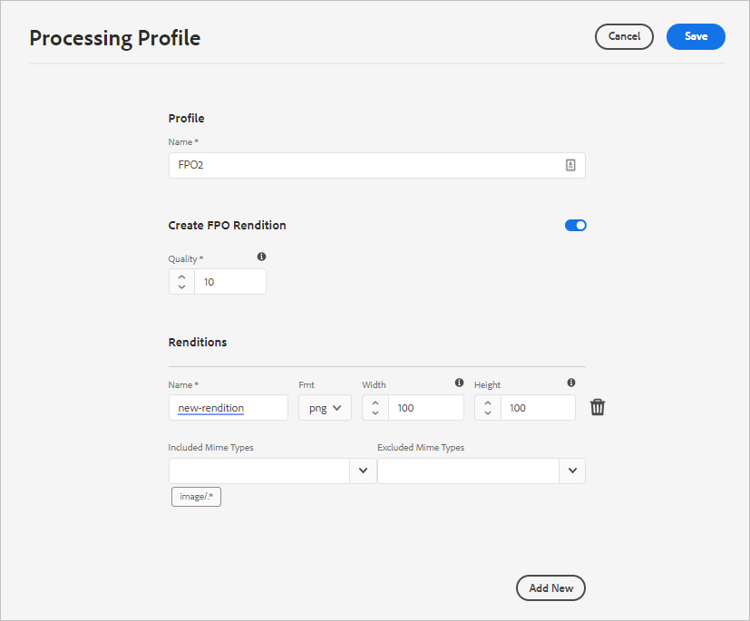
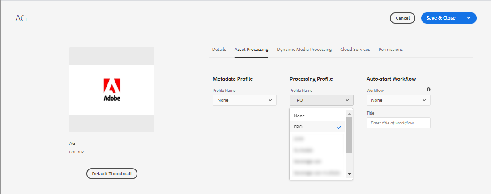
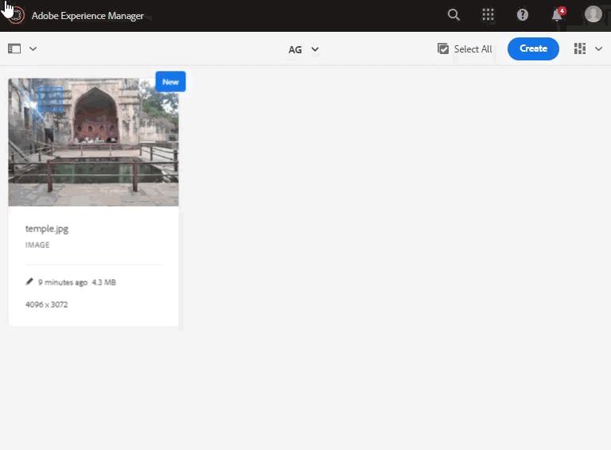
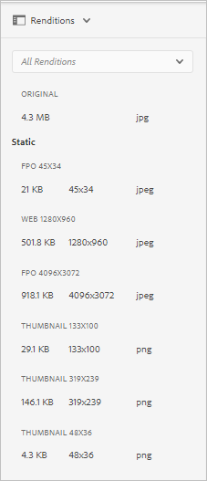

# Generate For Placement Only renditions for Adobe InDesign {#fpo-renditions}

<table>
    <tr>
        <td>
            <i>New</i> <a href="/help/assets/dynamic-media/dm-prime-ultimate.md"><b>Dynamic Media Prime and Ultimate</b></a>
        </td>
        <td>
            <i>New</i> <a href="/help/assets/assets-ultimate-overview.md"><b>AEM Assets Ultimate</b></a>
        </td>
        <td>
            <i>New</i> <a href="/help/assets/integrate-aem-assets-edge-delivery-services.md"><b>AEM Assets integration with Edge Delivery Services</b></a>
        </td>
        <td>
            <i>New</i> <a href="/help/assets/aem-assets-view-ui-extensibility.md"><b>UI Extensibility</b></a>
        </td>
          <td>
            <i>New</i> <a href="/help/assets/dynamic-media/enable-dynamic-media-prime-and-ultimate.md"><b>Enable Dynamic Media Prime and Ultimate</b></a>
        </td>
    </tr>
    <tr>
        <td>
            <a href="/help/assets/search-best-practices.md"><b>Search Best Practices</b></a>
        </td>
        <td>
            <a href="/help/assets/metadata-best-practices.md"><b>Metadata Best Practices</b></a>
        </td>
        <td>
            <a href="/help/assets/product-overview.md"><b>Content Hub</b></a>
        </td>
        <td>
            <a href="/help/assets/dynamic-media-open-apis-overview.md"><b>Dynamic Media with OpenAPI capabilities</b></a>
        </td>
        <td>
            <a href="https://developer.adobe.com/experience-cloud/experience-manager-apis/"><b>AEM Assets developer documentation</b></a>
        </td>
    </tr>
</table>

| Version | Article link |
| -------- | ---------------------------- |
| AEM 6.5  |    [Click here](https://experienceleague.adobe.com/en/docs/experience-manager-65/content/assets/administer/configure-fpo-renditions)                  |
| AEM as a Cloud Service     | This article         |

When placing large-sized assets from Experience Manager into Adobe InDesign documents, a creative professional must wait for a substantial time after they [place an asset](https://helpx.adobe.com/indesign/using/placing-graphics.html). Meanwhile, the user is blocked from using InDesign. This interrupts creative flow and negatively impacts the user experience. Adobe enables temporarily placing small-sized renditions in InDesign documents to begin with. When the final output is required, say for print and publishing workflows, the original, full-resolution assets replace the temporary rendition in the background. This asynchronous update in the background speeds up the design process to enhance productivity and does not hinder the creative process.

Assets provide renditions that are used For Placement Only (FPO). These FPO renditions have a small file size but are of the same aspect ratio. If an FPO rendition is not available for an asset, Adobe InDesign uses the original asset instead. This fallback mechanism ensures that the creative workflow proceeds without any breaks.

Experience Manager as a Cloud Service offers cloud-native asset-processing capabilities to generate the FPO renditions. Use asset microservices for rendition generation. You can configure rendition generation of newly uploaded assets and of the assets that exist in Experience Manager.

Following are the steps to generate FPO renditions:

1. [Create a processing profile](#create-processing-profile).

1. Configure Experience Manager to use this profile to [process new assets](#generate-renditions-of-new-assets). 
1. Use the profiles to [process existing assets](#generate-renditions-of-existing-assets).

## Create a Processing Profile {#create-processing-profile}

To generate FPO renditions, create a **[!UICONTROL Processing Profile]**. The profiles use cloud-native asset microservices for processing. For instructions, see [create processing profiles for asset microservices](asset-microservices-configure-and-use.md).

Select **[!UICONTROL Create FPO Rendition]** to generate FPO rendition. Optionally, click **[!UICONTROL Add New]** to add another rendition settings to the same profile.

## Generate renditions of new assets {#generate-renditions-of-new-assets}

To generate FPO renditions of new assets, apply the **[!UICONTROL Processing Profile]** to the folder in folder properties. In a folder's Properties page, click the **[!UICONTROL Asset Processing]** tab, select the **[!UICONTROL FPO profile]** as a **[!UICONTROL Processing Profile]**, and save the changes. All new assets uploaded to the folder are processed using this profile.

## Generate renditions of existing assets {#generate-renditions-of-existing-assets}

To generate renditions, select the assets and follow these steps.

## View FPO renditions {#view-fpo-renditions}

You can check that the generated FPO renditions after the workflow completes. In the Experience Manager Assets user interface, click the asset to open a large preview. Open the left rail and select **[!UICONTROL Renditions]**. Alternatively, use the keyboard shortcut `Alt + 3` when the preview is open.

Click **[!UICONTROL FPO rendition]** to load its preview. Optionally, you can right-click the rendition and save it to your file system. Check for available renditions in the left rail.

**See also**

* [Translate Assets](translate-assets.md)
* [Assets HTTP API](mac-api-assets.md)
* [Assets supported file formats](file-format-support.md)
* [Search assets](search-assets.md)
* [Connected assets](use-assets-across-connected-assets-instances.md)
* [Asset reports](asset-reports.md)
* [Metadata schemas](metadata-schemas.md)
* [Download assets](download-assets-from-aem.md)
* [Manage metadata](manage-metadata.md)
* [Search facets](search-facets.md)
* [Manage collections](manage-collections.md)
* [Bulk metadata import](metadata-import-export.md)
* [Publish Assets to AEM and Dynamic Media](/help/assets/publish-assets-to-aem-and-dm.md)