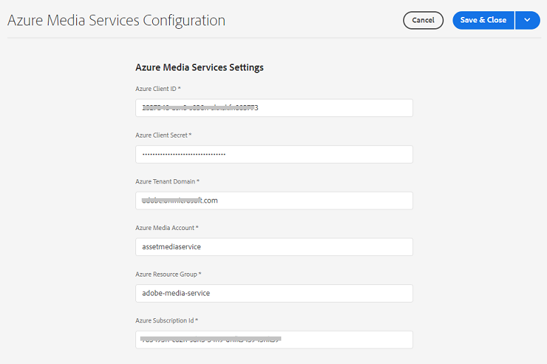
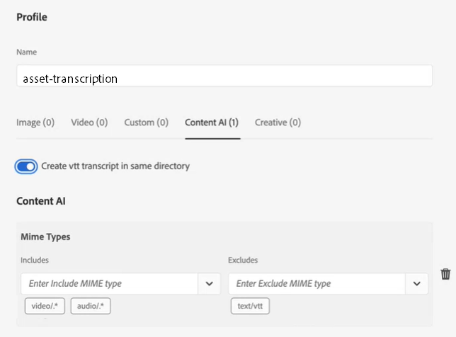
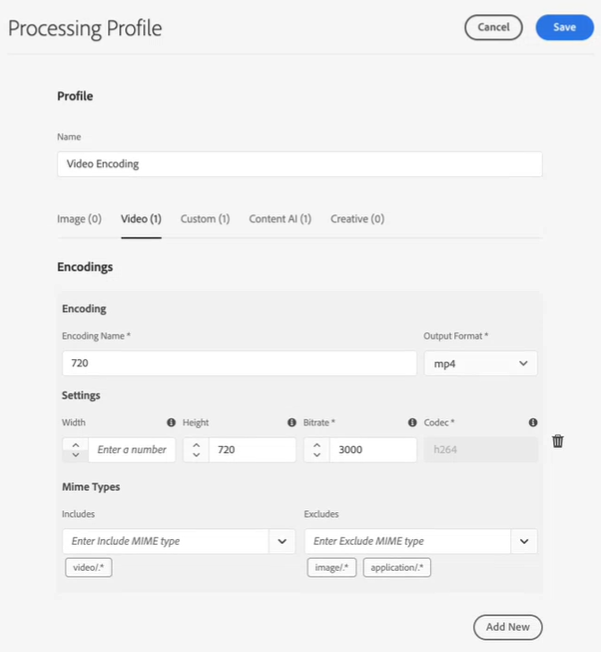
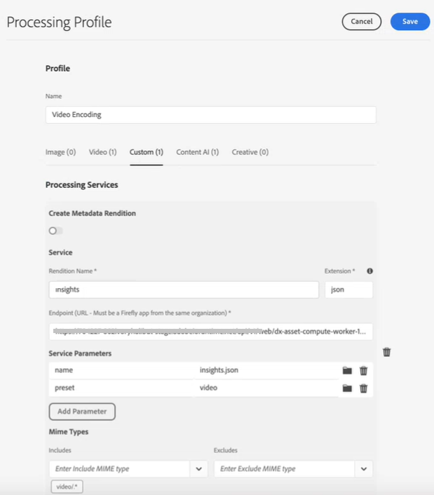
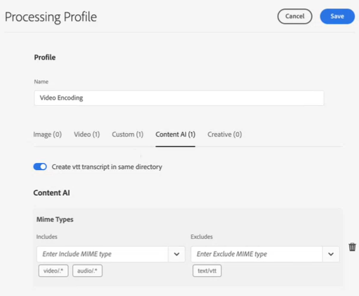
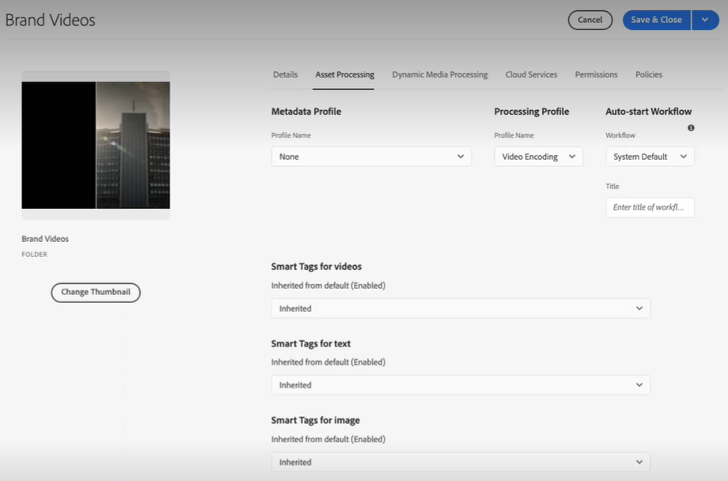
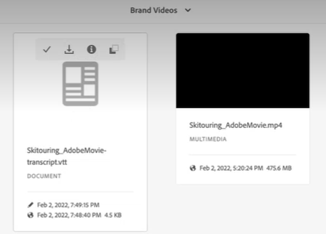
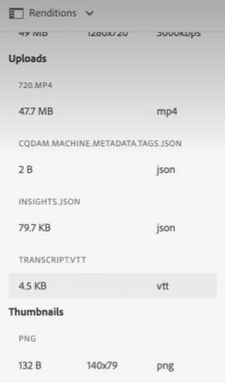
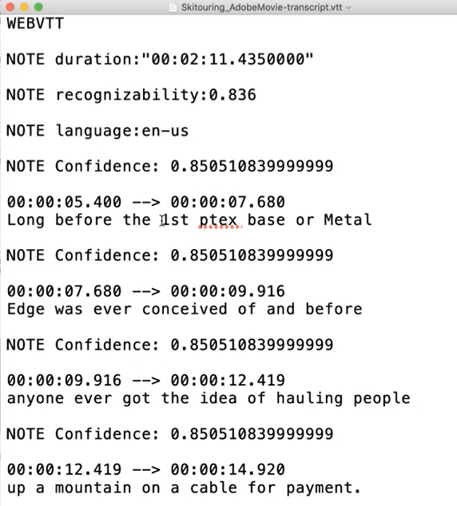
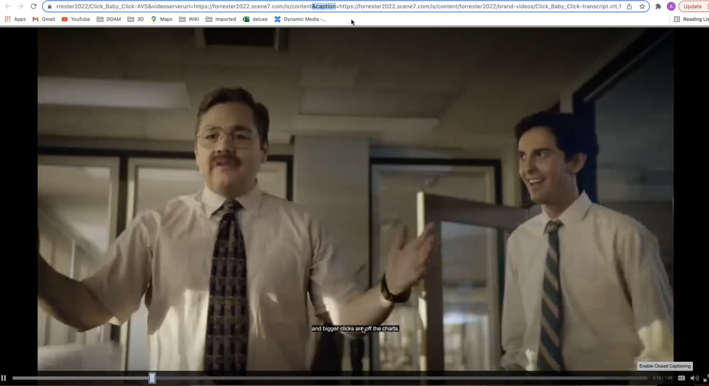

# Configure transcription in [!DNL Experience Manager Assets] {#configure-transcription-service}

| [Search Best Practices](/help/assets/search-best-practices.md) |[Metadata Best Practices](/help/assets/metadata-best-practices.md)|[Content Hub](/help/assets/product-overview.md)|[Dynamic Media with OpenAPI capabilities](/help/assets/dynamic-media-open-apis-overview.md)|[AEM Assets developer documentation](https://developer.adobe.com/experience-cloud/experience-manager-apis/)|
| ------------- | --------------------------- |---------|----|-----|

Transcription is the process of translating the audio from an audio or video file into text (speech to text) using the speech recognition technology. 
[!DNL Adobe Experience Manager Assets] is configured with [!DNL Azure Media Services] which automatically generates text transcript of the spoken language in a supported audio or video file in the WebVTT (.vtt) format. When an audio or video asset is processed in [!DNL Experience Manager Assets], the transcription service automatically generates the text transcript rendition of the audio or video asset and stores it at the same location within your Assets repository where the original asset resides. The [!DNL Experience Manager Assets] transcription service allows marketers to effectively manage their audio and video content with added discoverability of the text content and increase the ROI of these assets by supporting accessibility and localization.

Transcripts are text versions of spoken content; an example is a movie that you are watching on any OTT platform which often includes captions to help with accessibility or consuming the content in other languages. Or any audio or video file used for marketing, learning, or entertainment purpose. These experiences start with a transcription that is then formatted or translated as appropriate. Transcribing audio or video is a time intensive and error-prone process when performed manually. It is also a challenge to scale the manual process, given the ever-increasing need for audio-video content. [!DNL Experience Manager Assets] uses the Azure's AI-based transcription which allows high-scale processing of the audio and video assets and generates the text transcripts (.vtt files) along with the timestamp details. Along with Assets, the transcription feature is also supported with Dynamic Media.

The transcription feature is available without any cost in [!DNL Experience Manager Assets]. However, the administrators require the user's Azure credentials to configure the transcription service in [!DNL Experience Manager Assets]. You can also [get the trial credentials](https://azure.microsoft.com/en-us/pricing/details/media-services/) directly from Microsoft&reg; to experience the audio or video transcription feature in Assets.

## Transcription prerequisites {#prerequisites}

1. An up and running [!DNL Experience Manager Assets as a Cloud Service] instance.
1. The following Azure credentials are required for configuration in [!DNL Experience Manager Assets]:

   * Client ID (API key)
   * Client Secret key
   * Tenant Endpoint (domain)
   * Media Account
   * Resource Group
   * Subscription ID

   See [Azure documentation](https://docs.microsoft.com/en-us/azure/media-services/latest/access-api-howto?tabs=portal) to get credentials to access Azure Media Services API.

1. Ensure that the Azure account has sufficient credit to process new requests.

## Configure transcription in [!DNL Experience Manager Assets] {#configure-transcription}

Following are the configurations required to enable the transcription feature in [!DNL Experience Manager Assets]:

1. [Configure Azure Media Services](#configure-azure-media-service)
1. [Configure Processing Profile for audio/video transcription](#configure-processing-profile-for-transcription)

### Configure Azure Media Services {#configure-azure-media-services}

[!DNL Experience Manager Assets] uses the [!DNL Azure Media Services] which automatically generates text transcripts of the spoken language in a [supported audio or video file](#supported-file-formats-for-transcription) in the WebVTT (.vtt) format. The administrators can configure [!DNL Azure Media Services] in [!DNL Experience Manager Assets] using the Azure credentials. The [transcription prerequisites](#transcription-prerequisites) list the [!DNL Azure] credentials that are required for the configuration. If you do not have [!DNL Azure] account and credentials, see [Azure Media Services documentation](https://azure.microsoft.com/en-us/pricing/details/media-services/) to get trial credentials.

Go to **[!UICONTROL Tools]** > **[!UICONTROL Cloud Services]** > **[!UICONTROL Azure Media Services Configuration]**. Select a folder (location) from the left rail and click the [!UICONTROL Create] button to configure the connection with your [!DNL Azure] account. This folder is the location where your [!DNL Azure] cloud configuration is stored in Experience Manager Assets. Enter the [!DNL Azure] credentials and click **[!UICONTROL Save & Close]**.

### Configure Processing Profile for transcription {#configure-processing-profile}

Once the [!DNL Azure Media Services] is configured in Experience Manager Assets, the next step is to create an asset Processing Profile for generating AI-based transcription of the audio and video assets. The AI-based processing profile generates transcripts of the [supported audio or video asset](#supported-file-formats-for-transcription) as a rendition in Experience Manager Assets and stores the transcript (.vtt file) in the same folder where the original asset resides. Thus, it is easier for the users to search and locate the asset and its transcript rendition.

Go to **[!UICONTROL Tools]** > **[!UICONTROL Assets]** > **[!UICONTROL Processing Profiles]** and click the **[!UICONTROL Create]** button to create an AI-based processing profile for generating transcription of your audio and video files. By default, the processing profile page reflects only three tabs (Image, Video, and Custom). However, a **[!UICONTROL Content AI]** tab is visible if you have configured [!DNL Azure Media Services] in your [!DNL Experience Manager Assets] instance. Verify your [!DNL Azure] credentials if you do not see the **[!UICONTROL Content AI]** tab while creating a Processing Profile.

In the **[!UICONTROL Content AI]** tab, click the **[!UICONTROL Add New]** button to configure transcription. Here, you can include and exclude the file formats (MIME types) for generating transcripts by selecting file types from the drop-down list. In the following Illustration, all the supported audio and video files are included and the text files are excluded.

Enable the **[!UICONTROL Create VTT transcript in same directory]** toggle to create and store the transcript rendition (.vtt file) in the same folder where the original asset resides. The other renditions are also generated by the default DAM asset processing workflow regardless of this setting.

The following Illustration details a custom video profile that is created in Experience Manager Assets.

The video profile also contains the following custom configurations. See [processing profile documentation](/help/assets/asset-microservices-configure-and-use.md) for details on how to create custom processing profile.

Let us now configure transcription in this video profile. Navigate to the **[!UICONTROL Content AI]** tab and click the **[!UICONTROL Add New]** button. Include all the audio and video files and exclude the image and application files. Enable the **[!UICONTROL Create VTT transcript in same directory]** toggle and save the configuration.

Once the processing profile is configured for transcription of audio and video files, you can apply this processing profile to folders using one of the following methods:

* Select a processing profile definition in **[!UICONTROL Tools]** > **[!UICONTROL Assets]** > **[!UICONTROL Processing Profiles]**, and use **[!UICONTROL Apply Profile to Folders]** action. The content browser lets you navigate to a specific folder, select folder and confirm the application of the profile.
* Select a folder in the Assets user interface and click **[!UICONTROL Properties]** action to open folder properties. Click the **[!UICONTROL Asset Processing]** tab, and select the appropriate processing profile for the folder from the **[!UICONTROL Processing Profile]** list. To save the changes, click **[!UICONTROL Save & Close]**.

   

* Users can select folders or specific assets in Assets user interface to apply a processing profile, then select **[!UICONTROL Reprocess Assets]** option from the options available on the top.

>[!TIP]
>Only one processing profile can be applied to a folder.
>
>After a processing profile is applied to a folder, all the new assets uploaded (or updated) in this folder or any of its subfolders are processed using the additional processing profile configured. This processing is in addition to the standard, default profile.

>[!NOTE]
>
>A processing profile applied to a folder works for the entire tree, however, can be over-ridden with another profile applied to a subfolder. 
>
>When assets are uploaded to a folder, Experience Manager communicates with the containing folder's properties to identify the processing profile. If none is applied, a parent folder in the hierarchy is checked for a processing profile to apply.

## Generate transcription of your audio or video assets {#generate-transcription}

When processing a video asset, the [AI-based processing profile](#configure-processing-profile-for-transcription) automatically generates the transcript (.vtt file) as a rendition along with the original asset in the same folder.

You can also see the transcript rendition by accessing the Renditions of the original video asset. To access the **[!UICONTROL Renditions]** panel, select the original video asset and open the left rail. You can see that the transcript rendition (.vtt file) is visible under the **[!UICONTROL TRANSCRIPTVTT]** head.

You can download the transcript (.vtt text file) directly from the folder as a separate asset rendition, or from within the **[!UICONTROL Renditions]** panel of the original asset by downloading all the renditions of the asset.

Currently, Experience Manager does not support full text preview or editing of VTT files natively. However, you can download the transcript rendition and use any text editor to edit or verify the transcript. The transcript reflects the spoken language as a text at the given timestamp in the video with the confidence score (accuracy) of the transcription.

## Using transcription in Dynamic Media {#using-transcription-in-dynamic-media}

If you have [configured Dynamic Media](/help/assets/dynamic-media/config-dm.md) in your Experience Manager Assets instance, you can publish the asset (audio or video file) and its transcript (.vtt file) to Dynamic Media. By doing so, the original asset (audio or video file) and its transcribed rendition (.vtt file) are published to Dynamic Media in the same folder. The Dynamic Media administrator can [enable CC Closed Caption experience](/help/assets/dynamic-media/video.md#adding-captions-to-video) for the audio or video file using the transcript rendition (.vtt file).

See also:

* [Video tutorial on how to add CC Closed Caption to Dynamic Media video](https://experienceleague.adobe.com/docs/experience-manager-learn/assets/dynamic-media/dynamic-media-overview-feature-video-use.html#add-cc-closed-captioning-to-dynamic-media-video)
* [Publish Dynamic Media videos to YouTube](/help/assets/dynamic-media/video.md#publishing-videos-to-youtube)

In the following Illustration, the URL reflects the caption part which refers to the transcript (.vtt file). The video reflects the spoken language (transcribed text) as a **[!UICONTROL Closed Caption]** at the given timestamp in the video. The user can enable or disable the caption by using the **[!UICONTROL CC]** button.

## Supported file formats for transcription {#supported-file-format}

The following audio and video file formats are supported for transcription:

|Supported audio/video formats| Extensions|
|----|----|
|FLV (with H.264 and AAC codecs)| (.flv)|
|MXF| (.mxf)|
|MPEG2-PS, MPEG2-TS, 3GP| (.ts, .ps, .3gp, .3gpp, .mpg)|
|Windows Media Video (WMV)/ASF| (.wmv, .asf)|
|AVI (Uncompressed 8bit/10bit)| (.avi)|
|MP4| (.mp4, .m4a, .m4v)|
|Microsoft&reg; Digital Video Recording (DVR-MS)| (.dvr-ms)|
|Matroska/WebM| (.mkv)|
|WAVE/WAV| (.wav)|
|QuickTime| (.mov)|

>[!NOTE]
>
>The assets (audio or video files) that are of application type are not supported for transcription.

## Known limitations {#known-limitations}

* The transcription feature is supported for videos of duration up to 10 mins.
* The video title must be 80 characters or less.
* The supported file size is up to 15 GB.
* The maximum processing duration supported is 60 mins.
* In a paid [!DNL Azure] account, you can upload up to 50 movies per minute. However, in a trial account you can upload up to five movies per minute.

## Troubleshooting tips {#troubleshooting}

Log in to your [!DNL Azure Media Services] account with the same credentials (that you have used for configuration) to verify the request status. Contact [!DNL Azure] support if your request is not processed successfully.

**See also**

* [Translate Assets](translate-assets.md)
* [Assets HTTP API](mac-api-assets.md)
* [Assets supported file formats](file-format-support.md)
* [Search assets](search-assets.md)
* [Connected assets](use-assets-across-connected-assets-instances.md)
* [Asset reports](asset-reports.md)
* [Metadata schemas](metadata-schemas.md)
* [Download assets](download-assets-from-aem.md)
* [Manage metadata](manage-metadata.md)
* [Search facets](search-facets.md)
* [Manage collections](manage-collections.md)
* [Bulk metadata import](metadata-import-export.md)
* [Publish Assets to AEM and Dynamic Media](/help/assets/publish-assets-to-aem-and-dm.md)
