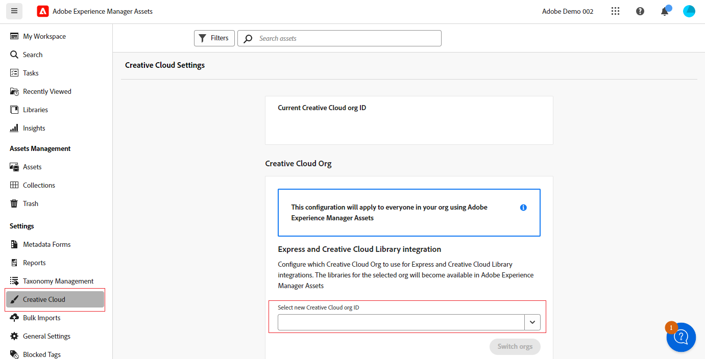

# Connect AEM Assets to Creative Cloud  {#cross-org-entitlements}

<table>
    <tr>
        <td>
            <i>New</i> <a href="/help/assets/dynamic-media/dm-prime-ultimate.md"><b>Dynamic Media Prime and Ultimate</b></a>
        </td>
        <td>
            <i>New</i> <a href="/help/assets/assets-ultimate-overview.md"><b>AEM Assets Ultimate</b></a>
        </td>
        <td>
            <i>New</i> <a href="/help/assets/integrate-aem-assets-edge-delivery-services.md"><b>AEM Assets integration with Edge Delivery Services</b></a>
        </td>
        <td>
            <i>New</i> <a href="/help/assets/aem-assets-view-ui-extensibility.md"><b>UI Extensibility</b></a>
        </td>
          <td>
            <i>New</i> <a href="/help/assets/dynamic-media/enable-dynamic-media-prime-and-ultimate.md"><b>Enable Dynamic Media Prime and Ultimate</b></a>
        </td>
    </tr>
    <tr>
        <td>
            <a href="/help/assets/search-best-practices.md"><b>Search Best Practices</b></a>
        </td>
        <td>
            <a href="/help/assets/metadata-best-practices.md"><b>Metadata Best Practices</b></a>
        </td>
        <td>
            <a href="/help/assets/product-overview.md"><b>Content Hub</b></a>
        </td>
        <td>
            <a href="/help/assets/dynamic-media-open-apis-overview.md"><b>Dynamic Media with OpenAPI capabilities</b></a>
        </td>
        <td>
            <a href="https://developer.adobe.com/experience-cloud/experience-manager-apis/"><b>AEM Assets developer documentation</b></a>
        </td>
    </tr>
</table>

Experience Manager Assets has the ability to connect to a Creative Cloud entitlement that is provisioned to a different IMS organization to easily use the latest Creative Cloud integrations in AEM Assets, including Express and Creative Cloud Libraries.

If your Creative Cloud products and AEM Assets are provisioned to separate IMS organizations, you can connect to a different Creative Cloud organization to be able to execute integrated workflows between the two solutions.

## Prerequisites {#prerequisites}

* Administrator rights to Experience Manager Assets

* Active entitlement to Creative Cloud for the same user ID used across Creative Cloud and Experience Manager. Entitlements to personal and federated IDs with the same email address are treated as different user IDs.

## Connect to a new Creative Cloud organization {#connect-to-creative-cloud-org}

To connect to a new Creative Cloud organization, execute the following steps:

1. Navigate to **[!UICONTROL Settings]** > **[!UICONTROL Creative Cloud]**.

1. Select the new Creative Cloud organization using the **[!UICONTROL Select new Creative Cloud org ID]** drop-down list. The list displays all organizations that you have access to. Select the organization with active Creative Cloud entitlements.

1. Click **[!UICONTROL Switch orgs]** to switch to the new organization.

   

## Limitations {#limitations}

* You can connect AEM Assets to one Creative Cloud organization at a time. Connection to multiple Creative Cloud organizations at a time is not supported.

* The Creative Cloud organization that you connect to within AEM Assets is applicable to all users within your organization.
