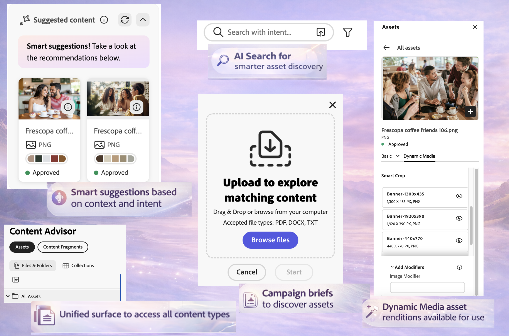
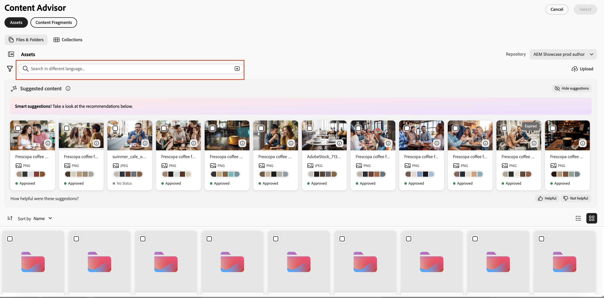
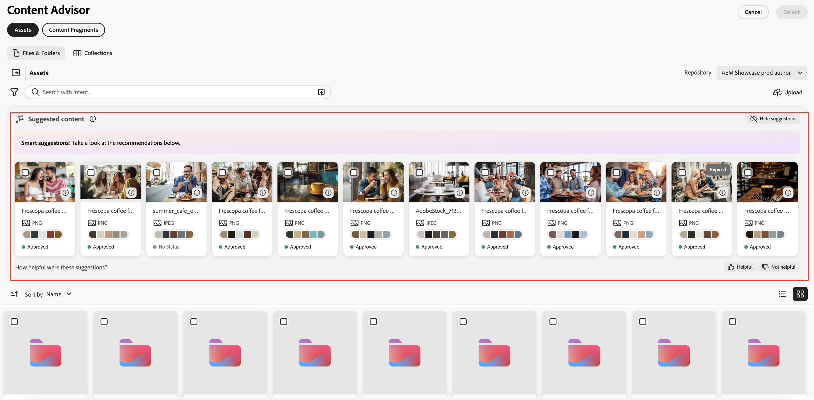
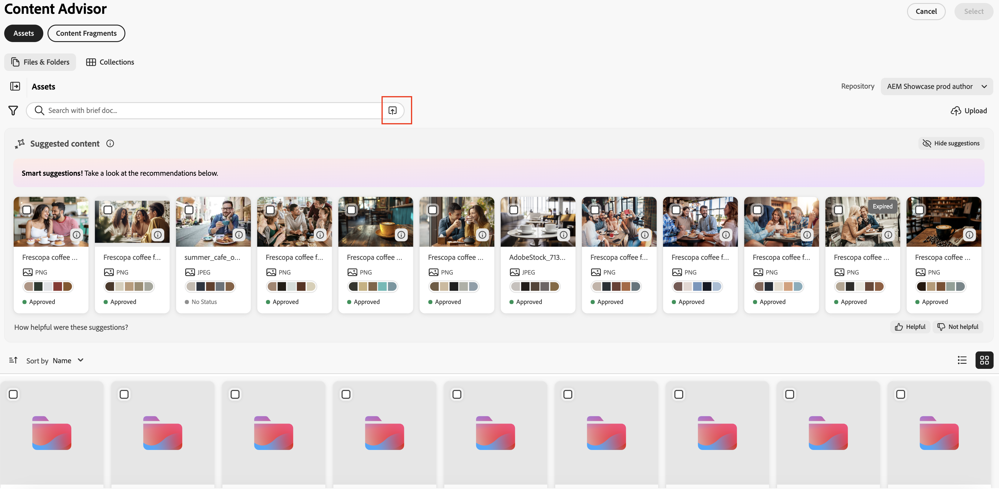
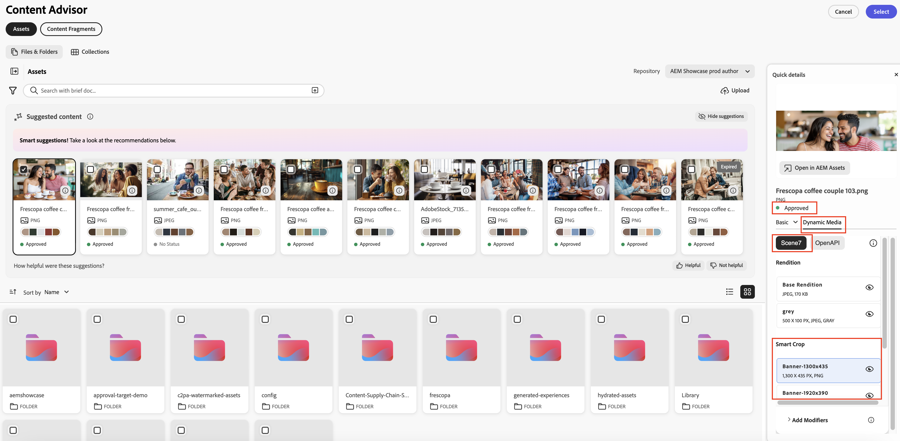
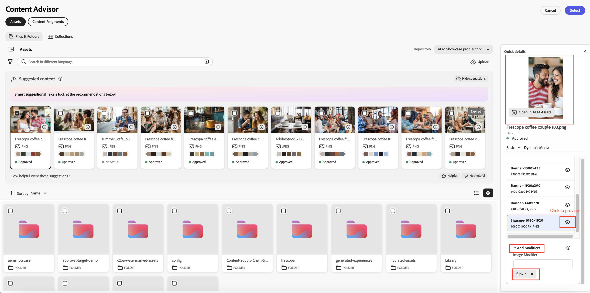
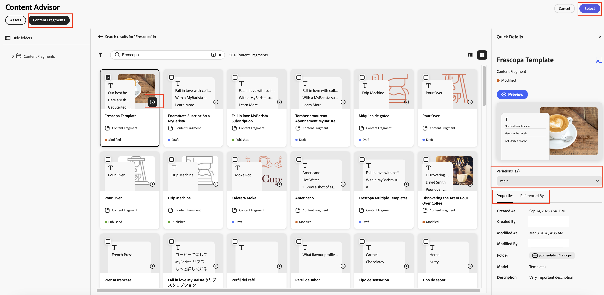
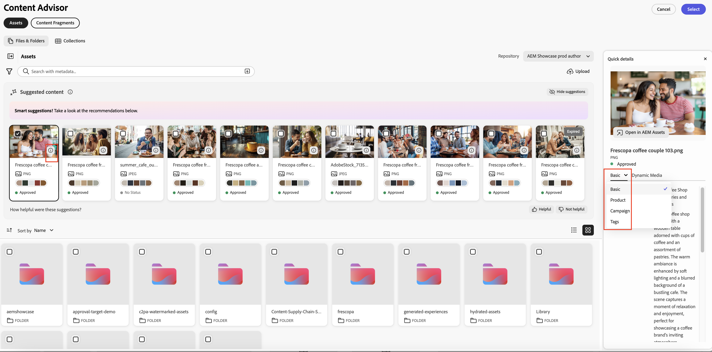
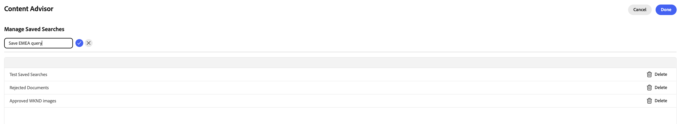

# Use Content Advisor to access AEM content in Adobe and non-Adobe applications{#content-advisor-aem-assets-adobe-non-Adobe-applications}

Content Advisor delivers a unified content discovery experience across Adobe and non-Adobe applications. Natively integrated with applications such as Adobe Workfront, AJO B2C (coming soon), AEM Sites and non-Adobe applications, Content Advisor brings content (assets and Content Fragments) together in a single, intelligent interface. It enables you to effortlessly discover, browse, and reuse the most relevant content, right within your workflow, so you can move faster without breaking context.

>[!IMPORTANT]
> 
> Content Fragment pill is not currently available and will be supported soon for appropriate Adobe applications.

Content Advisor brings intelligent, context-aware discovery directly into the authoring experience, helping you quickly find relevant, approved content based on your intent. With features such as smart suggestions, Dynamic Media renditions, and detailed asset metadata, it enables you to efficiently evaluate and reuse content without leaving the application interface, accelerating content creation while maintaining brand consistency.

Adobe Experience Manager (AEM) Assets also integrates natively with Adobe Express, allowing you to discover, access, and use assets from AEM Assets directly within the Express interface using Content Advisor. For more information, see [Use Content Advisor to access AEM Assets in Adobe Express](/help/assets/native-integration-adobe-express.md).

## Prerequisites {#prerequisites}

* Access to an AEM Assets as a Cloud Service environment.

* Access to an AEM Sites environment with authored Content Fragments (required only for working with Content Fragments). This is not required for accessing binary assets or AEM Assets.

## Intelligent asset discovery with Content Advisor {#intelligent-asset-discovery-content-advisor}

Content Advisor helps you discover relevant content using intelligent, context-aware recommendations based on your host Adobe application content or campaign brief. It also allows you to select channel-ready Dynamic Media renditions optimized for your use case. 

>[!IMPORTANT]
> 
>Ensure that you select an **author** repository from the **Repository** drop-down list. A **delivery** repository does not display Content Advisor features. 
>
> In addition, the **delivery** repository does not have content organized in folders and collections. The content is displayed at the root level in a flat structure.

Content Advisor provides the following key features:

* [AI Search for smarter asset discovery](#content-advisor-ai-search)

* [Smart suggestions based on context and intent](#smart-suggestions-content-advisor)

* [Campaign briefs to discover relevant assets](#campaign-briefs-content-advisor)

* [Dynamic Media asset renditions available for use](#dynamic-media-renditions-content-advisor)

* [Seamless integration with Content Fragments](#content-fragments-integration-content-advisor)

* [Access asset metadata consistent with Assets view](#asset-metadata-content-advisor)

* [Access filters consistent with Assets view](#filters-content-advisor)

* [Access and reuse recent and saved searches](#saved-searches-content-advisor)

* [Search for assets across and within collections](#search-collections-content-advisor)

### AI Search for smarter asset discovery {#content-advisor-ai-search}

Content Advisor uses an advanced search capability that understands the meaning and intent behind a user's query rather than relying on exact keyword matches. It uses Artificial Intelligence (AI) and machine learning to deliver more accurate and context-aware results.

Unlike traditional keyword-based search, which looks for exact terms, AI Search interprets relationships between words, concepts, and user intent. This ensures that users find what they are looking for—even if their query is phrased differently, contains typos, or is in another language.

Some if its key benefits include:

   * Multilingual support: Search across multiple languages without requiring exact translations. Users can find relevant content regardless of their query language.

   * Handles misspellings: Interprets typos and spelling errors, ensuring accurate results even with imperfect input.

   * Understands synonyms: Delivers results for related terms and phrases, so users do not need to guess the right keyword.

   * Context-Aware search: Recognizes the intent behind a query, not just the exact words.

   >[!IMPORTANT]
   > 
   >* Minimum required AEM release version to access AI Search within Content Advisor is `21994`
   >* AI Search support is coming soon for Content Fragments.
   

### Smart suggestions based on context and intent {#smart-suggestions-content-advisor}

 Content Advisor displays smart suggestions based on the context of the host Adobe application. This helps you quickly discover and use assets that align with your content needs without the time-consuming manual search.

   

>[!IMPORTANT]
> 
>* You must sign a GenAI Rider to access this feature within Content Advisor. To sign GenAI rider, contact your Adobe representative.
>* Minimum required AEM release version to access this feature is `21994`.
>* Content Advisor displays smart suggestions based on the context and intent of the content available within the host Adobe application. It does not display results based on images. See [Content Advisor feature support across Adobe applications](#content-advisor-feature-support-adobe-applications) for the list of supported Adobe applications that support this capability.

### Campaign briefs to discover relevant assets {#campaign-briefs-content-advisor}

Content Advisor allows you to upload a campaign brief document to discover relevant assets without manually entering search keywords. Content Advisor analyzes the information in the campaign brief to understand the campaign's intent and recommends relevant assets available in AEM Assets.

  

   >[!IMPORTANT]
   >
   >* Content Advisor analyzes the information available as text in the campaign brief to recommend relevant assets. It does not analyze the information available as images in the campaign brief.
   >* The supported file types that you can upload as a campaign brief include PDF, DOCX, and TXT documents. 
   >* You must sign a GenAI Rider to access this feature within Content Advisor. To sign GenAI rider, contact your Adobe representative.
   >* Minimum required AEM release version to access this feature is `21994`.
   >* Upload Campaign Brief support is coming soon for Content Fragments.

### Dynamic Media asset renditions available for use {#dynamic-media-renditions-content-advisor}

Dynamic Media renditions provide ready-to-use, channel-optimized versions of assets, including [image presets](/help/assets/dynamic-media/managing-image-presets.md), [Smart Crops](/help/assets/dynamic-media/image-profiles.md), format types, and color profiles. These renditions help ensure that the selected asset meets channel and design requirements without requiring manual editing or asset duplication.

You can also apply Dynamic Media modifiers to preview adjustments in real-time before selecting the rendition for the host Adobe application, enabling faster selection of the most appropriate rendition while maintaining asset consistency and quality.

Click the  icon on the asset card and select the  **[!UICONTROL Dynamic Media]** tab to view the available renditions for an asset. You can select to view [Dynamic Media Scene7](/help/assets/dynamic-media/dynamic-media.md) renditions or [Dynamic Media with OpenAPI](/help/assets/dynamic-media-open-apis-overview.md) renditions. When you select **[!UICONTROL OpenAPI]** for an asset, the available renditions display only if the asset is approved and available to Dynamic Media with OpenAPI.

You must have a valid AEM Dynamic Media license to view the Dynamic Media tab.

Click the  icon to preview the rendition or click the rendition name and click **[!UICONTROL Select]** to make the rendition available in your host application.

Click **[!UICONTROL Add Modifiers]**, specify a modifier in the text box, and press Enter to apply the transformation to all asset renditions in real-time. Similarly, you can add multiple modifiers to renditions and preview those transformations. Click the rendition name and click **[!UICONTROL Select]** to make the rendition available in your host application. The rendition after applying those modifiers is not saved. See the list of supported modifiers for [Dynamic Media Scene7](https://experienceleague.adobe.com/en/docs/dynamic-media-developer-resources/image-serving-api/image-serving-api/http-protocol-reference/command-reference/c-command-reference) and [Dynamic Media with OpenAPI](https://developer.adobe.com/experience-cloud/experience-manager-apis/api/stable/assets/delivery/#operation/getAssetSeoFormat).

### Discovery of Content Fragments {#content-fragments-discovery-content-advisor}

Content Advisor provides discovery of Content Fragments, enabling you to easily browse and incorporate fragments into supported Adobe applications. Search through a list of Content Fragments and select the most relevant content without leaving your current workflow.

Each Content Fragment is represented as a card with a live thumbnail preview generated from its content, helping you to quickly identify the right fragment. The card also displays key details such as the title and status (Draft, Modified, or Published). For deeper insights, click the  icon to view detailed properties, references to other Content Fragments and available variations, ensuring informed content selection and reuse.

>[!IMPORTANT]
> 
>* AI Search, Smart Suggestions, Upload Campaign Briefs, and Preview capabilities are not yet supported for Content Fragments in Content Advisor.

### Access asset metadata consistent with Assets view {#asset-metadata-content-advisor}

Content Advisor provides access to asset properties defined in AEM Assets, including metadata available in the Assets view. Content Advisor uses the same metadata configuration as in Assets View, replicating the list of metadata tabs and content in Assets view asset details page. This allows you to review key asset details such as title, description, format, size, and other metadata before selecting an asset. Access to asset properties helps ensure you choose the correct and approved asset for your content.

Click the  icon on the asset card and select the  **[!UICONTROL Basic]** tab to view asset metadata. You can also view other asset metadata tabs such as, Product, Campaign, and Tags, consistent with the asset metadata that exist in Assets view.

Content Advisor displays properties (metadata) for files in a read-only view. The properties are not displayed for collections and folders.

### Access filters consistent with Assets view {#filters-content-advisor}

Content Advisor provides the same filtering capabilities within your host Adobe application that are  available in the Assets view, enabling you to refine assets using predefined filters. Same filtering capabilities as available in Assets view also apply to the filters specific to content types, such as files, folders, and collections. This ensures a consistent asset discovery experience and helps you efficiently locate relevant assets within your host Adobe application.

If you do not have filters set up in Assets view via filter schema, Content Advisor displays out-of-the-box filters including File Type, File Format, Asset Status, File Size, Image Width, Image Height, Modified Date, and Created Date.

Custom filterschema is supported for Assets (Files) but not yet supported for Folders and Collections.

### Access and reuse recent and saved searches {#saved-searches-content-advisor}

 Saved searches created in the Assets view are also available, enabling you to reuse predefined search criteria. Saved searches works consistently between Assets view and Content Advisor across browsers. This helps you efficiently locate assets using consistent search patterns across AEM Assets and other Adobe applications.

 To save your frequently used search using Content Advisor:

1. Specify a search term (optional), click the filters icon, and select the options based on your requirements to create a search query.

1. Click **Manage saved searches** > **Create new Saved Search**.

1. Specify the name of the search and click  to save it. The search displays in the list of items.

   

To apply any of the saved search items, select the search item from the **[!UICONTROL Saved Searches]** drop-down list. Content Advisor displays the results based on the search query.

Content Advisor saves your recent searches and also allows you to save frequently used searches for quick access later. The list of recent searches is not consistent between Assets view and Content Advisor. The same user can have different set of recent searches in Assets view and Content Advisor. If you are using Incognito mode to access Content Advisor, the list of recent searches is not available. In addition, recent searches are not shared across different browsers for the same user and are AEM environment-specific.

The Default Saved Search feature, available in Assets view, is not available yet in Content Advisor.

### Search for assets across and within collections {#search-collections-content-advisor}

Content Advisor allows you to search for assets or collections across all collections or limit your search to a specific collection. This helps you quickly locate and use assets from curated collections while preserving their intended organizational context.

## Content Advisor feature support across Adobe applications {#content-advisor-feature-support-adobe-applications}

The following table illustrates the Content Advisor feature support across Adobe applications.

>[!IMPORTANT]
> 
> As Content Advisor expands to additional Adobe applications, this table will be updated to reflect the latest support.

| Application                          | Support for brief upload for searching Assets | Support for suggested content panel while searching Assets | Support for Dynamic Media panel while searching Assets | Support for searching Content Fragments |
|--------------------------------------|----------------------------------------------|-----------------------------------------------------------|--------------------------------------------------------|------------------------------------------|
| [Adobe Express](/help/assets/native-integration-adobe-express.md)                      |  &#10003;                                            | &#10003;                                                         | &#10003;                                                      | &#10003;                                        |
| [AEM Sites - Document Authoring](https://www.aem.live/docs/authoring-guide#document-authoring)                      |  &#10003;                                            | &#10003;                                                         | &#10003;                                                      | &minus;                                        |
| [AEM Sites - Universal Editor](https://www.aem.live/docs/authoring-guide#universal-editor-in-aem-sites)                     |  &#10003;                                            | &#10003;                                                         | &#10003;                                                      |  &minus;                                        |
| AEM Sites - [GoogleDrive](https://www.aem.live/docs/authoring-guide#google-drive)/[Sharepoint authoring](https://www.aem.live/docs/authoring-guide#microsoft-sharepoint) |  &#10003;                                            | &minus;                                                         | &#10003;                                                      | &minus;                                        |
| AEM Sites (Content Fragment Editor)              |  &#10003;                                            | &#10003;                                                         | &#10003;                                                      |  &minus;                                        |
| Adobe Workfront Workflow                     |  &#10003;                                            | &#10003;                                                         | &minus;                                                      |  &#10003;                                        |
| Adobe Workfront Planning                     |  &#10003;                                            | &#10003;                                                         | &minus;                                                      |  &#10003;                                        |

## Content Advisor feature support across non-Adobe applications {#content-advisor-feature-support-non-adobe-applications}

Content Advisor is also available for integration with non-Adobe (third-party) applications, extending intelligent asset discovery beyond Adobe applications. The same rich feature set, including AI-powered search, context-aware recommendations, campaign brief–based discovery, access to Dynamic Media renditions, filters, and asset metadata, is supported in third-party integrations.

This allows you to discover, evaluate, and use approved assets from AEM Assets directly within your external applications while maintaining consistency with the experience available in Adobe Express and other Adobe applications.

For more information about the integrations, properties, and customizations, refer to the following articles:

* [Content Advisor integration examples](https://github.com/adobe/aem-assets-selectors-mfe-examples/tree/consolidate-docs-to-experience-league/examples)

* [Content Advisor properties](/help/assets/content-advisor-properties.md)

* [Content Advisor customozations](/help/assets/content-advisor-properties.md)
