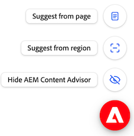
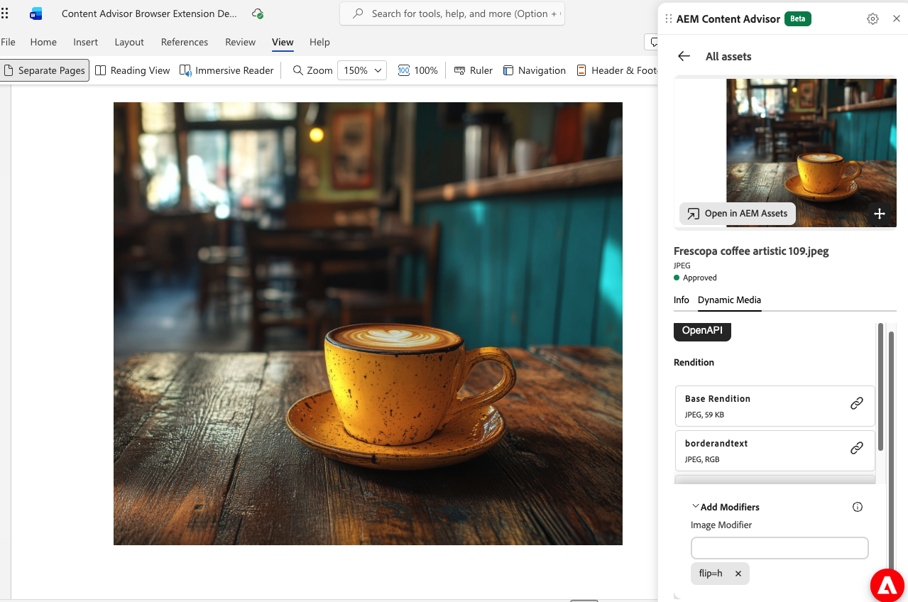

# Use AEM Content Advisor with the browser extension (Beta) {#content-advisor-browser-extension}

Use the power of AEM Content Advisor for AEM Assets, in the application of your choice with the browser extension.

**Why you will love it?**

* **Zero setup, zero code.** Install it, sign in, and start working. No integration, no custom connectors, no developer tickets.

* **Smarter suggestions, on your terms.** Recommendations come from the whole page, or narrow them by selecting a region, highlighting text, or choosing an image. The more precisely you point, the sharper the results.

* **Pick exactly what you need.** Choose any asset or any Dynamic Media rendition (the right size, format, or crop) and send it straight to your editor. Insert, drag and drop, or copy URL to the clipboard.

* **Works where you author.** AEM (Cloud Service, Adobe Managed Services, or On-premise), other Adobe CX Enterprise products (where AEM Assets native integration does not exist), and third-party tools such as Google Docs/WordPress/Microsoft Powerpoint, and any other web application.

>[!IMPORTANT]
> 
>You can send an email to `aem-content-advisor-feedback@adobe.com` to provide feedback on AEM Content Advisor browser extension.

## Pre-requisites {#prerequisites-content-advisor}

* You must sign in with an Adobe ID that has access to the required AEM Assets repository.

* A valid Dynamic Media license to view Dynamic Media renditions.

## Install and use the extension {#content-advisor-browser-extension-install}

1. Install the [AEM Content Advisor extension from the Chrome Web Store](https://chromewebstore.google.com/detail/content-advisor/hgagfaikdinmneghfgjjocmfidmnadga).
2. Sign in with your Adobe ID when prompted.
3. Open a supported web application.
4. Open AEM Content Advisor by selecting the **AEM Content Advisor** extension button or the floating AEM Content Advisor widget. You can also [configure settings for AEM Content Advisor browser extension](#content-advisor-browser-extension-configure) before starting to use the extension.
5. Select one of the following options to additionally benefit from AEM Content Advisor suggestions:
   * **Suggest from page** to get recommendations based on the page content.
   * **Suggest from region** to get recommendations based on a selected area of the page.

   

6. Drag a recommended asset into the editor, or select to copy the asset if direct drag and drop is not supported.

   >[!NOTE]
   >
   >The [rich features of AEM Content Advisor](/help/assets/integrate-adobe-non-adobe-applications.md), including AI Search, campaign brief-based suggestions, Dynamic Media renditions, and more, are also available with the browser extension.

## Working with Dynamic Media renditions {#working-with-dynamic-media-renditions}

Dynamic Media renditions available within AEM Content Advisor browser extension provide ready-to-use, channel-optimized versions of assets, including [image presets](/help/assets/dynamic-media/managing-image-presets.md), [Smart Crops](/help/assets/dynamic-media/image-profiles.md), format types, and color profiles. These renditions help ensure that the selected asset meets channel and design requirements without requiring manual editing or asset duplication.

You can also apply Dynamic Media modifiers to preview adjustments in real-time before selecting the rendition for the host Adobe application, enabling faster selection of the most appropriate rendition while maintaining asset consistency and quality.

Click the  icon on the asset card and select the  **[!UICONTROL Dynamic Media]** tab to view the available renditions for an asset. You can select to view [Dynamic Media Scene7](/help/assets/dynamic-media/dynamic-media.md) renditions or [Dynamic Media with OpenAPI](/help/assets/dynamic-media-open-apis-overview.md) renditions. When you select **[!UICONTROL OpenAPI]** for an asset, the available renditions display only if the asset is approved and available to Dynamic Media with OpenAPI.

Select the rendition to open its preview and you can drag the asset from the preview to the editor. You can also click the Link icon to copy the Dynamic Media rendition to the clipboard. 

   

   On surfaces that support rendering assets directly from a URL, the Dynamic Media URL is retained. On other surfaces, the Dynamic Media rendition is copied to the host web application.
   
   You can optionally click **[!UICONTROL Add Modifiers]**, specify a modifier in the text box, and press Enter to apply the transformation to all asset renditions in real-time. Similarly, you can add multiple modifiers to renditions and preview those transformations. You can drag the asset from Preview to the editor. The rendition after applying those modifiers is not saved. See the list of supported modifiers for [Dynamic Media with OpenAPI](https://developer.adobe.com/experience-cloud/experience-manager-apis/api/stable/assets/delivery/#operation/getAssetSeoFormat) and [Dynamic Media Scene 7](https://experienceleague.adobe.com/en/docs/dynamic-media-developer-resources/image-serving-api/image-serving-api/http-protocol-reference/command-reference/c-command-reference).

## Working with AEM Sites {#content-advisor-browser-extension-aem-sites}

Dynamic Media with OpenAPI allows [AEM Sites integration with remote AEM Assets Cloud Services](/help/assets/integrate-remote-approved-assets-with-sites.md), for approved assets.

You can now experience the full range of AEM Content Advisor capabilities, even from AEM Sites (Adobe Managed Services and On-premise), via the browser extension. Ensure to select the same remote AEM Assets Cloud Services instance in the browser extension repository picker, as what is configured in the Dynamic Media with OpenAPI integration. Use of only approved assets from the remote AEM Assets Cloud Services instance is allowed via the browser extension in AEM Sites (Adobe Managed Services and On-premise).

>[!IMPORTANT]
> 
>If you drag a Preset or a Smart Crop Dynamic Media with OpenAPI rendition, the preset or Smart Crop configuration is not retained. The delivery URL of the Base rendition is used instead.
   

## Configure AEM Content Advisor {#content-advisor-browser-extension-configure}

Select the **Settings** icon in the AEM Content Advisor panel to configure the extension.

| Setting | Description |
| --- | --- |
| **Show floating widget** | Displays the floating AEM Content Advisor widget on supported pages. You can use the widget to open the AEM Content Advisor panel and access suggestion options. |
| **Show inline toolbar** | Displays the **Find related content** option when you select text on a supported page. Use this option to get asset recommendations based on the selected text. |
| **Reload panel** | Reloads the AEM Content Advisor panel. |
| **Reset layout** | Restores the AEM Content Advisor panel and floating widget to their default layout and positions. |
| **Sign out** | Signs you out of AEM Content Advisor. |
| **Show transfer progress** | Displays the progress of asset transfers when assets are being transferred. |
| **Theme** | Select **System**, **Light**, or **Dark** to control the appearance of AEM Content Advisor. |

<!--
| **Asset reference** | Specifies how an asset is referenced when it is used in supported applications. Select **Local (DAM path)** to use the asset's AEM Assets path, or **Remote (delivery)** to use the asset's delivery URL. |

-->

## Important points to note {#content-advisor-browser-extension-important-points}

* The AEM Content Advisor extension is supported in Google Chrome and other browsers based on Chromium, such as Microsoft Edge.
* Asset recommendations depend on the content available on the page or in the selected region. Pages with limited or inaccessible content might return fewer recommendations.
* The browser extension does not work in applications that already have a [native AEM Content Advisor integration](/help/assets/integrate-adobe-non-adobe-applications.md#content-advisor-feature-support-adobe-applications), or in applications that block extensions. To request AEM Content Advisor in such web applications, email `aem-content-advisor-feedback@adobe.com`.
* The capabilities available in AEM Content Advisor depend on the host application. Drag and drop and adding assets directly to content are supported only when the host application allows these operations. In other applications, you can select the asset to copy it and then paste it into the editor.

**See also**

* [Translate Assets](/help/assets/translate-assets.md)
* [Assets HTTP API](/help/assets/mac-api-assets.md)
* [Assets supported file formats](/help/assets/file-format-support.md)
* [Search assets](/help/assets/search-assets.md)
* [Connected assets](/help/assets/use-assets-across-connected-assets-instances.md)
* [Asset reports](/help/assets/asset-reports.md)
* [Metadata schemas](/help/assets/metadata-schemas.md)
* [Download assets](/help/assets/download-assets-from-aem.md)
* [Manage metadata](/help/assets/manage-metadata.md)
* [Manage Dynamic Media templates](/help/assets/dynamic-media/manage-dynamic-media-templates.md)
* [Manage reports in Assets view](/help/assets/manage-reports-assets-view.md)
* [Search facets](/help/assets/search-facets.md)
* [Manage collections](/help/assets/manage-collections.md)
* [Bulk metadata import](/help/assets/metadata-import-export.md)
* [Publish Assets to AEM and Dynamic Media](/help/assets/publish-assets-to-aem-and-dm.md)

