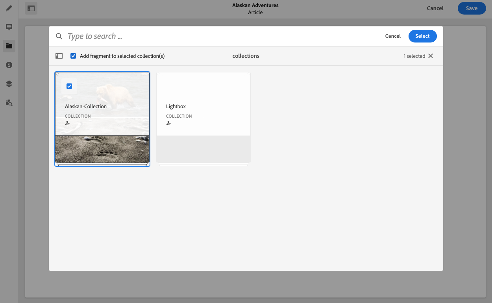
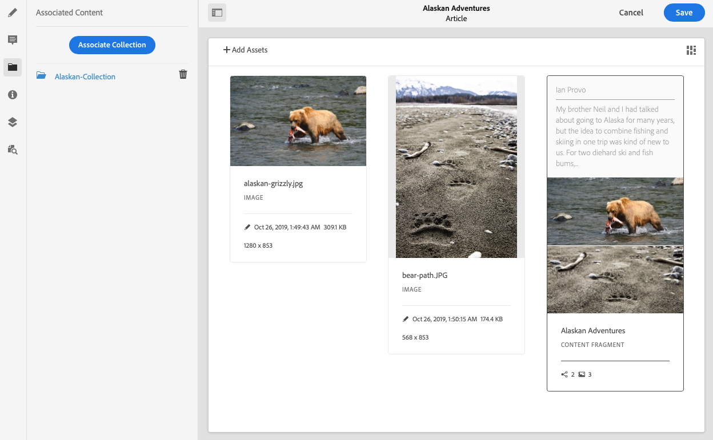

# Associated Content{#associated-content}

For Content Fragments of Adobe Experience Manager (AEM) as a Cloud Service, the associated content feature (available in the original editor) provides the connection so that assets can be optionally used with the fragment. This provides flexibility by [providing a range of assets to access when using the content fragment](/help/assets/content-fragments/content-fragments.md#using-associated-content), while also helping to reduce the time required to search for the appropriate asset. This feature can be used for both for your headless content delivery, and page authoring.

>[!NOTE]
>
>Content Fragments are a Sites feature, but are stored as **Assets**. 
>
>There are two editors for authoring Content Fragments; although the basic functionality is the same, there are some differences. This section covers the original editor, primarily accessed from the **Assets** console. 

## Adding Associated Content {#adding-associated-content}

>[!NOTE]
>
>There are various methods of adding [visual assets (for example, images)](/help/assets/content-fragments/content-fragments.md#fragments-with-visual-assets) to the fragment and/or page.

To make the association you first need to [add your media assets to a collection](/help/assets/manage-collections.md). After that is done you can:

1. Open your fragment and select **Associated Content** from the side panel.

   

1. Depending on whether any collections have already been associated, or not - select either:

   * **Associate Content** - this is the first associated collection
   * **Associate Collection** - associated collections are already configured

1. Select the required collection.

   You can optionally add the fragment itself to the selected collection; this aids tracking.

   

1. Confirm (with **Select**). The collection is listed as associated.

   

## Editing Associated Content {#editing-associated-content}

Once you have associated a collection you can:

* **Remove** the association.
* **Add Assets** to the collection.
* Select an asset for further action.
* Edit the asset.
