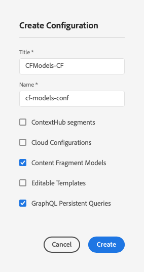

# Content Fragments - Configuration Browser{#content-fragments-configuration-browser}

>[!CAUTION]
>
>The AEM GraphQL API for Content Fragments Delivery is available on request. 
>
>Please reach out to [Adobe Support](https://experienceleague.adobe.com/?lang=en&support-solution=General#support) to enable the API for your AEM as a Cloud Service program.

## Enable Content Fragment Functionality for your Instance {#enable-content-fragment-functionality-instance}

Before using Content Fragments you need to use the **Configuration Browser** to enable:

* **Content Fragment Models** - mandatory
* **GraphQL Persistent Queries** - optional

>[!CAUTION]
>
>If do you not enable **Content Fragment Models** the **Create** option will not be available for creating new models.

To enable content fragment functionality you need to:

* Enable the use of content fragment functionality via the configuration browser
* Apply the configuration to your Assets folder

### Enable Content Fragment Functionality in Configuration Browser {#enable-content-fragment-functionality-in-configuration-browser}

To [use certain Content Fragment functionality](#creating-a-content-fragment-model) you **must** first enable them via the **Configuration Browser**:

>[!NOTE]
>
>For further details see also [Configuration Browser:](/help/implementing/developing/introduction/configurations.md#using-configuration-browser).

>[!CAUTION]
>
>Sub-configurations (a configuration nested within a configuration) are not supported for use with Content Fragments.

1. Navigate to **Tools**, **General**, then open the **Configuration Browser**.

1. Use **Create** to open the dialog, where you:

   1. Specify a **Title**.
   1. To enable their use select 
      * **Content Fragment Models** 
      * **GraphQL Persistent Queries**

      

1. Select **Create** to save the definition.

<!-- 1. Select the location appropriate to your website. -->

### Apply the Configuration to your Assets Folder {#apply-the-configuration-to-your-assets-folder}

When the configuration **global** is enabled for content fragment functionality, then applies to any Assets folder.

To use other configurations (i.e. excluding global) with a comparable Assets folder, then you have to define the connection. This is done by selecting the appropriate **Configuration** in the **Cloud Services** tab of the **Folder Properties** of the appropriate folder.

