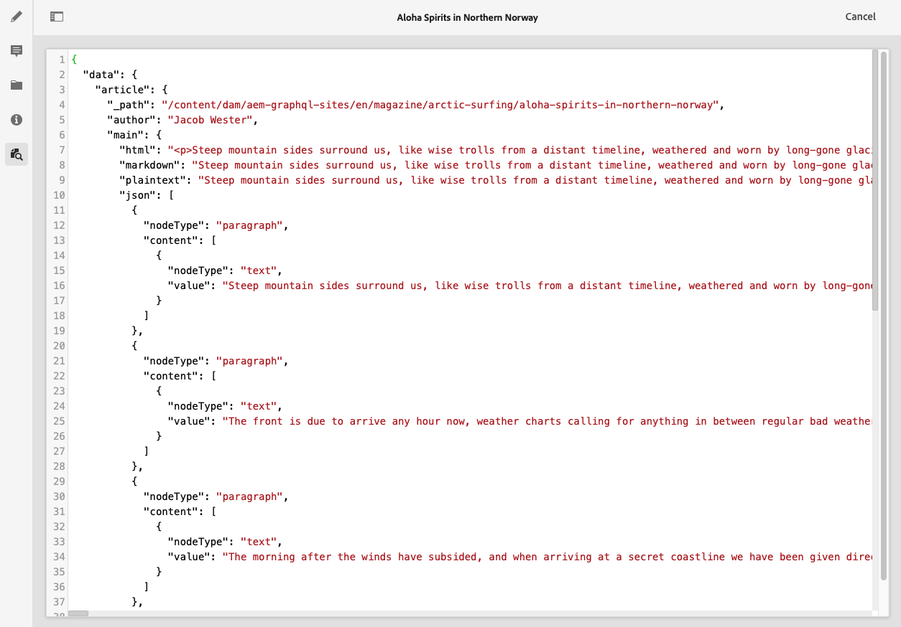

# Preview - JSON Representation {#preview-json-representation}

When developing the models for Content Fragments as part of your AEM headless implementation, you might want to view sample JSON output for a content fragment, as based on a model. For example, to get an idea of how the final output will look. This could be helpful when validating the model JSON structure, maybe with default sample content per data type.

>[!NOTE]
>
>Content Fragments are a Sites feature, but are stored as **Assets**. 
>
>There are two editors for authoring Content Fragments; although the basic functionality is the same, there are some differences. This section covers the original editor, primarily accessed from the **Assets** console. See the Sites documentation, [Content Fragments - Authoring](/help/sites-cloud/administering/content-fragments/authoring.md), for details of the new editor (primarily accessed from the **Content Fragments** console).

Using the **Preview** icon:

You can view the JSON representation of the current fragment. For example:

<!--
**Copy URL** lets you copy to clipboard the URL for either author or publish.
-->