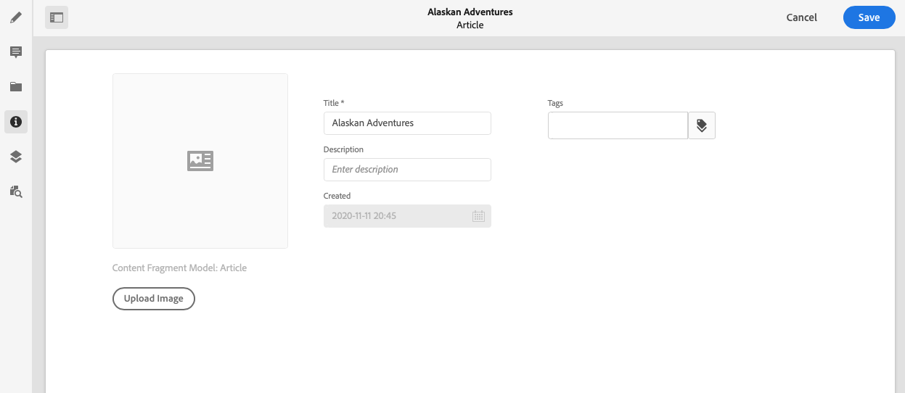

# Metadata - Fragment Properties {#metadata-fragment-properties}

See how you can view and edit the metadata properties for Content Fragments in AEM to adjust your headless content.

>[!NOTE]
>
>Content Fragments are a Sites feature, but are stored as **Assets**. 
>
>There are two editors for authoring Content Fragments; although the basic functionality is the same, there are some differences. This section covers the original editor, primarily accessed from the **Assets** console. See the Sites documentation, [Content Fragments - Authoring](/help/sites-cloud/administering/content-fragments/authoring.md), for details of the new editor (primarily accessed from the **Content Fragments** console).

## Editing Properties / Meta data {#editing-properties-meta-data}

You can view and edit the metadata (properties) for content fragments:

1. In the **Assets** console navigate to the location of the content fragment.
2. Either:

    * Select [**View Properties** to open the dialogs](/help/assets/manage-digital-assets.md#editing-properties). Once open for viewing you can also edit.
    * Open the content fragment for editing, then select **Metadata** from the side panel.

   

3. The **Basic** tab provides options that you can view or edit:

    * Thumbnail, for which you can **Upload Image**
    * **Content Fragment Model** indicates the model used to create the current fragment
    * **Title**
    * **Description**
    * **Tags**
      * [Tags](/help/sites-cloud/authoring/sites-console/tags.md) are particularly powerful when organizing your fragments as they can be used for content classification and taxonomy. Tags can be used for the purpose of finding content (by tags) and applying bulk operations. 
      For example, you can tag relevant fragments as “Christmas launch” to allow browsing only these as a subset, or to copy them for use with another future launch in a new folder.

        >[!NOTE]
        >
        >**Tags** can also be added when [authoring your Variation content](/help/assets/content-fragments/content-fragments-variations.md#authoring-your-content) and when [creating Variations](/help/assets/content-fragments/content-fragments-variations.md#creating-a-variation).

    * **Created** (display only)

    For example:
    
