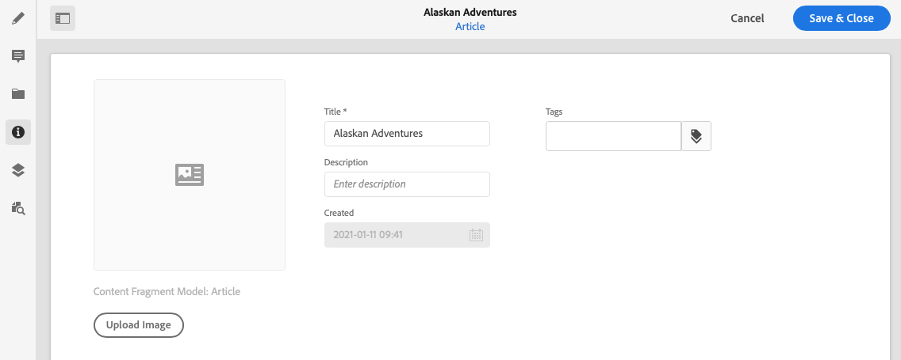

# Metadata - Fragment Properties {#metadata-fragment-properties}

See how you can view and edit the metadata properties for Content Fragments in AEM to adjust your headless content.

## Editing Properties / Meta data {#editing-properties-meta-data}

You can view and edit the metadata (properties) for content fragments:

1. In the **Assets** console navigate to the location of the content fragment.
2. Either:

    * Select [**View Properties** to open the dialogs](/help/assets/manage-digital-assets.md#editing-properties). Once open for viewing you can also edit.
    * Open the content fragment for editing, then select **Metadata** from the side panel.

   

3. The **Basic** tab provides options that you can view or edit:

    * Thumbnail, for which you can **Upload Image**
    * **Content Fragment Model** indicates the model used to create the current fragment
    * **Title**
    * **Description**
    * **Tags**
    * Created (display only)

   
