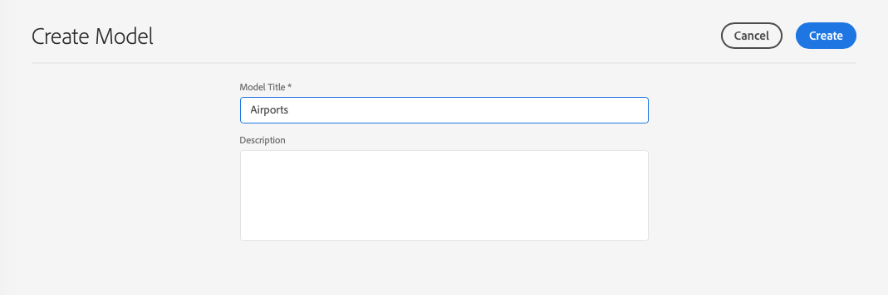
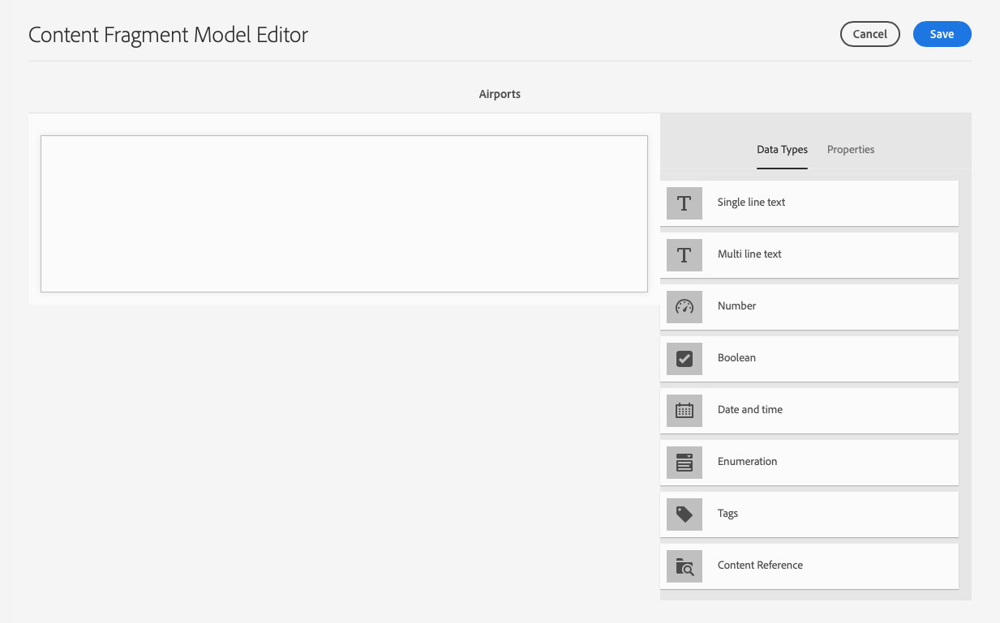
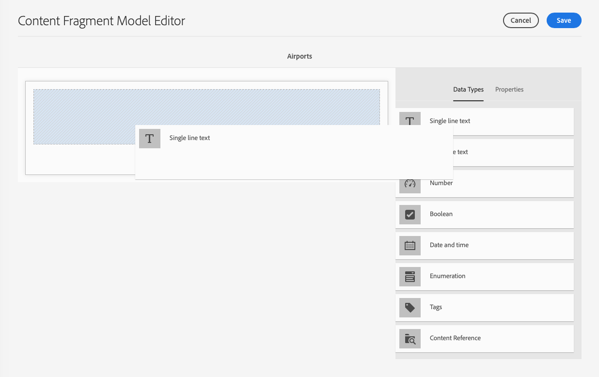
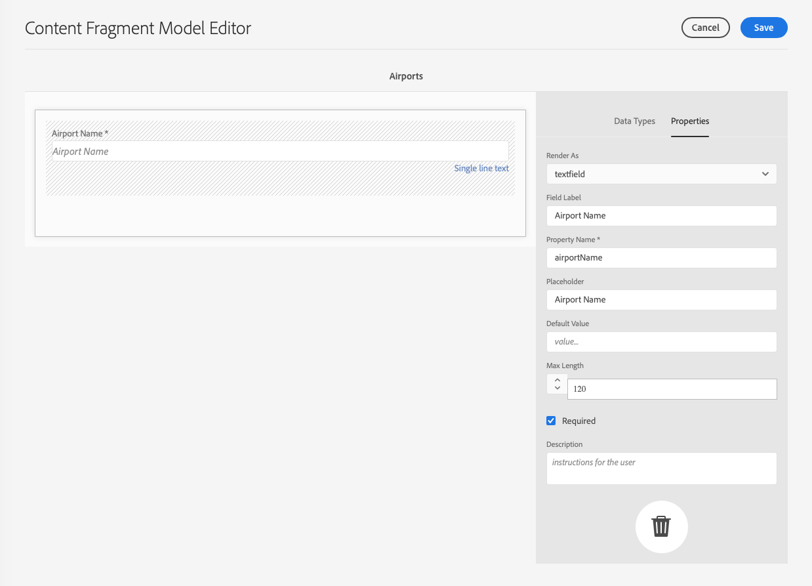
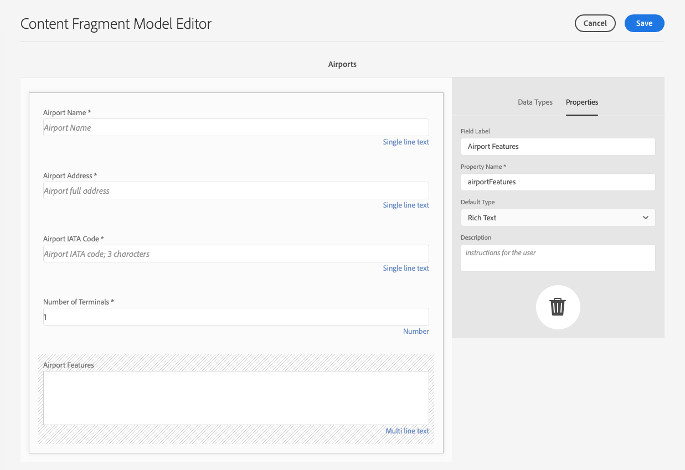
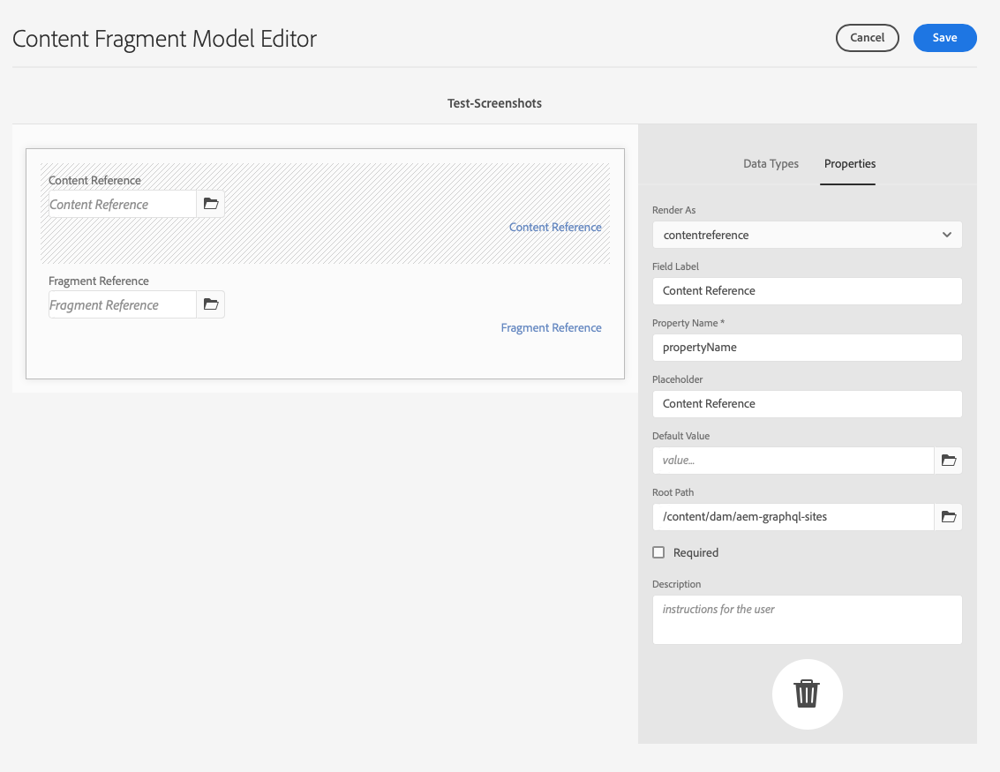
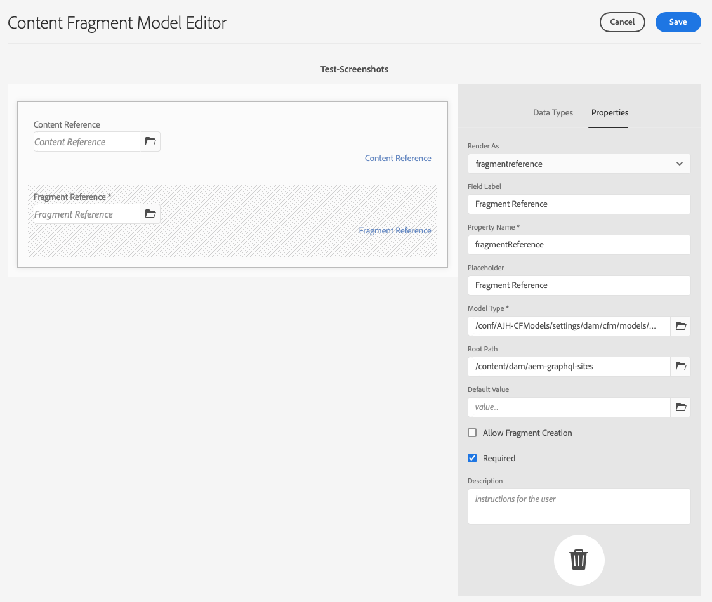
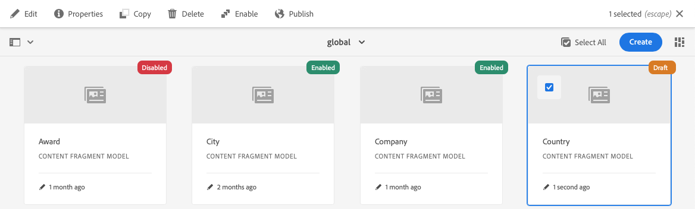
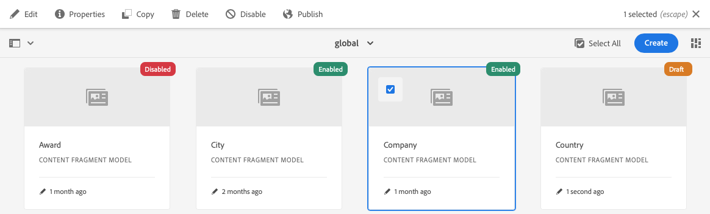

# Content Fragment Models {#content-fragment-models}

>[!CAUTION]
>
>The AEM GraphQL API for Content Fragments Delivery is available on request. 
>
>Please reach out to [Adobe Support](https://experienceleague.adobe.com/?lang=en&support-solution=General#support) to enable the API for your AEM as a Cloud Service program.

Content Fragment Models define the structure of content for your [content fragments](/help/assets/content-fragments/content-fragments.md).

To use Content Fragment Models you:

1. [Enable Content Fragment Model functionality for your instance](/help/assets/content-fragments/content-fragments-configuration-browser.md)
1. [Create](#creating-a-content-fragment-model), and [configure](#defining-your-content-fragment-model), your Content Fragment Models
1. [Enable your Content Fragment Models](#enabling-disabling-a-content-fragment-model) for use when creating Content Fragments for use when creating Content Fragments

## Creating a Content Fragment Model {#creating-a-content-fragment-model}

1. Navigate to **Tools**, **Assets**, then open **Content Fragment Models**.
1. Navigate to the folder appropriate to your [configuration](/help/assets/content-fragments/content-fragments-configuration-browser.md).
1. Use **Create** to open the wizard.

   >[!CAUTION]
   >
   >If the [use of content fragment models have not been enabled](/help/assets/content-fragments/content-fragments-configuration-browser.md), the **Create** option will not be available.

1. Specify the **Model Title**. You can also add **Tags**, and a **Description** if required.

   

1. Use **Create** to save the empty model. A message will indicate the success of the action, you can select **Open** to immediately edit the model, or **Done** to return to the console.

## Defining your Content Fragment Model {#defining-your-content-fragment-model}

The content fragment model effectively defines the structure of the resulting content fragments using a selection of **[Data Types](#data-types)**. Using the model editor you can add instances of the data types, then configure them to create the required fields:

>[!CAUTION]
>
>Editing an existing content fragment model can impact dependent fragments.

1. Navigate to **Tools**, **Assets**, then open **Content Fragment Models**.

1. Navigate to the folder holding your content fragment model.
1. Open the required model for **Edit**; use either the quick action, or select the model and then the action from the toolbar.

   Once open the model editor shows:

    * left: fields already defined
    * right: **Data Types** available for creating fields (and **Properties** for use once fields have been created)

   >[!NOTE]
   >
   >When a field as **Required**, the **Label** indicated in the left pane will be marked with an asterix (**&#42;**).

1. **To Add a Field**

    * Drag a required data type to the required location for a field.

    * Once a field has been added to the model, the right panel will show the **Properties** that can be defined for that particular data type. Here you can define what is required for that field. 
      Many properties are self-explanatory, for additional details see [Properties](#properties).

1. **To Remove a Field**

   Select the required field, then click/tap the trash-can icon. You will be asked to confirm the action.

1. Add all required fields, and define the related properties, as required. 

1. Select **Save** to persist the definition.

<!--
## Defining your Content Fragment Model {#defining-your-content-fragment-model}

The content fragment model effectively defines the structure of the resulting content fragments using a selection of **[Data Types](#data-types)**. Using the model editor you can add instances of the data types, then configure them to create the required fields:

>[!CAUTION]
>
>Editing an existing content fragment model can impact dependent fragments.

1. Navigate to **Tools**, **Assets**, then open **Content Fragment Models**.

1. Navigate to the folder holding your content fragment model.
1. Open the required model for **Edit**; use either the quick action, or select the model and then the action from the toolbar.

   Once open the model editor shows:

    * left: fields already defined
    * right: **Data Types** available for creating fields (and **Properties** for use once fields have been created)

   >[!NOTE]
   >
   >When a field as **Required**, the **Label** indicated in the left pane will be marked with an asterix (**&#42;**).

   

1. **To Add a Field**

    * Drag a required data type to the required location for a field:

      

    * Once a field has been added to the model, the right panel will show the **Properties** that can be defined for that particular data type. Here you can define what is required for that field. 
      Many properties are self-explanatory, for additional details see [Properties](#properties).
      For example:

      

1. **To Remove a Field**

   Select the required field, then click/tap the trash-can icon. You will be asked to confirm the action.

   

1. Add all required fields, and define the related properties, as required. For example:

   

1. Select **Save** to persist the definition.
-->

## Data Types {#data-types}

A selection of data types is available for defining your model:

* **Single line text**
  * Add one, or more, fields of a single line of text; the maximum length can be defined
* **Multi line text**
  * A text area that can be Rich Text, Plain Text or Markdown
* **Number**
  * Add one, or more, numerical fields
* **Boolean**
  * Add a boolean checkbox
* **Date and time**
  * Add a date and/or time
* **Enumeration**
  * Add a set of checkbox, radio button(s), or dropdown fields
* **Tags**
  * Allows fragment authors to access and select areas of tags
* **Content Reference**
  * References other content, of any type; can be used to [create nested content](#using-references-to-form-nested-content)

<!--
* **Fragment Reference**
  * References other content fragments; can be used to [create nested content](#using-references-to-form-nested-content)
  * The data type can be configured to allow fragment authors to:
    * Edit the referenced fragment directly.
    * Create a new content fragment, based on the appropriate model  
* **JSON Object**
  * Allows the content fragment author to enter JSON syntax into the corresponding elements of a fragment. 
    * To allow AEM to store direct JSON that you have copy/pasted from another service.
    * The JSON will be passed through, and output as JSON in GraphQL.
    * Includes JSON syntax-highlighting, auto-complete and error-highlighting in the content fragment editor.
-->

## Properties {#properties}

Many properties are self-explanatory, for certain properites additional details are below:

* **Render As**
  The various options for realizing/rendering the field in a fragment. Often this allows you to define whether the author will see a single instance of the field, or will be allowed to create multiple instances.

* **Field Label**
  Entering a **Field Label** will autogenerate a **Property Name**, which can then be manually updated if required.

* **Validation**
  Basic validation is available by mechanisms such as the **Required** property. Some data types have addition validation fields. See [Validation](#validation) for further details.

* For the data type **Multi line text** it is possible to define the **Default Type** as either:

  * **Rich Text**
  * **Markdown**
  * **Plain Text**

  If not specified, the default value **Rich Text** is used for this field.

  Changing the **Default Type** in a content fragment model will only take effect on an existing, related, content fragment after that fragment is opened in the editor and saved.

<!--
* **Translatable**
  Checking the "Translatable" checkbox on a field in CF model editor will

  * Ensure the field's property name is added in translation config, context `/content/dam/<tenant>`, if not already present. 
  * For GraphQL: set a `<translatable>` property on the Content Fragment field to `yes`, to allow GraphQL query filter for JSON output with only translatable content.

* See **[Fragment Reference (Nested Fragments)](#fragment-reference-nested-fragments)** for more details about that specific data type and its properties.
-->

## Validation {#validation}

Various data types now include the possibility to define validation requirements for when content is entered in the resulting fragment:

* **Single line text**
  * Compare against a predefined regex.
* **Number**
  * Check for specific values.

<!--
* **Content Reference**
  * Test for specific types of content.
  * Only images within a predefined range of width and height (in pixels) can be referenced. 
  * Only assets of specified file size or smaller can be referenced. 
  * Only predefined file types can be referenced.
  * No more than the predefined number of assets can be referenced. 
  * No more than the predefined number of fragments can be referenced.
* **Fragment Reference**
  * Test for a specific content fragment model.
-->

<!--
## Using References to form Nested Content {#using-references-to-form-nested-content}

Content Fragments can form nested content, using either of the following data types:

* **[Content Reference](#content-reference)**
  * Provides a simple reference to other content; of any type.
  * Can be configured for a one or multiple references (in the resulting fragment).

* **[Fragment Reference](#fragment-reference-nested-fragments)** (Nested Fragments)
  * References other fragments, dependent on the specific models specified.
  * Allows you to include/retrieve structured data.
    >[!NOTE]
    >
    >This method is of particular interest in conjunction with [Headless Content Delivery using Content Fragments with GraphQL](/help/assets/content-fragments/content-fragments-graphql.md).
  * Can be configured for one or multiple references (in the resulting fragment)..

>[!NOTE]
>
>AEM has a recurrence protection for:
>
>* Content References
>  This prevents the user from adding a reference to the current fragment. This may lead to an empty Fragment Reference picker dialog.
>
>* Fragment References in GraphQL 
>  If you create a deep query that returns multiple Content Fragments referenced by each another, it will return null at first occurence.

### Content Reference {#content-reference}

The Content Reference allows you to render content from another source; for example, image or content fragment.

In addition to standard properties you can specify:

* The **Root Path** for any referenced content.
* The content types that can be referenced.
* Limitations for file sizes.
* Image restraints.
-->

<!-- Check screenshot - might need update

   
-->

<!--
### Fragment Reference (Nested Fragments) {#fragment-reference-nested-fragments}

The Fragment Reference references one, or more, content fragments. This feature of particular interest when retrieving content for use in your app, as it allows you to retrieve structured data with multiple layers.

For example:

* A model defining details for an employee; these include:
  * A reference to the model that defines the employer (company)

```xml
type EmployeeModel {
    name: String
    firstName: String
    company: CompanyModel
}

type CompanyModel {
    name: String
    street: String
    city: String
}
```

>[!NOTE]
>
>This is of particular interest in conjunction with [Headless Content Delivery using Content Fragments with GraphQL](/help/assets/content-fragments/content-fragments-graphql.md).

In addition to standard properties you can define:

* **Render As**:

  * **multifield** - the fragment author can create multiple, individual, references

  * **fragmentreference** - allows the fragment author to select a single reference to a fragment

* **Model Type**
  Multiple models can be selected. When authoring the Content Fragment any referenced fragments must have been created using these models.

* **Root Path**
  This specifies a root path for any fragments referenced.

* **Allow Fragment Creation**

  This will allow the fragment author to create a new fragment based on the appropriate model.
-->

<!--
  * **fragmentreferencecomposite** - allows the fragment author to build a composite, by selecting multiple fragments
-->

<!-- Check screenshot - might need update

   
-->

<!--
>[!NOTE]
>
>A recurrence protection mechanism is in place. It prohibits the user from selecting the current Content Fragment in the Fragment Reference. This may lead to an empty Fragment Reference picker dialog.
>
>There is also a recurrence protection for Fragment References in GraphQL. If you create a deep query across two Content Fragments that reference each other, it will return null.
-->

## Enabling or Disabling a Content Fragment Model {#enabling-disabling-a-content-fragment-model}

For full control over the use of your Content Fragment Models they have a status that you can set.

### Enabling a Content Fragment Model {#enabling-a-content-fragment-model}

Once a model has been created it needs to be enabled so that it:

* Is available for selection when creating a new Content Fragment.
* Can be referenced from within a Content Fragment Model.
* Is available to GraphQL; so the schema is generated.

To enable a Model that is flagged as either:

* **Draft** : mew (never enabled).
* **Disabled** : has been specifically disabled.

You use the **Enable** option from either:

* The top toolbar, when the required Model is selected.
* The corresponding Quick Action (mouse-over the required Model).



### Disabling a Content Fragment Model {#disabling-a-content-fragment-model}

A model can also be disabled so that:

* The model is no longer available as a basis for creating *new* Content Fragments.
* However:
  * The GraphQL schema keeps being generated and is still queryrable (to avoid impacting JSON API).
  * Any Content Fragments based of the model can still be queried and returned from the GraphQL endpoint.
* The model cannot be referenced anymore, but existing references are kept untouched, and can still be queried and returned from the GraphQL endpoint.

To disable a Model that is flagged as **Enabled** you use the **Disable** option from either:

* The top toolbar, when the required Model is selected.
* The corresponding Quick Action (mouse-over the required Model).



## Deleting a Content Fragment Model {#deleting-a-content-fragment-model}

>[!CAUTION]
>
>Deleting a content fragment model can impact dependent fragments.

To delete a content fragment model:

1. Navigate to **Tools**, **Assets**, then open **Content Fragment Models**.

1. Navigate to the folder holding your content fragment model.
1. Select your model, followed by **Delete** from the toolbar.

   >[!NOTE]
   >
   >If the model is referenced a warning will be given. Take action appropriately.

## Publishing a Content Fragment Model {#publishing-a-content-fragment-model}

Content fragment models need to be published when/before any dependent content fragments are published.

To publish a content fragment model:

1. Navigate to **Tools**, **Assets**, then open **Content Fragment Models**.

1. Navigate to the folder holding your content fragment model.
1. Select your model, followed by **Publish** from the toolbar.
   The published status will be indicated in the console. 

   >[!NOTE]
   >
   >If you publish a content fragment for which the model has not yet been published, a selection list will indicate this and the model will be published with the fragment.

## Unpublishing a Content Fragment Model {#unpublishing-a-content-fragment-model}

Content fragment models can be unpublished if they are not referenced by any fragments.

To unpublish a content fragment model:

1. Navigate to **Tools**, **Assets**, then open **Content Fragment Models**.

1. Navigate to the folder holding your content fragment model.
1. Select your model, followed by **Unpublish** from the toolbar.
   The published status will be indicated in the console. 
