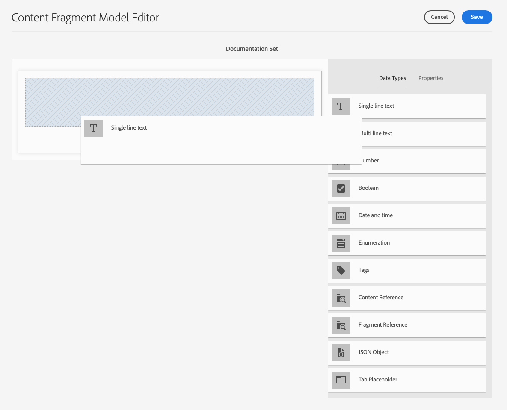

# Content Fragment Models {#content-fragment-models}

Content Fragment Models define the structure of content for your [content fragments](/help/assets/content-fragments/content-fragments.md).

## Enable Content Fragment Models {#enable-content-fragment-models}

>[!CAUTION]
>
>If do you not enable **Content Fragment Models** the **Create** option will not be available for creating new models.

To enable content fragment models you need to:

* Enable the use of content fragment models in the configuration manager
* Apply the configuration to your Assets folder

### Enable Content Fragment Models in Configuration Manager {#enable-content-fragment-models-in-configuration-manager}

To [create a new Content Fragment Model](#creating-a-content-fragment-model) you **must** first enable them using the Configuration Manager:

1. Navigate to **Tools**, **General**, then open the **Configuration Browser**.
2. Select the location appropriate to your website.
3. Use **Create** to open the dialog, where you:

    1. Specify a **Title**.
    2. Select **Content Fragment Models** to enable their use.

   

4. Select **Create** to save the definition.

### Apply the Configuration to your Assets Folder {#apply-the-configuration-to-your-assets-folder}

When the configuration **global** is enabled for content fragment models, then any models that users create can be used in any Assets folder.

To use other configurations (i.e. excluding global) with a comparable Assets folder, then you have to define the connection. This is done by selecting the appropriate **Configuration** in the **Cloud Services** tab of the **Folder Properties** of the appropriate folder.

## Creating a Content Fragment Model {#creating-a-content-fragment-model}

1. Navigate to **Tools**, **Assets**, then open **Content Fragment Models**.
1. Navigate to the folder appropriate to your [configuration](#enable-content-fragment-models).
1. Use **Create** to open the wizard.

   >[!CAUTION]
   >
   >If the [use of content fragment models have not been enabled](#enable-content-fragment-models), the **Create** option will not be available.

1. Specify the **Model Title**. You can also add a **Description** if required.

   

1. Use **Create** to save the empty model. A message will indicate the success of the action, you can select **Open** to immediately edit the model, or **Done** to return to the console.

## Defining your Content Fragment Model {#defining-your-content-fragment-model}

The content fragment model effectively defines the structure of the resulting content fragments. Using the model editor you can add, and configure, the required fields:

>[!CAUTION]
>
>Editing an existing content fragment model can impact dependent fragments.

1. Navigate to **Tools**, **Assets**, then open **Content Fragment Models**.

1. Navigate to the folder holding your content fragment model.
1. Open the required model for **Edit**; use either the quick action, or select the model and then the action from the toolbar.

   Once open the model editor shows:

    * left: fields already defined
    * right: **Data Types** available for creating fields (and **Properties** for use once fields have been created)

   >[!NOTE]
   >
   >When a field as **Required**, the **Label** indicated in the left pane will be marked with an asterix (**&#42;**).

   

1. **To Add a Field**

    * Drag a required data type to the required location for a field:

   

    * Once a field has been added to the model, the right panel will show the **Properties** that can be defined for that particular data type. Here you can define what is required for that field. For example:

   

   >[!NOTE]
   >
   >For the data type **Multi line text** it is possible to define the **Default Type** as either:
   >    * **Rich Text**
   >    * **Markdown**
   >    * **Plain Text**
   >
   >If not specified, the default value **Rich Text** is used for this field.
   >
   >Changing the **Default Type** in a content fragment model will only take effect on an existing, related, content fragment after that fragment is opened in the editor and saved.

1. **To Remove a Field**

   Select the required field, then click/tap the trash-can icon. You will be asked to confirm the action.

   

1. After adding all required fields, and defining the properties, use **Save** to persist the definition. For example:

   

## Nested Content {#nested-content}

Content Fragments can form nested content, using either of the following data types:
* **[Content Reference](#content-reference)** 
  * Provides a simple reference to other content; of any type.
  * Can be configured for a one or multiple references (in the resulting fragment).

* **[Fragment Reference](#fragment-reference-nested-fragments)** (Nested Fragments)
  * References another fragment, dependent on a specific model.
  * Allows you to include/retrieve structured data.
    >[!NOTE]
    >
    >This method is of particular interest in conjunction with [Content Delivery using Content Fragments with GraphQL](/help/assets/content-fragments/content-fragments-graphql.md).
  * Can be configured for one or multiple references (in the resulting fragment).

### Content Reference {#content-reference}

The Content Reference allows you to render content from another source; for example, image or content fragment.

In addition to standard properties you can specify the **Root Path** for any referenced content.

<!-- Check screenshot - might need update -->

   

### Fragment Reference (Nested Fragments) {#fragment-reference-nested-fragments}

The Fragment Reference references another content fragment. This of particular interest when retrieving content for use in your app, as it allows you to retrieve structured data with multiple layers.

For example:

* A model defining details for an employee; these include:
  * A reference to the model that defines the employer (company)

```xml
type EmployeeModel {
    name: String
    firstName: String
    company: CompanyModel
}
 
type CompanyModel {
    name: String
    street: String
    city: String
}
```

>[!NOTE]
>
>This is of particular interest in conjunction with [Content Delivery using Content Fragments with GraphQL](/help/assets/content-fragments/content-fragments-graphql.md).

In addition to standard properties you can define:

* **Model Type**
  Referenced fragments must have been created using the specified Content Fragment Model.

* **Root Path**
  This specifies a root path for any fragments referenced.

* **Allow Fragment Creation**

<!-- Check screenshot - might need update -->

   

## Deleting a Content Fragment Model {#deleting-a-content-fragment-model}

>[!CAUTION]
>
>Deleting a content fragment model can impact dependent fragments.

To delete a content fragment model:

1. Navigate to **Tools**, **Assets**, then open **Content Fragment Models**.

1. Navigate to the folder holding your content fragment model.
1. Select your model, followed by **Delete** from the toolbar.

   >[!NOTE]
   >
   >If the model is referenced a warning will be given. Take action appropriately.

## Publishing a Content Fragment Model {#publishing-a-content-fragment-model}

Content fragment models need to be published when/before any dependent content fragments are published.

To publish a content fragment model:

1. Navigate to **Tools**, **Assets**, then open **Content Fragment Models**.

1. Navigate to the folder holding your content fragment model.
1. Select your model, followed by **Publish** from the toolbar.

   >[!NOTE]
   >
   >If you publish a content fragment for which the model has not yet been published, a selection list will indicate this and the model will be published with the fragment.
