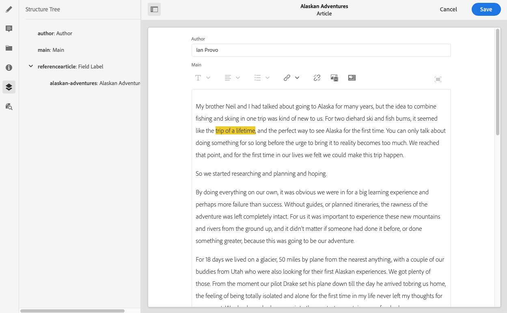

# Content Fragment Structure Tree {#content-fragment-structure-tree}

Use the Structure Tree feature of the Content Fragment Editor in AEM to better understand your content, particularly for headless delivery.

>[!NOTE]
>
>Content Fragments are a Sites feature, but are stored as **Assets**. 
>
>There are two editors for authoring Content Fragments; although the basic functionality is the same, there are some differences. This section covers the original editor, primarily accessed from the **Assets** console. See the Sites documentation, [Content Fragments - Authoring](/help/sites-cloud/administering/content-fragments/authoring.md), for details of the new editor (primarily accessed from the **Content Fragments** console).

In the Content Fragment Editor you can select the Structure Tree icon:

This opens a representation of the fragment's structure in the left hand pane. Using this you can navigate through, and to, referenced fragments. Selecting a reference opens that fragment for editing.

>[!NOTE]
>
>Using the breadcrumbs in the main panel, you can navigate back to your starting point.

