# Variations - Authoring Fragment Content{#variations-authoring-fragment-content}

[Variations](/help/assets/content-fragments/content-fragments.md#constituent-parts-of-a-content-fragment) are a significant feature of **Content Fragments** in Adobe Experience Manager (AEM) as a Cloud Service. **Variations enable authors to create and edit copies of the Master content** for use on specific channels and scenarios. This capability makes headless content delivery substantially more flexible, because a single **Master** fragment can drive multiple channel-specific renderings without duplicating the underlying source. In particular, authors can tailor tone, length, and structure per channel while keeping the **Master** as the canonical source of truth.

>[!NOTE]
>
>Content Fragments are a Sites feature, but are stored as **Assets**.
>
>There are two editors for authoring Content Fragments - the new editor and the original editor. The new editor is the default. Although the basic functionality is the same, there are some differences.
>
>This section covers the original editor. This is [opened via the new editor](/help/assets/content-fragments/content-fragments-managing.md#opening-the-fragment-editor).
>
>See the Sites documentation, [Content Fragments - Authoring](/help/sites-cloud/administering/content-fragments/authoring.md), for full details of the new editor.

From the **Variations** tab, authors can perform the following core tasks:

* [Enter the content](#authoring-your-content) for the fragment.
* [Create and manage variations](#managing-variations) of the **Master** content.

Authors can also perform a range of additional actions depending on the data-type being edited; for example:

* [Insert visual assets into the fragment](#inserting-assets-into-your-fragment) (images).

* Select between [Rich Text](#rich-text), [Plain Text](#plain-text), and [Markdown](#markdown) for editing.

* [Upload Content](#uploading-content).

* [View key statistics](#viewing-key-statistics) (about multi-line text).

* [Synchronize variations with Master content](#synchronizing-with-master).

>[!CAUTION]
>
>After a fragment has been published and/or referenced, AEM displays a warning when an author opens the fragment for editing again. This warning indicates that changes to the fragment affect the referenced pages, too.

## Authoring your Content {#authoring-your-content}

When you open your content fragment for editing in the original editor, the **Variations** tab opens by default. Here you author the content, for the **Master** variation or any variations you have created. The structured fragment contains fields of various data-types that were defined in the content model; this model governs which fields appear and how each can be edited, ensuring the authored content stays consistent with its intended structure.

For example, the editor renders each defined field according to its data-type, so text fields, references, and multi-value fields are presented with the appropriate editing controls.

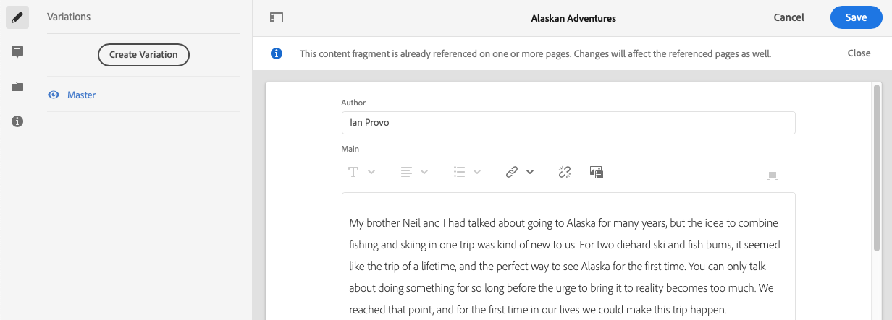

You can perform the following authoring actions:

* Make edits to your content directly in the **Variations** tab; each data type provides different editing options, for example:

  * when configured (as multiple) in the model, various data types allow you to **Add** instances of the relevant field
  
  * for **Multi-line text** fields, you can also open the [full-screen editor](#full-screen-editor) to:

    * select the [Format](#formats)
    * see more editing options (for [Rich Text](#rich-text) format)
    * access a range of [actions](#actions)

  * For **Fragment Reference** fields, the [Edit Content Fragment](#fragment-references-edit-content-fragment) option is available when enabled by the model definition.

* Assign **Tags** to the current variation; tags can be added, updated, and removed.

  * [Tags](/help/sites-cloud/authoring/sites-console/tags.md) are powerful for organizing your fragments, because they enable content classification and taxonomy. Tags support finding content (by tags) and applying bulk operations across matching fragments.

    * Searches for a tag return the fragment, with the tag variation highlighted.
    * Variation tags can also group variations for a specific Content Delivery Network (CDN) profile (for CDN caching), instead of using the variation name. This lets you manage caching behavior through tags rather than variation names.

    For example, you can tag relevant fragments as "Christmas launch" to browse only that subset, or to copy them for use with another future launch in a new folder.

  >[!NOTE]
  >
  >**Tags** can also be added (to the **Master** variation) as part of the [Metadata](/help/assets/content-fragments/content-fragments-metadata.md)

* [Create and manage variations](#managing-variations) of the **Master** content.

>[!NOTE]
>
>Depending on definitions in the underlying model, fields can be subject to certain types of [Validation](/help/assets/content-fragments/content-fragments-models.md#validation).

### Full Screen Editor {#full-screen-editor}

When editing a multi-line text field, open the **full-screen editor** by first selecting within the text, then selecting the following action icon:

This opens the **full-screen text editor**:

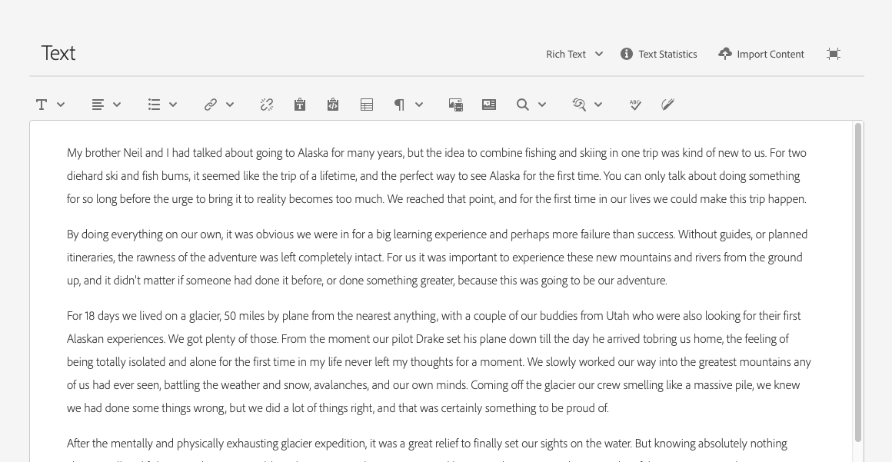

The **full-screen text editor** expands the editing area into a larger, dedicated workspace, making it easier to review, structure, and edit multi-line or long-form content without the constraints of the inline field.

The full-screen text editor provides:

* Access to a range of [actions](#actions) for working with the content
* Depending on the [format](#formats), additional formatting options ([Rich Text](#rich-text)), enabling styled and structured text when the field supports it

### Actions {#actions}

When the full-screen editor is open, the following actions become available for every one of the supported [formats](#formats). The full-screen editor is the expanded, **multi-line text** editing mode, giving you room to compose and manage longer content comfortably.

Each of these actions helps you control how content is formatted, imported, measured, and kept consistent:

* **Select the [format](#formats)** — Choose between [Rich Text](#rich-text), [Plain Text](#plain-text), and [Markdown](#markdown) to match how you want the content authored and rendered.

* **[Upload content](#uploading-content)** — Import existing content directly into the editor instead of typing or pasting it manually.

* **[Show Text Statistics](#viewing-key-statistics)** — Display key metrics about the text, so you can review the content at a glance while editing.

* **[Synchronize with Master](#synchronizing-with-master)** — Available when editing a variation, this action aligns the variation with its master version to keep the two consistent.

### Formats {#formats}

The options for editing multi-line text depend on the format selected. Each format determines how content is entered, displayed, and stored. The available formats are:

* **[Rich Text](#rich-text)** — supports styled content such as bold, italics, headings, and other visual formatting, making it well suited to documents where presentation and readability matter.
* **[Plain Text](#plain-text)** — stores content as unformatted characters with no styling, providing the simplest and most portable option for straightforward text entry.
* **[Markdown](#markdown)** — uses lightweight, human-readable syntax to apply formatting through simple symbols, giving you structured output (such as headings, lists, and emphasis) while keeping the underlying text easy to read and edit.

The format can be selected when the full-screen editor is open, allowing you to switch between **Rich Text**, **Plain Text**, and **Markdown** as needed for your content.

### Rich Text {#rich-text}

**Rich text editing** is a WYSIWYG (what-you-see-is-what-you-get) formatting capability that lets you style and structure your content directly within the editor, without writing markup. Rich text editing lets you format content using the following options:

* **Bold**
* **Italic**
* **Underline**
* **Alignment**: left, center, right
* **Bulleted list**
* **Numbered list**
* **Indentation**: increase, decrease
* **Create/Break hyperlinks**
* **Paste Text/from Word**
* **Insert a table**
* **Paragraph style**: Paragraph, Heading 1/2/3
* [Insert asset](#inserting-assets-into-your-fragment)
* Open the **full-screen editor**, which provides an expanded, distraction-free workspace for editing longer content and unlocks the following additional formatting options:
  * **Search**
  * **Find/Replace**
  * **Spellchecker**
  * [Annotations](/help/assets/content-fragments/content-fragments-variations.md#annotating-a-content-fragment)
* [Insert Content Fragment](#inserting-content-fragment-into-your-fragment); available when your **Multi-line text** field is configured with **Allow Fragment Reference**.

The [actions](#actions) are also accessible from the full-screen editor, so you can perform the same operations whether you work in the inline editor or the expanded full-screen view.

### Plain Text {#plain-text}

**Plain Text** enables the rapid entry of content without **formatting** or **markdown** information, because it strips out styling and structural syntax to leave only the raw characters you type. This lightweight mode is ideal when speed and simplicity matter more than presentation — for example, when drafting notes quickly, pasting unformatted content, or capturing text that will be styled later. You can also open the full-screen editor for further [actions](#actions), giving you a distraction-free workspace for longer content.

Because **Plain Text** intentionally omits rich styling, it produces clean, portable output that transfers reliably across tools and platforms. This makes it a dependable choice when you want the content itself, free of embedded formatting artifacts.

>[!CAUTION]
>
>If you select **Plain Text**, you might lose any **formatting**, **markdown**, or **assets** that you inserted in either **Rich Text** or **Markdown**. This loss occurs because Plain Text does not retain styling or embedded elements, so switching to it discards content that depends on formatting to display correctly.

### Markdown {#markdown}

>[!NOTE]
>
>For full information, see the [Markdown](/help/assets/content-fragments/content-fragments-markdown.md) documentation.

This lets you format your text using Markdown, a lightweight markup syntax that applies structure and styling to plain text without a visual toolbar. Markdown keeps your source content clean and portable while rendering as fully formatted output. You can define:

* **Headings** — establish document hierarchy and section titles.
* **Paragraphs and Line Breaks** — control the flow and spacing of running text.
* **Links** — create clickable hyperlinks to internal or external resources.
* **Images** — embed inline images within the content.
* **Block Quotes** — set apart quoted or emphasized passages as indented callouts.
* **Lists** — build both ordered (numbered) and unordered (bulleted) lists.
* **Emphasis** — apply italic and bold styling to highlight text.
* **Code Blocks** — display preformatted code or literal text in a fixed-width, monospace format.
* **Backslash Escapes** — insert literal Markdown characters by escaping them, so symbols display as-is rather than triggering formatting.

You can also open the full-screen editor for further [actions](#actions), which provides a larger workspace for editing and reviewing longer Markdown content.

>[!CAUTION]
>
>If you switch between **Rich Text** and **Markdown** you might experience unexpected effects with **Block Quotes** and **Code Blocks**. This happens because the two formats interpret and store these elements differently, so content created in one mode may not convert cleanly into the other. As a result, review Block Quotes and Code Blocks carefully after switching modes to confirm they render as intended.

### Fragment References {#fragment-references}

A **Fragment Reference** links one content fragment to another, allowing structured content to be reused across fragments. If the Content Fragment Model contains Fragment References, fragment authors gain additional options for managing referenced fragments directly from the editor:

* [Edit Content Fragment](#fragment-references-edit-content-fragment)
* [New Content Fragment](#fragment-references-new-content-fragment)

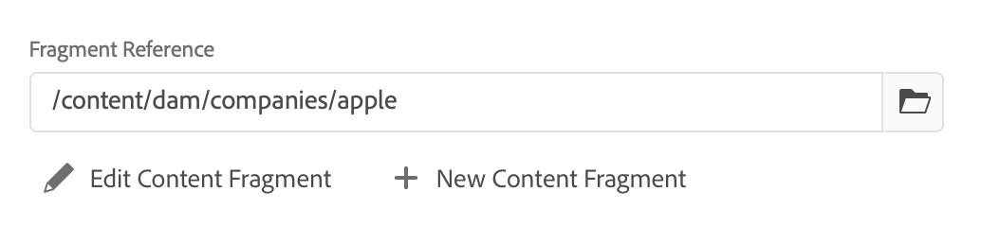

#### Edit Content Fragment {#fragment-references-edit-content-fragment}

The option **Edit Content Fragment** opens the referenced fragment in a **new editor tab** within the same browser tab.

Selecting the original editor tab again (for example, **Little Pony Inc.**) closes this secondary tab (in this case, **Adam Smith**). Only one referenced fragment is edited at a time in this way.

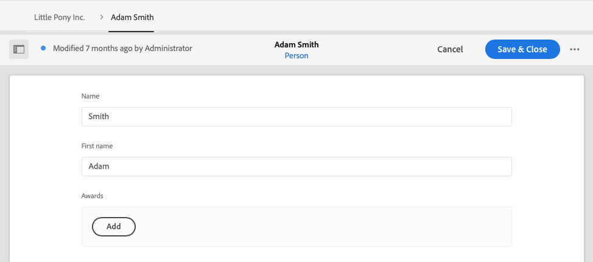

#### New Content Fragment {#fragment-references-new-content-fragment}

The option **New Content Fragment** lets you create a new fragment and reference it immediately. A variation of the create content fragment wizard opens directly in the editor for this purpose.

**To create a content fragment:**

1. Navigate to and select the required folder.
1. Select **Next**.
1. Specify the fragment properties; for example, the **Title**.
1. Select **Create**.
1. Finally, choose one of the following completion options:
   1. **Done**:
      * returns you to the original fragment
      * references the new fragment

      This finalizes the reference without leaving your current editing context.
   1. **Open**:
      * references the new fragment
      * opens the new fragment for editing in a new browser tab

      This lets you continue authoring the newly created fragment right away.

### Viewing Key Statistics {#viewing-key-statistics}

When the full-screen editor is open, the **Text Statistics** action displays detailed statistics about the current text. It provides a clear, at-a-glance summary of the document's size and composition, drawn from the content you are actively editing.

The statistics typically include:

- **Word count** — the total number of words in the text.
- **Character count** — the total number of characters, often reported both with and without spaces.
- **Sentence count** — the total number of sentences.
- **Paragraph count** — the total number of paragraphs.
- **Line count** — the total number of lines in the editor.

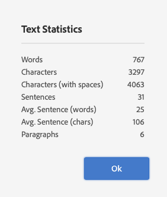

These statistics help you assess document length, track writing progress, and confirm that your text meets specific length requirements. Because the metrics reflect the content currently in the full-screen editor, they update to describe exactly what you are working on.

For example, if you open the full-screen editor with a short article and run **Text Statistics**, the action reports the number of words, characters, sentences, and paragraphs it contains — giving you an immediate, quantified overview of the document before you continue editing.

### Uploading Content {#uploading-content}

Content authors can upload text prepared in an external editor directly into a content fragment, streamlining the authoring workflow. Rather than composing every fragment from scratch inside the fragment editor, authors reuse content that already exists in a separate document and add it straight to the fragment.

This capability simplifies content fragment authoring for several reasons:

- **Reuse of existing drafts:** Text written or reviewed in a preferred external editor can be brought into the fragment without rewriting it, reducing duplicated effort.
- **Faster population of fragments:** Prepared content is added directly to the fragment, which shortens the time between drafting and publishing.
- **Consistent authoring:** Because the source text is prepared in advance, authors can review and finalize wording before it enters the fragment, supporting cleaner, more accurate content.

In practice, this means that when a body of text has already been drafted elsewhere, an author does not need to retype or manually recreate it. The prepared text is uploaded and applied directly to the content fragment, keeping the authoring process efficient and reducing the risk of transcription errors.

### Annotating a Content Fragment {#annotating-a-content-fragment}

An **annotation** is a note or comment attached to a content fragment that lets authors flag context, provide feedback, or record editorial guidance directly against the content. Annotations remain visually highlighted in the editor, making it easy to locate and revisit flagged passages during review.

#### Steps to Annotate a Content Fragment

To annotate a fragment, follow these steps:

1. Select **Master** or the required variation. This determines which version of the content the annotation is applied to.

2. Open the full-screen editor to access the complete annotation toolset.

3. Locate the **Annotate** icon in the top toolbar. Authors can select specific text first if the annotation applies to a particular portion of the fragment, ensuring the note is anchored to the relevant passage.

   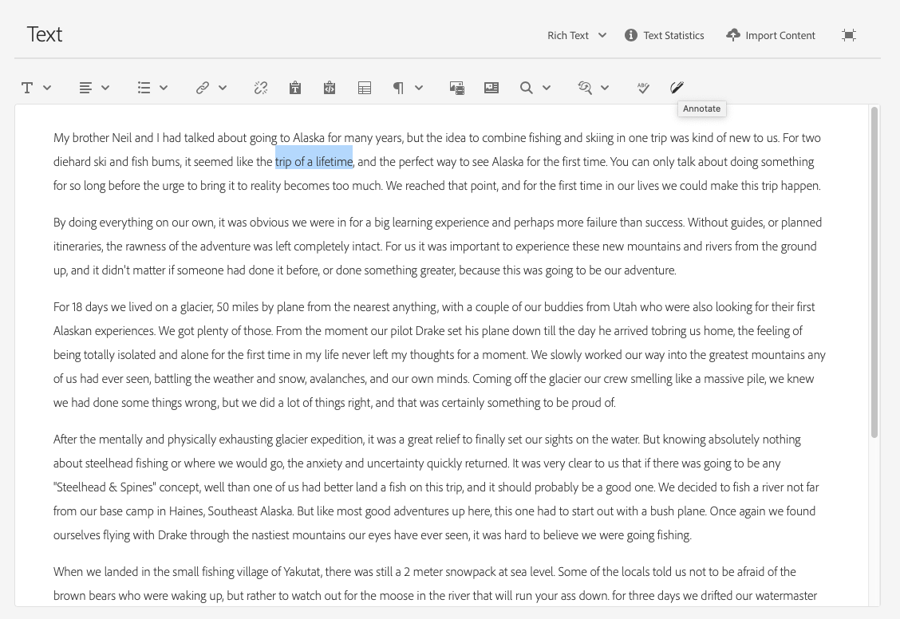

4. A dialog box opens where the author enters the annotation text.

   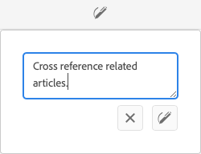

5. Select **Apply** on the dialog to attach the annotation. If the annotation was applied to selected text, that text remains highlighted, visually indicating which portion the note refers to.

   

6. Close the full-screen editor. Annotations remain highlighted after closing. Selecting a highlighted annotation reopens a dialog box so the author can edit the annotation further.

   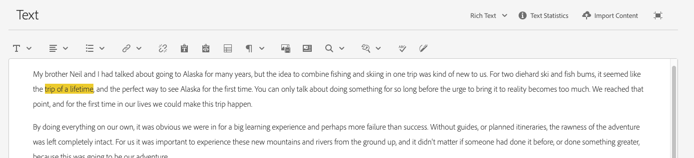

7. Select **Save** to persist the annotation and any subsequent edits.

   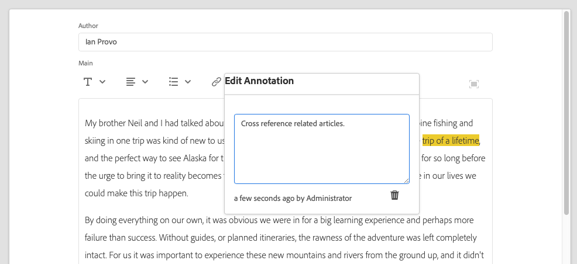

>[!NOTE]
>
>The Annotations feature does not show comments entered in the new [Content Fragment editor](/help/sites-cloud/administering/content-fragments/authoring.md#commenting-on-your-fragment).

### Viewing, Editing, Deleting Annotations {#viewing-editing-deleting-annotations}

Annotations:

* **Identifying annotations:** Annotations are indicated by a highlight on the text, in both full-screen and normal mode of the editor. Full details of an annotation can then be viewed, edited, and/or deleted by clicking the highlighted text, which reopens the annotation dialog box, giving you access to the full annotation content.

  >[!NOTE]
  >
  >A drop-down selector is provided if multiple annotations have been applied to one piece of text, allowing you to select which annotation to view.

* **Deleting via the source text:** When you delete the entire text to which the annotation was applied, the associated annotation is automatically deleted as well.

* **Managing via the Annotations tab:** An annotation can be listed and deleted by selecting the **Annotations** tab in the fragment editor, which lists every annotation applied to the fragment.

  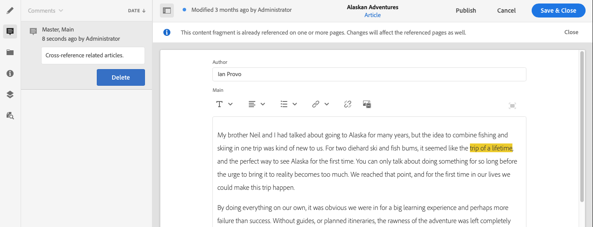

* **Reviewing via the Timeline:** An annotation can also be viewed and deleted in the [Timeline](/help/assets/content-fragments/content-fragments-managing.md#timeline-for-content-fragments) for the selected fragment.

### Inserting Assets into your Fragment {#inserting-assets-into-your-fragment}

To ease the process of authoring content fragments, you can add [Assets](/help/assets/manage-digital-assets.md) (images) directly to the fragment.

The assets are added to the paragraph sequence of the fragment without any formatting, keeping the fragment focused on content structure rather than presentation; formatting is applied when the [fragment is used/referenced on a page](/help/sites-cloud/authoring/fragments/content-fragments.md).

>[!CAUTION]
>
>These assets cannot be moved or deleted on a referencing page, this must be done in the fragment editor.
>
>However, formatting of the asset (for example, size) must be done in the [page editor](/help/sites-cloud/authoring/fragments/content-fragments.md). The representation of the asset in the fragment editor exists purely to support authoring the content flow, because presentation details are resolved on the referencing page.

>[!NOTE]
>
>There are various methods of adding [images](/help/assets/content-fragments/content-fragments.md#fragments-with-visual-assets) to the fragment and/or page.

1. Position the cursor where you want to add the image.
1. Use the **Insert Asset** icon to open the search dialog.

   

1. In the dialog box, you can either navigate to the required asset in the Digital Asset Manager (DAM), or search for the asset within the DAM.

   When located, select the required asset by clicking the thumbnail.

1. Use **Select** to add the asset to the paragraph system of your content fragment at the current location.

   >[!CAUTION]
   >
   >After adding an asset, if you change the format to:
   >
   >* **Plain Text**: the asset is removed and lost from the fragment, because plain text does not support embedded assets.
   >* **Markdown**: the asset is not visible, but is still there when you return to **Rich Text**.

### Inserting a Content Fragment into your Fragment {#inserting-content-fragment-into-your-fragment}

To streamline content fragment authoring, you can embed another Content Fragment directly within your current fragment.

The nested fragment is inserted as a reference at your current cursor location within the fragment. This ensures the referenced content stays synchronized with its source, so updates made in the original fragment propagate automatically.

>[!NOTE]
>
>This option is available when your **Multi-line text** is configured with **Allow Fragment Reference**.

>[!CAUTION]
>
>Referenced Content Fragments cannot be moved or deleted on a referencing page; this must be done in the fragment editor.
>
>However, formatting of the asset (for example, size) must be done in the [page editor](/help/sites-cloud/authoring/fragments/content-fragments.md). The representation of the asset in the fragment editor is purely for authoring the content flow.

>[!NOTE]
>
>There are various methods of adding [images](/help/assets/content-fragments/content-fragments.md#fragments-with-visual-assets) to the fragment and/or page.

1. Position the cursor at the exact location within your fragment where you want the referenced Content Fragment to appear.
1. Use the **Insert Content Fragment** icon to open the search dialog.

   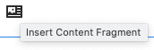

1. In the dialog box, you can either navigate to the required fragment in the Assets folder, or search for the fragment.

   When located, select the required fragment by clicking the thumbnail.

1. Use **Select** to add a reference to the selected Content Fragment to your current content fragment (at the current location).

   >[!CAUTION]
   >
   >After adding a reference to another fragment, if you change the format to:
   >
   >* **Plain Text**: the reference is lost from the fragment, because plain text does not support embedded fragment references.
   >* **Markdown**: the reference remains.

## Inheritance {#inheritance}

**Inheritance** is the mechanism by which content is automatically pushed from one content fragment to another. Through inheritance, fields and variations defined on a source fragment propagate to dependent fragments, ensuring consistency across related content without requiring manual duplication. Inherited fields, and variations, can be the product of **[Multi-Site Management (MSM)](/help/assets/content-fragments/content-fragments-msm.md)**, the framework that enables a single source of truth to feed multiple regional or localized sites.

### Canceling and Re-Enabling Inheritance

Inheritance can be canceled and then re-enabled as needed. Canceling inheritance breaks the automatic link, allowing a **live copy** to hold values that differ from its source — useful when a specific variation or field must be tailored locally. Re-enabling inheritance restores the automatic connection, reverting the field or variation back to the source values.

Depending on the context, this control is available for a **variation**, or for an **individual field**, provided the fragment is part of a **live copy**. This granularity allows editors to override only what needs to differ while keeping the remainder of the fragment synchronized with its source.

For example:

* **Cancel Inheritance** — breaks the automatic link so the field or variation can be edited independently of the source fragment.

  

* **Re-enable Inheritance** (if inheritance is already canceled) — restores the automatic link so the field or variation once again reflects the source values.

  

<!--
* Rollout action is also available in Live Copy source

  
-->

## Managing Variations {#managing-variations}

### Creating a Variation {#creating-a-variation}

**Variations** enable you to reuse the **Master** content and adapt it for a specific purpose. A variation begins as an exact copy of the **Master**, which you can then edit independently to serve a distinct audience, channel, or context — without altering the original **Master** content. This makes variations a practical way to maintain a single authoritative source while tailoring its presentation where needed.

**To create a variation:**

1. Open your fragment and ensure that the side panel is visible.
1. Select **Variations** from the icon bar in the side panel.
1. Select **Create Variation**.
1. A dialog box opens so you can define the **Title** and **Description** for the new variation.
1. Select **Add**. The fragment **Master** is copied into the new variation, which then opens for [editing](#editing-a-variation). Because the variation starts from a full copy of the **Master**, you can immediately begin adapting its content.

   >[!NOTE]
   >
   >When creating a variation, it is always the **Master** that is copied — not whichever variation happens to be open. This ensures every new variation is based on the authoritative source content.

   >[!NOTE]
   >
   >When you create a variation, all **Tags** currently assigned to the **Master** variation are copied to your new variation. This preserves the existing tagging and classification so the new variation inherits the same metadata from the outset.

### Editing a Variation {#editing-a-variation}

You can edit a variation at any time after it has been created, updating its content independently of the original fragment it belongs to. A **variation** is an alternative version of a content fragment, allowing the same underlying fragment to be adapted for different audiences, channels, or contexts while remaining linked to its source. Editing a variation modifies only that variation's content, not the base fragment.

#### Ways to Begin Editing a Variation

Key ways to begin editing a variation include:

* **Immediately after [creating your variation](#creating-a-variation).** When you create a variation, its content is available for editing right away, so you can populate or refine it without leaving the current view. This ensures you can move directly from creation to authoring in a single, uninterrupted workflow.
* **By opening an existing fragment and selecting the variation from the side panel.** Open the fragment that contains the variation, then choose the required variation in the side panel to load its content for editing. This path is useful when you return later to update a variation you created previously, because the side panel lists the available variations for that fragment in one place.

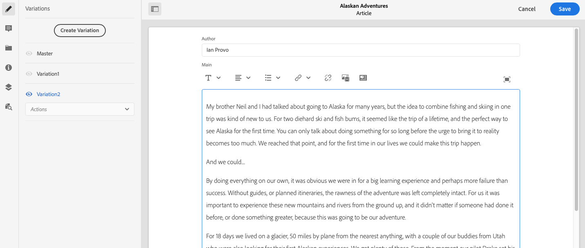

#### What Editing Lets You Do

Once the variation is open, you can change its content to tailor the messaging, tone, or details for its intended use, while the original fragment remains unchanged. Because each variation is edited separately, changes made to one variation do not affect the base fragment or other variations derived from the same source.

### Renaming a Variation {#renaming-a-variation}

To rename a variation, follow these steps:

1. Open your fragment and select **Variations** from the side panel to display the list of available variations.
1. Select the required variation you want to rename from the list.
1. Select **Rename** from the **Actions** drop-down menu to open the rename dialog.

1. Enter the new **Title** and/or **Description** in the resulting dialog box.

1. Confirm the **Rename** action to apply and save your changes.

>[!NOTE]
>
>The **Rename** action updates only the variation **Title** and its **Description**; it does not change the underlying content of the variation.

### Deleting a Variation {#deleting-a-variation}

A **variation** is an alternate version of a fragment, allowing you to maintain multiple tailored renditions of the same base content. Deleting a variation permanently removes that specific rendition, so confirm your selection before proceeding.

To delete a variation from your fragment, follow these steps:

1. Open your fragment and select **Variations** from the side panel.
1. Select the required variation.
1. Select **Delete** from the **Actions** drop-down.
1. Confirm the **Delete** action in the confirmation dialog to permanently remove the selected variation.

>[!NOTE]
>
>You cannot delete **Master**. The **Master** serves as the base (original) variation on which all other variations depend, so it cannot be removed.

### Synchronizing with Master {#synchronizing-with-master}

**Master** is the core element of a content fragment that holds the master copy of the content. Variations, by contrast, hold the individual, updated, and tailored versions of that content. When Master is updated, those changes are often relevant to the variations. In such cases, the updates must be propagated to the variations to keep content consistent.

When editing a variation, you have access to the action for synchronizing the current element of the variation with Master. This synchronization action automatically copies changes made to Master into the required variation, ensuring the variation reflects the latest master content without manual re-entry.

>[!CAUTION]
>
>Synchronization is only available to copy changes *from **Master** to the variation*.
>
>Only the current element of the variation is synchronized.
>
>Synchronization only works on the **Multi-line text** data-type.
>
>Transferring changes *from a variation to **Master*** is not available as an option.

1. Open your content fragment in the fragment editor. Ensure that the **Master** has been edited.

1. Select a specific variation, then the appropriate synchronization action from either:

   * the **Actions** drop-down selector - **Sync current element with master**

      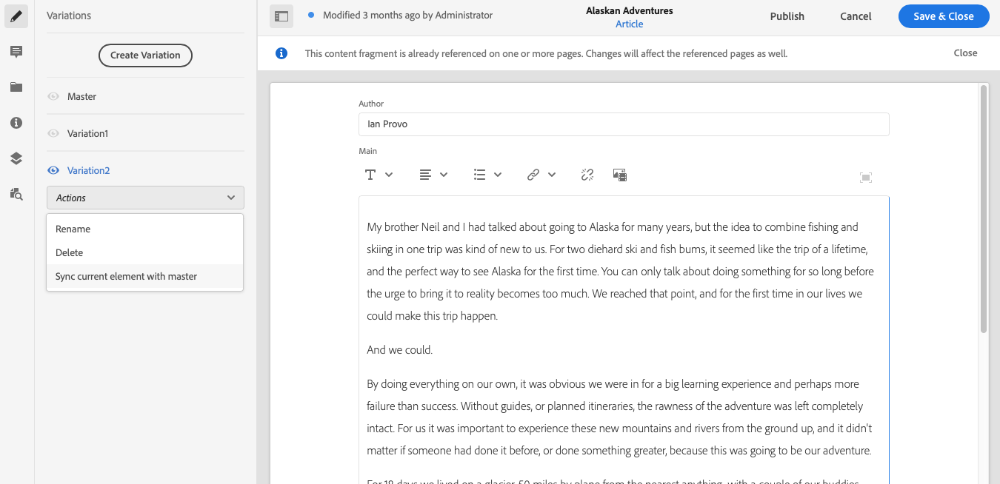

   * the toolbar of the full-screen editor - **Sync with master**

      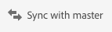

1. Master and the variation are shown side-by-side, with color-coded highlights that make each difference easy to identify. This ensures you can review every change before applying it:

   * **green** indicates that content was added (to the variation)
   * **red** indicates that content was removed (from the variation)
   * **blue** indicates replaced text

   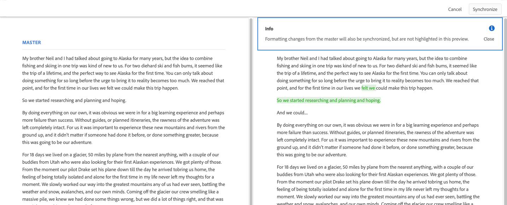

1. Select **Synchronize**. The variation is updated and shown with the synchronized content.
