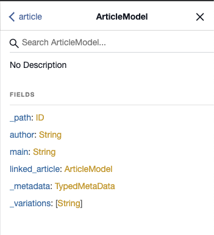

# GraphQL API for use with Content Fragments {#graphql-api-for-use-with-content-fragments}

The GraphQL API used with Content Fragments is heavily based on the standard, open source GraphQL API.

Using the GraphQL API in AEM enables the efficient delivery of Content Fragments to JavaScript clients in Headless CMS implementations:

* Avoiding iterative API requests as with REST,
* Ensuring that delivery is limited to the specific requirements,
* Allowing for bulk delivery of exactly what is needed for rendering as response to a single API query.

## The GraphQL API {#graphql-api}

*"GraphQL is a data query language and specification developed internally by Facebook in 2012 before being publicly open sourced in 2015. It provides an alternative to REST-based architectures with the purpose of increasing developer productivity and minimizing amounts of data transferred. GraphQL is used in production by hundreds of organizations of all sizes..."* See [GraphQL Foundation](https://foundation.graphql.org/).

For further information about the GraphQL API, see the following sections (amongst many other resources):

* At [graphql.org](https://graphql.org):

  * [Introduction to GraphQL](https://graphql.org/learn)

  * [The GraphQL Specification](http://spec.graphql.org/)

* At [graphql.com](https://graphql.com):

  * [Guides](https://www.graphql.com/guides/)

  * [Tutorials](https://www.graphql.com/tutorials/)

  * [Case Studies](https://www.graphql.com/case-studies/)

The GraphQL for AEM implementation is based on the standard GraphQL Java Library. See:

* [graphQL.org - Java](https://graphql.org/code/#java)

* [GraphQL Java at GitHub](https://github.com/graphql-java)

## Use Cases for Author and Publish Environments {#use-cases-author-publish-environments}

The use cases can depend on the type of AEM as a Cloud Service environment:

* Publish environment; used to: 
  * Query data for JS application (standard use-case)

* Author environment; used to: 
  * Query data for "content management purposes":
    * GraphQL in AEM as a Cloud Service is currently a read-only API.
    * The REST API can be used for CR(u)D operations.

## Schema Generation {#schema-generation}

GraphQL is a strongly typed API, which means that data must be clearly structured and organized by type.

The GraphQL specification provides a series of guidelines on how to create a robust API for interrogating data on a certain instance. To do this, a client needs to fetch the [Schema](#schema-generation), which contains all the types necessary for a query. 

For Content Fragments, the GraphQL schemas (structure and types) are based on [Content Fragment Models](/help/assets/content-fragments/content-fragments-models.md) and their data types.

For example, if a user created a Content Fragment Model called `Article`, then AEM generates the object `article` that is of a type `ArticleModel`. The fields within this type correspond to the fields and data types defined in the model.

1. A Content Fragment Model:

   

1. The corresponding GraphQL schema (output from GraphiQL automatic documentationi):
   

   This shows that the generated type `ArticleModel` contains several [fields](#fields). 
   
   * Three of them have been controlled by the user: `author`, `main` and `linked_article`.

   * The other fields were added automatically by AEM, and represent helpful methods to provide information about a certain Content Fragment; in this example, `_path`, `_metadata`, `_variations`. These [helper fields](#helper-fields) are marked with a preceeding `_` to distinguish between what has been defined by the user and what has been auto-generated.

1. After a user creates a Content Fragment based on the Article model, it can then be interrogated through GraphQL. For examples, see the [Sample Queries](/help/assets/content-fragments/content-fragments-graphql.md#graphql-sample-queries) (based on a [sample Content Fragment structure for use with GraphQL](/help/assets/content-fragments/content-fragments-graphql.md#content-fragment-structure-graphql)).

In GraphQL for AEM, the schema is flexible. This means that it is auto-generated each and every time a Content Fragment Model is created, updated or deleted. The data schema caches are also refreshed when you update a Content Fragment Model.

The Sites GraphQL service listens (in the background) for any modifications made to a Content Fragment Model. When updates are detected, only that part of the schema is regenerated. This optimization saves time and provides stablity.

So for example, if you:

1. Install a package containing `Content-Fragment-Model-1` and `Content-Fragment-Model-2`:
 
   1. GraphQL types for `Model-1` and `Model-2` will be generated.

1. Then modify `Content-Fragment-Model-2`:

   1. Only the `Model-2` GraphQL type will get updated.

   1. Whereas `Model-1` will remain the same. 

>[!NOTE]
>
>This is important to note in case you want to do bulk updates on Content Fragment Models through the REST api, or otherwise.

The schema is served through the same endpoint as the GraphQL queries, with the client handling the fact that the schema is called with the extension `GQLschema`. For example, performing a simple `GET` request on `/content/graphql/endpoint.GQLschema` will result in the output of the schema with the Content-type: `text/x-graphql-schema;charset=iso-8859-1`.

## Fields {#fields}

Within the schema there are individual fields, of two basic categories:

* Fields that you generate.

  A selection of [Field Types](#field-types) are used to create fields based on how you configure your Content Fragment Model. The field names are taken from the **Property Name** field of the **Data Type**.
  
  * There is also the **Render As** property to take into consideration, because users can configure certain data types; for example, as either a single line text or a multifield. 

* GraphQL for AEM also generates a number of [helper fields](#helper-fields).

  These are used to identify a Content Fragment, or to get more information about a content fragment.

### Field Types {#field-types}

GraphQL for AEM supports a list of types. All the supported Content Fragment Model Data Types and the corresponding GraphQL types are represented:

| Content Fragment Model - Data Type | GraphQL Type | Description |
|--- |--- |--- |
| Single Line Text | String, [String] | Used for simple strings such as author names, location names, etc |
| Multi Line Text | String | Used for outputing text such as the body of an article |
| Number | Float, [Float] | Used to display floating point number and regular numbers |
| Boolean | Boolean | Used to display checkboxes → simple true/false statements |
| Date And Time | Calendar | Used to display date and time in an ISO 8086 format |
| Enumeration | String | Used to display an option from a list of options defined at model creation |
| Tags | [String] | Used to display a list of Strings representing Tags used in AEM |
| Content Reference | String | Used to display the path towards another asset in AEM |
| Fragment Reference | <A model type> | Used to reference another Content Fragment of a certain Model Type, defined when the model was created |

### Helper Fields {#helper-fields}

In addition to the data types for user generated fields, GraphQL for AEM also generates a number of *helper* fields in order to help identify a Content Fragment, or to provide additional information about a Content Fragment.

#### Path {#path}

The path field is used as an identifier in GraphQL. It represents the path of the Content Fragment asset inside the AEM repository. We have chosen this as the identifier of a content fragment, because it:

* is unique within AEM,
* can be easily fetched.

The following code will display the paths of all Content Fragments that were created based on the Content Fragment Model `Person`. 

```xml
{
  persons {
    items {
      _path
    }
  }
}
```

To retrieve a single Content Fragment of a specific type, you also need to determine its path first. for example:

```xml
{
    person(_path="/content/dam/path/to/fragment/john-doe") {
        _path
        name
        first-name
    }
}
```

See [Sample Query - A Single City Fragment](/help/assets/content-fragments/content-fragments-graphql.md#sample-single-city-fragment).

#### Metadata {#metadata}

Through GraphQL, AEM also exposes the metadata of a Content Fragment. Metadata is the information that describes a content fragment, such as the title of a content fragment, the thumbnail path, the description of a Content Fragment, the date it was created, amongst others.

Because Metadata is generated through the Schema Editor and as such does not have a specific structure, the `TypedMetaData` GraphQL type was implemented to expose the metadata of a Content Fragment. `TypedMetaData `exposes the information grouped by the following scalar types:

| Field |
|--- |
|`stringMetadata:[StringMetadata]!`|
|`stringArrayMetadata:[StringArrayMetadata]!`|
|`intMetadata:[IntMetadata]!`|
|`intArrayMetadata:[IntArrayMetadata]!`|
|`floatMetadata:[FloatMetadata]!`|
|`floatArrayMetadata:[FloatArrayMetadata]!`|
|`booleanMetadata:[BooleanMetadata]!`|
|`booleanArrayMetadata:[booleanArrayMetadata]!` |
|`calendarMetadata:[CalendarMetadata]!`|
|`calendarArrayMetadata:[CalendarArrayMetadata]!`|

Each scalar type represents either a single name-value pair or an array of name-value pairs, where the value of that pair is of the type it was grouped in. 

For example, if you want to retrieve the title of a Content Fragment, we know that this property is a String property, so we would query for all the String Metadata:

To query for metadata:

```xml
{
  person(_path: "/content/dam/path/to/fragment/john-doe") {
    _path
    _metadata {
      stringMetadata {
        name
        value
      }
    }
  }
}
```

You can view all the metadata GraphQL types if you view the Generated GraphQL schema. All model types have the same `TypedMetaData`. 

>[!NOTE]
>
>**Difference between normal and array metadata**
>Keep in mind that `StringMetadata` and `StringArrayMetadata` both refer to what is stored in the repository, not how you retrieve them. 
>
>So for example, by calling the `stringMetadata` field, you would receive an array of all the metadata that was stored in the repository as a `String `, and if you call `stringArrayMetadata` you would receive an array of all the metadata that was stored in the repository as `String[]`.

See [Sample Query for Metadata - List the Metadata for Awards titled GB](/help/assets/content-fragments/content-fragments-graphql.md#sample-metadata-awards-gb).

#### Variations {#variations}

The `_variations` field has been implemented to simplify querying the variations that a Content Fragment has. For example:

```xml
{
  person(_path: "/content/dam/path/to/fragment/john-doe") {
    _variations
  }
}
```

ee [Sample Query - All Cities with a Named Variation](/help/assets/content-fragments/content-fragments-graphql.md#sample-cities-named-variation).

<!--
## Security Considerations {#security-considerations}
-->

## Permissions {#permission}

The permissions are those required for accessing Assets.

<!-- to be addressed later -->

<!-- 
## Authentication {#authentication}
-->

<!-- to be addressed later -->

<!-- 
## Caching {#caching}
-->

## Filtering {#filtering}

Filtering in your GraphQL queries allows you to return specific data. Filtering uses a syntax based on logical operators and expressions.

For examples, see the [Sample Queries](/help/assets/content-fragments/content-fragments-graphql.md#graphql-sample-queries) for examples.

<!-- to be addressed later -->

<!--
## Sorting {#sorting}
-->

<!-- to be addressed later -->

<!--
## Paging {#paging}
-->

## End-Points {#end-points}

The endpoint is the path used to access GraphQL for AEM. Using this path you (or your app) can:

* access the GraphQL schema,
* send your GraphQL queries, 
* receive the responses (to your GraphQL queries).

To have access to GraphQL servlets in AEM you need to configure an endpoint. This also includes two OSGi configurations.

1. The Sling schema servlet that responds to requests to retrieve the GraphQL schema:

   

   * **Selectors** (`sling.servlet.selectors`) 
     Must be left blank.

   * **Resource Types** (`sling.servlet.resourceTypes`) 
     Define the resource type that the GraphQL servlet should listen to. 
     For example: 
     `graphql-enablement/components/endpoint`.

   * **Methods** (`sling.servlet.methods^)
     The HTTP method the servlet should listen to; usually `GET`.

   * **Extensions** (`sling.servlet.extensions`)
     Specify the extension that the Schema Servlet should respond to. In this case it is `GQLschema`, to be compatible with the GraphQL specifications.

2. The servlet that responds to graphql requests :

   

   * **Selectors** (`sling.servlet.selectors`) 
     Must be left blank.

   * **Resource Type** (`sling.servlet.resourceTypes`) 
     The resource type the GraphQL servlet should respond to. 
     For example, `graphql-enablement/components/endpoint`.

   * **Methods** (`sling.servlet.methods`)
     The HTTP methods the GraphQL servlet should respond to, usually `GET` and `POST`.

   * **Extensions** (`sling.servlet.extensions`)
     The extension to listen for GraphQL requests, usually `gql`.

3. You now need to create an endpoint - a node of the sling:resourceType defined in these configurations. 
   For example, to create an endpoint for retrieving the GraphQL Schema create a new node under `/apps/<my-site>/graphql`:

   * Name: `endpoint`
   * Primary Type: `nt:unstructured`
   * sling:resourceType: `graphql-enablement/components/endpoint`
