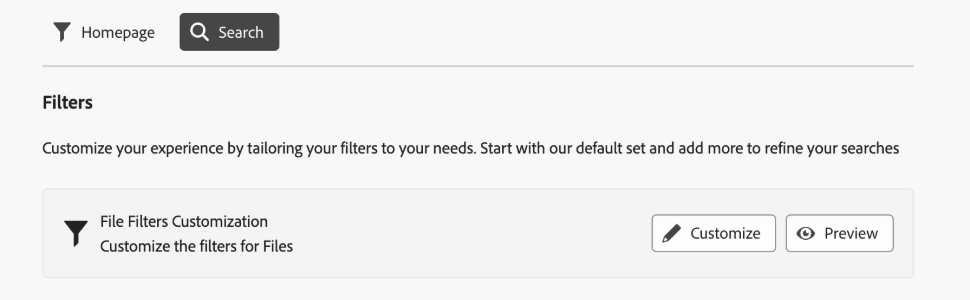
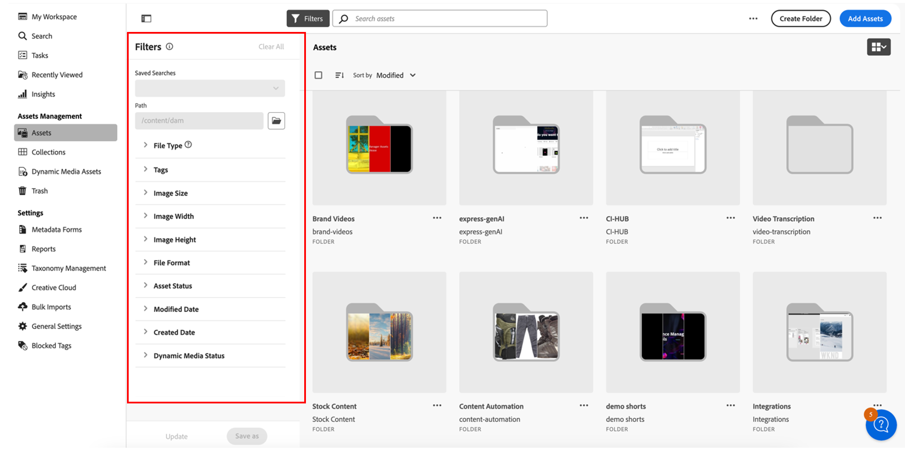

# Customize search filters {#customize-search-filters}

Search filters allow you to refine search results based on various parameters such as date, file type, tags, and relevance, enhancing the precision of search queries. By applying filters, you can quickly sift through the most relevant results efficiently. This not only saves time but also improves the overall search experience by tailoring results to specific preferences and needs.
See more about [search](search-assets-view.md).

Custom search filters can only be mapped to entries in your Searchable Property Index. Ensure that any custom metadata is included before configuring your custom filter experience. [!DNL Assets view] helps customizing search filters to streamline the search process. To customize the search filters template, execute the following steps:

1. Navigate to **[!UICONTROL Settings]** > **[!UICONTROL General Settings]**.
1. Go to the **[!UICONTROL Search]** tab. Click **[!UICONTROL Customize]** to configure your search form. 

    

1. The [!UICONTROL Configure Filters] form appears. Ensure that you are in Edit mode so that you can make modifications in the template. You can switch to [!UICONTROL Preview mode] to see the preview of an existing search form.
1. Drop filter elements from the [custom filters](#available-custom-filters) on the canvas. You can drag and dropt the component to reorder if needed.

    >[!VIDEO](https://video.tv.adobe.com/v/3443080)

1. Click **[!UICONTROL Preview mode]** to review the changes.
1. Click **[!UICONTROL Confirm]** to save.

## Available custom filters {#available-custom-filters} 

Assets view provides the following custom filters that are reconfigurable as per the requirement:

* [Filter elements](#filter-elements)
* [Preconfigured filters](#preconfigured-filters)

### Filter elements {#filter-elements}

You can use a collection of filter elements on your custom search filters canvas. These elements are reconfigurable based on the usability of search property attributes. However, you can customize the [filter properties](#filter-properties) as per your requirements. The following filter elements are available in [!DNL Assets view]:

<table>
    <tr>
        <th>Filter elements</th>
        <th>Description</th>
        <th>Properties</th>
    </tr>
    <tr>
        <td>Text</td>
        <td>A text field is an input area where you can type information related to the filter.</td>
        <td>
            <ul>
                <li>Label
                <li>Metadata
                <li>Values
                <li>Description
            </ul>
        </td>
    </tr>
    <tr>
        <td>Options</td>
        <td>Options refer to the available alternatives to select a preferred item from a list.</td>
        <td>
            <ul>
                <li>Label
                <li>Metadata
                <li>Values
                <li>Options
                <li>Description
            </ul>
        </td>
    </tr>
    <tr>
        <td>Boolean</td>
        <td>A Boolean represents one true value. It can be used where you want to be specific to choose one option among others.</td>
        <td>
            <ul>
                <li>Label
                <li>Metadata
                <li>Description
            </ul>
        </td>
    </tr>
    <tr>
        <td>Number</td>
        <td>Use this filter element to represent a numeric value.</td>
        <td>
            <ul>
                <li>Label
                <li>Metadata
                <li>Selection type
                <li>Stepper
                <li>Stepper value
                <li>Description
            </ul>
        </td>
    </tr>
    <tr>
        <td>Dropdown</td>
        <td>To choose among various options displayed in a list of options.</td>
        <td>
            <ul>
                <li>Label
                <li>Metadata
                <li>Options
                <li>Values
                <li>Description
            </ul>
        </td>
    </tr>
    <tr>
        <td>Date</td>
        <td>Used to specify the date.</td>
        <td>
            <ul>
                <li>Label
                <li>Metadata
                <li>Selection type
                <li>Description
            </ul>
        </td>
    </tr>
    <tr>
        <td>Path browser</td>
        <td>Used to navigate through files or folders in the Experience Manager repository.</td>
        <td>
            <ul>
                <li>Label
                <li>Metadata
                <li>Path explorer
                <li>Description
            </ul>
        </td>
    </tr>
    <tr>
        <td>Tags</td>
        <td>Used to select tags from the available options. Tags provide more specific information about the assets and enhance their discoverability. Tags already applied to the selected assets displays in the <b>Properties</b> panel. If you store tags on a custom metadata property and use the root path to restrict it to a hierarchy, you can leverage the same configuration in your search filters. If you can't find the relevant tags, create them and assign to the selected assets. See <a href = "tagging-management-assets-view.md"> Manage tags in Assets view </a> for details on creating and assigning tags to assets.</td>
        <td>
            <ul>
                <li>Label
                <li>Metadata
                <li>Tag picker
                <li>Description
            </ul>
        </td>
    </tr>
    <tr>
        <td>User</td>
        <td>Used to specify the type of user among administrators, regular, and consumer users.</td>
        <td>
            <ul>
                <li>Label
                <li>Metadata
                <li>Description
            </ul>
        </td>
    </tr>
</table>

### Preconfigured filters {#preconfigured-filters}

The preconfigured filters are preset settings that allow you to use them directly on the canvas. However, you can customize the [filter properties](#filter-properties) as per your requirements. The following filters are preconfigured in [!DNL Assets view]:

<table>
    <tr>
        <th>Preconfigured filters</th>
        <th>Description</th>
        <th>Properties</th>
    </tr>
    <tr>
        <td>File type</td>
        <td>Filter the search results by the supported types of files that are, `Images`, `Documents`, and `Videos`.</td>
        <td>
            <ul>
                <li>Label
                <li>Metadata
                <li>Selection type
                <li>Options
                <li>Values
                <li>Description
            </ul>
        </td>
    </tr>
    <tr>
        <td>File format</td>
        <td>Assets view supports any binary file format with basic services, such as, storage, upload, copy, move, delete, and adding metadata.</td>
        <td>
            <ul>
                <li>Label
                <li>Metadata
                <li>Selection type
                <li>Description
            </ul>
        </td>
    </tr>
    <tr>
        <td>Image size</td>
        <td>Provide one of more of the minimum and maximum dimensions to filter images. Size is provided in dimensions in pixel and is not the file size of the images.</td>
        <td>
            <ul>
                <li>Label
                <li>Metadata
                <li>Selection type
                <li>Stepper
                <li>Stepper value
                <li>Description
            </ul>
        </td>
    </tr>
    <tr>
        <td>Image width</td>
        <td>Vertical dimensions of an image.</td>
        <td>
            <ul>
                <li>Label
                <li>Metadata
                <li>Selection type
                <li>Stepper
                <li>Stepper value
                <li>Description
            </ul>
        </td>
    </tr>
    <tr>
        <td>Image height</td>
        <td>Horizontal dimensions of an image.</td>
        <td>
            <ul>
                <li>Label
                <li>Metadata
                <li>Selection type
                <li>Stepper
                <li>Stepper value
                <li>Description
            </ul>
        </td>
    </tr>
    <tr>
        <td>Created date</td>
        <td>Date range when assets were created.</td>
        <td>
            <ul>
                <li>Label
                <li>Metadata
                <li>Selection type
                <li>Description
            </ul>
        </td>
    </tr>
    <tr>
        <td>Modified date</td>
        <td>Date range when assets were modified.</td>
        <td>
            <ul>
                <li>Label
                <li>Metadata
                <li>Selection type
                <li>Description
            </ul>
        </td>
    </tr>
    <tr>
        <td>Asset status</td>
        <td>Assets view allow you to set the status on assets available in the repository. Set an asset status to better govern and manage downstream consumption of digital assets. Choose among <b>Approved, Rejected, or No Status</b>.</td>
        <td>
            <ul>
                <li>Label
                <li>Metadata
                <li>Selection type
                <li>Description
            </ul>
        </td>
    </tr>
    <tr>
        <td>Smart tags</td>
        <td>Filter assets using smart tags added in the Experience Manager repository.</td>
        <td>
            <ul>
                <li>Label
                <li>Metadata
                <li>Selection type
                <li>Delimeter support
                <li>Description
            </ul>
        </td>
    </tr>
    <tr>
        <td>Dynamic media status</td>
        <td>Choose the status of an asset between published or unpublished.</td>
        <td>
            <ul>
                <li>Label
                <li>Metadata
                <li>Selection type
                <li>Options
                <li>Values
                <li>Description
            </ul>
        </td>
    </tr>
    <tr>
        <td>Expiration date</td>
        <td>Filter assets specifying a date range after which the assets are no longer valid or needed. </td>
        <td>
            <ul>
                <li>Label
                <li>Metadata
                <li>Selection type
                <li>Description
            </ul>
        </td>
    </tr>
    <tr>
        <td>Tags (Taxonomy)</td>
        <td>It is a system of organizing and classifying digital assets using tags, essentially creating a hierarchical structure of keywords that allows users to easily search and find relevant content by applying specific tags to each asset, </td>
        <td>
            <ul>
                <li>Label
                <li>Metadata
                <li>Tag picker
                <li>Description
            </ul>
        </td>
    </tr>
</table>

#### Filter properties {#filter-properties}

Each filter element is associated with a set of properties. Following properties are used in the filter and preconfigured elements:

<table>
    <tr>
        <th>Properties</th>
        <th>Values</th>
        <th>Description</th>
    </tr>
    <tr>
        <td>Label</td>
        <td>Text</td>
        <td>It is an identifier of the filter that you are using.</td>
    </tr>
    <tr>
        <td>Metadata</td>
        <td>Drop down</td>
        <td>The metadata property is used to map approved metadata from Adobe Experience Manager Assets repository. You can choose the metadata value from the drop-down menu that needs to be mapped with the filter element. </td>
    </tr>
    <tr>
        <td>Selection type</td> 
        <td>Single, Multiple, Exact, or Range </td>
        <td>
            <ul>
                <li><b>Single selection</b> allows choosing one item at a me, which is ideal for distinct choices.
                <li><b>Multiple selection</b> allows choosing several items concurrently, which is useful for selecting multiple options. 
                <li><b>Exact selection</b> allows choosing a precise single item from various options.
                <li><b>Range selection</b> allows choosing a continuous set of values within a defined range, useful for selecting a range of dates or numerical values.
            </ul>
        </td>   
    </tr>
    <tr>
        <td>Options</td>
        <td>Manual, JSON Path, or CSV Upload</td>
        <td>
            <ul>
                <li>Choose <b>Manual</b> if you want to add options manually. 
                <li>Choose <b>JSON Path</b> to add options from the JSON file. 
                <li>Choose <b>CSV Upload</b> to import a CSV file containing values to be added in the options.
            </ul>
        </td>
    </tr>
    <tr>
       <td>Values</td>
        <td>Add or Edit</td>
        <td>
        <ul>
        <li>Click <b>add</b> to add a new value. 
        <li>Click &#9998; to edit the label. 
        <li>Click   to delete the option value. 
        <li>Click <b>Edit</b> to modify the edit options. 
        <li>You can also change the sequence of options by holding them.
        </td>
    </tr>
    <tr>
        <td>Delimeter support</td>
        <td>Enable or disable</td>
        <td>A delimiter is a symbol used to separate distinct elements in text. For example commas, spaces, or semicolons.</td>
    </tr>
    <tr>
        <td>Stepper</td>
        <td>Value</td>
        <td>Enable the Stepper button to the number field to increment or decrement the value on each click. </td>
    </tr>
    <tr>
        <td>Stepper value </td>
        <td>Number</td>
        <td>It indicates the increment/decrement value when using the stepper button. It appears when stepper is enabled.</td>
    </tr>
    <tr>
        <td>Description</td>
        <td>Text</td>
        <td>Add a detailed explanation to provide additional information about the filter element.</td>
    </tr>
</table>

## Delete a filter element {#delete-a-filter-element}

To delete a search filter, follow these steps:

1. Navigate to **[!UICONTROL Settings]** > **[!UICONTROL General Settings]**.
1. Go to the **[!UICONTROL Search]** tab. Click **[!UICONTROL Customize]** to configure your search form. 
1. The [!UICONTROL Configure Filters] form appears. Ensure that you are in Edit mode so that you can make modifications in the template.
1. Select the filter element that you want to delete. For example, select **[!UICONTROL Image height]**.
1. Click **[!UICONTROL Delete Category]** to delete the filter element. The **[!UICONTROL Image height]** element is removed from the canvas.
1. Click **[!UICONTROL Confirm]** to save the form.

## Using custom search filters{#using-custom-search-filters}

After configuring the search filters, you can use them to search for assets within the repository.

>[!MORELIKETHIS]
>
>* [Search assets](search-assets-view.md)
