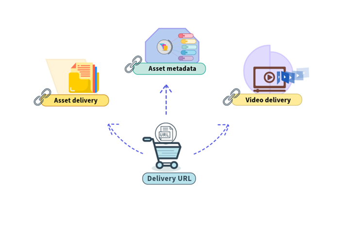

# Delivery  APIs {#delivery-apis}

| [Search Best Practices](/help/assets/search-best-practices.md) |[Metadata Best Practices](/help/assets/metadata-best-practices.md)|[Content Hub](/help/assets/product-overview.md)|[Dynamic Media with OpenAPI capabilities](/help/assets/dynamic-media-open-apis-overview.md)|[AEM Assets developer documentation](https://developer.adobe.com/experience-cloud/experience-manager-apis/)|
| ------------- | --------------------------- |---------|----|-----|

>[!AVAILABILITY]
>
>Dynamic Media with OpenAPI capabilities guide is now available in PDF format. Download the entire guide and use Adobe Acrobat AI Assistant to answer your queries. 
>
>[!BADGE Dynamic Media with OpenAPI capabilities Guide PDF]{type=Informative url="https://helpx.adobe.com/content/dam/help/en/experience-manager/aem-assets/dynamic-media-with-openapi-capabilities.pdf"}

All [approved assets](approve-assets.md) available in Experience Manager assets repository can be [searched](search-assets-api.md) and then delivered to integrated downstream applications using a Delivery URL.

Any changes made to approved assets in DAM, including version updates and metadata modifications, are automatically reflected in the delivery URLs. With a short Time-to-Live (TTL) value of 10 minutes configured for assets delivery via CDN, updates become visible across all authoring and published interfaces in under 10 minutes.

The following image illustrates the available delivery URLs: 



The following table illustrates the usage of the various available Delivery APIs:

|Delivery API | Description |
|---|---|
| [Web-optimized binary representation of the asset in requested output format](https://adobe-aem-assets-delivery.redoc.ly/#operation/getAssetSeoFormat) |Returns the web-optimized binary representation of the asset in requested output format based on the asset ID sent in the request. In addition, you can define various image modifiers such as, width, height, rotate, flip, quality, crop, format, and [smart crop](/help/assets/dynamic-media/image-profiles.md). See the [API details](https://adobe-aem-assets-delivery.redoc.ly/#operation/getAssetSeoFormat) for supported formats and image modifiers.<br>Adobe recommends using this API for all image format types.|
| [Web-optimized binary representation of the asset](https://adobe-aem-assets-delivery.redoc.ly/#operation/getAsset) |Convenience API that applies defaults to web-optimized binary representation of the asset returned in the response. The defaults include a standard JPEG/WEBP format, quality => 65, and width => 1024. |
|[Original uploaded binary of the asset](https://adobe-aem-assets-delivery.redoc.ly/#operation/getAssetOriginal) |Returns the originally uploaded binaries for the asset. Adobe recommends using this API for document format types and SVG images. |
|[Pre-generated rendition of the asset available on AEM Assets authoring environment](https://adobe-aem-assets-delivery.redoc.ly/#operation/getAssetRendition) |Returns the asset rendition's bitstream available on AEM Assets authoring environment based on asset ID and rendition name sent in the request. |
| [Asset metadata](https://adobe-aem-assets-delivery.redoc.ly/#operation/getAssetMetadata) |Returns the properties associated to an asset, such as, title, description, CreateDate, ModifyDate, and so on.|
| [Player container for the video asset](https://adobe-aem-assets-delivery.redoc.ly/#operation/videoPlayerDelivery) |Returns the player container for the video asset. You can  embed the player in to an iframe HTML element and play the video.|
| [Playback manifests in the selected output format](https://adobe-aem-assets-delivery.redoc.ly/#operation/videoManifestDelivery) | Returns the playback manifest file for the specified video asset in the selected output format. You must build a custom player capable of adaptive streaming through HLS or DASH protocols to be able to pull the playback manifest file and play the video.|


>[!NOTE]
>
>* [Image presets, smart imaging, and additional image modifiers](https://adobe-aem-assets-delivery-advancemodifiers.redoc.ly/), are available to you as a limited availability feature. To get access, [create and submit an Adobe Customer Support case](https://helpx.adobe.com/enterprise/using/support-for-experience-cloud.html).
>* Smart Crop is not available with [Assets Prime](/help/assets/assets-ultimate-overview.md).

## Delivery APIs endpoints {#delivery-apis-endpoint}

The API endpoints vary for each delivery API. For example, the API endpoint for `Web-optimized binary representation of the asset in the requested output format` API is:
`https://delivery-pXXXX-eYYYY.adobeaemcloud.com/adobe/assets/{assetId}/as/{seoName}.{format}`

The delivery domain is similar in structure to the Experience Manager author environment's domain. The only difference is replacing the term `author` with `delivery`.

`pXXXX` refers to the program ID

`eYYYY` refers to the environment ID

See [API details](https://adobe-aem-assets-delivery.redoc.ly/#tag/Assets) for more information.

## Delivery APIs request method {#delivery-api-request-method}

GET

## Delivery APIs header {#deliver-assets-api-header}

You need to provide the following details while defining a header in the Delivery APIs header:

```java
headers: {
      'If-None-Match': 'string',
      Authorization: 'Bearer <YOUR_JWT_HERE>'
    }
```

To invoke the Delivery APIs, an IMS token is required in the `Authorization` details to deliver a restricted asset. The IMS token is fetched from a technical account. See [Fetch the AEM as a Cloud Service Credentials](https://experienceleague.adobe.com/docs/experience-manager-cloud-service/content/implementing/developing/generating-access-tokens-for-server-side-apis.html?lang=en#fetch-the-aem-as-a-cloud-service-credentials) to create a new technical account. See [Generating the access token](https://experienceleague.adobe.com/docs/experience-manager-cloud-service/content/implementing/developing/generating-access-tokens-for-server-side-apis.html?lang=en#generating-the-access-token) to generate the IMS token and use it appropriately in the Delivery APIs request header.


To view request samples, response samples, and response codes, see [Delivery APIs](https://adobe-aem-assets-delivery.redoc.ly/#operation/getAssetSeoFormat).
