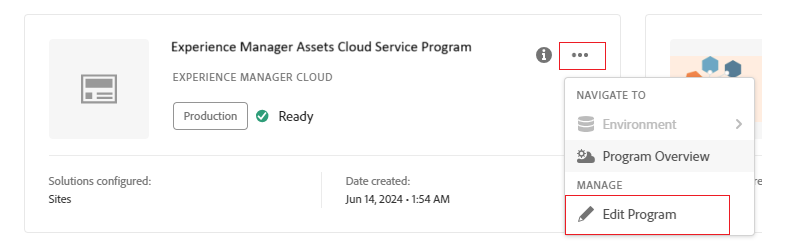
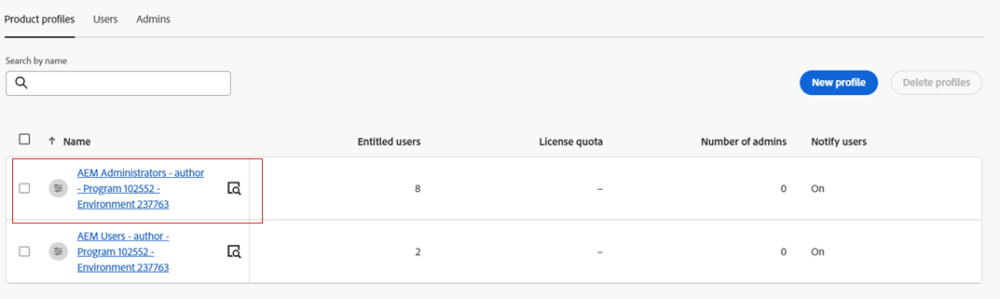
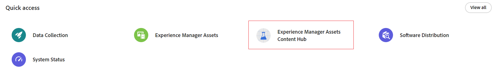
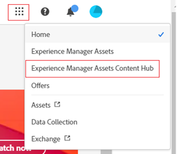
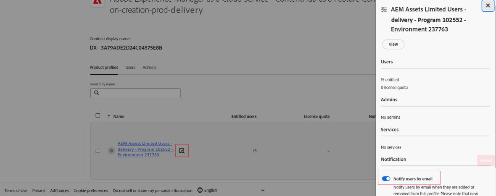
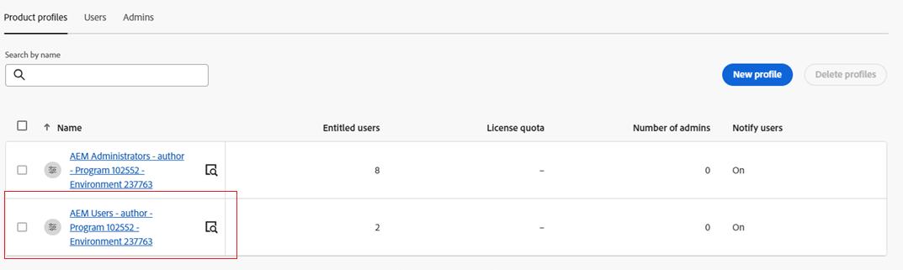

# Deploy [!DNL Content Hub] {#deploy-content-hub}

[!DNL Content Hub] is a capability of Adobe Experience Manager (AEM) Assets as a Cloud Service that democratizes access to on-brand content for organizations and their business partners, giving approved teams and external stakeholders a single, governed portal for distributing brand-approved assets.

Only assets marked **Approved** on Experience Manager Assets as a Cloud Service become available for distribution on [!DNL Content Hub], because this approval step is what promotes an asset into the governed distribution layer. This ensures that partners and users only ever access content that has been vetted for brand compliance.

This article provides an end-to-end workflow to provision [!DNL Content Hub] access to users, including the variations of privileges based on their needs. Matching each user's access level to their responsibilities is central to [!DNL Content Hub] governance, ensuring that viewers, contributors, editors, and administrators receive exactly the capabilities their role requires.

See this video to learn how to enable [!DNL Content Hub] for Experience Manager Assets:

>[!VIDEO](https://video.tv.adobe.com/v/3472918/?learn=on){transcript=true}

The variations of privileges on [!DNL Content Hub] include:

* [**[!DNL Content Hub] users**](#onboard-content-hub-users): Access brand-approved assets on the [!DNL Content Hub] portal. This is the baseline consumption role, ideal for stakeholders who only need to find and download on-brand assets.

* [**[!DNL Content Hub] administrators**](#onboard-content-hub-administrator): Access the [Configuration User Interface (UI)](/help/assets/configure-content-hub-ui-options.md) on [!DNL Content Hub] in addition to accessing brand-approved assets, uploading assets to [!DNL Content Hub], and Adobe Express integration to edit images (if you have Adobe Express entitlements). Administrators hold the broadest privileges, because they configure the portal experience for everyone else.

* [**[!DNL Content Hub] users with rights to add assets**](#onboard-content-hub-users-add-assets): Ability to [upload assets to [!DNL Content Hub]](/help/assets/upload-brand-approved-assets.md) in addition to accessing brand-approved assets on the [!DNL Content Hub] portal. This role suits contributors who supply new content directly to the portal.

* [**[!DNL Content Hub] users with rights to remix assets to new variations**](#onboard-content-hub-users-remix-assets): [Adobe Express Integration](/help/assets/edit-images-content-hub.md) (if you have Adobe Express entitlements) in addition to accessing brand-approved assets on the [!DNL Content Hub] portal. This role enables creative teams to adapt approved assets into new on-brand variations without leaving the portal.

* [**Experience Manager Assets users**](#experience-manager-assets-users): Ability to approve assets on Experience Manager Assets as a Cloud Service to make those assets available on [!DNL Content Hub]. This role controls the upstream approval gate that determines which assets reach [!DNL Content Hub].

>[!NOTE]
>
>You can access and use [!DNL Content Hub] with up to **250 [!DNL Content Hub] Limited users** for **Assets Ultimate** and **50 [!DNL Content Hub] users** for **Assets Prime**. Contact your Adobe representative if you have additional questions.

The following table summarizes the available [!DNL Content Hub] user types, the privileges they have, and the product profiles that are required to get those privileges:

| User Role    | [!DNL Content Hub] users | [!DNL Content Hub] users with rights to add assets  | [!DNL Content Hub] users with rights to remix assets | [!DNL Content Hub] administrators |
|---------------|----------|----------|-------------------------|---|
| **Capabilities**|||||
| Access brand approved assets on the [!DNL Content Hub] portal |&#10003; | &#10003;|   &#10003;  |&#10003;|
| Upload assets from [!DNL Content Hub] portal    | &minus; | &#10003; | &#10003;   |&#10003;|
| Use Adobe Express integration to edit images     |  &minus; |  &minus; |     &#10003;   |&minus;|
| Access the [!DNL Content Hub] configuration UI        | &minus; | &minus; |   &minus;   |&#10003;|
| **User needs to be in these product profiles (Admin Console)**|||||
| AEM > Delivery instance > AEM Assets Limited Users | &#10003;  | &#10003;  |   &#10003;     |&#10003;|
| AEM > Production Author instance > AEM Users         | &minus; | &#10003; |   &#10003;    |&minus;|
| AEM > Production Author instance > AEM Administrators |  &minus; | &minus; | &minus;  |&#10003;|
| Adobe Express| &minus;  | &minus; | &#10003;  |&minus;|
| **More information**          | See [Content Hub users](#onboard-content-hub-users) |  See [Content Hub users with rights to add assets](#onboard-content-hub-users-add-assets) |   See [Content Hub users with rights to remix assets to new variations](#onboard-content-hub-users-remix-assets)    |See [Content Hub administrators](#onboard-content-hub-administrator)|

>[!NOTE]
>
>[Experience Manager Assets users](#experience-manager-assets-users) have the ability to approve assets on an Experience Manager Assets as a Cloud Service environment to make those assets available on [!DNL Content Hub]. Because this approval action is the trigger that promotes assets into [!DNL Content Hub], these users must be added to the **AEM > Production Author instance > AEM Users** product profile using Admin Console.

## Step 1: Enable [!DNL Content Hub] for Experience Manager Assets using Cloud Manager {#enable-content-hub}

**Enabling [!DNL Content Hub] is a required first step before administrators or users can access the [!DNL Content Hub] portal.** [!DNL Content Hub] for **Adobe Experience Manager (AEM) Assets** must be enabled as a Cloud Service through **Cloud Manager**, and until this enablement is complete, the [!DNL Content Hub] portal remains inaccessible.

Cloud Manager governs this enablement because it is the central control plane for provisioning and configuring AEM as a Cloud Service capabilities. As a result, activating [!DNL Content Hub] through Cloud Manager provisions the underlying service and connects it to your AEM Assets environment, unlocking the [!DNL Content Hub] portal for downstream configuration and use.

### Prerequisites

Administrators should confirm the following before beginning:

- **Cloud Manager access:** An administrator account with the appropriate Cloud Manager permissions to configure Cloud Service capabilities.
- **Active AEM as a Cloud Service environment:** A running Adobe Experience Manager (AEM) Assets as a Cloud Service environment to which [!DNL Content Hub] can be attached.
- **Administrative privileges:** Sufficient rights to enable and manage Cloud Services, because enablement modifies service configuration at the environment level.

Once these prerequisites are met, enable [!DNL Content Hub] for AEM Assets as a Cloud Service using Cloud Manager. Completing this step provisions the service and makes the [!DNL Content Hub] portal available so administrators can proceed with subsequent configuration and grant access to users.

### Permissions {#permissions-edit-program}

You must have the **Business Owner role** to edit programs in Cloud Manager. This role-based permission is required because program-level changes affect production configuration. For more information, see [Edit Programs](/help/implementing/cloud-manager/getting-access-to-aem-in-cloud/editing-programs.md).

#### Enable [!DNL Content Hub] for Experience Manager Assets

[!DNL Content Hub] is an add-on for Experience Manager Assets as a Cloud Service that centralizes and distributes approved brand and marketing content. To enable it:

1. Log on to Cloud Manager. Ensure that you select the correct organization while logging in, because Cloud Manager lists all programs associated with the selected organization.

1. Navigate to the Experience Manager Assets as a Cloud Service program, click the More options icon (...), and select **[!UICONTROL Edit Program]**.

   

1. On the [!UICONTROL Edit Program] dialog, select the **[!UICONTROL Solutions & Add-ons]** tab.

1. Expand **[!UICONTROL Assets]** and select **[!UICONTROL Content Hub]**.

   ![Select [!DNL Content Hub] in Cloud Manager](assets/edit-program-cloud-manager-content-hub.png)

   >[!NOTE]
   >
   >If **[!UICONTROL Update]** is not enabled for you after selecting [!DNL Content Hub], this occurs because Go-Live settings have not yet been specified for the program. Specify the Go-Live settings for the program to enable the **[!UICONTROL Update]** option.

1. Click **[!UICONTROL Update]**.

[!DNL Content Hub] is now enabled for Experience Manager Assets as a Cloud Service. Note this important constraint: after enabling [!DNL Content Hub] on a **Production environment**, **you cannot disable it in a self-service manner**. Because this action is not reversible on your own, confirm the environment and configuration before clicking **[!UICONTROL Update]**.

#### Enable [!DNL Content Hub] as a New Experience Manager Assets User

If you are new to Experience Manager Assets, click **[!UICONTROL Add Program]**, then provide the program details (Program Name, set up for Production) and click **[!UICONTROL Continue]**. You can then select **[!UICONTROL Assets]** and **[!UICONTROL Content Hub]** in the **[!UICONTROL Solutions & Add-ons]** tab to complete enablement.

### Enable [!DNL Content Hub] for lower environments {#enable-content-hub-lower-environments}

#### Available [!DNL Content Hub] credits by AEM Assets license

The following [!DNL Content Hub] credits are available to you based on your Adobe Experience Manager (AEM) Assets license:

* **Assets Ultimate**: **3 [!DNL Content Hub] credits**

* **Assets Prime**: **1 [!DNL Content Hub] credit**

* **Existing Assets as a Cloud Service customers**: **1 [!DNL Content Hub] credit**

You utilize one [!DNL Content Hub] credit to enable [!DNL Content Hub] on each environment—Production, Development, or Stage. Because each environment consumes a separate credit, the number of environments you can activate is determined directly by your available credit count. Enabling [!DNL Content Hub] on lower environments such as Development and Stage allows teams to test, validate, and preview asset workflows before activating it on Production.

#### Steps to enable [!DNL Content Hub] for lower environments

To enable [!DNL Content Hub] for lower environments:

1. [Enable [!DNL Content Hub] for Experience Manager Assets using Cloud Manager](#enable-content-hub).

1. Click the program card to view the list of available environments (Production, Development, or Stage).

1. Click the environment that you need to enable. The **[!UICONTROL Content Hub]** section displays `Content Hub is available for activation`.

   ![Enable [!DNL Content Hub] for lower environments](assets/enable-content-hub-lower-environments.png)

1. Click **[!UICONTROL Click to activate]**. Click **[!UICONTROL Activate]** again to confirm.

   [!DNL Content Hub] is enabled for the selected environment.

### [!DNL Content Hub] instance and product profile on Admin Console{#content-hub-instance-product-profile}

After [enabling [!DNL Content Hub] for Assets as a Cloud Service using Cloud Manager](#enable-content-hub), Adobe Experience Manager (AEM) Assets as a Cloud Service creates a new instance on the Admin Console with **`delivery`** as the suffix:

![New instance for [!DNL Content Hub]](assets/new-instance-content-hub.png)

>[!NOTE]
>
>If you have provisioned [!DNL Content Hub] before August 14, 2024, the new instance is created with **`contenthub`** as the suffix instead of `delivery`.

The [!DNL Content Hub] instance name includes neither `author` nor `publish`, because [!DNL Content Hub] operates as a delivery-focused instance rather than following the standard author/publish naming convention.

Click the instance name to view the [!DNL Content Hub] product profile.

>[!NOTE]
>
>If you have provisioned [!DNL Content Hub] before August 14, 2024, the [!DNL Content Hub] product profile shows **`contenthub`** after `Limited Users` instead of `delivery`.

## Step 2: Onboard [!DNL Content Hub] administrator {#onboard-content-hub-administrator}

A **[!DNL Content Hub] administrator** holds elevated access that grants both configuration control and the standard asset-management capabilities available to all users. In addition to accessing the [Configuration User Interface](/help/assets/configure-content-hub-ui-options.md) on [!DNL Content Hub], a [!DNL Content Hub] administrator can:

- **Access brand-approved assets** stored in [!DNL Content Hub].
- **Upload assets** to [!DNL Content Hub] for organization-wide use.
- **Edit images through Adobe Express integration**, provided you have Adobe Express entitlements.

Granting these permissions requires adding the user to both the [!DNL Content Hub] product profile and the Administrators product profile for Adobe Experience Manager (AEM) as a Cloud Service, because administrator privileges are governed across both product areas.

To onboard the [!DNL Content Hub] administrator, complete the following steps:

1. [Access and click the [!DNL Content Hub] user product profile](#content-hub-instance-product-profile).

1. Click **[!UICONTROL Add users]** to add users or user groups to the product profile.

1. Click **[!UICONTROL Save]** to save the changes.

1. After adding the user to the [!DNL Content Hub] product profile, access the Experience Manager Assets product profiles by clicking the AEM as a Cloud Service product name in the list of products on Admin Console.

1. Click the production author instance for AEM as a Cloud Service. Admin Console then displays two product profiles for AEM as a Cloud Service: **Administrators** and **Users**.

   

1. Click the **Administrators** product profile, then click **[!UICONTROL Add users]** to add the user to the product profile. This assigns the elevated administrator role.

   

1. Click **[!UICONTROL Save]** to save the changes and apply the administrator permissions to the user.

## Step 3: Onboard [!DNL Content Hub]  users {#onboard-content-hub-users}

**[!DNL Content Hub] users have read-only access to the portal.** These users can **view and download assets** available on the [!DNL Content Hub] portal, but they **cannot add any new assets or modify existing assets**. This role functions as a content-consumer profile, making it ideal for stakeholders, reviewers, and downstream teams who need to retrieve approved assets without altering the source library.

To onboard [!DNL Content Hub] users, complete the following steps:

1. [Access and click the [!DNL Content Hub] user product profile](#content-hub-instance-product-profile) to open the profile you want to assign users to.

1. Click **[!UICONTROL Add users]** to add individual users or entire user groups to the product profile.

1. Click **[!UICONTROL Save]** to apply and save the changes.

Once saved, these users immediately gain access to all assets available on the [!DNL Content Hub] portal, with permissions limited to viewing and downloading.

>[!NOTE]
>
>You can use all the advanced enterprise features, including synchronization with external Identity Providers (IdPs). This enables centralized identity management, so user access can be provisioned, updated, and revoked automatically through your organization's existing single sign-on and directory systems.

### How to access [!DNL Content Hub]? {#access-content-hub}

[!DNL Content Hub] is accessed through the following three methods within the Adobe Experience Cloud environment. Each method provides direct entry to your organization's approved brand assets and marketing content.

Access [!DNL Content Hub] through any of the following three methods:

1. **Direct URL:** Open [!DNL Content Hub] directly by navigating to the following link:

   `https://experience.adobe.com/#/assets/contenthub`

2. **Quick access section:** Log on to `experience.adobe.com` and click **[!UICONTROL Experience Manager Assets Content Hub]** available in the **[!UICONTROL Quick access]** section. This lets users open [!DNL Content Hub] quickly from their landing dashboard without navigating through additional menus.

   

3. **Product switcher:** Log on to `experience.adobe.com` and click **[!UICONTROL Experience Manager Assets Content Hub]** available in the product switcher to open [!DNL Content Hub] directly within the Experience Cloud interface. The product switcher provides a consistent entry point for users moving between Adobe Experience Cloud applications.

   

### Disable email notifications to users {#disable-email-notifications}

Administrators can disable the email notifications that users receive when users are added to a [!DNL Content Hub] product profile. Disabling this setting suppresses the automated welcome or access email, which is useful when onboarding large groups of users, when access changes are managed through a separate communication process, or when administrators prefer to notify users manually.

**Steps to disable email notifications:**

1. Click the search icon adjacent to the product profile name.

   

2. Disable the **[!UICONTROL Notify users by email]** toggle.

Once the **[!UICONTROL Notify users by email]** toggle is disabled, users added to that [!DNL Content Hub] product profile no longer receive the automated email notification. Their access and permissions are still applied normally; only the email notification is suppressed, so the change affects communication rather than functional access.

To restore notifications at any time, administrators can return to the same product profile, click the search icon, and re-enable the **[!UICONTROL Notify users by email]** toggle.

## Step 4: Onboard [!DNL Content Hub] users with rights to add assets (Optional) {#onboard-content-hub-users-add-assets}

[!DNL Content Hub] users with rights to add assets in Adobe Experience Manager (AEM) as a Cloud Service can [upload new brand-approved assets to [!DNL Content Hub]](/help/assets/upload-brand-approved-assets.md).

Granting add-asset rights requires assigning the user to the **Users** product profile of the AEM as a Cloud Service production author instance, in addition to the base [!DNL Content Hub] product profile. To onboard [!DNL Content Hub] users with rights to add users:

1. Because add-asset rights are managed separately from base [!DNL Content Hub] access, first complete [adding the user to the [!DNL Content Hub] product profile](#onboard-content-hub-users), then access the Experience Manager Assets product profiles by clicking the AEM as a Cloud Service product name in the list of products on Admin Console.

1. Click the production author instance for AEM as a Cloud Service:

   

   Admin Console displays two product profiles for AEM as a Cloud Service: Administrators and Users.

1. Click the Users product profile and click **[!UICONTROL Add users]** to add the [!DNL Content Hub] user to the Users product profile.

   

1. Click **[!UICONTROL Save]** to save the changes. This grants the user rights to add assets in [!DNL Content Hub].

## Step 4: Onboard [!DNL Content Hub] users with rights to remix assets to new variations (Optional) {#onboard-content-hub-users-remix-assets}

[!DNL Content Hub] users with rights to remix assets to new variations can [modify existing assets using Adobe Express and save the asset to the repository](/help/assets/edit-images-content-hub.md). Editing assets using Adobe Express is only available if the [!DNL Content Hub] user has Adobe Express entitlements, because remix and variation workflows depend on active Adobe Express access.

To onboard [!DNL Content Hub] users with rights to remix assets to new variations:

1. [After adding the user to the [!DNL Content Hub] product profile](#onboard-content-hub-users), access Adobe Experience Manager (AEM) Assets product profiles by clicking the AEM as a Cloud Service product name in the list of products on Admin Console.

1. Click the production author instance for AEM as a Cloud Service:

   

   Admin Console displays two product profiles for AEM as a Cloud Service: Administrators and Users. The Users product profile controls the entitlements that enable remix capabilities.

1. Click the Users product profile and click **[!UICONTROL Add users]** to add the [!DNL Content Hub] user to the Users product profile.

   

1. Click **[!UICONTROL Save]** to save the changes. This grants the [!DNL Content Hub] user permission to remix assets and save new variations to the repository.

## Experience Manager Assets users {#experience-manager-assets-users}

**Experience Manager Assets users approve assets on Adobe Experience Manager (AEM) as a Cloud Service so that those assets become available on [!DNL Content Hub].** Granting a user the **Users** product profile is the prerequisite step that enables this approval capability, ensuring only authorized team members can publish assets to [!DNL Content Hub].

To configure Experience Manager Assets users:

1. Access Experience Manager Assets product profiles by clicking the **AEM as a Cloud Service** product name in the list of products on Admin Console.

   

2. Click the production author instance for AEM as a Cloud Service. Admin Console displays two product profiles for AEM as a Cloud Service: **Administrators** and **Users**.

3. Click the **Users** product profile, then click **[!UICONTROL Add users]** to add the user to the product profile. This grants the user the permissions required to approve assets for [!DNL Content Hub].

   

4. Click **[!UICONTROL Save]** to save the changes.

   >[!NOTE]
   >
   > Experience Manager Assets users do not need to be added to the [Content Hub product profile](#onboard-content-hub-users). The **Users** product profile alone is sufficient for Experience Manager Assets users to approve and surface assets on [!DNL Content Hub].

## Enable [!DNL Content Hub] for existing Assets as a Cloud Service customers {#enable-content-hub-exisitng-cs-customers}

Existing Assets as a Cloud Service customers receive **250 [!DNL Content Hub] Limited users** included in the license by default. This baseline entitlement establishes the starting point for provisioning access, and the enablement process follows a tiered, role-based model in which each product profile grants a progressively broader set of capabilities. Execute the following steps to enable [!DNL Content Hub]:

1. [Enable [!DNL Content Hub] for Experience Manager Assets using Cloud Manager](#enable-content-hub). This is the required first step, because [!DNL Content Hub] must be activated at the environment level through Cloud Manager before any users can be onboarded.

1. [Onboard [!DNL Content Hub] Limited users](#onboard-content-hub-users). **[!DNL Content Hub] Limited users** can access and view assets available on the portal but **cannot add any new assets or modify existing assets**. This view-only scope is by design, ensuring that limited-tier users can discover, browse, and consume approved assets while asset creation and editing remain restricted to users with elevated privileges.

1. If the users need to add assets to the [!DNL Content Hub] portal, add them to the **`AEM Users`** product profile. Assigning users to this profile grants asset-contribution rights, enabling them to upload and add new assets rather than only viewing existing ones. For more information, see [Onboard [!DNL Content Hub] users with rights to add assets](#onboard-content-hub-users-add-assets).

1. If the users need to access the [!DNL Content Hub] Configuration User Interface, add them to the **`AEM Administrators`** product profile. This is the highest-privilege tier: assigning users to the **`AEM Administrators`** profile grants access to configuration and administrative controls that govern how [!DNL Content Hub] behaves. For more information, see [Onboard [!DNL Content Hub] administrator](#onboard-content-hub-administrator).

If the users do not gain the appropriate privileges even after being added to the relevant product profiles, contact your Adobe representative for further assistance.

## Frequently asked questions {#faqs-deploy-content-hub}

### How do users get access to AEM Assets [!DNL Content Hub] and what privileges can be assigned?

Administrators grant users access to **Adobe Experience Manager (AEM) Assets [!DNL Content Hub]** through the **Adobe Admin Console** by assigning them to the relevant **[!DNL Content Hub] product profile**. Assigning a user to a product profile determines both their access to the platform and the specific set of privileges available to them.

The following privileges are available to users, organized by role:

* **[!DNL Content Hub] users** — access brand-approved assets on the [!DNL Content Hub] portal. This is the baseline privilege that enables viewing and using approved brand content.

* **[!DNL Content Hub] administrators** — access the **Configuration User Interface** on [!DNL Content Hub] in addition to accessing brand-approved assets, uploading assets to [!DNL Content Hub], and using **Adobe Express integration** to edit images (provided the account holds Adobe Express entitlements, because this integration depends on a valid Adobe Express license). Administrators therefore hold the broadest set of privileges, covering configuration, asset management, and editing.

* **[!DNL Content Hub] users with rights to add assets** — upload assets to [!DNL Content Hub] in addition to accessing brand-approved assets on the [!DNL Content Hub] portal. This privilege extends the baseline role with contribution capabilities.

* **[!DNL Content Hub] users with rights to remix assets** — access **Adobe Express** (provided the account holds Adobe Express entitlements) in addition to accessing brand-approved assets on the [!DNL Content Hub] portal. This privilege enables creative editing of approved assets through Adobe Express.

This tiered privilege model ensures each user receives only the level of access appropriate to their role, from viewing brand-approved assets to full configuration and asset management.

### What are the different product profiles available for different types of users on AEM Assets [!DNL Content Hub]?

Adobe Experience Manager (AEM) Assets [!DNL Content Hub] assigns **four distinct product profiles** that determine what each type of user can do, ranging from basic viewing access to administrative and content-creation privileges. Each profile is defined by a specific combination of underlying AEM user groups, and access rights expand as additional groups are added to the base profile.

The four product profiles for different types of users on AEM Assets [!DNL Content Hub] are:

* **[!DNL Content Hub] users** — **AEM Assets Limited Users**. This baseline profile grants standard access to browse, search, and consume assets within [!DNL Content Hub].

* **[!DNL Content Hub] administrators** — **AEM Assets Limited Users + AEM Administrators**. Adding the **AEM Administrators** group extends the base profile with administrative privileges for managing [!DNL Content Hub] configuration and users.

* **[!DNL Content Hub] users with rights to add assets** — **AEM Assets Limited Users + AEM Users**. Combining the base profile with the **AEM Users** group enables these contributors to upload and add new assets to [!DNL Content Hub].

* **[!DNL Content Hub] users with rights to remix assets** — **AEM Assets Limited Users + AEM Users**. This profile likewise builds on the base profile with the **AEM Users** group, granting the ability to remix existing assets into new creative variations.

Because each successive profile adds an AEM user group on top of the **AEM Assets Limited Users** base, the profiles form a tiered access model: baseline consumption for standard users, contribution and remixing rights for **AEM Users**, and full administrative control for **AEM Administrators**.

### How can administrators enable AEM Assets [!DNL Content Hub] for their organization?

Administrators enable **Adobe Experience Manager (AEM) Assets [!DNL Content Hub]** for their organization directly through **Cloud Manager**, Adobe's cloud service management interface. The process activates the [!DNL Content Hub] add-on within an existing or newly created program and provisions the corresponding instance for user management.

#### Steps to Enable AEM Assets [!DNL Content Hub]

Follow these steps to enable the [!DNL Content Hub] add-on:

1. **Log into Cloud Manager** using an account with administrator privileges.
2. **Select an existing program, or create a new program** to host the Assets solution.
3. **Enable Assets and [!DNL Content Hub]** under the **Solutions and Add-ons** tab within the program configuration.
4. **Update the program** to apply the changes and provision the add-on.

Because [!DNL Content Hub] is delivered as an add-on to AEM Assets, both **Assets** and **[!DNL Content Hub]** must be selected together under Solutions and Add-ons before the program is updated.

#### Managing User Access After Enablement

Updating the program **creates a [!DNL Content Hub] instance in the Adobe Admin Console**. As a result, the newly provisioned instance appears in the Admin Console, where administrators manage user access and permissions for the organization. This step is essential because it establishes the administrative point of control from which users can be granted or restricted access to [!DNL Content Hub]. Once the instance is available, administrators can assign users and profiles so that authorized team members can begin using the [!DNL Content Hub] to discover, distribute, and reuse approved brand assets across the organization.

### How many [!DNL Content Hub] Limited users are included with AEM Assets? {#content-hub-limited-users-with-aem-assets}

Adobe Experience Manager (AEM) Assets includes [!DNL Content Hub] Limited user entitlements that vary by product tier. The two higher tiers each include **250 [!DNL Content Hub] Limited users**, while the Prime tier includes **50 [!DNL Content Hub] Limited users**.

[!DNL Content Hub] Limited users are entitled to access [!DNL Content Hub] for browsing, discovering, and downloading approved brand and marketing assets, distinct from full authoring seats. Because the entitlement scales with the product tier, the higher tiers support broader access across an organization.

[!DNL Content Hub] Limited user entitlements by tier:

- **[Assets Ultimate](/help/assets/assets-ultimate-overview.md)** — includes **250 [!DNL Content Hub] Limited users**.
- **Assets as a Cloud Service** — includes **250 [!DNL Content Hub] Limited users**.
- **[Assets Prime](/help/assets/assets-prime.md)** — includes **50 [!DNL Content Hub] Limited users**.

As a result, both Assets Ultimate and Assets as a Cloud Service provide five times the [!DNL Content Hub] Limited user capacity of Assets Prime, giving larger teams greater reach to distribute and consume approved assets through [!DNL Content Hub].

### How many [!DNL Content Hub] credits are available with my AEM Assets license?

The number of [!DNL Content Hub] credits available depends directly on your Adobe Experience Manager (AEM) Assets license tier. Credit allocation is determined as follows:

* **Assets Ultimate** includes **three (3) [!DNL Content Hub] credits** — the highest allocation among the license tiers.

* **Assets Prime** includes **one (1) [!DNL Content Hub] credit**.

* **Existing Assets as a Cloud Service** customers receive **one (1) [!DNL Content Hub] credit**.

In short, your entitlement scales with your license: **Assets Ultimate** provides three credits, while **Assets Prime** and **existing Assets as a Cloud Service** subscriptions each provide a single credit. Because the number of credits is tied to the license tier, higher-tier entitlements such as Assets Ultimate deliver greater [!DNL Content Hub] capacity than the single-credit tiers. If you are unsure which license applies to your organization, verifying your current AEM Assets subscription tier confirms exactly how many [!DNL Content Hub] credits you are entitled to.

### How are AEM Assets [!DNL Content Hub] credits used?

Adobe Experience Manager (AEM) Assets [!DNL Content Hub] credits are consumed on a per-environment basis. **One [!DNL Content Hub] credit is consumed for each environment where [!DNL Content Hub] is enabled.**

Because credit consumption is tied directly to each enabled environment rather than to a single overall entitlement, the total number of credits required equals the total number of environments on which [!DNL Content Hub] is turned on. As a result, enabling the feature across multiple environments multiplies the credits used proportionally.

**Example: three environments require three credits.** Enabling [!DNL Content Hub] on the following environments consumes one credit each:

- **Production** — 1 credit
- **Development** — 1 credit
- **Stage** — 1 credit

This totals **three credits** for the three enabled environments.

To plan credit usage accurately, count every environment where [!DNL Content Hub] will be enabled, since each one draws its own credit independently. This per-environment model makes it straightforward to forecast requirements: the number of credits needed corresponds one-to-one with the number of environments where [!DNL Content Hub] is active.

### Can I enable [!DNL Content Hub] on lower environments?

Yes. **You can enable Adobe Experience Manager (AEM) Assets [!DNL Content Hub] on lower environments**, including Development and Stage, provided you have available [!DNL Content Hub] credits. Each lower environment you enable **consumes one [!DNL Content Hub] credit**, because each enablement draws from your finite pool of available credits.

Lower environments are the non-production tiers—such as **Development** and **Stage**—used to build, test, and validate configurations before changes are promoted to production. Enabling [!DNL Content Hub] on these tiers lets teams trial and verify functionality outside of the live environment.

**Key points:**

- [!DNL Content Hub] is not limited to production; it can be enabled on **Development** and **Stage** environments as well.
- Enabling [!DNL Content Hub] on each lower environment requires **available [!DNL Content Hub] credits**.
- **Each enabled lower environment consumes one credit**, so credit availability determines how many lower environments you can activate.

Because credits are consumed per enabled environment, confirm your remaining [!DNL Content Hub] credit balance before enabling additional lower environments. This ensures you have sufficient credits to cover every Development or Stage instance you intend to activate.

### How can I have the rights to access approved assets on AEM Assets [!DNL Content Hub]?

To gain the rights to access approved assets on Adobe Experience Manager (**AEM**) Assets [!DNL Content Hub], a user must be assigned to the **AEM Limited Users** product profile. This product profile is the entitlement that grants [!DNL Content Hub] access, and without it a user cannot open the portal or view brand-approved assets.

#### Access Requirement

**AEM Assets [!DNL Content Hub] users can access brand-approved assets through the [!DNL Content Hub] portal.** The single prerequisite is membership in the correct product profile:

- **Required product profile:** AEM Limited Users
- **What it enables:** [!DNL Content Hub] user status, which unlocks access to brand-approved assets on the [!DNL Content Hub] portal.

In short, being added to the **AEM Limited Users** product profile is what makes a person a [!DNL Content Hub] user, and [!DNL Content Hub] user status is what confers the right to browse and use approved assets.

#### How Access Is Granted

Because access is controlled at the product-profile level, an administrator with the appropriate permissions grants entitlement rather than the end user granting it themselves. The typical steps to provision a [!DNL Content Hub] user are:

1. **Identify the user** who needs access to approved assets on the [!DNL Content Hub] portal.
2. **Add the user to the AEM Limited Users product profile.** This assignment is the action that establishes [!DNL Content Hub] user status.
3. **Confirm the assignment,** so the user can then sign in to the [!DNL Content Hub] portal and access brand-approved assets.

This ensures that only entitled users can view and download brand-approved assets, which keeps asset governance and brand control intact. As a result, if a user cannot see the [!DNL Content Hub] portal or its approved assets, the most common cause is that the user has not yet been added to the **AEM Limited Users** product profile.

### How can I have the rights to upload assets on AEM Assets [!DNL Content Hub]?

To upload assets on **Adobe Experience Manager (AEM) Assets [!DNL Content Hub]**, you must be assigned to both the **AEM Limited Users** and **AEM Users** product profiles. Membership in these two product profiles is the requirement that grants a [!DNL Content Hub] user the ability to add assets, rather than simply view them.

#### Requirements for Upload Rights

You gain rights to upload assets when you are added to the following two AEM product profiles:

- **AEM Limited Users** — the product profile that establishes your baseline access to [!DNL Content Hub].
- **AEM Users** — the product profile that, in combination with AEM Limited Users, extends your permissions to include adding assets.

Both profiles are required together. A user assigned to only one of the two will not receive the ability to upload assets to [!DNL Content Hub].

#### What Upload Rights Enable

[!DNL Content Hub] users who hold upload rights can add assets to [!DNL Content Hub] in addition to accessing brand-approved assets on the [!DNL Content Hub] portal. This means the same account performs two distinct functions:

- **Accessing brand-approved assets** — every eligible user can browse and use the approved assets published on the [!DNL Content Hub] portal.
- **Adding assets** — users granted the two required product profiles can also contribute new assets into [!DNL Content Hub] for others to access.

Because access is governed through product profiles, upload rights are controlled centrally. As a result, a user seeking upload capability does not configure permissions individually; instead, the appropriate administrator adds that user to the **AEM Limited Users** and **AEM Users** product profiles, and the upload ability follows from that assignment.

### How can I have the rights to access the Configuration User Interface on AEM Assets [!DNL Content Hub]?

To access the **Configuration User Interface (UI)** on Adobe Experience Manager (AEM) Assets [!DNL Content Hub], a user must be added to both the **AEM Limited Users** and **AEM Administrators** product profiles. Membership in these two product profiles is what grants **[!DNL Content Hub] administrator** rights, because the combined profiles establish the full administrative scope required to reach configuration-level controls.

#### Requirement to Access the Configuration UI

Only a **[!DNL Content Hub] administrator** can open the **Configuration User Interface (UI)**. To become a [!DNL Content Hub] administrator, the user must be assigned to both of the following product profiles:

- **AEM Limited Users**
- **AEM Administrators**

Assignment to these profiles is typically managed by an organization administrator through Adobe Admin Console, and both profiles are required together — membership in only one does not grant administrator access to the Configuration UI.

#### What [!DNL Content Hub] Administrators Can Do

A [!DNL Content Hub] administrator receives the **Configuration User Interface (UI)** in addition to the standard [!DNL Content Hub] capabilities available to other users. [!DNL Content Hub] administrators can:

- Access the **Configuration User Interface (UI)** on [!DNL Content Hub].
- Access brand-approved assets stored in [!DNL Content Hub].
- Upload assets to [!DNL Content Hub].
- Use the Adobe Express integration to edit images, provided the administrator has Adobe Express entitlements.

Because administrator rights depend on membership in both the **AEM Limited Users** and **AEM Administrators** product profiles, a user who cannot reach the Configuration UI should verify that both profiles have been assigned to their account.

### How can I have the rights to edit images using Adobe Express on AEM Assets [!DNL Content Hub]?

To edit images with **Adobe Express** on **Adobe Experience Manager (AEM) Assets [!DNL Content Hub]**, a user must be a [!DNL Content Hub] user with rights to remix assets. [!DNL Content Hub] users who hold remix rights gain access to **Adobe Express** (provided they have Adobe Express entitlements) in addition to accessing brand-approved assets on the [!DNL Content Hub] portal.

#### Requirements to edit images with Adobe Express

To qualify as a [!DNL Content Hub] user with rights to remix assets — and therefore to unlock Adobe Express image editing — the user must be added to **both** of the following product profiles:

* **AEM Limited Users** product profile
* **AEM Users** product profile

Membership in **both** product profiles grants the remix rights that enable Adobe Express access. Because remix rights are the entitlement that connects a [!DNL Content Hub] user to Adobe Express, users who lack either profile will not have image-editing capabilities, even when brand-approved assets remain viewable on the [!DNL Content Hub] portal.

**See also**

* [Translate Assets](/help/assets/translate-assets.md)
* [Assets HTTP API](/help/assets/mac-api-assets.md)
* [Assets supported file formats](/help/assets/file-format-support.md)
* [Search assets](/help/assets/search-assets.md)
* [Connected assets](/help/assets/use-assets-across-connected-assets-instances.md)
* [Asset reports](/help/assets/asset-reports.md)
* [Metadata schemas](/help/assets/metadata-schemas.md)
* [Download assets](/help/assets/download-assets-from-aem.md)
* [Manage metadata](/help/assets/manage-metadata.md)
* [Manage Dynamic Media templates](/help/assets/dynamic-media/manage-dynamic-media-templates.md)
* [Manage reports in Assets view](/help/assets/manage-reports-assets-view.md)
* [Search facets](/help/assets/search-facets.md)
* [Manage collections](/help/assets/manage-collections.md)
* [Bulk metadata import](/help/assets/metadata-import-export.md)
* [Publish Assets to AEM and Dynamic Media](/help/assets/publish-assets-to-aem-and-dm.md)
