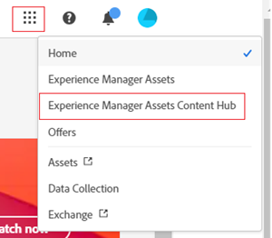

# Deploy Content Hub {#deploy-content-hub}

<table>
    <tr>
        <td>
            <i>New</i> <a href="/help/assets/dynamic-media/dm-prime-ultimate.md"><b>Dynamic Media Prime and Ultimate</b></a>
        </td>
        <td>
            <i>New</i> <a href="/help/assets/assets-ultimate-overview.md"><b>AEM Assets Ultimate</b></a>
        </td>
        <td>
            <i>New</i> <a href="/help/assets/integrate-aem-assets-edge-delivery-services.md"><b>AEM Assets integration with Edge Delivery Services</b></a>
        </td>
        <td>
            <i>New</i> <a href="/help/assets/aem-assets-view-ui-extensibility.md"><b>UI Extensibility</b></a>
        </td>
          <td>
            <i>New</i> <a href="/help/assets/dynamic-media/enable-dynamic-media-prime-and-ultimate.md"><b>Enable Dynamic Media Prime and Ultimate</b></a>
        </td>
    </tr>
    <tr>
        <td>
            <a href="/help/assets/search-best-practices.md"><b>Search Best Practices</b></a>
        </td>
        <td>
            <a href="/help/assets/metadata-best-practices.md"><b>Metadata Best Practices</b></a>
        </td>
        <td>
            <a href="/help/assets/product-overview.md"><b>Content Hub</b></a>
        </td>
        <td>
            <a href="/help/assets/dynamic-media-open-apis-overview.md"><b>Dynamic Media with OpenAPI capabilities</b></a>
        </td>
        <td>
            <a href="https://developer.adobe.com/experience-cloud/experience-manager-apis/"><b>AEM Assets developer documentation</b></a>
        </td>
    </tr>
</table>

>[!AVAILABILITY]
>
>Content Hub guide is now available in PDF format. Download the entire guide and use Adobe Acrobat AI Assistant to answer your queries. 
>
>[!BADGE Content Hub Guide PDF]{type=Informative url="https://helpx.adobe.com/content/dam/help/en/experience-manager/aem-assets/content-hub.pdf"}

Content Hub is available as part of Experience Manager Assets as a Cloud Service for democratizing access to on-brand content for organizations and their business partners.

The assets that are marked Approved on Experience Manager Assets as a Cloud Service are available for asset distribution on Content Hub.

This article provides an end-to-end workflow to provide Content Hub access to users including the variations of privileges based on their needs.

The variations of privileges on Content Hub include:

* [Content Hub users](#onboard-content-hub-users): Access brand approved assets on the Content Hub portal.

* [Content Hub administrators](#onboard-content-hub-administrator): Access to the [Configuration User Interface](/help/assets/configure-content-hub-ui-options.md) on Content Hub in addition to accessing brand-approved assets, uploading assets to Content Hub, Adobe Express integration to edit images (if you have Adobe Express entitlements).

* [Content Hub users with rights to add assets](#onboard-content-hub-users-add-assets): Ability to [upload assets to Content Hub](/help/assets/upload-brand-approved-assets.md) in addition to accessing brand approved assets on the Content Hub portal.

* [Content Hub users with rights to remix assets to new variations](#onboard-content-hub-users-remix-assets): [Adobe Express Integration](/help/assets/edit-images-content-hub.md) (if you have Adobe Express entitlements) in addition to accessing brand approved assets on the Content Hub portal.

* [Experience Manager Assets users](#experience-manager-assets-users): Ability to approve assets on Experience Manager Assets as a Cloud Service to make those assets available on Content Hub.

The following table summarizes the available Content Hub user types, the privileges they have, and the product profiles that are required to get those privileges:

| User Role    | Content Hub users | Content Hub users with rights to add assets  | Content Hub users with rights to remix assets | Content Hub administrators |
|---------------|----------|----------|-------------------------|---|
| **Capabilities**|
| Access brand approved assets on the Content Hub portal |&#10003; | &#10003;|   &#10003;  |&#10003;|
| Upload assets from Content Hub portal    | &minus; | &#10003; | &#10003;   |&#10003;|
| Use Adobe Express integration to edit images     |  &minus; |  &minus; |     &#10003;   |&minus;|
| Access the Content Hub configuration UI        | &minus; | &minus; |   &minus;   |&#10003;|
| **User needs to be in these product profiles (Admin Console)**|
| AEM > Delivery instance > AEM Assets Limited Users | &#10003;  | &#10003;  |   &#10003;     |&#10003;|
| AEM > Production Author instance > AEM Users         | &minus; | &#10003; |   &#10003;    |&minus;|
| AEM > Production Author instance > AEM Administrators |  &minus; | &minus; | &minus;  |&#10003;|
| Adobe Express| &minus;  | &minus; | &#10003;  |&minus;|
| **More information**          | See [Content Hub users](#onboard-content-hub-users) |  See [Content Hub users with rights to add assets](#onboard-content-hub-users-add-assets) |   See [Content Hub users with rights to remix assets to new variations](#onboard-content-hub-users-remix-assets)    |See [Content Hub administrators](#onboard-content-hub-administrator)|

>[!NOTE]
>
>[Experience Manager Assets users](#experience-manager-assets-users) have the ability to approve assets on an Experience Manager Assets as a Cloud Service environment to make those assets available on Content Hub. These users must be added to AEM > Production Author instance > AEM Users product profile using Admin Console.

## Step 1: Enable Content Hub for Experience Manager Assets using Cloud Manager {#enable-content-hub}

To access the Content Hub portal, administrators first need to enable Content Hub for Experience Manager Assets as a Cloud Service using Cloud Manager. Execute the following steps:

1. Log on to Cloud Manager. Ensure that you select the right organization while logging in. The Cloud Manager lists all your programs.

1. Navigate to Experience Manager Assets as a Cloud Service program, click the More options icon (...) and select **[!UICONTROL Edit Program]**.

   

1. On the [!UICONTROL Edit Program] dialog, select the **[!UICONTROL Solutions & Add-ons]** tab.

1. Expand **[!UICONTROL Assets]** and select **[!UICONTROL Content Hub]**.
   

   >[!NOTE]
   >
   >If **[!UICONTROL Update]** is not enabled for you after selecting Content Hub, ensure that you have specified Go-Live settings for the program.

1. Click **[!UICONTROL Update]**.

Content Hub is now enabled for Experience Manager Assets as a Cloud Service. After enabling Content Hub on a Production environment, you cannot disable it in a self-service manner.

>[!NOTE]
>
>You can access and use Content Hub with up to 250 Content Hub users. Please contact your Adobe representative if you have additional questions. 

If you are new to Experience Manager Assets, click **[!UICONTROL Add Program]** and then provide program details (Program Name, set up for Production) and click **[!UICONTROL Continue]**. You can then select **[!UICONTROL Assets]** and **[!UICONTROL Content Hub]** in the **[!UICONTROL Solutions & Add-ons]** tab.

### Content Hub instance and product profile on Admin Console{#content-hub-instance-product-profile}

After [enabling Content Hub for Assets as a Cloud Service using Cloud Manager](#enable-content-hub), there is a new instance created within AEM Assets as a Cloud Service on Admin Console with `delivery` as the suffix:

>[!NOTE]
>
>If you have provisioned Content Hub before August 14, 2024, the new instance is created with `contenthub` as the suffix.

Note that there is no `author` or `publish` in the instance name for Content Hub.

Click the instance name to view the Content Hub product profile.

>[!NOTE]
>
>If you have provisioned Content Hub before August 14, 2024, the Content Hub product profile has `contenthub` mentioned after `Limited Users` instead of `delivery`.

## Step 2: Onboard Content Hub administrator {#onboard-content-hub-administrator}

Content Hub administrators can access the [Configuration User Interface](/help/assets/configure-content-hub-ui-options.md) on Content Hub in addition to accessing brand-approved assets, uploading assets to Content Hub, Adobe Express integration to edit images (if you have Adobe Express entitlements). 

To onboard the Content Hub administrator:

1. [Access and click the Content Hub user product profile](#content-hub-instance-product-profile).

1. Click **[!UICONTROL Add users]** to add users or user groups to the product profile.

1. Click **[!UICONTROL Save]** to save the changes.

1. After adding the user to the Content Hub product profile, access Experience Manager Assets product profiles by clicking the AEM as a Cloud Service product name in the list of products on Admin Console.

1. Click the production author instance for AEM as a Cloud Service:
   

   Admin Console displays two product profiles for AEM as a Cloud Service: Administrators and Users.
1. Click the Administrators product profile and click **[!UICONTROL Add users]** to add the user to the product profile.
   

1. Click **[!UICONTROL Save]** to save the changes.

## Step 3: Onboard Content Hub  users {#onboard-content-hub-users}

Content Hub users can access assets available on the portal but cannot add any new assets or modify existing assets.

To onboard Content Hub users:

1. [Access and click the Content Hub user product profile](#content-hub-instance-product-profile).

1. Click **[!UICONTROL Add users]** to add users or user groups to the product profile.

1. Click **[!UICONTROL Save]** to save the changes.

These users can now access the assets available on the Content Hub portal.

>[!NOTE]
>
>You can use all the advanced enterprise features like synchronization with external Identity Providers.

### How to access Content Hub? {#access-content-hub}

Content Hub can be accessed using the following ways:

* Access Content Hub using the following link:

   `https://experience.adobe.com/#/assets/contenthub`

* Log on to `experience.adobe com` and click **[!UICONTROL Experience Manager Assets Content Hub]** available in the **[!UICONTROL Quick access]** section:
   

* Log on to `experience.adobe com` and click **[!UICONTROL Experience Manager Assets Content Hub]** available in the product switcher:
   

### Disable email notifications to users {#disable-email-notifications}

If administrators need to disable email notifications sent to users when they are added to the Content Hub product profile:

Click the search icon adjacent to the product profile name and disable the **[!UICONTROL Notify users by email]** toggle.

## Step 4: Onboard Content Hub users with rights to add assets (Optional) {#onboard-content-hub-users-add-assets}

Content Hub users with rights to add assets can [upload new brand-approved assets to Content Hub](/help/assets/upload-brand-approved-assets.md).

To onboard Content Hub users with rights to add users:

1. [After adding the user to the Content Hub product profile](#onboard-content-hub-users), access Experience Manager Assets product profiles by clicking the AEM as a Cloud Service product name in the list of products on Admin Console.

1. Click the production author instance for AEM as a Cloud Service:
   

   Admin Console displays two product profiles for AEM as a Cloud Service: Administrators and Users.
1. Click the Users product profile and click **[!UICONTROL Add users]** to add the user to the product profile.
   

1. Click **[!UICONTROL Save]** to save the changes.

## Step 4: Onboard Content Hub users with rights to remix assets to new variations (Optional) {#onboard-content-hub-users-remix-assets}

Content Hub users with rights to remix assets to new variations can [modify existing assets using Adobe Express and save the asset to the repository](/help/assets/edit-images-content-hub.md). Editing assets using Adobe Express is only available if the user has Adobe Express entitlements.

To onboard Content Hub users with rights to remix assets to new variations:

1. [After adding the user to the Content Hub product profile](#onboard-content-hub-users), access Experience Manager Assets product profiles by clicking the AEM as a Cloud Service product name in the list of products on Admin Console.

1. Click the production author instance for AEM as a Cloud Service:
   

   Admin Console displays two product profiles for AEM as a Cloud Service: Administrators and Users.
1. Click the Users product profile and click **[!UICONTROL Add users]** to add the user to the product profile.
   

1. Click **[!UICONTROL Save]** to save the changes.

## Experience Manager Assets users {#experience-manager-assets-users}

Experience Manager Assets users can approve assets on AEM as a Cloud Service so that they are available on Content Hub.

To configure Experience Manager Assets users:

1. Access Experience Manager Assets product profiles by clicking the AEM as a Cloud Service product name in the list of products on Admin Console.

1. Click the production author instance for AEM as a Cloud Service:
   

   Admin Console displays two product profiles for AEM as a Cloud Service: Administrators and Users.
1. Click the Users product profile and click **[!UICONTROL Add users]** to add the user to the product profile.
   

1. Click **[!UICONTROL Save]** to save the changes.

   >[!NOTE]
   >
   > You do not need to be added to the [Content Hub product profile](#onboard-content-hub-users) for the Experience Manager Assets users.
