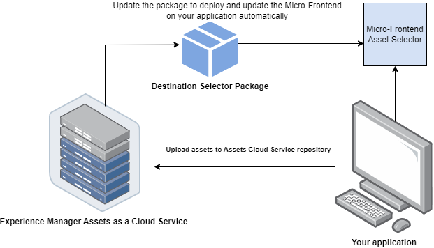
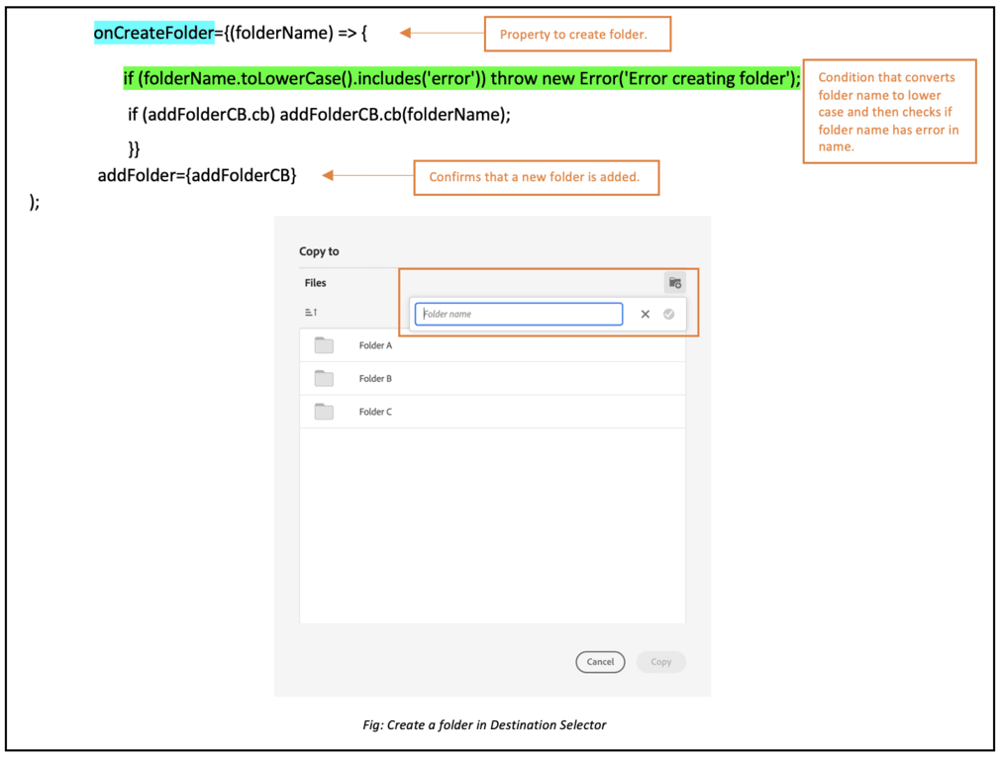
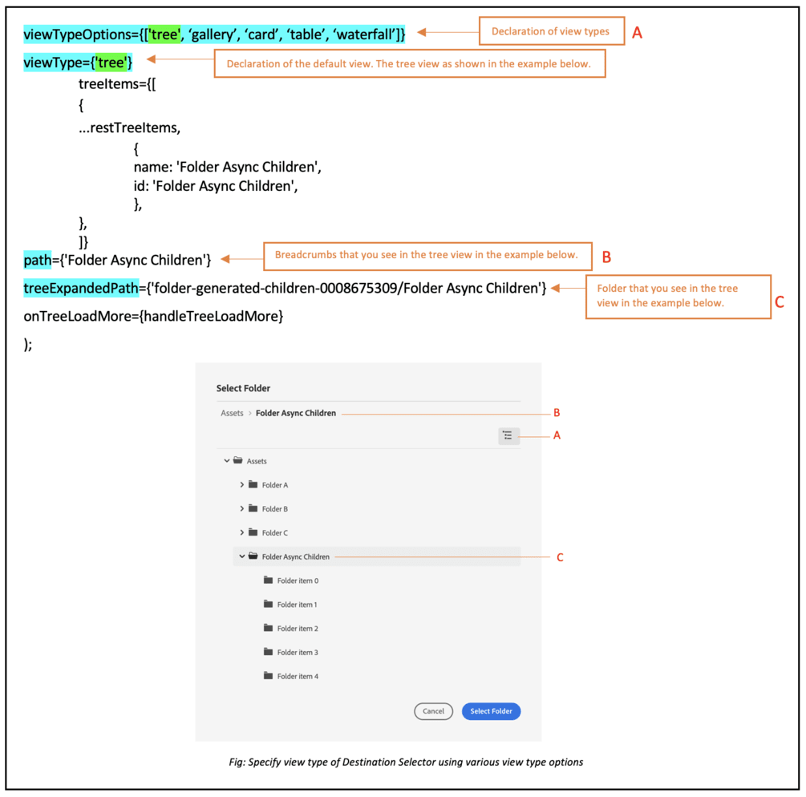
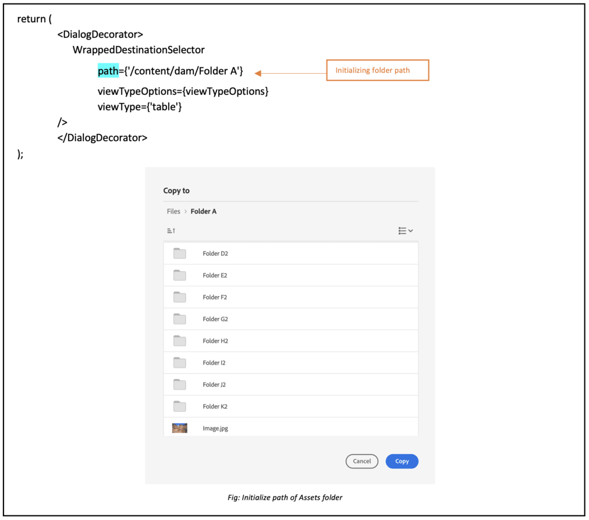
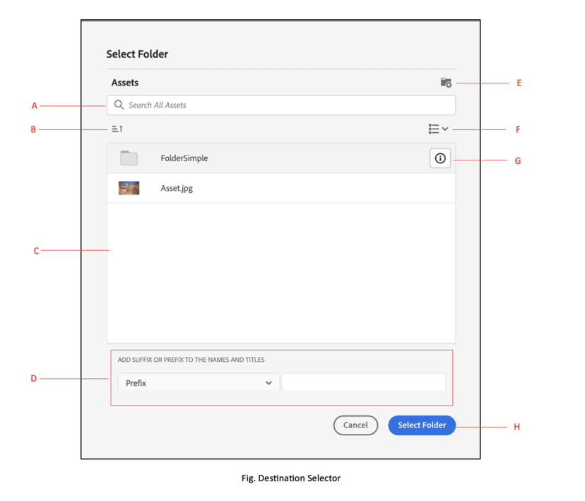

# Micro-Frontend Destination Selector {#Overview}

| [Search Best Practices](/help/assets/search-best-practices.md) |[Metadata Best Practices](/help/assets/metadata-best-practices.md)|[Content Hub](/help/assets/product-overview.md)|[Dynamic Media with OpenAPI capabilities](/help/assets/dynamic-media-open-apis-overview.md)|[AEM Assets developer documentation](https://developer.adobe.com/experience-cloud/experience-manager-apis/)|
| ------------- | --------------------------- |---------|----|-----|

Micro-Frontend Destination Selector provides a user interface within your application that easily integrates with the [!DNL Experience Manager Assets as a Cloud Service] repository. You can search or browse to the appropriate folder within the [!DNL Experience Manager Assets as a Cloud Service] repository and upload assets from your application.

The Micro-Frontend user interface is made available in your application experience using the Destination Selector package. Any updates to the package are automatically imported and the latest deployed Destination Selector loads automatically within your application.



Destination Selector provides many benefits, such as:

* Ease of integration with any of the Adobe or non-Adobe applications using Vanilla JavaScript library.
* Easy to maintain as updates to the Destination Selector package are automatically deployed to the Destination Selector available for your application. There are no updates required within your application to load the latest modifications.
* Ease of customization as there are properties available that control the Destination Selector display within your application.
* Full-text search to quickly navigate to folders to upload assets from your application.
* Ability to create folders, sort folders in ascending or descending order, and view them in List, Grid, Gallery, or Waterfall view.

The scope of this article is to demonstrate how to use Destination Selector with an [!DNL Adobe] application under Unified Shell or when you already have an imsToken generated for authentication. These workflows are referred to as non-SUSI flow in this article.

Perform the following tasks to integrate and use Destination Selector with your [!DNL Experience Manager Assets as a Cloud Service] repository:

* [Integrate Destination Selector using Vanilla JS](#integration-with-vanilla-js)
* [Define Destination Selector display properties](#destination-selector-properties)
* [Use Destination Selector](#using-destination-selector)

## Integrate Destination Selector using Vanilla JS {#integration-with-vanilla-js}

You can integrate any [!DNL Adobe] or non-Adobe application with [!DNL Experience Manager Assets] as a [!DNL Cloud Service] repository and select assets from within the application. 

The integration is done by importing the Destination Selector package and connecting to the Assets as a Cloud Service using the Vanilla JavaScript library. You must edit an `index.html` or any appropriate file within your application to -

* Define the authentication details
* Access the Assets as a Cloud Service repository
* Configure the Destination Selector display properties

You can perform authentication without defining some of the IMS properties, if:

* You are integrating an [!DNL Adobe] application on [Unified Shell](https://experienceleague.adobe.com/docs/experience-manager-cloud-service/content/overview/aem-cloud-service-on-unified-shell.html?lang=en).
* You already have an IMS token generated for authentication.

## Prerequisites {#prerequisites}

Define the prerequisites in the `index.html` file or a similar file within your application implementation to define the authentication details to access the [!DNL Experience Manager Assets] as a [!DNL Cloud Service] repository. The prerequisites include:

* imsOrg
* imsToken
* apikey

## Installation {#installation}

Destination Selector is available via both ESM CDN (For example, [esm.sh](https://esm.sh/)/[skypack](https://www.skypack.dev/)) and [UMD](https://github.com/umdjs/umd) version.

In browsers using **UMD version** (recommended):

In browsers using **UMD version** (recommended):

```
<script src="https://experience.adobe.com/solutions/CQ-assets-selectors/static-assets/resources/assets-selectors.js"></script>

<script>
  const { renderAssetSelector } = PureJSSelectors;
</script>

```

In browsers with `import maps` support using **ESM CDN version**:

```
<script type="module">
  import { AssetSelector } from 'https://experience.adobe.com/solutions/CQ-assets-selectors/static-assets/resources/@assets/selectors/index.js'
</script>

```

In Deno/Webpack Module Federation using **ESM CDN version**:

```
import { AssetSelector } from 'https://experience.adobe.com/solutions/CQ-assets-selectors/static-assets/resources/@assets/selectors/index.js'

```

### Selected Destination {#selected-destination}

Destination Selector receives a callback from `onItemSelect`, `onTreeToggleItem`, or `onTreeSelectionChange` with the selected directory that contains the object (directory, image, and so on).

**Schema Syntax**

```
interface SelectedDestination {
  id: string;
  children: SelectedDestination[];
  'repo:repositoryId': string;
  'dc:format': string;
  'repo:assetClass': string;
  'storage:directoryType': string;
  'storage:region': string;
  'repo:name': string;
  'repo:path': string;
  'repo:ancestors': string[];
  'repo:createDate': string;
  'storage:assignee':

  { type: string; id: string; }
  ;
  'repo:assetId': string;
  'aem:published': boolean;
  'repo:createdBy': string;
  'repo:state': string;
  'repo:id': string;
  'repo:modifyDate': string;
  _page:

  { orderBy: string; count: number; };
}
```

The following table describes some of the important properties of the selected destination.

| Property | Type | Explanation |
|---|---|---|
| *repo:repositoryId* | string | Unique identifier for the repository where the asset is stored. |
| *repo:id*| string | Unique identifier for the asset. |
| *repo:assetClass* | string | The classification of the asset (For example, image, or video, document). |
| *repo:name*| string | The name of the asset, including the file extension. |
| *repo:size*| number| The size of the asset in bytes.|
| *repo:path*| string | The location of the asset within the repository. |
| *repo:ancestors*| `Array<string>`| An array of ancestor items for the asset in the repository. |
| *repo:state*| string | Current state of the asset in the repository (For example, active, deleted, and so on). |
| *repo:createdBy*| string | The user or system that created the asset. |
| *repo:createDate* | string | The date and time when the asset was created. |
| *repo:modifiedBy* | string | The user or system that last modified the asset. |
| *repo:modifyDate* | string| The date and time when the asset was last modified. |
| *dc:format*| string | The format of the asset.|
| *_page* | orderBy: string; count: number; | Includes page number of the document.|

For a complete list of properties and detailed example, visit [Destination Selector Code Example](https://github.com/adobe/aem-assets-selectors-mfe-examples).

### Example for the non-SUSI flow {#non-ims-vanilla}

This example demonstrates how to use Destination Selector with a non-SUSI flow when running an [!DNL Adobe] application under Unified Shell or when you already have `imsToken` generated for authentication.

Include the Destination Selector package in your code using the `script` tag, as shown in _lines 6&ndash;15_ of the example below. After the script is loaded, the `PureJSSelectors` global variable is available for use. Define the Destination Selector [properties](#destination-selector-properties) as shown in _lines 16&ndash;23_. The `imsOrg` and `imsToken` properties are both required for authentication in non-SUSI flow. The `handleSelection` property is used to handle the selected assets. To render the Destination Selector, call the `renderDestinationSelector` function as mentioned in _line 17_. The Destination Selector is displayed in the `<div>` container element, as shown in _lines 21 and 22_.

By following these steps, you can use Destination Selector with a non-SUSI flow in your [!DNL Adobe] application.

```html {line-numbers="true"}
<!DOCTYPE html>
<html>
<head>
    <title>Destination Selector</title>
    <script src="https://experience.adobe.com/solutions/CQ-assets-selectors/assets/resources/assets-selectors.js"></script>
    <script>
        // get the container element in which we want to render the DestinationSelector component
        const container = document.getElementById('destination-selector-container');
        // imsOrg and imsToken are required for authentication in non-SUSI flow
        const destinationSelectorProps = {
            imsOrg: 'example-ims@AdobeOrg',
            imsToken: "example-imsToken",
            apiKey: "example-apiKey-associated-with-imsOrg",
            handleSelection: (assets: SelectedAssetType[]) => {},
        };
        // Call the `renderDestinationSelector` available in PureJSSelectors globals to render DestinationSelector
        PureJSSelectors.renderDestinationSelector(container, destinationselectorprops);
    </script>
</head>

<body>
    <div id="destination-selector-container" style="height: calc(100vh - 80px); width: calc(100vw - 60px); margin: -20px;">
    </div>
</body>

</html>
```

For detailed example, visit [Destination Selector Code Example](https://github.com/adobe/aem-assets-selectors-mfe-examples).

## Use Destination Selector properties {#destination-selector-properties}

You can use the Destination Selector properties to customize the way the Destination Selector is rendered. The following table lists the properties that you can use to customize and use the Destination Selector:

| Property | Type | Required | Default | Description |
|---|---|---|---|---|
| *imsOrg*| string | Yes | | Adobe Identity Management System (IMS) ID that is assigned while provisioning [!DNL Adobe Experience Manager] as a [!DNL Cloud Service] for your organization. The `imsOrg` key is required to authenticate whether the organization you are accessing is under Adobe IMS or not. |
| *imsToken* | string | No | | IMS bearer token used for authentication. `imsToken` is not required if you are using the SUSI flow. However, it is required if you are using the non-SUSI flow. |
| *apiKey* | string | No | | API key used for accessing the AEM Discovery service. `apiKey` is not required if you are using the SUSI flow. However, it is required in non-SUSI flow. |
| *rootPath* | string | No | /content/dam/ | Folder path from which Destination Selector displays your assets. `rootPath` can also be used in the form of encapsulation. For example, given the following path, `/content/dam/marketing/subfolder/`, Destination Selector does not allow you to traverse through any parent folder, but only displays the children folders. |
| *hasMore* | boolean | No | | When the application has more content to display, you can use this property to add a loader that loads the content to make it visible in the application. It is an indicator that states that content loading is in progress. |
| *orgName* | boolean | No | | It is the name of org (probably orgID) associated with AEM |
| *initRepoID* | string | No | | It is the path of assets repository that you want to use in a default initial view  |
| *onCreateFolder* | string | No | | The `onCreateFolder` property lets you add icon that adds a new folder in the application. |
| *onConfirm* | string | No | | It is a callback when you hit the confirm button. |
| *confirmDisabled* | string | No | | This property controls the toggle of the confirm button. |
| *viewType* | string | No | | The `viewType` property is used to specify the views that you use to display assets.  |
| *viewTypeOptions* | string | No | | This property is related with `viewType` property. you can specify one or more views to display assets. Available viewTypeOptions are: List view, Grid view, Gallery view, Waterfall view, and Tree view. |
| *itemNameFormatter* | string | No | | This property lets you format the item name |
| *i18nSymbols* | `Object<{ id?: string, defaultMessage?: string, description?: string}>` | No |  | If the OOTB translations are insufficient for your application's needs, you can expose an interface through which you can pass your own custom localized values through the `i18nSymbols` prop. Passing a value through this interface overrides the default translations provided and instead use your own.  To perform the override, you must pass a valid [Message Descriptor](https://formatjs.io/docs/react-intl/api/#message-descriptor) object to the key of `i18nSymbols` that you want to override. |
| *inlineAlertSetup* | string | No | | It adds an alert message that you want to pass in the application. For example, adding an alert message that You do not have permission to access this folder.  |
| *intl* | Object | No  | | Destination Selector provides default, OOTB translations. You can select the translation language by providing a valid locale string through the `intl.locale` prop. For example: `intl={{ locale: "es-es" }}` </br></br> The locale strings supported follow the [ISO 639 - Codes](https://www.iso.org/iso-639-language-codes.html) for the representation of names of languages standards. </br></br> List of supported locales: English - 'en-us' (default) Spanish - 'es-es' German - 'de-de' French - 'fr-fr' Italian - 'it-it' Japanese - 'ja-jp' Korean - 'ko-kr' Portuguese - 'pt-br' Chinese (Traditional) - 'zh-cn' Chinese (Taiwan) - 'zh-tw' |

## Examples to use Destination Selector properties {#usage-examples}

You can define the Destination Selector [properties](#destination-selector-properties) in the `index.html` file to customize the Destination Selector display within your application.

### Example 1: Create a folder in Destination Selector

Destination Selector lets you create a folder to upload, move, or copy assets at the particular location.

   

### Example 2: Specify view type of Destination Selector

Destination Selector displays a wide array of assets in four different views including List view, Grid view, Gallery view, and Waterfall view. To specify default view type, you can use `viewType` property. The `viewTypeOptions` property is used along with `viewType` property to stipulate other view types so that other view type options can be displayed in a drop-down. A single argument can be used in case you want just one option to display.



### Example 3: Initialize path of Assets Folder

Use the `path` property to define the folder name that displays automatically when the Destination Selector is rendered.



## Using Destination Selector {#using-destination-selector}

Once the Destination Selector is set up and you are authenticated to use Destination Selector with your [!DNL Adobe Experience Manager] as a [!DNL Cloud Service] application, you can select assets or perform various other operations to search for your assets within the repository.

   

* **A**: [Search bar](#search-bar)
* **B**: [Sorting](#sorting)
* **C**: [Assets](#assets-repo)
* **D**: [Add suffix or prefix](#add-suffix-or-prefix)
* **E**: [Create new folder](#create-new-folder)
* **F**: [View](#types-of-view)
* **G**: [Info](#info)
* **H**: [Select folder](#select-folder)

### Search bar {#search-bar}

Destination Selector lets you perform full text search of assets within the selected repository. For example, if you type the keyword `wave` in the search bar, all the assets with the `wave` keyword mentioned in any of the metadata properties are displayed.

### Sorting {#sorting}

You can sort assets in Destination Selector by name, dimension, or size of an asset. You can also sort the assets in ascending or descending order.

### Assets Repository {#assets-repo}

Destination Selector also lets you view data of repository of your choice available in the AEM application. You can use `repositoryID` property to initialize the path of destination folder that you want to view at the first instance of Destination Selector.

### Add Suffix or Prefix {#add-suffix-or-prefix}

It is an example of the `optionsFormSetup` property. You can use this to confirm the selection, it is passed on the `onConfirm` event. 

### Create a folder {#create-new-folder}

It lets you create a folder in the destination folder of your [!DNL Adobe Experience Manager] as a [!DNL Cloud Service].

### Types of view {#types-of-view}

Destination Selector lets you view the asset in four different views:

*  [!UICONTROL **List View**]: The list view displays scrollable files and folders in a single column.
*  [!UICONTROL **Grid View**]: The grid view displays scrollable files and folders in a grid of rows and columns.
*  [!UICONTROL **Gallery View**]: The gallery view displays files or folders in a center-locked horizontal list.
*  [!UICONTROL **Waterfall View**]: The waterfall view displays files or folders in the form of a Bridge.

### Info {#info}

The information or info icon lets you view metadata of the selected asset. It includes various details such as dimensions, size, description, path, date modified, and date created. The metadata information is provided while uploading or copying or creating an asset.

### Select folder {#select-folder}

The Select folder button lets you select assets for perform various operations associated to [properties](#destination-selector-properties) on destination selector.
