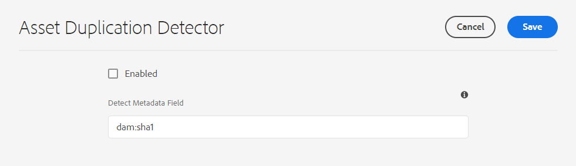

# Detect duplicate assets {#detect-duplicate-assets}

| [Search Best Practices](/help/assets/search-best-practices.md) |[Metadata Best Practices](/help/assets/metadata-best-practices.md)|[Content Hub](/help/assets/product-overview.md)|[Dynamic Media with OpenAPI capabilities](/help/assets/dynamic-media-open-apis-overview.md)|[AEM Assets developer documentation](https://developer.adobe.com/experience-cloud/experience-manager-apis/)|
| ------------- | --------------------------- |---------|----|-----|

| Version | Article link |
| -------- | ---------------------------- |
| AEM 6.5  |    [Click here](https://experienceleague.adobe.com/docs/experience-manager-65/assets/managing/duplicate-detection.html?lang=en)                  |
| AEM as a Cloud Service     | This article         |

If a DAM user uploads one or more assets that already exist in the repository, [!DNL Experience Manager] detects the duplication and notifies the user. Duplicate detection is disabled by default as it can have performance impact depending on size of repository and number of assets uploaded.

To enable the feature:

1. Navigate to **[!UICONTROL Tools > Assets > Assets Configurations]**.

1. Click **[!UICONTROL Asset Duplication Detector]**.

1. On the [!UICONTROL Asset Duplication Detector page], click **[!UICONTROL Enabled]**.

   `dam:sha1` value for the Detect Metadata field ensures that duplicate assets are detected even if the filenames are different.

1. Click **[!UICONTROL Save]**.

   

>[!NOTE]
>
>If you have configured Duplication Detector using `/apps/example/config.author/com.adobe.cq.assetcompute.impl.assetprocessor.AssetDuplicationDetector.cfg.json` configuration file (OSGi configuration), you can continue to use it, however, Adobe recommends using the new method.
 

Once enabled, Experience Manager sends notifications of duplicate assets to the Experience Manager Inbox. It is an aggregated result for multiple duplicates. Users can choose to remove the assets based on the results.

>[!NOTE]
>
>When you upload assets to the repository, Experience Manager detects duplication and notifies you about the first 100 duplicate assets.
