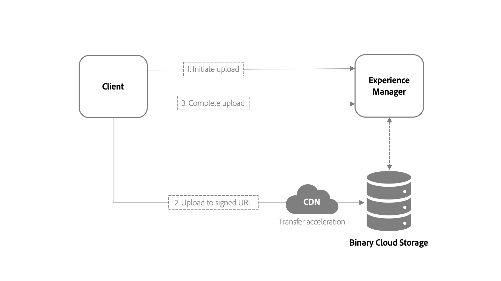

# [!DNL Adobe Experience Manager Assets] developer use cases, APIs, and reference material {#assets-cloud-service-apis}

<table>
    <tr>
        <td>
            <sup style= "background-color:#008000; color:#FFFFFF; font-weight:bold"><i>New</i></sup> <a href="/help/assets/dynamic-media/dm-prime-ultimate.md"><b>Dynamic Media Prime and Ultimate</b></a>
        </td>
        <td>
            <sup style= "background-color:#008000; color:#FFFFFF; font-weight:bold"><i>New</i></sup> <a href="/help/assets/assets-ultimate-overview.md"><b>AEM Assets Ultimate</b></a>
        </td>
        <td>
            <sup style= "background-color:#008000; color:#FFFFFF; font-weight:bold"><i>New</i></sup> <a href="/help/assets/integrate-aem-assets-edge-delivery-services.md"><b>AEM Assets integration with Edge Delivery Services</b></a>
        </td>
        <td>
            <sup style= "background-color:#008000; color:#FFFFFF; font-weight:bold"><i>New</i></sup> <a href="/help/assets/aem-assets-view-ui-extensibility.md"><b>UI Extensibility</b></a>
        </td>
          <td>
            <sup style= "background-color:#008000; color:#FFFFFF; font-weight:bold"><i>New</i></sup> <a href="/help/assets/dynamic-media/enable-dynamic-media-prime-and-ultimate.md"><b>Enable Dynamic Media Prime and Ultimate</b></a>
        </td>
    </tr>
    <tr>
        <td>
            <a href="/help/assets/search-best-practices.md"><b>Search Best Practices</b></a>
        </td>
        <td>
            <a href="/help/assets/metadata-best-practices.md"><b>Metadata Best Practices</b></a>
        </td>
        <td>
            <a href="/help/assets/product-overview.md"><b>Content Hub</b></a>
        </td>
        <td>
            <a href="/help/assets/dynamic-media-open-apis-overview.md"><b>Dynamic Media with OpenAPI capabilities</b></a>
        </td>
        <td>
            <a href="https://developer.adobe.com/experience-cloud/experience-manager-apis/"><b>AEM Assets developer documentation</b></a>
        </td>
    </tr>
</table>

The article contains recommendations, reference materials, and resources for developers of [!DNL Assets] as a [!DNL Cloud Service]. It includes new asset upload module, API reference, and information about the support provided in post-processing workflows.

## [!DNL Experience Manager Assets] APIs and operations {#use-cases-and-apis}

[!DNL Assets] as a [!DNL Cloud Service] provides several APIs to programmatically interact with digital assets. Each API supports specific use cases, as mentioned in the table below. The [!DNL Assets] user interface, [!DNL Experience Manager] desktop app and [!DNL Adobe Asset Link] support all or some of the operations.

>[!CAUTION]
>
>Some APIs continue to exist but are not actively supported (denoted with an &times;). To the extent possible, do not use these APIs.

| Support level |         Description         |
| ------------- | --------------------------- |
| &#10003;      | Supported                   |
| &times;       | Not supported. Do not use.  |
| -             | Not available               |

| Use case | [aem-upload](https://github.com/adobe/aem-upload) | [Experience Manager / Sling / JCR](https://www.adobe.io/experience-manager/reference-materials/cloud-service/javadoc/index.html) Java APIs | [Asset compute service](https://experienceleague.adobe.com/docs/asset-compute/using/extend/understand-extensibility.html) | [[!DNL Assets] HTTP API](https://experienceleague.adobe.com/docs/experience-manager-cloud-service/assets/admin/mac-api-assets.html#create-an-asset) | Sling [GET](https://sling.apache.org/documentation/bundles/rendering-content-default-get-servlets.html) / [POST](https://sling.apache.org/documentation/bundles/manipulating-content-the-slingpostservlet-servlets-post.html) servlets | [GraphQL](https://experienceleague.adobe.com/docs/experience-manager-learn/getting-started-with-aem-headless/graphql/overview.html) |
| ----------------|:---:|:---:|:---:|:---:|:---:|:---:|
| **Original binary** |||||||
| Create original    |&#10003;|&times;|-|&times;|&times;|-|
| Read original      |-|&times;|&#10003;|&#10003;|&#10003;|-|
| Update original    |&#10003;|&times;|&#10003;|&times;|&times; |-|
| Delete original    |-|&#10003;|-|&#10003;|&#10003;|-|
| Copy original      |-|&#10003;|-|&#10003;|&#10003;|-|
| Move original      |-|&#10003;|-|&#10003;|&#10003;|-|
| **Metadata** |||||||
| Create metadata    |-|&#10003;|&#10003;|&#10003;|&#10003;|-|
| Read metadata      |-|&#10003;|-|&#10003;|&#10003;|-|
| Update metadata    |-|&#10003;|&#10003;|&#10003;|&#10003;|-|
| Delete metadata    |-|&#10003;|&#10003;|&#10003;|&#10003;|-|
| Copy metadata      |-|&#10003;|-|&#10003;|&#10003;|-|
| Move metadata      |-|&#10003;|-|&#10003;|&#10003;|-|
| **Content Fragments (CF)** |||||||
| Create CF          |-|&#10003;|-|&#10003;|-|-|
| Read CF            |-|&#10003;|-|&#10003;|-|&#10003;|
| Update CF          |-|&#10003;|-|&#10003;|-|-|
| Delete CF          |-|&#10003;|-|&#10003;|-|-|
| Copy CF            |-|&#10003;|-|&#10003;|-|-|
| Move CF            |-|&#10003;|-|&#10003;|-|-|
| **Versions** |||||||
| Create version     |&#10003;|&#10003;|-|-|-|-|
| Read version       |-|&#10003;|-|-|-|-|
| Delete version     |-|&#10003;|-|-|-|-|
| **Folders** |||||||
| Create folder      |&#10003;|&#10003;|-|&#10003;|-|-|
| Read folder        |-|&#10003;|-|&#10003;|-|-|
| Delete folder      |&#10003;|&#10003;|-|&#10003;|-|-|
| Copy folder        |&#10003;|&#10003;|-|&#10003;|-|-|
| Move folder        |&#10003;|&#10003;|-|&#10003;|-|-|

## Asset upload {#asset-upload}

In [!DNL Experience Manager] as a [!DNL Cloud Service], you can directly upload the assets to the cloud storage using HTTP API. The steps to upload a binary file are below. Execute these steps in an external application and not within the [!DNL Experience Manager] JVM.

1. [Submit an HTTP request](#initiate-upload). It informs [!DNL Experience Manage]r deployment of your intent to upload a new binary.
1. [PUT the contents of the binary](#upload-binary) to one or more URIs provided by the initiation request.
1. [Submit an HTTP request](#complete-upload) to inform the server that the contents of the binary were successfully uploaded.



>[!IMPORTANT]
>
>Execute the above steps in an external application and not within the [!DNL Experience Manager] JVM.

The approach provides a scalable and more performant handling of asset uploads. The differences as compared to [!DNL Experience Manager] 6.5 are:

* Binaries do not go through [!DNL Experience Manager], which is now simply coordinating the upload process with the binary cloud storage configured for the deployment.
* Binary cloud storage works with a Content Delivery Network (CDN) or Edge network. A CDN selects an upload endpoint that is nearer for a client. When data travels a shorter distance to a nearby endpoint, the upload performance and user experience improve, especially for geographically distributed teams.

>[!NOTE]
>
>See the client code to implement this approach in the open-source [aem-upload library](https://github.com/adobe/aem-upload).
>
>[!IMPORTANT]
>
>In certain circumstances, changes may not fully propagate between requests to Experience Manager due to eventually consistent nature of the storage in Cloud Service. This leads to 404 responses to initiate or complete upload calls due to the requisite folder creations not being propagated. Clients should expect 404 responses and handle them by implementing a retry with a back-off strategy.

### Initiate upload {#initiate-upload}

Submit an HTTP POST request to the desired folder. Assets are created or updated in this folder. Include the selector `.initiateUpload.json` to indicate that the request is to initiate upload of a binary file. For example, the path to the folder where the asset should be created is `/assets/folder`. The POST request is `POST https://[aem_server]:[port]/content/dam/assets/folder.initiateUpload.json`.

The content type of the request body should be `application/x-www-form-urlencoded` form data, containing the following fields:

* `(string) fileName`: Required. The name of the asset as it appears in [!DNL Experience Manager].
* `(number) fileSize`: Required. The file size, in bytes, of the asset being uploaded.

A single request can be used to initiate uploads for multiple binaries, as long as each binary contains the required fields. If successful, the request responds with a `201` status code and a body containing JSON data in the following format:

```json
{
    "completeURI": "(string)",
    "folderPath": "(string)",
    "files": [
        {
            "fileName": "(string)",
            "mimeType": "(string)",
            "uploadToken": "(string)",
            "uploadURIs": [
                "(string)"
            ],
            "minPartSize": (number),
            "maxPartSize": (number)
        }
    ]
}
```

* `completeURI` (string): Call this URI when the binary finishes uploading. The URI can be an absolute or relative URI, and clients should be able to handle either. That is, the value can be `"https://[aem_server]:[port]/content/dam.completeUpload.json"` or `"/content/dam.completeUpload.json"` See [complete upload](#complete-upload).
* `folderPath` (string): Full path to the folder in which the binary is uploaded.
* `(files)` (array): A list of elements whose length and order match the length and order of the list of binary information provided in the initiate request.
* `fileName` (string): The name of the corresponding binary, as supplied in the initiate request. This value should be included in the complete request.
* `mimeType` (string): The mime type of the corresponding binary, as supplied in the initiate request. This value should be included in the complete request.
* `uploadToken` (string): An upload token for the corresponding binary. This value should be included in the complete request.
* `uploadURIs` (array): A list of strings whose values are full URIs to which the binary's content should be uploaded (see [Upload binary](#upload-binary)).
* `minPartSize` (number): The minimum length, in bytes, of data that may be provided to any one of the `uploadURIs`, if there is more than one URI.
* `maxPartSize` (number): The maximum length, in bytes, of data that may be provided to any one of the `uploadURIs`, if there is more than one URI.

### Upload binary {#upload-binary}

The output of initiating an upload includes one or more upload URI values. If more than one URI is provided, the client may split the binary into parts and make PUT requests of each part to the provided upload URIs, in order. If you choose to split the binary into parts, adhere to the following guidelines:

* Each part, with the exception of the last, must be of a size greater than or equal to `minPartSize`.
* Each part must be of a size less than or equal to `maxPartSize`.
* If the size of your binary exceeds `maxPartSize`, split the binary into parts to upload it.
* You are not required to use all URIs.

If the size of your binary is less than or equal to `maxPartSize`, you may instead upload the entire binary to a single upload URI. If more than one upload URI is provided, use the first one and ignore the rest. You are not required to use all URIs.

CDN edge nodes help accelerate the requested upload of binaries.

The easiest way to accomplish this is to use the value of `maxPartSize` as your part size. The API contract guarantees that there are sufficient upload URIs to upload your binary if you use this value as your part size. To do this, split the binary into parts of size `maxPartSize`, using one URI for each part, in order. The final part can be of any size less than or equal to `maxPartSize`. For example, assume the total size of the binary is 20,000 bytes, the `minPartSize` is 5,000 bytes, `maxPartSize` is 8,000 bytes, and the number of upload URIs is 5. Execute the following steps:

* Upload the first 8,000 bytes of the binary using the first upload URI.
* Upload the second 8,000 bytes of the binary using the second upload URI.
* Upload the last 4,000 bytes of the binary using the third upload URI. Since this is the final part, it does not need to be larger than `minPartSize`.
* You do not need to use the last two upload URIs. You can ignore them.

A common error is to calculate the part size based on the number of upload URIs provided by the API. The API contract does not guarantee that this approach works, and may actually result in part sizes that are outside the range between `minPartSize` and `maxPartSize`. This can result in binary upload failures.

Again, the easiest and safest way is to simply use parts of size equal to `maxPartSize`.

If the upload is successful, the server responds to each request with a `201` status code.

>[!NOTE]
>
>For more information about the upload algorithm, see the [official feature documentation](https://jackrabbit.apache.org/oak/docs/features/direct-binary-access.html#Upload) and [API documentation](https://jackrabbit.apache.org/oak/docs/apidocs/org/apache/jackrabbit/api/binary/BinaryUpload.html) in the Apache Jackrabbit Oak project.

### Complete upload {#complete-upload}

After all the parts of a binary file are uploaded, submit an HTTP POST request to the complete URI provided by the initiation data. The content type of the request body should be `application/x-www-form-urlencoded` form data, containing the following fields.

|Fields | Type | Required or not | Description |
|---|---|---|---|
| `fileName` | String | Required | The name of the asset, as was provided by the initiation data. |
| `mimeType` | String | Required | The HTTP content type of the binary, as was provided by the initiation data. |
| `uploadToken` | String | Required | Upload token for the binary, as was provided by the initiation data. |
| `createVersion` | Boolean | Optional | If `True` and an asset with the specified name exists, then [!DNL Experience Manager] creates a new version of the asset. |
| `versionLabel` | String | Optional | If a new version is created, the label associated with the new version of an asset . |
| `versionComment` | String | Optional | If a new version is created, the comments associated with the version. |
| `replace` | Boolean | Optional | If `True` and an asset with the specified name exists, [!DNL Experience Manager] deletes the asset then re-create it. |
| `uploadDuration` | Number | Optional | The total amount of time, in milliseconds, for the file to upload in its entirety. If specified, the upload duration is included in the system's log files for transfer rate analysis. |
| `fileSize` | Number | Optional | The size, in bytes, of the file. If specified, the file size is included in the system's log files for transfer rate analysis. |

>[!NOTE]
>
>If the asset exists and neither `createVersion` nor `replace` is specified, then [!DNL Experience Manager] updates the asset's current version with the new binary.

Like the initiate process, the complete request data may contain information for more than one file.

The process of uploading a binary is not done until the complete URL is invoked for the file. An asset is processed after the upload process is complete. Processing does not start even if the asset's binary file is uploaded completely but upload process is not completed. If upload is successful, the server responds with a `200` status code.

### Example Shell Script to upload assets to AEM as a Cloud Service {#upload-assets-shell-script}

The multistep upload process for direct binary access within AEM as a Cloud Service is illustrated in the following example shell-script `aem-upload.sh`:

```bash
#!/bin/bash

# Check if pv is installed
if ! command -v pv &> /dev/null; then
    echo "Error: 'pv' command not found. Please install it before running the script."
    exit 1
fi

# Check if jq is installed
if ! command -v jq &> /dev/null; then
    echo "Error: 'jq' command not found. Please install it before running the script."
    exit 1
fi

# Set DEBUG to true to enable debug statements
DEBUG=true

# Function for printing debug statements
function debug() {
    if [ "${DEBUG}" = true ]; then
        echo "[DEBUG] $1"
    fi
}

# Function to check if a file exists
function file_exists() {
    [ -e "$1" ]
}

# Function to check if a path is a directory
function is_directory() {
    [ -d "$1" ]
}

# Check if the required number of parameters are provided
if [ "$#" -ne 4 ]; then
    echo "Usage: $0 <aem-url> <asset-folder> <file-to-upload> <bearer-token>"
    exit 1
fi

AEM_URL="$1"
ASSET_FOLDER="$2"
FILE_TO_UPLOAD="$3"
BEARER_TOKEN="$4"

# Extracting file name or folder name from the file path
NAME=$(basename "${FILE_TO_UPLOAD}")

# Step 1: Check if "file-to-upload" is a folder
if is_directory "${FILE_TO_UPLOAD}"; then
    echo "Uploading files from the folder recursively..."
    
    # Recursively upload files in the folder
    find "${FILE_TO_UPLOAD}" -type f | while read -r FILE_PATH; do
        FILE_NAME=$(basename "${FILE_PATH}")
        debug "Uploading file: ${FILE_PATH}"
        
        # You can choose to initiate upload for each file here
        # For simplicity, let's assume you use the same ASSET_FOLDER for all files
        ./aem-upload.sh "${AEM_URL}" "${ASSET_FOLDER}" "${FILE_PATH}" "${BEARER_TOKEN}"
    done
else
    # "file-to-upload" is a single file
    FILE_NAME="${NAME}"

    # Step 2: Calculate File Size
    FILE_SIZE=$(stat -c %s "${FILE_TO_UPLOAD}")

    # Step 3: Initiate Upload
    INITIATE_UPLOAD_ENDPOINT="${AEM_URL}/content/dam/${ASSET_FOLDER}.initiateUpload.json"

    debug "Initiating upload..."
    debug "Initiate Upload Endpoint: ${INITIATE_UPLOAD_ENDPOINT}"
    debug "File Name: ${FILE_NAME}"
    debug "File Size: ${FILE_SIZE}"

    INITIATE_UPLOAD_RESPONSE=$(curl -X POST \
        -H "Authorization: Bearer ${BEARER_TOKEN}" \
        -H "Content-Type: application/x-www-form-urlencoded; charset=UTF-8" \
        -d "fileName=${FILE_NAME}" \
        -d "fileSize=${FILE_SIZE}" \
        ${INITIATE_UPLOAD_ENDPOINT})

    # Continue with the rest of the script...
fi


# Check if the response body contains the specified HTML content for a 404 error
if echo "${INITIATE_UPLOAD_RESPONSE}" | grep -q "<title>404 Specified folder not found</title>"; then
    echo "Folder not found. Creating the folder..."

    # Attempt to create the folder
    CREATE_FOLDER_ENDPOINT="${AEM_URL}/api/assets/${ASSET_FOLDER}"

    debug "Creating folder..."
    debug "Create Folder Endpoint: ${CREATE_FOLDER_ENDPOINT}"

    CREATE_FOLDER_RESPONSE=$(curl -X POST \
        -H "Content-Type: application/json" \
        -H "Authorization: Bearer ${BEARER_TOKEN}" \
        -d '{"class":"'${ASSET_FOLDER}'","properties":{"title":"'${ASSET_FOLDER}'"}}' \
        ${CREATE_FOLDER_ENDPOINT})

    # Check the response code and inform the user accordingly
    STATUS_CODE_CREATE_FOLDER=$(echo "${CREATE_FOLDER_RESPONSE}" | jq -r '.properties."status.code"')
    case ${STATUS_CODE_CREATE_FOLDER} in
        201)
            echo "Folder created successfully. Initiating upload again..."

            # Retry Initiate Upload after creating the folder
            INITIATE_UPLOAD_RESPONSE=$(curl -X POST \
                -H "Authorization: Bearer ${BEARER_TOKEN}" \
                -H "Content-Type: application/x-www-form-urlencoded; charset=UTF-8" \
                -d "fileName=${FILE_NAME}" \
                -d "fileSize=${FILE_SIZE}" \
                ${INITIATE_UPLOAD_ENDPOINT})
            ;;
        409)
            echo "Error: Folder already exists."
            ;;
        412)
            echo "Error: Precondition failed. Root collection cannot be found or accessed."
            exit 1
            ;;
        500)
            echo "Error: Internal Server Error. Something went wrong."
            exit 1
            ;;
        *)
            echo "Error: Unexpected response code ${STATUS_CODE_CREATE_FOLDER}"
            exit 1
            ;;
    esac
fi

# Extracting values from the response
FOLDER_PATH=$(echo "${INITIATE_UPLOAD_RESPONSE}" | jq -r '.folderPath')
UPLOAD_URIS=($(echo "${INITIATE_UPLOAD_RESPONSE}" | jq -r '.files[0].uploadURIs[]'))
UPLOAD_TOKEN=$(echo "${INITIATE_UPLOAD_RESPONSE}" | jq -r '.files[0].uploadToken')
MIME_TYPE=$(echo "${INITIATE_UPLOAD_RESPONSE}" | jq -r '.files[0].mimeType')
MIN_PART_SIZE=$(echo "${INITIATE_UPLOAD_RESPONSE}" | jq -r '.files[0].minPartSize')
MAX_PART_SIZE=$(echo "${INITIATE_UPLOAD_RESPONSE}" | jq -r '.files[0].maxPartSize')
COMPLETE_URI=$(echo "${INITIATE_UPLOAD_RESPONSE}" | jq -r '.completeURI')

# Extracting "Affinity-cookie" from the response headers
AFFINITY_COOKIE=$(echo "${INITIATE_UPLOAD_RESPONSE}" | grep -i 'Affinity-cookie' | awk '{print $2}')

debug "Folder Path: ${FOLDER_PATH}"
debug "Upload Token: ${UPLOAD_TOKEN}"
debug "MIME Type: ${MIME_TYPE}"
debug "Min Part Size: ${MIN_PART_SIZE}"
debug "Max Part Size: ${MAX_PART_SIZE}"
debug "Complete URI: ${COMPLETE_URI}"
debug "Affinity Cookie: ${AFFINITY_COOKIE}"
if $DEBUG; then
    i=1
    for UPLOAD_URI in "${UPLOAD_URIS[@]}"; do
        debug "Upload URI $i: "$UPLOAD_URI
        i=$((i+1))
    done
fi


# Calculate the number of parts needed
NUM_PARTS=$(( (FILE_SIZE + MAX_PART_SIZE - 1) / MAX_PART_SIZE ))
debug "Number of Parts: $NUM_PARTS"

# Calculate the part size for the last chunk
LAST_PART_SIZE=$(( FILE_SIZE % MAX_PART_SIZE ))
if [ "${LAST_PART_SIZE}" -eq 0 ]; then
    LAST_PART_SIZE=${MAX_PART_SIZE}
fi

# Step 4: Upload binary to the blob store in parts
PART_NUMBER=1
for i in $(seq 1 $NUM_PARTS); do
    PART_SIZE=${MAX_PART_SIZE}
    if [ ${PART_NUMBER} -eq ${NUM_PARTS} ]; then
        PART_SIZE=${LAST_PART_SIZE}
        debug "Last part size: ${PART_SIZE}"
    fi

    PART_FILE="/tmp/${FILE_NAME}_part${PART_NUMBER}"

    # Creating part file 
    SKIP=$((PART_NUMBER - 1))
    SKIP=$((MAX_PART_SIZE * SKIP))
    dd if="${FILE_TO_UPLOAD}" of="${PART_FILE}"  bs="${PART_SIZE}" skip="${SKIP}" count="${PART_SIZE}" iflag=skip_bytes,count_bytes  > /dev/null 2>&1
    debug "Creating part file: ${PART_FILE} with size ${PART_SIZE}, skipping first ${SKIP} bytes."

    
    UPLOAD_URI=${UPLOAD_URIS[$PART_NUMBER-1]}

    debug "Uploading part ${PART_NUMBER}..."
    debug "Part Size: $PART_SIZE"
    debug "Part File: ${PART_FILE}"
    debug "Part File Size: $(stat -c %s "${PART_FILE}")"
    debug "Upload URI: ${UPLOAD_URI}"

    # Upload the part in the background
    if command -v pv &> /dev/null; then
        pv "${PART_FILE}" | curl --progress-bar -X PUT --data-binary "@-" "${UPLOAD_URI}" &
    else
        curl -# -X PUT --data-binary "@${PART_FILE}" "${UPLOAD_URI}" &
    fi

    PART_NUMBER=$((PART_NUMBER + 1))
done

# Wait for all background processes to finish
wait

# Step 5: Complete the upload in AEM
COMPLETE_UPLOAD_ENDPOINT="${AEM_URL}${COMPLETE_URI}"

debug "Completing the upload..."
debug "Complete Upload Endpoint: ${COMPLETE_UPLOAD_ENDPOINT}"

RESPONSE=$(curl -X POST \
    -H "Authorization: Bearer ${BEARER_TOKEN}" \
    -H "Content-Type: application/x-www-form-urlencoded; charset=UTF-8" \
    -H "Affinity-cookie: ${AFFINITY_COOKIE}" \
    --data-urlencode "uploadToken=${UPLOAD_TOKEN}" \
    --data-urlencode "fileName=${FILE_NAME}" \
    --data-urlencode "mimeType=${MIME_TYPE}" \
    "${COMPLETE_UPLOAD_ENDPOINT}")
    
debug $RESPONSE

echo "File upload completed successfully."
```

### Open-source upload library {#open-source-upload-library}

To learn more about the upload algorithms or to build your own upload scripts and tools, Adobe provides open-source libraries and tools:

* [Open-source aem-upload library](https://github.com/adobe/aem-upload).
* [Open-source command-line tool](https://github.com/adobe/aio-cli-plugin-aem).

>[!NOTE]
>
>The aem-upload library and the command-line tool both use the [node-httptransfer library](https://github.com/adobe/node-httptransfer/)

### Deprecated asset upload APIs {#deprecated-asset-upload-api}

<!-- #ENGCHECK review / update the list of deprecated APIs below. -->

The new upload method is supported only for [!DNL Adobe Experience Manager] as a [!DNL Cloud Service]. The APIs from [!DNL Adobe Experience Manager] 6.5 are deprecated. The methods related to upload or update assets or renditions (any binary upload) are deprecated in the following APIs:

* [Experience Manager Assets HTTP API](mac-api-assets.md)
* `AssetManager` Java API, like `AssetManager.createAsset(..)`, `AssetManager.createAssetForBinary(..)`, `AssetManager.getAssetForBinary(..)`, `AssetManager.removeAssetForBinary(..)`, `AssetManager.createOrUpdateAsset(..)`, `AssetManager.createOrReplaceAsset(..)` 

>[!MORELIKETHIS]
>
>* [Open-source aem-upload library](https://github.com/adobe/aem-upload).
>* [Open-source command-line tool](https://github.com/adobe/aio-cli-plugin-aem).
>* [Apache Jackrabbit Oak documentation for direct upload](https://jackrabbit.apache.org/oak/docs/features/direct-binary-access.html#Upload).

## Asset processing and post-processing workflows {#post-processing-workflows}

In [!DNL Experience Manager], the asset processing is based on **[!UICONTROL Processing Profiles]** configuration that uses [asset microservices](asset-microservices-configure-and-use.md#get-started-using-asset-microservices). Processing does not require developer extensions.

For post-processing workflow configuration, use the standard workflows with extensions with custom steps.

## Support of workflow steps in post-processing workflow {#post-processing-workflows-steps}

If you upgrade from a previous version of [!DNL Experience Manager], you can use asset microservices to process assets. The cloud-native asset microservices are simpler to configure and use. A few workflow steps used in the [!UICONTROL DAM Update Asset] workflow in the previous version are not supported. For more information about supported classes, see the [Java API reference or Javadocs](https://www.adobe.io/experience-manager/reference-materials/cloud-service/javadoc/index.html).

The following technical workflow models are either replaced by asset microservices or the support is not available:

* `com.day.cq.dam.cameraraw.process.CameraRawHandlingProcess`
* `com.day.cq.dam.core.process.CommandLineProcess`
* `com.day.cq.dam.pdfrasterizer.process.PdfRasterizerHandlingProcess`
* `com.day.cq.dam.core.process.AddPropertyWorkflowProcess`
* `com.day.cq.dam.core.process.CreateSubAssetsProcess`
* `com.day.cq.dam.core.process.DownloadAssetProcess`
* `com.day.cq.dam.word.process.ExtractImagesProcess`
* `com.day.cq.dam.word.process.ExtractPlainProcess`
* `com.day.cq.dam.ids.impl.process.IDSJobProcess`
* `com.day.cq.dam.indd.process.INDDMediaExtractProcess`
* `com.day.cq.dam.indd.process.INDDPageExtractProcess`
* `com.day.cq.dam.core.impl.lightbox.LightboxUpdateAssetProcess`
* `com.day.cq.dam.pim.impl.sourcing.upload.process.ProductAssetsUploadProcess`
* `com.day.cq.dam.core.process.SendDownloadAssetEmailProcess`
* `com.day.cq.dam.similaritysearch.internal.workflow.smarttags.StartTrainingProcess`
* `com.day.cq.dam.similaritysearch.internal.workflow.smarttags.TransferTrainingDataProcess`
* `com.day.cq.dam.switchengine.process.SwitchEngineHandlingProcess`
* `com.day.cq.dam.core.process.GateKeeperProcess`
* `com.day.cq.dam.s7dam.common.process.DMEncodeVideoWorkflowCompletedProcess`
* `com.day.cq.dam.core.process.DeleteImagePreviewProcess`
* `com.day.cq.dam.video.FFMpegTranscodeProcess`
* `com.day.cq.dam.core.process.ThumbnailProcess`
* `com.day.cq.dam.video.FFMpegThumbnailProcess`
* `com.day.cq.dam.core.process.CreateWebEnabledImageProcess`
* `com.day.cq.dam.core.process.CreatePdfPreviewProcess`
* `com.day.cq.dam.s7dam.common.process.VideoUserUploadedThumbnailProcess`
* `com.day.cq.dam.s7dam.common.process.VideoThumbnailDownloadProcess`
* `com.day.cq.dam.s7dam.common.process.VideoProxyServiceProcess`
* `com.day.cq.dam.scene7.impl.process.Scene7UploadProcess`
* `com.day.cq.dam.s7dam.common.process.S7VideoThumbnailProcess`
* `com.day.cq.dam.core.process.MetadataProcessorProcess`
* `com.day.cq.dam.core.process.AssetOffloadingProcess`
* `com.adobe.cq.dam.dm.process.workflow.DMImageProcess`

<!-- Commenting the previous list documented at the time of GA. Replacing it with the updated list via cqdoc-18231.

* `com.day.cq.dam.core.process.DeleteImagePreviewProcess`
* `com.day.cq.dam.s7dam.common.process.DMEncodeVideoWorkflowCompletedProcess`
* `com.day.cq.dam.core.process.GateKeeperProcess`
* `com.day.cq.dam.core.process.AssetOffloadingProcess`
* `com.day.cq.dam.core.process.MetadataProcessorProcess`
* `com.adobe.cq.dam.dm.process.workflow.DMImageProcess`
* `com.day.cq.dam.s7dam.common.process.S7VideoThumbnailProcess`
* `com.day.cq.dam.scene7.impl.process.Scene7UploadProcess`
* `com.day.cq.dam.s7dam.common.process.VideoProxyServiceProcess`
* `com.day.cq.dam.s7dam.common.process.VideoThumbnailDownloadProcess`
* `com.day.cq.dam.s7dam.common.process.VideoUserUploadedThumbnailProcess`
* `com.day.cq.dam.core.process.CreatePdfPreviewProcess`
* `com.day.cq.dam.core.process.CreateWebEnabledImageProcess`
* `com.day.cq.dam.video.FFMpegThumbnailProcess`
* `com.day.cq.dam.core.process.ThumbnailProcess`
* `com.day.cq.dam.cameraraw.process.CameraRawHandlingProcess`
* `com.day.cq.dam.core.process.CommandLineProcess`
* `com.day.cq.dam.pdfrasterizer.process.PdfRasterizerHandlingProcess`
* `com.day.cq.dam.core.process.AddPropertyWorkflowProcess`
* `com.day.cq.dam.core.process.CreateSubAssetsProcess`
* `com.day.cq.dam.core.process.DownloadAssetProcess`
* `com.day.cq.dam.word.process.ExtractImagesProcess`
* `com.day.cq.dam.word.process.ExtractPlainProcess`
* `com.day.cq.dam.video.FFMpegTranscodeProcess`
* `com.day.cq.dam.ids.impl.process.IDSJobProcess`
* `com.day.cq.dam.indd.process.INDDMediaExtractProcess`
* `com.day.cq.dam.indd.process.INDDPageExtractProcess`
* `com.day.cq.dam.core.impl.lightbox.LightboxUpdateAssetProcess`
* `com.day.cq.dam.pim.impl.sourcing.upload.process.ProductAssetsUploadProcess`
* `com.day.cq.dam.core.process.ScheduledPublishBPProcess`
* `com.day.cq.dam.core.process.ScheduledUnPublishBPProcess`
* `com.day.cq.dam.core.process.SendDownloadAssetEmailProcess`
-->

<!-- PPTX source: slide in add-assets.md - overview of direct binary upload section of
https://adobe-my.sharepoint.com/personal/gklebus_adobe_com/_layouts/15/guestaccess.aspx?guestaccesstoken=jexDC5ZnepXSt6dTPciH66TzckS1BPEfdaZuSgHugL8%3D&docid=2_1ec37f0bd4cc74354b4f481cd420e07fc&rev=1&e=CdgElS
-->

**See also**

* [Translate Assets](translate-assets.md)
* [Assets HTTP API](mac-api-assets.md)
* [Assets supported file formats](file-format-support.md)
* [Search assets](search-assets.md)
* [Connected assets](use-assets-across-connected-assets-instances.md)
* [Asset reports](asset-reports.md)
* [Metadata schemas](metadata-schemas.md)
* [Download assets](download-assets-from-aem.md)
* [Manage metadata](manage-metadata.md)
* [Search facets](search-facets.md)
* [Manage collections](manage-collections.md)
* [Bulk metadata import](metadata-import-export.md)
* [Publish Assets to AEM and Dynamic Media](/help/assets/publish-assets-to-aem-and-dm.md)

>[!MORELIKETHIS]
>
>* [[!DNL Experience Cloud] as a [!DNL Cloud Service] SDK](/help/implementing/developing/introduction/aem-as-a-cloud-service-sdk.md).