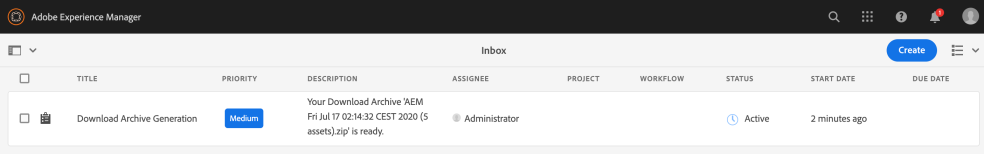

# Download assets from [!DNL Adobe Experience Manager] {#download-assets-from-aem}

You can download assets including static and dynamic renditions. Alternatively, you can send emails with links to assets directly from [!DNL Adobe Experience Manager Assets]. Downloaded assets are bundled in a ZIP file. The compressed ZIP file has a maximum file size of 1 GB for the export job. A maximum of 500 total assets per export job are allowed.

>[!NOTE]
>
>Recipients of emails must be members of the `dam-users` group to access the ZIP download link in the email message. To be able to download the assets, the members must have permissions to launch workflows that trigger downloading of assets.

The asset types Image Sets, Spin Sets, Mixed Media Sets, and Carousel Sets cannot be downloaded.

You can download Experience Manager assets using the following methods:

* [Experience Manager user interface](#download-in-aem)
* Asset Link Share user interface
* [Asset Share Commons](https://adobe-marketing-cloud.github.io/asset-share-commons/)
* [Brand Portal](https://experienceleague.adobe.com/docs/experience-manager-brand-portal/using/introduction/brand-portal.html)
* [Desktop app](https://experienceleague.adobe.com/docs/experience-manager-desktop-app/using/using.html#download-assets)

## Download assets using [!DNL Experience Manager] interface {#download-in-aem}

Asynchronous download service provides a framework for seamless download of large-sized assets. Smaller files are downloaded from the user interface in real-time. The large files are downloaded asynchronously and users are informed of the completion via Experience Manager notifications in the Inbox. See [understanding Experience Manager inbox](https://experienceleague.adobe.com/docs/experience-manager-cloud-service/sites/authoring/getting-started/inbox.html).



*Figure: Download notification via [!DNL Experience Manager] Inbox.*

Asynchronous downloads are triggered in either of the following case:

* If there are more than 10 assets or more than 100 MB to be downloaded.
* If the download takes more than 30 seconds to prepare.

To download assets, follow these steps:

1. In [!DNL Experience Manager] user interface, click **[!UICONTROL Assets]** > **[!UICONTROL Files]**.
1. Navigate to the assets you want to download. Select the folder or select one or more assets within the folder. On the toolbar, click **[!UICONTROL Download]**.

   ![Available options when downloading assets from [!DNL Experience Manager Assets]](/help/assets/assets/asset-download1.png)

   *Figure: Download dialog box options.*

1. In the Download dialog box, select the download options you want.

   | Download option | Description |
   |---|---|
   | **[!UICONTROL Create separate folder for each asset]** | Select this option to include each asset you download&ndash;including assets in child folders nested under the parent folder of the asset&ndash;into one folder on your local computer. When this option is *not* select, by default, the folder hierarchy is ignored and all assets are downloaded into one folder in your local computer. |
   | **[!UICONTROL Email]** | Select this option to have an email notification sent to the recipient. Standard emails templates are available at the following locations:<ul><li>`/libs/settings/dam/workflow/notification/email/downloadasset`.</li><li>`/libs/settings/dam/workflow/notification/email/transientworkflowcompleted`.</li></ul> Templates that you customize during deployment are available at the following locations: <ul><li>`/apps/settings/dam/workflow/notification/email/downloadasset`.</li><li>`/apps/settings/dam/workflow/notification/email/transientworkflowcompleted`.</li></ul>You can store tenant-specific custom templates at the following locations:<ul><li>`/conf/<tenant_specific_config_root>/settings/dam/workflow/notification/email/downloadasset`.</li><li>`/conf/<tenant_specific_config_root>/settings/dam/workflow/notification/email/transientworkflowcompleted`.</li></ul> |
   | **[!UICONTROL Asset(s)]** | Select this option to download the asset in its original form without any renditions.<br>The subassets option is available if the original asset has subassets.|
    **[!UICONTROL Rendition(s)]** | A rendition is the binary representation of an asset. Assets have a primary representation - that of the uploaded file. They can have any number of representations. <br> With this option, you can select the renditions you want downloaded. The renditions that are available depend on the asset you selected. |
   | **[!UICONTROL Smart Crops]** | Select this option to download all the smart crop renditions of the selected asset from within [!DNL Experience Manager]. A zip file with the Smart Crop renditions is created and downloaded to your local computer. |
   | **[!UICONTROL Dynamic Rendition(s)]** | Select this option to generate a series of alternate renditions in real time. When you select this option, you also select the renditions that you want to create dynamically by selecting from the [Image Preset](/help/assets/dynamic-media/image-presets.md) list. <br>In addition, you can select the size and unit of measurement, format, color space, resolution, and any optional image modifiers such as inverting the image. The option is only available if you have [!DNL Dynamic Media] enabled.|

1. In the dialog box, click **[!UICONTROL Download]**.

## Enable asset download servlet {#enable-asset-download-servlet}

The default servlet in [!DNL Experience Manager] allows authenticated users to issue arbitrarily-large, concurrent download requests to create ZIP files of assets. The download preparation can have performance implications or can even overload the server and the network. To mitigate such potential DoS-like risks caused by this feature, `AssetDownloadServlet` OSGi component is disabled for publish instances.

To allow downloading assets from your DAM, say when using something like Asset Share Commons or other portal-like implementation, manually enable the servlet via an OSGi configuration. Adobe recommends setting the permissible download size as low as possible without affecting the day-to-day download requirements. A high value may impact performance.

1. Create a folder with a naming convention that targets the publish runmode, that is, `config.publish`:

   `/apps/<your-app-name>/config.publish`

1. In the config folder, create a new file of type `nt:file` named `com.day.cq.dam.core.impl.servlet.AssetDownloadServlet.config`.
1. Populate `com.day.cq.dam.core.impl.servlet.AssetDownloadServlet.config` with the following. Sets a maximum size (in bytes) for the download as value of `asset.download.prezip.maxcontentsize`. The below sample configures the maximum size of the ZIP download to not exceed 100 kB.

   ```java
   enabled=B"true"
   asset.download.prezip.maxcontentsize=I"102400"
   ```

## Disable asset download servlet {#disable-asset-download-servlet}

The `Asset Download Servlet` can be disabled on an [!DNL Experience Manager] Publish instances by updating the dispatcher configuration to block any asset download requests. The servlet can also be manually disabled via the OSGi console directly.

1. To block asset download requests via a dispatcher configuration edit the `dispatcher.any` configuration and add a new rule to the [filter section](https://experienceleague.adobe.com/docs/experience-manager-dispatcher/using/configuring/dispatcher-configuration.html#configuring).

   `/0100 { /type "deny" /url "*.assetdownload.zip/assets.zip*" }`

>[!MORELIKETHIS]
>
>* [Download DRM protected assets](drm.md)
>* [Download assets using Experience Manager desktop app on Win or Mac desktop](https://helpx.adobe.com/experience-manager/desktop-app/aem-desktop-app.html)
>* [Download assets using Adobe Assets Link from within the supported Adobe Creative Cloud apps](https://helpx.adobe.com/enterprise/using/manage-assets-using-adobe-asset-link.html)
