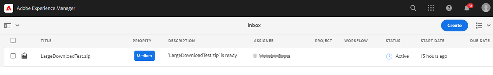

# Download assets from [!DNL Adobe Experience Manager] {#download-assets-from-aem}

| [Search Best Practices](/help/assets/search-best-practices.md) |[Metadata Best Practices](/help/assets/metadata-best-practices.md)|[Content Hub](/help/assets/product-overview.md)|[Dynamic Media with OpenAPI capabilities](/help/assets/dynamic-media-open-apis-overview.md)|[AEM Assets developer documentation](https://developer.adobe.com/experience-cloud/experience-manager-apis/)|
| ------------- | --------------------------- |---------|----|-----|

| Version | Article link |
| -------- | ---------------------------- |
| AEM 6.5  |    [Click here](https://experienceleague.adobe.com/docs/experience-manager-65/assets/managing/download-assets-from-aem.html?lang=en)                  |
| AEM as a Cloud Service     | This article         |

You can download assets including static and dynamic renditions. Alternatively, you can send emails with links to assets directly from [!DNL Adobe Experience Manager Assets]. Downloaded assets are bundled in a ZIP file. <!-- The compressed ZIP file has a maximum file size of 1 GB for the export job. A maximum of 500 total assets per export job are allowed. -->

<!--
>[!NOTE]
>
>Recipients of emails must be members of the `dam-users` group to access the ZIP download link in the email message. To be able to download the assets, the members must have permissions to launch workflows that trigger downloading of assets.
-->

The following asset types cannot be downloaded: Image Sets, Spin Sets, Mixed Media Sets, and Carousel Sets.

You can download assets from Experience Manager using the following methods:

<!-- * [Link Share](#link-share-download) -->

* [Experience Manager user interface](#download-assets)
* [Asset Share Commons](https://adobe-marketing-cloud.github.io/asset-share-commons/)
* [Brand Portal](https://experienceleague.adobe.com/docs/experience-manager-brand-portal/using/introduction/brand-portal.html)
* [Desktop app](https://experienceleague.adobe.com/docs/experience-manager-desktop-app/using/using.html#download-assets)

## Download assets using [!DNL Experience Manager] interface {#download-assets}

Experience Manager optimizes the download experience based on the asset quantity and size. Smaller files are downloaded from the user interface in real time. [!DNL Experience Manager] directly downloads single asset requests for the original file rather than enclosing single assets in a ZIP archive to allow for faster downloads. Experience Manager supports large downloads with asynchronous requests. Download requests larger than 100 GB are split into multiple ZIP archives with a maximum size of 100 MB each. 

By default, [!DNL Experience Manager] triggers a notification in the [[!DNL Experience Manager] Inbox](/help/sites-cloud/authoring/inbox.md) upon generation of a download archive.




### Enable email notifications for large downloads {#enable-emails-for-large-downloads}

Asynchronous downloads are triggered in any of the following cases:

* If there are more than ten assets 
* If the download size is more than 100 MB
* If the download takes more than 30 seconds to prepare

While the asynchronous download runs at the backend, the user can continue to explore and work further in Experience Manager. In addition to the Experience Manager inbox notifications, Experience Manager can send emails to notify the user upon completion of the download process. To enable this feature, the administrators can configure email service by [configuring an SMTP server connection](https://experienceleague.adobe.com/docs/experience-manager-cloud-service/content/implementing/developing/development-guidelines.html#sending-email).

Once the email service is configured, the administrators and users can enable email notifications from the Experience Manager interface. 

To enable email notifications:

1. Log in to [!DNL Experience Manager Assets].
1. Click the user icon from the upper-right corner and then click **[!UICONTROL My Preferences]** to open the User Preferences window.
1. Select the **[!UICONTROL Asset Download email notifications]** checkbox and click **[!UICONTROL Accept]**.

   


To download assets, follow these steps:

1. In [!DNL Experience Manager] user interface, click **[!UICONTROL Assets]** > **[!UICONTROL Files]**.
1. Navigate to the assets that you want to download. Select the folder or select one or more assets within the folder. On the toolbar, click **[!UICONTROL Download]**.

   ![Available options when downloading assets from [!DNL Experience Manager Assets]](/help/assets/assets/asset-download1.png)

1. In the download dialog box, select the download options that you want.

   | Download option | Description |
   |---|---|
   | **[!UICONTROL Create separate folder for each asset]** | Select this option to create a folder for each asset containing all downloaded renditions for the asset. If unselected, each asset (and its renditions if selected for download) is contained in the parent folder of the generated archive. |
   | **[!UICONTROL Email]** | Select this option to send an email notification (containing a link to your download) to another user. The recipient user must be a member of the `dam-users` group. Standard emails templates are available at the following locations:<ul><li>`/libs/settings/dam/workflow/notification/email/downloadasset`.</li><li>`/libs/settings/dam/workflow/notification/email/transientworkflowcompleted`.</li></ul> Templates that you customize during deployment are available at the following locations: <ul><li>`/apps/settings/dam/workflow/notification/email/downloadasset`.</li><li>`/apps/settings/dam/workflow/notification/email/transientworkflowcompleted`.</li></ul>You can store tenant-specific custom templates at the following locations:<ul><li>`/conf/<tenant_specific_config_root>/settings/dam/workflow/notification/email/downloadasset`.</li><li>`/conf/<tenant_specific_config_root>/settings/dam/workflow/notification/email/transientworkflowcompleted`.</li></ul> |
   | **[!UICONTROL Asset(s)]** | Select this option to download the asset in its original form.<br>The subassets option is available if the original asset has subassets.|
   | **[!UICONTROL Rendition(s)]** | A rendition is the binary representation of an asset. Assets have a primary representation - that of the uploaded file. They can have any number of representations. <br> With this option, you can select the renditions you want downloaded. The renditions that are available depend on the asset you selected. |
   | **[!UICONTROL Smart Crops]** | Select this option to download all the smart crop renditions of the selected asset from within [!DNL Experience Manager]. A zip file with the Smart Crop renditions is created and downloaded to your local computer. |
   | **[!UICONTROL Dynamic Rendition(s)]** | Select this option to generate a series of alternate renditions in real time. When you select this option, you also select the renditions that you want to create dynamically by selecting from the [Image Preset](/help/assets/dynamic-media/image-presets.md) list. <br>In addition, you can select the size and unit of measurement, format, color space, resolution, and any optional image modifiers such as inverting the image. The option is only available if you have [!DNL Dynamic Media] enabled.|

1. In the dialog box, click **[!UICONTROL Download]**.

   If email notification is enabled for large downloads, an email containing a download URL of the archived zip folder appears in your inbox. Click the download link from the email to download the zip archive.

   

   You can also view the notification in your [!DNL Experience Manager] Inbox.

   

## Download assets shared using link sharing {#link-share-download}

Sharing assets using a link is a convenient way to make it available to interested people without them having to log in to [!DNL Assets]. See [Link Share functionality](/help/assets/share-assets.md#sharelink). 

When users download assets from shared links, [!DNL Assets] uses an asynchronous service that offers faster and uninterrupted downloads. The assets to be downloaded are queued in the background in an inbox into ZIP archives of manageable file size. For larger downloads, the download is chunked into files of 100 GB.

The [!UICONTROL Download Inbox] displays the processing status of each archive. Once the processing is complete, you can download the archives from the inbox.


## Enable asset download servlet {#enable-asset-download-servlet}

The default servlet in [!DNL Experience Manager] allows authenticated users to issue arbitrarily large, concurrent download requests to create ZIP files of assets. The download preparation can have performance implications or can even overload the server and the network. To mitigate such potential DoS-like risks caused by this feature, `AssetDownloadServlet` OSGi component is disabled for publish instances. If you do not need the download feature on author instances, disable the servlet on author.

To allow downloading assets from your DAM, say when using something like Asset Share Commons or other portal-like implementation, manually enable the servlet via an OSGi configuration. Adobe recommends setting the permissible download size as low as possible without affecting the day-to-day download requirements. A high value may impact performance.

1. Create a folder with a naming convention that targets the publish run mode, that is, `config.publish`:

   `/apps/<your-app-name>/config.publish`

1. In the config folder, create a file of type `nt:file` named `com.day.cq.dam.core.impl.servlet.AssetDownloadServlet.config`.
1. Populate `com.day.cq.dam.core.impl.servlet.AssetDownloadServlet.config` with the following. Sets a maximum size (in bytes) for the download as value of `asset.download.prezip.maxcontentsize`. The below sample configures the maximum size of the ZIP download to not exceed 100 KB.

   ```java
   enabled=B"true"
   asset.download.prezip.maxcontentsize=I"102400"
   ```

## Disable asset download servlet {#disable-asset-download-servlet}

If you do not need the download functionality, then disable the servlet to prevent any DoS-like risks. The `Asset Download Servlet` can be disabled on an [!DNL Experience Manager] author and publish instances by updating the dispatcher configuration to block any asset download requests. The servlet can also be manually disabled via the OSGi console directly.

1. To block asset download requests via a dispatcher configuration edit the `dispatcher.any` configuration and add a new rule to the [filter section](https://experienceleague.adobe.com/docs/experience-manager-dispatcher/using/configuring/dispatcher-configuration.html#configuring).

   `/0100 { /type "deny" /url "*.assetdownload.zip/assets.zip*" }`

## OnTime or OffTime rendition {#on-off-time-rendition}

To enable the `OnOffTimeAssetAccessFilter` service, you need to create an OSGi configuration. This service allows the blocking of access to renditions and metadata in addition to the asset itself based on on/off time settings. The OSGi configuration should be for `com.day.cq.dam.core.impl.servlet.OnOffTimeAssetAccessFilter`. Follow the steps below:

1. In your project code in Git, create a configuration file at `/apps/system/config/com.day.cq.dam.core.impl.servlet.OnOffTimeAssetAccessFilter.cfg.json`. The file should contain `{}` as its content, signifying an empty OSGi configuration for the corresponding OSGi component. This action enables the service.
1. Deploy your code, including this new configuration, through [!DNL Cloud Manager].
1. Once deployed, the renditions and metadata are accessible according to the on/off time settings of the assets. If the current date or time falls before the on-time or after the off-time, an error message is displayed.
For more details on adding an empty OSGi configuration, see this [guide](https://experienceleague.adobe.com/docs/experience-manager-cloud-service/content/implementing/deploying/configuring-osgi.html?lang=en).

## Tips and limitations {#tips-limitations}

* If you download an empty folder, [!DNL Experience Manager] conveys a success message about creating a ZIP archive, but the archive is not created.

**See also**

* [Translate Assets](translate-assets.md)
* [Assets HTTP API](mac-api-assets.md)
* [Assets supported file formats](file-format-support.md)
* [Search assets](search-assets.md)
* [Connected assets](use-assets-across-connected-assets-instances.md)
* [Asset reports](asset-reports.md)
* [Metadata schemas](metadata-schemas.md)
* [Manage metadata](manage-metadata.md)
* [Search facets](search-facets.md)
* [Manage collections](manage-collections.md)
* [Bulk metadata import](metadata-import-export.md)
* [Publish Assets to AEM and Dynamic Media](/help/assets/publish-assets-to-aem-and-dm.md)

>[!MORELIKETHIS]
>
>* [Download DRM protected assets](drm.md)
>* [Download assets using Experience Manager desktop app on Win or Mac desktop](https://experienceleague.adobe.com/docs/experience-manager-desktop-app/using/using.html)
>* [Download assets using Adobe Assets Link from within the supported Adobe Creative Cloud apps](https://helpx.adobe.com/enterprise/using/manage-assets-using-adobe-asset-link.html)
