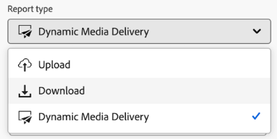
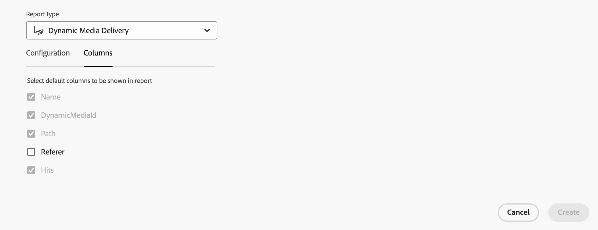
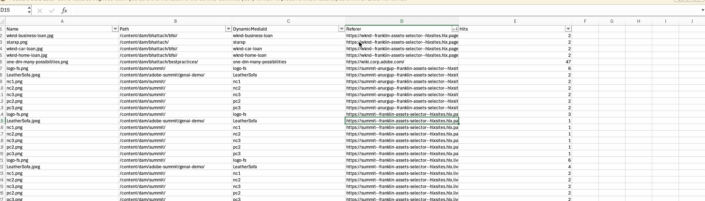

# Dynamic Media delivery reports {#dynamic-media-delivery-reports} 

Get delivery insights for assets delivered with Dynamic Media, with asset level delivery count, referer information, asset path in AEM Assets and unique asset ID. Reports can be generated for all assets delivered via the Dynamic Media for AEM Assets repository or for a specific folder hierarchy in AEM Assets. Moreover, Dynamic Media Delivery Reports insights help measure ROI of assets delivered, measure channel performance, and help take informed asset management tasks for assets.

<!--
>[!NOTE]
> 
>To get early access to the Dynamic Media Delivery Report on your Dynamic Media account, [create and submit an Adobe Customer Support case](https://helpx.adobe.com/enterprise/using/support-for-experience-cloud.html).
-->

## Prerequisites for generating Dynamic Media delivery reports {#prereqs-dynamic-media-delivery-reports}

You should have a Dynamic Media license to create and use this report.

>[!IMPORTANT]
> 
>* Reports are provided for assets delivered via Dynamic Media.
>* Reports are generated for the first 1 million rows. To capture all files within this limit, consider including the referer column for smaller folders.
>* Reports can be generated for the past 3 months only.

## Create a Dynamic Media Delivery Report in Assets view {#create-dynamic-media-delivery-report}

1. Create a Dynamic Media Delivery Report, using the steps mentioned in [Create a report](#create-report). 

1. Select **[!UICONTROL Dynamic Media Delivery]** from the **[!UICONTROL Report type]** drop-down list.

   


1. In the **[!UICONTROL Columns]** tab, you can select the **[!UICONTROL Referer]** column to include it in your report.

   

   All the columns of the downloaded report are read-only, except the **Referer** column, which you can modify to include or exclude from the report. <!--Choosing a referer displays the number of visitors received from each referred report that directs traffic to the site. It offers insights into the sources of traffic and the origin of the visitors. Such insights help measure ROI of delivered assets, measure channel performance, and help take informed asset management tasks for assets.-->

## Actions performed on Dynamic Media delivery report {#actions-performed-dynamic-media-delivery-reports}

After creating the report, you can perform the following actions:

* **[!UICONTROL Delete]**: You can delete the selected report.
* **[!UICONTROL Download CSV]**: You can download the selected report in a CSV format. The downloaded report consists of the Name, Path, DynamicMediaID, Referer, Hits columns.
    * **Referer** column lists the URL where the asset is delivered or included.

    * **Hits** column lists the number of times the asset is delivered (delivery count).

To delete or download the Dynamic Media Delivery Report as CSV, see [View and download existing report](#View-and-download-existing-report).

   

## Troubleshoot missing Referer data in Dynamic Media delivery report {#troubleshoot-missing-referer-data-dynamic-media-delivery-reports}

The **Referer** column displays the URL of the webpage from which a Dynamic Media asset request originated. The value is populated from the **Referer** request header that is sent with the asset delivery request.

If the **Referer** column is empty, review the following scenarios.

### Webpage does not send referer information {#webpage-does-not-send-referer-information}

If the webpage's **Referer-Policy** is set to `no-referer`, the browser does not send referer information with the asset request. As a result, the **Referer** column remains empty.

### Asset is accessed directly {#asset-is-accessed-directly}

The **Referer** column can also be empty when users access an asset directly, for example by:

* Entering the asset URL in the browser's address bar.
* Opening a bookmarked asset URL.
* Opening the asset URL directly.

In these scenarios, no referer information is available.

### Request comes from a non-browser client {#request-comes-from-a-non-browser-client}

Non-browser clients, such as:

* Native mobile applications
* Server-to-server requests
* Scripts
* Bots
* cURL clients

Do not automatically send the **Referer** request header. If the header is not included in the asset delivery request, the **Referer** column remains empty.

## Populate the Referer column {#populate-the-referer-column-dynamic-media-delivery-reports}

### Browser-based requests {#browser-based-requests}

Browsers automatically populate the **Referer** request header, subject to the webpage's **Referer-Policy** settings.

### Native mobile applications and server-side clients {#native-mobile-applications-and-server-side-clients}

For native mobile applications and server-side callers, explicitly include the **Referer** request header in the asset delivery request.

The following examples demonstrate how to set the **Referer** header.

#### iOS (URLSession) {#ios-urlsession}

```swift
request.setValue(
    "https://app.customer.com/<screen>",
    forHTTPHeaderField: "Referer"
)
```

##### Android (OkHttp) {#android-okhttp}

```java
Request request = new Request.Builder()
    .url(assetUrl)
    .header("Referer", "https://app.customer.com/<screen>")
    .build();
```

>[!NOTE]
>
>The examples use `https://app.customer.com/<screen>` as a placeholder value. Replace it with the appropriate URL for your application.


**See also**

* [Translate Assets](/help/assets/translate-assets.md)
* [Assets HTTP API](/help/assets/mac-api-assets.md)
* [Assets supported file formats](/help/assets/file-format-support.md)
* [Search assets](/help/assets/search-assets.md)
* [Connected assets](/help/assets/use-assets-across-connected-assets-instances.md)
* [Asset reports](/help/assets/asset-reports.md)
* [Metadata schemas](/help/assets/metadata-schemas.md)
* [Download assets](/help/assets/download-assets-from-aem.md)
* [Manage metadata](/help/assets/manage-metadata.md)
* [Manage Dynamic Media templates](/help/assets/dynamic-media/manage-dynamic-media-templates.md)
* [Search facets](/help/assets/search-facets.md)
* [Manage collections](/help/assets/manage-collections.md)
* [Bulk metadata import](/help/assets/metadata-import-export.md)
* [Publish Assets to AEM and Dynamic Media](/help/assets/publish-assets-to-aem-and-dm.md)
