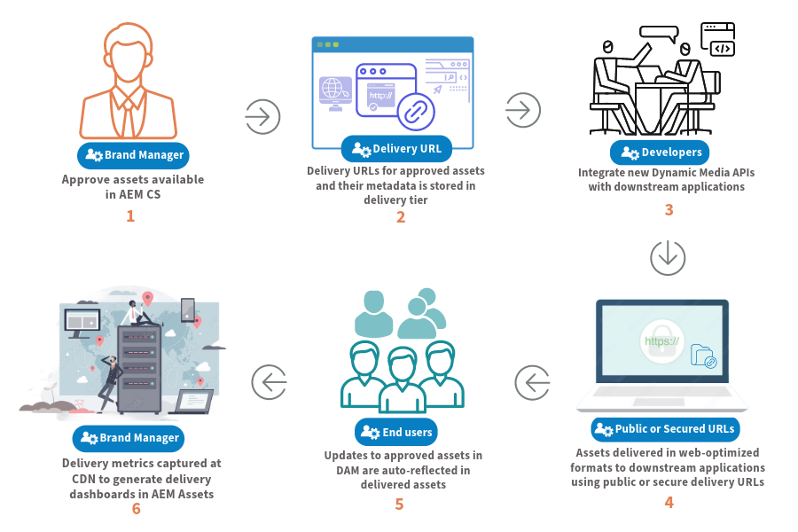
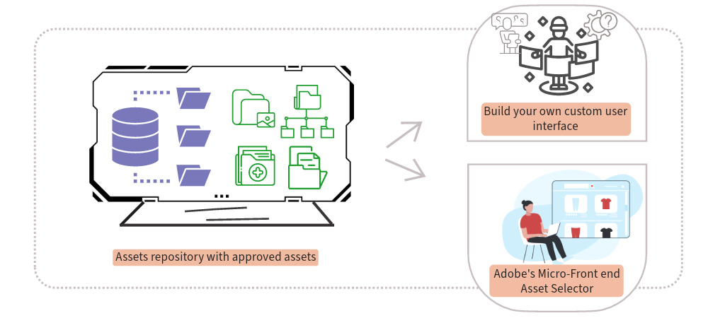
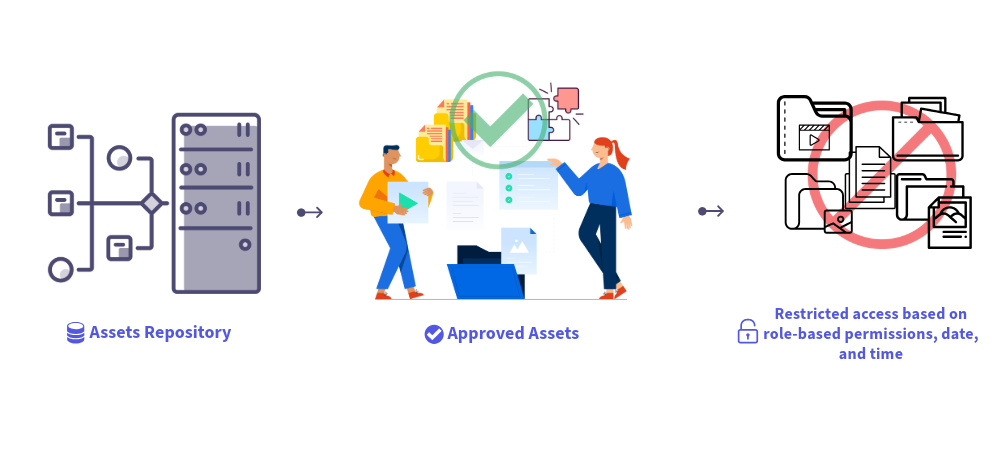
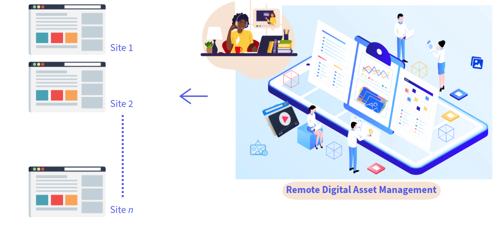

# Dynamic Media with OpenAPI capabilities {#new-dynaminc-media-apis-overview}

<table>
    <tr>
        <td>
            <i>New</i> <a href="/help/assets/dynamic-media/dm-prime-ultimate.md"><b>Dynamic Media Prime and Ultimate</b></a>
        </td>
        <td>
            <i>New</i> <a href="/help/assets/assets-ultimate-overview.md"><b>AEM Assets Ultimate</b></a>
        </td>
        <td>
            <i>New</i> <a href="/help/assets/integrate-aem-assets-edge-delivery-services.md"><b>AEM Assets integration with Edge Delivery Services</b></a>
        </td>
        <td>
            <i>New</i> <a href="/help/assets/aem-assets-view-ui-extensibility.md"><b>UI Extensibility</b></a>
        </td>
          <td>
            <i>New</i> <a href="/help/assets/dynamic-media/enable-dynamic-media-prime-and-ultimate.md"><b>Enable Dynamic Media Prime and Ultimate</b></a>
        </td>
    </tr>
    <tr>
        <td>
            <a href="/help/assets/search-best-practices.md"><b>Search Best Practices</b></a>
        </td>
        <td>
            <a href="/help/assets/metadata-best-practices.md"><b>Metadata Best Practices</b></a>
        </td>
        <td>
            <a href="/help/assets/product-overview.md"><b>Content Hub</b></a>
        </td>
        <td>
            <a href="/help/assets/dynamic-media-open-apis-overview.md"><b>Dynamic Media with OpenAPI capabilities</b></a>
        </td>
        <td>
            <a href="https://developer.adobe.com/experience-cloud/experience-manager-apis/"><b>AEM Assets developer documentation</b></a>
        </td>
    </tr>
</table>

>[!AVAILABILITY]
>
>Dynamic Media with OpenAPI capabilities guide is now available in PDF format. Download the entire guide and use Adobe Acrobat AI Assistant to answer your queries. 
>
>[!BADGE Dynamic Media with OpenAPI capabilities Guide PDF]{type=Informative url="https://helpx.adobe.com/content/dam/help/en/experience-manager/aem-assets/dynamic-media-with-openapi-capabilities.pdf"}

In today's fast-paced digital world, unlocking the full potential of your brand's digital assets is crucial for staying ahead of the competition. A holistic Digital Assets Management (DAM) solution facilitates assets governance, promotes brand consistency, and accelerates content delivery while ensuring brand integrity, and exceptional customer experiences.

Dynamic Media with OpenAPI capabilities puts DAM at the core of an agile and efficient content supply chain ecosystem to ensure asset governance and delivery.

## Why use Dynamic Media with OpenAPI capabilities? {#dynamic-media-open-api-features}

Dynamic Media with OpenAPI capabilities provides the following key benefits:

* **Seamless integrations**: Dynamic Media with OpenAPI capabilities offers a comprehensive set of search and delivery APIs. It allows your developers to easily [integrate delivery of assets with their applications](/help/assets/integrate-dynamic-media-open-apis.md). The applications include Adobe as well as third-party applications. It provides a [Micro Frontend assets selector user interface](/help/assets/overview-asset-selector.md) to search and select approved assets. The selector can be effortlessly integrated with any application based on JavaScript frameworks such as React JS, Angular JS, and Vanilla JS.

* **Centralized management of digital assets**: DAM is the single source of truth for all digital assets. Your digital assets are managed centrally in AEM Assets and delivered to consuming applications by reference using delivery URLs, without copying asset binaries. 

* **Real-time updates**: Any changes made to approved assets in DAM, including version updates and metadata modifications, are automatically reflected in the delivery URLs. With a short Time-to-Live (TTL) value of 10 minutes configured for Dynamic Media with OpenAPI capabilities via CDN, updates become visible across all authoring and published interfaces in under 10 minutes. 

* **Brand consistency**: Only [brand-approved assets](/help/assets/approve-assets.md) are exposed to downstream applications. [Brand Managers and Marketers maintain strict control over brand assets](/help/assets/restrict-assets-delivery.md). Only approved and latest version of the asset is available for use, ensuring brand consistency across all channels and applications.

* **Web-optimized delivery**: Digital assets are delivered in web-optimized formats to enhance your digital experiences' Core Web Vitals. This includes support for WebP renditions for images, adaptive streaming through HLS or DASH protocols for videos, and original renditions for documents.

* **Dynamic asset transformation**: Our system allows for on-the-fly image transformation using URL parameters known as image modifiers. [For example, width, height, rotate, flip, quality, crop, format, and smart crop](/help/assets/deliver-assets-apis.md). Transformed renditions are generated dynamically and delivered seamlessly via the CDN.

* **Secure delivery of assets**: Dynamic Media with OpenAPI capabilities provides a mechanism for control over access to your digital assets. You can specify user roles or groups as metadata for to-be-secured assets and set a predefined timeframe during which [only authorized users can access these assets](/help/assets/restrict-assets-delivery.md). The delivery URLs for secured assets do not resolve for unauthorized users during the restricted period.

* **Data insights to take informed decisions (upcoming)**: Beyond asset management and delivery, it captures delivery data insights into asset deliveries at CDN allowing Brand managers to track delivery metrics across channels. It enables them to take data-driven decisions for continuous optimization of asset governance and delivery strategies.

## Prerequisites to access Dynamic Media with OpenAPI capabilities {#prerequisites-dynaminc-media-open-apis}

To access Dynamic Media with OpenAPI capabilities, you must have licences for:

* AEM Assets as a Cloud Service

* AEM Dynamic Media

## How to enable the Dynamic Media with OpenAPI capabilities? {#enable-dynamic-media-open-apis}

Before submitting a request to enable Dynamic Media with OpenAPI capabilities on AEM as a Cloud Service, ensure that it is not already enabled. 

Once the [Prerequisites](#prerequisites-dynaminc-media-open-apis) are met and if Dynamic Media with OpenAPI capabilities is enabled on your AEM as a Cloud Service instance, there is a Delivery URL available for each approved asset in the repository. For information on how to copy delivery URL, see [Copy delivery URL for approved assets](approve-assets.md#copy-delivery-url-approved-assets) . Adobe recommends using this method to verify that Dynamic Media with OpenAPI capabilities is enabled on AEM as a Cloud Service before submitting a support ticket to enable it.

To enable Dynamic Media with OpenAPI capabilities on AEM as a Cloud Service, submit an Adobe Support ticket with the following details:

* Cloud Services program and environment ID 

* Details of the use case to solve with Dynamic Media with OpenAPI capabilities integration.

* Details of the downstream application(s) to integrate with Dynamic Media with OpenAPI capabilities.

   >[!NOTE]
   >
   > To integrate with a non-Adobe application, provide domain names to allow list where the application is hosted.

* Details of key customer contacts involved in integration project.

* List of key Adobe account team members (email).

Once you submit the support ticket, Adobe enables Dynamic Media with OpenAPI capabilities on your Cloud Services environment and share the details, such as IMS Client ID, for you to proceed with the integration.

>[!NOTE]
>
>Exclude `/conf/global/settings/dam/assets-configurations/assetdelivery` from any content package, to avoid deactivation of Dynamic Media with OpenAPI capabiities.

## Dive more into key capabilities {#learn-more-key-capabilities}

<table>
<td>
   
   

      <a href="/help/assets/approve-assets.md">
      <strong>Approve assets in Experience Manager Assets</strong>
      </a>
   

   

      <em>Approve assets in AEM Assets to streamline asset management, ensuring a controlled and efficient process for handling assets.</em>
   

</td>
<td>
   
   

      <a href="/help/assets/integrate-dynamic-media-open-apis.md">
      <strong>Integrate AEM Assets with downstream applications</strong>
      </a>
   

   

      <em>Integrate your own custom user interface with the Experience Manager Assets repository using the Search and Delivery APIs or use Adobe's Micro-Frontend Asset Selector.</em>
   

</td>
<td>
   
   

      <a href="/help/assets/overview-asset-selector.md">
      <strong>Adobe's Micro-Frontend Asset Selector</strong>
      </a>
   

   

      <em>A user interface that interacts with AEM Assets repository to search assets and then use them in your application authoring experience.</em>
   

</td>
</table>
<table>

<table>
<td>
   
   

      <a href="/help/assets/search-assets-api.md">
      <strong>Search assets in Experience Manager Assets repository</strong>
      </a>
   

   

      <em>Search assets in AEM Assets repository so that they can delivered to downstream applications.</em>
   

</td>
<td>
   
   

      <a href="/help/assets/deliver-assets-apis.md">
      <strong>Deliver assets to downstream applications</strong>
      </a>
   

   

      <em>Deliver assets to integrated downstream applications using a Delivery URL.</em>
   

</td>
<td>
   
   

      <a href="/help/assets/restrict-assets-delivery.md">
      <strong>Restrict access to assets in Experience Manager</strong>
      </a>
   

   

      <em> DAM Admin or Brand Managers restrict the access by configuring roles for approved assets on the AEM as a Cloud Service author instance.</em>
   

</td>

</table>
<table>
<td>
   
   

      <a href="/help/assets/integrate-remote-approved-assets-with-sites.md">
      <strong>Integrate remote AEM Assets with AEM Sites</strong>
      </a>
   

   

      <em>Learn how to integrate remote AEM Assets with AEM Sites environment. </em>
   

</td>
<td>
   
   

      <a href="/help/assets/dynamic-media-open-apis-faqs.md">
      <strong>Dynamic Media with OpenAPI capabilities frequently asked questions</strong>
      </a>
   

   

      <em>Get a response to the most asked Dynamic Media with OpenAPI capabilities frequently asked questions.</em>
   

</td>
<td>
   
   

      <a href="/help/assets/configure-custom-domain.md">
      <strong>Configure custom domain</strong>
      </a>
   

   

      <em>While AEM as a Cloud Service comes with a default domain, you can customize it as per your needs.</em>
   

</td>

</table>
