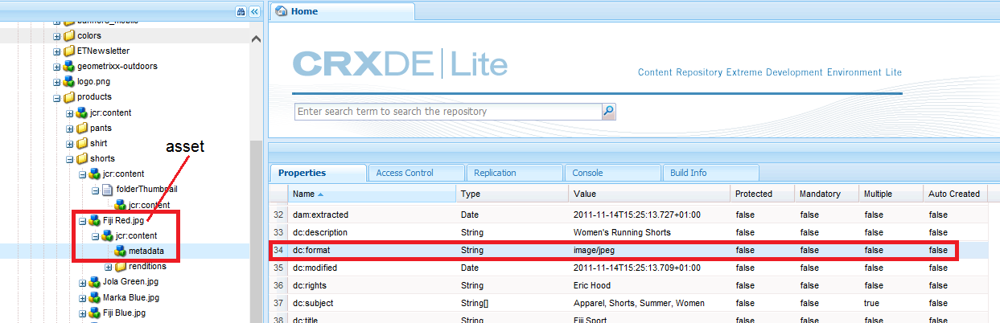

# About configuring Dynamic Media Cloud Service {#configuring-dynamic-media}

<table>
    <tr>
        <td>
            <i>New</i> <a href="/help/assets/dynamic-media/dm-prime-ultimate.md"><b>Dynamic Media Prime and Ultimate</b></a>
        </td>
        <td>
            <i>New</i> <a href="/help/assets/assets-ultimate-overview.md"><b>AEM Assets Ultimate</b></a>
        </td>
        <td>
            <i>New</i> <a href="/help/assets/integrate-aem-assets-edge-delivery-services.md"><b>AEM Assets integration with Edge Delivery Services</b></a>
        </td>
        <td>
            <i>New</i> <a href="/help/assets/aem-assets-view-ui-extensibility.md"><b>UI Extensibility</b></a>
        </td>
          <td>
            <i>New</i> <a href="/help/assets/dynamic-media/enable-dynamic-media-prime-and-ultimate.md"><b>Enable Dynamic Media Prime and Ultimate</b></a>
        </td>
    </tr>
    <tr>
        <td>
            <a href="/help/assets/search-best-practices.md"><b>Search Best Practices</b></a>
        </td>
        <td>
            <a href="/help/assets/metadata-best-practices.md"><b>Metadata Best Practices</b></a>
        </td>
        <td>
            <a href="/help/assets/product-overview.md"><b>Content Hub</b></a>
        </td>
        <td>
            <a href="/help/assets/dynamic-media-open-apis-overview.md"><b>Dynamic Media with OpenAPI capabilities</b></a>
        </td>
        <td>
            <a href="https://developer.adobe.com/experience-cloud/experience-manager-apis/"><b>AEM Assets developer documentation</b></a>
        </td>
    </tr>
</table>

{{work-with-dynamic-media}}

If you use Adobe Experience Manager as a Cloud Service for different environments, such as development, staging, and live production, configure Dynamic Media Cloud Services for each of those environments.

See also [Configure a Dynamic Media company alias account](/help/assets/dynamic-media/dm-alias-account.md)

## Architecture diagram of Dynamic Media {#architecture-diagram-of-dynamic-media}

The following architecture diagram describes how Dynamic Media works.

With the new architecture, Experience Manager is responsible for primary source assets and syncs with Dynamic Media for asset processing and publishing:

1. When the primary source asset is uploaded to Adobe Experience Manager as a Cloud Service, it is replicated to Dynamic Media. At that point, Dynamic Media handles all asset processing and rendition generation, such as video encoding and dynamic variants of an image.
1. After the renditions are generated, Experience Manager as a Cloud Service can securely access and preview the remote Dynamic Media renditions (no binaries are sent back to the Experience Manager as a Cloud Service instance).
1. After content is ready to publish and approve, it triggers the Dynamic Media service to push content to delivery servers and cache content at the CDN (Content Delivery Network).

>[!NOTE]
>
>The following list of features requires you to use the out-of-the-box CDN that is bundled with Adobe Experience Manager - Dynamic Media. Any other custom CDN is not supported with these features.
>
>* [Smart Imaging](/help/assets/dynamic-media/imaging-faq.md)
>* [Cache invalidation](/help/assets/dynamic-media/invalidate-cdn-cache-dynamic-media.md)
>* [Hotlink protection](/help/assets/dynamic-media/hotlink-protection.md)
>* [HTTP/2 delivery of content](/help/assets/dynamic-media/http2faq.md)
>* URL redirect at the CDN level
>* Akamai ChinaCDN (for optimal delivery in China)

<!-- OBSOLETE CONTENT

## (Optional) Migrating Dynamic Media presets and configurations from 6.3 to 6.5 Zero Downtime {#optional-migrating-dynamic-media-presets-and-configurations-from-to-zero-downtime}

If you are upgrading Experience Manager as a Cloud Service Dynamic Media from 6.3 to 6.4 or 6.5 (which now includes the ability for zero downtime deployments), you are required to run the following curl command to migrate all your presets and configurations from `/etc` to `/conf` in CRXDE Lite.

>[!NOTE]
>
>If you run your Experience Manager as a Cloud Service instance in compatibility mode--that is, you have the compatibility packaged installed--you do not need to run these commands.

For all upgrades, either with or without the compatibility package, you can copy the default, out-of-the-box viewer presets that originally came with Dynamic Media by running the following Linux curl command:

`curl -u admin:admin -X POST https://<server_address>:<server_port>/libs/settings/dam/dm/presets/viewer.pushviewerpresets.json`

To migrate any custom viewer presets and configurations that you have created from `/etc` to `/conf`, run the following Linux curl command:

`curl -u admin:admin -X POST https://<server_address>:<server_port>/libs/settings/dam/dm/presets.migratedmcontent.json`

-->

## Create a Dynamic Media Configuration in Cloud Services {#configuring-dynamic-media-cloud-services}

<!-- **Before you creating a Dynamic Media Configuration in Cloud Services**: After you receive your provisioning email with Dynamic Media credentials, you must open the [Dynamic Media Classic desktop application](https://experienceleague.adobe.com/docs/dynamic-media-classic/using/getting-started/signing-out.html#getting-started), then sign in to your account to change your password. The password provided in the provisioning email is system-generated and intended to be a temporary password only. It is important that you update the password so that Dynamic Media Cloud Service is set up with the correct credentials. -->

1. In Experience Manager as a Cloud Service, select the Experience Manager as a Cloud Service logo to access the global navigation console.
1. On the left of the console, select the Tools icon, then go to **[!UICONTROL Cloud Services > Dynamic Media Configuration]**.
1. On the Dynamic Media Configuration Browser page, in the left pane, select **[!UICONTROL global]** (do not select the folder icon to the left of **[!UICONTROL global]**). Then select **[!UICONTROL Create]**.
1. On the **[!UICONTROL Create Dynamic Media Configuration]** page, enter the title, Dynamic Media account email address, and password of the company administrator of the Dynamic Media account, then select your region. This information is provided to you by Adobe in the provisioning email. Contact Adobe Customer Support if you did not receive this email. 
1. Select **[!UICONTROL Connect to Dynamic Media]**.
1. In the **[!UICONTROL Change Password]** dialog box, in the **[!UICONTROL New Password]** field, enter a new password that consists of 8-25 characters. The password must contain at least one of each of the following:

      * Uppercase letter
      * Lowercase letter
      * Number
      * Special character: `# $ & . - _ : { }`

      The **[!UICONTROL Current Password]** field is intentionally pre-filled and hidden from interaction.

      If necessary, you can check the spelling of a password you have typed or retyped by selecting the password eye icon to reveal the password. Select the icon again to hide the password.

1. In the **[!UICONTROL Repeat Password]** field, retype the new password, then select **[!UICONTROL Done]**.

   The new password is saved when you select **[!UICONTROL Save]** in the upper-right corner of the **[!UICONTROL Create Dynamic Media Configuration]** page.

   If you selected **[!UICONTROL Cancel]** in the **[!UICONTROL Change Password]** dialog box, you must still enter a new password when you save the created Dynamic Media configuration.
  
   See also [Change the password to Dynamic Media](#change-dm-password).

1. When the connection is successful, you can set the following:

   | Property | Description |
   |---|---|
   | Company | The name of the Dynamic Media account. **Important**: Only one Dynamic Media Configuration in Cloud Services is supported on an instance of Experience Manager; do not add more than one configuration. Multiple Dynamic Media Configurations on an Experience Manager instance is _not_ supported or recommended by Adobe.<!-- CQDOC-19579 and CQDOC-19612 --> See also [Configure a Dynamic Media company alias account](/help/assets/dynamic-media/dm-alias-account.md). |
   | Company Root Folder Path | Your company's root folder path. |
   | Publishing Assets | You can choose from the following three options: **[!UICONTROL Immediately]** - When assets are uploaded, the system ingests the assets and provides the URL/Embed instantly. There is no user intervention necessary to publish assets. **[!UICONTROL On Activation]** - You must explicitly publish the asset first before a URL/Embed link is provided. **[!UICONTROL Selective Publish]** - Assets are auto published for secure preview only. They can also be explicitly published to Experience Manager as a Cloud Service without publishing to DMS7 for delivery in the public domain. In the future, this option intends to publish assets to Experience Manager as a Cloud Service and publish assets to Dynamic Media, mutually exclusive of each other. That is, you can publish assets to DMS7 so you can use features such a Smart Crop or dynamic renditions. Or, you can publish assets exclusively in Experience Manager as a Cloud Service for previewing; those same assets are not published in DMS7 for delivery in the public domain. |
   | Secure Preview Server | Lets you specify the URL path to your secure renditions preview server. That is, after renditions are generated, Experience Manager as a Cloud Service can securely access and preview the remote Dynamic Media renditions (no binaries are sent back to the Experience Manager as a Cloud Service instance). Unless you have a special arrangement to use your own company's server or a special server, Adobe recommends that you leave this setting as specified. |
   | Sync all content | Selected by default. Deselect this option if you want to selectively include or exclude assets from the sync to Dynamic Media. Deselecting this option lets you can choose from the following two Dynamic Media sync modes: **[!UICONTROL Dynamic Media sync mode]** **[!UICONTROL Enable by default]** - The configuration is applied to all folders by default unless you mark a folder specifically for exclusion. <!-- you can then deselect the folders that you do not want the configuration applied to.--> **[!UICONTROL Disabled by default]** - The configuration is not applied to any folder until you explicitly mark a selected folder for sync to Dynamic Media. To mark a selected folder for sync to Dynamic Media, select an asset folder, then in the toolbar, select **[!UICONTROL Properties]**. On the **[!UICONTROL Details]** tab, in the **[!UICONTROL Dynamic Media sync mode]** drop-down list, choose from the following three options. When you are done, select **[!UICONTROL Save]**. _Remember: these three options are not available if you selected **Sync all content** earlier._ See also [Work with Selective Publish at the folder level in Dynamic Media](/help/assets/dynamic-media/selective-publishing.md). **[!UICONTROL Inherited]** - No explicit sync value on the folder. Instead, the folder inherits the sync value from one of its ancestor folders or the default mode in the cloud configuration. The detailed status for inherited shows by way of a tooltip. **[!UICONTROL Enable for subfolders]** - Include everything in this subtree for sync to Dynamic Media. The folder-specific settings override the default mode in the cloud configuration. **[!UICONTROL Disabled for subfolders]** - Exclude everything in this subtree from syncing to Dynamic Media. |

   >[!NOTE]
   >
   >There is no support for versioning in Dynamic Media. Also, delayed activation applies only if **[!UICONTROL Publish Assets]** in the Edit Dynamic Media Configuration page is set to **[!UICONTROL Upon Activation]**. And then, only until the first time the asset is activated.
   >
   >
   >After an asset is activated, any updates are immediately published live to S7 Delivery.

   

1. Select **[!UICONTROL Save]**. The new Dynamic Media password and configuration is saved. If you selected **[!UICONTROL Cancel]** instead, no password update occurs.
1. In the **[!UICONTROL Configuring Dynamic Media]** dialog box, select **[!UICONTROL OK]** to begin the configuration.

   >[!IMPORTANT]
   >
   >When the new Dynamic Media configuration finishes its setup, you receive a status notification within Experience Manager as a Cloud Service's Inbox.
   >
   >This Inbox notification informs you if the configuration was either successful or not.
   > See [Troubleshoot a new Dynamic Media configuration](#troubleshoot-dm-config) and [Your Inbox](/help/sites-cloud/authoring/inbox.md) for more information. 

1. To securely preview Dynamic Media content before it gets published, Experience Manager as a Cloud Service uses token-based validation and hence Experience Manager Author previews Dynamic Media content by default. However, you can *allowlist* more IPs to provide users access to securely preview content. To set up this action in Experience Manager as a Cloud Service, see [Configure Dynamic Media Publish Setup for Image Server - Security tab](/help/assets/dynamic-media/dm-publish-settings.md#security-tab). <!-- To securely preview Dynamic Media content before it gets published, you must "allowlist" the Experience Manager as a Cloud Service author instance to connect to Dynamic Media. To set up this action, do the following: -->

<!--
    * Open the [Dynamic Media Classic desktop application](https://experienceleague.adobe.com/docs/dynamic-media-classic/using/getting-started/signing-out.html#getting-started), then sign in to your account. Your credentials and sign-in details were provided by Adobe at the time of provisioning. If you do not have this information, contact Adobe Customer Support.
    * On the navigation bar near the upper right corner of the page, go to **[!UICONTROL Setup]** > **[!UICONTROL Application Setup]** > **[!UICONTROL Publish Setup]** > **[!UICONTROL Image Server]**.
    * On the Image Server Publish page, in the **[!UICONTROL Publish Context]** drop-down list, select **[!UICONTROL Test Image Serving]**.
    * For the Client Address Filter, select **[!UICONTROL Add]**.
    * To enable (turn on) the address, select the check box, then enter the IP address of the Experience Manager Author instance (not Dispatcher IP).
    * Select **[!UICONTROL Save]**. -->

You are now finished with the basic configuration; you are ready to use Dynamic Media.

If you want to further customize your configuration, such as enabling ACL (Access Control List) permissions, you can optionally complete any of the tasks under [Configure Advanced Settings in Dynamic Media](#optional-configuring-advanced-settings-in-dynamic-media-scene-mode).

### Troubleshoot a new Dynamic Media configuration {#troubleshoot-dm-config}

When a new Dynamic Media configuration finishes its setup, you receive a status notification within Experience Manager as a Cloud Service's Inbox. This notification informs you if the configuration was either successful or not, as seen in the following respective images from the Inbox.

   

   

See also [Your Inbox](/help/sites-cloud/authoring/inbox.md).

**To troubleshoot a new Dynamic Media configuration:**

1. Near the upper-right corner of the Experience Manager as a Cloud Service page, select the bell icon, then select **[!UICONTROL View All]**.
1. On the Inbox page, select the success notification to read an overview of the status and logs of the configuration.

   If the configuration failed, select the failure notification similar to the following screenshot.

   

1. On the **[!UICONTROL DMSETUP]** page, review the configuration details that describe the failure. In particular, take note of any error messages or error codes. Contact Adobe Customer Support with this information.

   

### Change the password to Dynamic Media {#change-dm-password}

Password expiration in Dynamic Media is set to 100 years from the current system date.

The password must contain at least one of each of the following:

* Uppercase letter
* Lowercase letter
* Number
* Special character: `# $ & . - _ : { }`

If necessary, you can check the spelling of a password you have typed or retyped by selecting the password eye icon to reveal the password. Select the icon again to hide the password.

The changed password is saved when you select **[!UICONTROL Save]** in the upper-right corner of the **[!UICONTROL Edit Dynamic Media Configuration]** page.

1. In Experience Manager as a Cloud Service, select the Experience Manager as a Cloud Service logo to access the global navigation console.
1. On the left of the console, select the Tools icon, then go to **[!UICONTROL Cloud Services > Dynamic Media Configuration]**.
1. On the Dynamic Media Configuration Browser page, in the left pane, select **[!UICONTROL global]**. Do not select the folder icon to the left of **[!UICONTROL global]**. Then, select **[!UICONTROL Edit]**.
1. On the **[!UICONTROL Edit Dynamic Media Configuration]** page, directly below the **[!UICONTROL Password]** field, select **[!UICONTROL Change Password]**.
1. In the **[!UICONTROL Change Password]** dialog box, do the following:

   * In the **[!UICONTROL New Password]** field, enter a new password.

      The **[!UICONTROL Current Password]** field is intentionally pre-filled and hidden from interaction.

   * In the **[!UICONTROL Repeat Password]** field, retype the new password, then select **[!UICONTROL Done]**.

1. In the upper-right corner of the **[!UICONTROL Edit Dynamic Media Configuration]** page, select **[!UICONTROL Save]**, then select **[!UICONTROL OK]**.

## (Optional) Configure Advanced Settings in Dynamic Media{#optional-configuring-advanced-settings-in-dynamic-media-scene-mode}

To further customize the configuration and setup of Dynamic Media, or optimize its performance, you can complete one or more of the following _optional_ tasks:

* [(Optional) Enable ACL permissions in Dynamic Media](#optional-enable-acl)
* [(Optional) Setup and configuration of Dynamic Media settings](#optional-setup-and-configuration-of-dynamic-media-scene-mode-settings)
* [(Optional) Tune the performance of Dynamic Media](#optional-tuning-the-performance-of-dynamic-media-scene-mode)

<!--

* [(Optional) Filtering assets for replication](#optional-filtering-assets-for-replication)

-->

<!-- Removed as per CQDOC-20701 - May need to revisit and update. In Adobe Experience Manager (AEM) as a Cloud Service, enabling Access Control List (ACL) permissions for Dynamic Media requires a different approach compared to on-premise versions (which was described below), as direct editing of OSGi configurations via the UI is not supported. Not sure how this is done now. For example, you can manage ACLs using tools like the Netcentric Access Control Tool (AC Tool), which simplifies the specification and deployment of complex ACLs in AEM but I doubt that's the recommended method.

### (Optional) Enable Access Control List permissions in Dynamic Media {#optional-enable-acl}

When you run Dynamic Media on AEM as a Cloud Service, it currently forwards `/is/image` requests to Secure Preview Image Serving without checking ACL (Access Control List) permissions on the PlatformServerServlet. You can, however, _enable_ ACL permissions. Doing so forwards the authorized `/is/image` requests. If a user is not authorized to access the asset, a "403 - Forbidden" error is displayed.

**To enable Access Control List permissions in Dynamic Media on AEM as a Cloud Service:**

1. From Adobe Experience Manager, navigate to **[!UICONTROL Tools]** > **[!UICONTROL Operations]** > **[!UICONTROL Web Console]**.

   

1. A new browser tab opens to the **[!UICONTROL Adobe Experience Manager Web Console Configuration]** page.

   

1. On the page, scroll to the name _Adobe CQ Scene7 PlatformServer_.

1. To the right of the name, select the pencil icon (**[!UICONTROL Edit the configuration values]**).

1. On the **com.adobe.cq.dam.s7imaging.impl.ps.PlatformServerServlet.name** page, select the check box for the following two settings:

   * `com.adobe.cq.dam.s7imaging.impl.ps.PlatformServerServlet.cache.enable.name` &ndash; When enabled, this setting caches permission results for two minutes (default) to save.
   * `com.adobe.cq.dam.s7imaging.impl.ps.PlatformServerServlet.validate.userAccess.name` &ndash; When enabled, this setting validates a user's access while they preview assets by way of Dynamic Media Image Server.

   

1. Near the lower-right corner of the page, select **[!UICONTROL Save]**.
-->

### (Optional) Setup and configuration of Dynamic Media settings {#optional-setup-and-configuration-of-dynamic-media-scene-mode-settings}

Use the Dynamic Media Classic user interface to change your Dynamic Media settings.

<!-- Some of the tasks above require that you open the [Dynamic Media Classic desktop application](https://experienceleague.adobe.com/docs/dynamic-media-classic/using/getting-started/signing-out.html#getting-started), then sign in to your account. -->

Setup and configuration tasks include the following:

* [Configure Dynamic Media Publish Setup for Image Server](#publishing-setup-for-image-server)
* [Configure Dynamic Media General Settings](#configuring-application-general-settings)
* [Configure color management](#configuring-color-management)
* [Edit MIME types for supported formats](#editing-mime-types-for-supported-formats)
* [Add MIME types for unsupported formats](#adding-mime-types-for-unsupported-formats)
<!-- OBSOLETE BUT LEAVE FOR POSSIBLE FUTURE* [Creating batch set presets to auto-generate Image Sets and Spin Sets](#creating-batch-set-presets-to-auto-generate-image-sets-and-spin-sets) -->

#### Configure Dynamic Media Publish Setup for Image Server {#publishing-setup-for-image-server}

The Dynamic Media Publish Setup page establishes default settings that determine how assets are delivered from Adobe Dynamic Media servers to web sites or applications.

See [Configure Dynamic Media Publish Setup for Image Server](/help/assets/dynamic-media/dm-publish-settings.md).

#### Configure Dynamic Media General Settings {#configuring-application-general-settings}

Configure the Dynamic Media **[!UICONTROL Publish Server Name]** URL and the **[!UICONTROL Origin Server Name]** URL. You can also specify **[!UICONTROL Upload to Application]** settings and **[!UICONTROL Default Upload Options]** all based on your particular use case.

See [Configure Dynamic Media General Settings](/help/assets/dynamic-media/dm-general-settings.md).

#### Configure color management {#configuring-color-management}

Dynamic Media color management lets you color correct assets. With color correction, ingested assets retain their color space (RGB, CMYK, Gray) and embedded color profile. When you request a dynamic rendition, the image color is corrected into the target color space using CMYK, RGB, or Gray output.

See [Configure Image Presets](/help/assets/dynamic-media/managing-image-presets.md).

To configure the default color properties for enabling color correction when requesting images:

1. Open the [Dynamic Media Classic desktop application](https://experienceleague.adobe.com/docs/dynamic-media-classic/using/getting-started/signing-out.html#getting-started), then sign in to your account using credentials provided during provisioning.
1. Go to **[!UICONTROL Setup > Application Setup]**.
1. Expand the **[!UICONTROL Publish Setup]** area and select **[!UICONTROL Image Server]**. Set **[!UICONTROL Publish Context]** to **[!UICONTROL Image Serving]** when setting defaults for publish instances.
1. Scroll to the property that you must change, for example, a property in the **[!UICONTROL Color Management Attributes]** area.
   You can set the following color correction properties:

   | Property | Description |
   |---|---|
   | CMYK Default Color Space | Name of the default CMYK color profile. |
   | Grayscale Default Color Space | Name of the default Gray color profile. |
   | RGB Default Color Space | Name of the default RGB color profile. |
   | Color Conversion Rendering Intent | Specifies the render intent. Acceptable values are: **[!UICONTROL perceptual]**, **[!UICONTROL relative colometric]**, **[!UICONTROL saturation]**, **[!UICONTROL absolute colometric]**. Adobe recommends **[!UICONTROL relative]** as the default. |

1. Select **[!UICONTROL Save]**.

For example, you could set the **[!UICONTROL RGB Default Color Space]** to *sRGB*, and **[!UICONTROL CMYK Default Color Space]** to *WebCoated*.

Doing so would do the following:

* Enables color correction for RGB and CMYK images.
* RGB images that do not have a color profile are assumed to be in the *sRGB* color space.
* CMYK images that do not have a color profile are assumed to be in *WebCoated* color space.
* Dynamic renditions that return RGB output, return it in the *sRGB* color space.
* Dynamic renditions that return CMYK output, return it in the *WebCoated* color space.

#### Edit MIME types for supported formats {#editing-mime-types-for-supported-formats}

You can define which asset types are processed by Dynamic Media and customize advanced asset processing parameters. For example, you can specify asset processing parameters to do the following:

* Convert an Adobe PDF to an eCatalog asset.
* Convert an Adobe Photoshop Document (.PSD) to a banner template asset for personalization.
* Rasterize an Adobe Illustrator file (.AI) or an Adobe Photoshop Encapsulated PostScript&reg; file (.EPS).
* [Video Profiles](/help/assets/dynamic-media/video-profiles.md) and [Image Profiles](/help/assets/dynamic-media/image-profiles.md) can be used to define processing of videos and images, respectively.

See [Upload assets](/help/assets/add-assets.md).

**To edit MIME types for supported formats:**

1. Sign in to your Experience Manager as a Cloud Service as the product administrator.
1. In Experience Manager as a Cloud Service , select the Experience Manager as a Cloud Service logo to access the global navigation console, then go to **[!UICONTROL General > CRXDE Lite]**. 

   If you do not have access to CRXDE Lite, see [Using CRXDE Lite](/help/implementing/developing/tools/crxde.md).

1. In the left rail, navigate to the following:

   `/conf/global/settings/cloudconfigs/dmscene7/jcr:content/mimeTypes`

   

1. Under the mimeTypes folder, select a MIME type.
1. On the right side of the CRXDE Lite page, in the lower portion:

   * Double-select the **[!UICONTROL enabled]** field. By default all asset MIME types are enabled (set to **[!UICONTROL true]**), which means the assets are synced to Dynamic Media for processing. If you want to exclude this asset MIME type from being processed, change this setting to **[!UICONTROL false]**.

   * Double-select **[!UICONTROL jobParam]** to open its associated text field. See [Supported MIME Types](/help/assets/file-format-support.md) for a list of permitted processing parameter values that you can use for a given MIME type.

1. Do one of the following:
   * Repeat steps 3-4 to edit more MIME types.
   * On the menu bar of the CRXDE Lite page, select **[!UICONTROL Save All]**.

1. In the upper-left corner of the page, select **[!UICONTROL CRXDE Lite]** to return to Experience Manager as a Cloud Service.

#### Add MIME types for unsupported formats {#adding-mime-types-for-unsupported-formats}

You can add custom MIME types for unsupported formats in Experience Manager Assets. To ensure any new node that you add in CRXDE Lite is not deleted by Experience Manager, move the MIME type before `image_`. Also, ensure that its enabled value is set to **[!UICONTROL false]**.

**To add MIME types for unsupported formats:**

1. Sign in to your Experience Manager as a Cloud Service as the product administrator.
1. From Experience Manager as a Cloud Service, go to **[!UICONTROL Tools > Operations > Web Console]**.

   

1. A new browser tab opens to the **[!UICONTROL Adobe Experience Manager Web Console Configuration]** page.

   

1. On the page, scroll down to the name *Adobe CQ Scene7 Asset MIME type Service* as seen the following screenshot. To the right of the name, select the **[!UICONTROL Edit the configuration values]** (pencil icon).

   

1. On the **Adobe CQ Scene7 Asset MIME type Service** page, select any plus sign icon &lt;+&gt;. The location in the table where you select the plus sign to add the new MIME type is trivial.

   

1. Type `DWG=image/vnd.dwg` in the empty text field that you just added.

   The `DWG=image/vnd.dwg` MIME type is for sample purposes only. The MIME type that you add here can be any other unsupported format.

   

1. In the lower-right corner of the page, select **[!UICONTROL Save]**.

   At this point, you can close the browser tab that has the open Adobe Experience Manager Web Console Configuration page.

1. Return to the browser tab that has your open Experience Manager as a Cloud Service console.
1. From Experience Manager as a Cloud Service, go to **[!UICONTROL Tools > General > CRXDE Lite]**.

   If you do not have access to CRXDE Lite, see [Using CRXDE Lite](/help/implementing/developing/tools/crxde.md).

   

1. In the left rail, navigate to the following:

   `conf/global/settings/cloudconfigs/dmscene7/jcr:content/mimeTypes`

1. Drag the MIME type `image_vnd.dwg` and drop it directly above `image_` in the tree as seen in the following screenshot.

   

1. With the MIME type `image_vnd.dwg` still selected, from the **[!UICONTROL Properties]** tab, in the **[!UICONTROL enabled]** row, under the **[!UICONTROL Value]** column header, double-select the value. The **[!UICONTROL Value]** drop-down list is opened.
1. Type `false` in the field (or select **[!UICONTROL false]** from the drop-down list).

   

1. Near the upper-left corner of the CRXDE Lite page, select **[!UICONTROL Save All]**.

### (Optional) Tune the performance of Dynamic Media {#optional-tuning-the-performance-of-dynamic-media-scene-mode}

To keep Dynamic Media <!--(with `dynamicmedia_scene7` run mode)--> running smoothly, Adobe recommends the following synchronization performance/scalability fine-tuning tips:

* [Update the predefined Job parameters for processing of different file formats](#update-job-para).
* [Update the predefined Granite Workflow Queue (video assets) worker threads](#update-granite-workflow-queue-worker-threads-video)
* [Update the predefined Granite Transient Workflow Queue (images and non-video assets) worker threads](#update-granite-transient-workflow-queue-worker-threads-images).
* [Update the maximum upload connections to the Dynamic Media Classic (Scene7) server](#update-max-s7-upload-connections).

#### Update the predefined Job parameters for processing of different file formats {#update-job-para}

You can tune job parameters for faster processing when you upload files. For example, if you upload PSD files, but do not want to process them as templates, you can set layer extraction to false (off). In such case, the tuned job parameter appears as follows: `process=None&createTemplate=false`.

In case you do want to turn on template creation, use the following parameters: `process=MaintainLayers&layerNaming=AppendName&createTemplate=true`.

<!-- THIS PARAGRAPH WAS REPLACED WITH THE TWO PARAGRAPHS DIRECTLY ABOVE BASED ON CQDOC-17657 You can tune job parameters for faster processing when you upload files. For example, if you are uploading PSD files, but do not want to process them as templates, you can set layer extraction to false (off). In such case, the tuned job parameter would appear as `process=None&createTemplate=false`. -->

Adobe recommends using the following "tuned" job parameters for PDF, PostScript&reg;, and PSD files:

| File type | Recommended job parameters |
| ---| ---|
| PDF | `pdfprocess=Rasterize&resolution=150&colorspace=Auto&pdfbrochure=false&keywords=false&links=false` |
| PostScript&reg; | `psprocess=Rasterize&psresolution=150&pscolorspace=Auto&psalpha=false&psextractsearchwords=false&aiprocess=Rasterize&airesolution=150&aicolorspace=Auto&aialpha=false` |
| PSD | `process=None&layerNaming=AppendName&anchor=Center&createTemplate=false&extractText=false&extendLayers=false` |

<!-- CQDOC-17657 for PSD entry in table above -->

To update any of these parameters, see [Editing MIME types for supported formats](#editing-mime-types-for-supported-formats).

See also [Adding MIME types for unsupported formats](#adding-mime-types-for-unsupported-formats).

#### Update the predefined Granite Workflow Queue (video assets) worker threads {#update-granite-workflow-queue-worker-threads-video}

The Granite Workflow queue is used for non-transient workflows. In Dynamic Media, it used to process video with the **[!UICONTROL Dynamic Media Encode Video]** workflow.

>[!NOTE]
>
>You must be signed in to Experience Manager as a Cloud Service as the product administrator to complete this task.

If you do not have access to OSGi, see [OSGi Configuration](/help/implementing/developing/components/overview.md#osgi-configuration).

**To update the predefined Granite Workflow Queue (video assets) worker threads:**

1. Navigate to `https://<server>/system/console/configMgr` and search for **Queue: Granite Workflow Queue**.

   >[!NOTE]
   >
   >A text search is necessary instead of a direct URL because the OSGi PID is dynamically generated.

1. In the **[!UICONTROL Maximum Parallel Jobs]** field, change the number to the desired value.

   By default, the maximum number of parallel jobs depends on the number of available CPU cores. For example, on a 4-core server, it assigns two worker threads. (A value between 0.0 and 1.0 is ratio-based, or any numbers greater than one assigns the number of worker threads.)

   For most use cases, the 0.5 default setting is sufficient.

   

1. Select **[!UICONTROL Save]**.

#### Update the predefined Granite Transient Workflow Queue worker threads {#update-granite-transient-workflow-queue-worker-threads-images}

The Granite Transit Workflow queue is used for the **[!UICONTROL DAM Update Asset]** workflow. In Dynamic Media, it is used for image and non-video asset ingestion and processing.

>[!NOTE]
>
>You must be signed in to Experience Manager as a Cloud Service as the product administrator to complete this task.

**To update the predefined Granite Transient Workflow queue worker threads:**

1. Navigate to the **Adobe Experience Manager Web Console Configuration** at `http://<host>:<port>/system/console/configMgr`
1. Search for **Queue: Granite Transient Workflow Queue**.

   >[!NOTE]
   >
   >A text search is necessary instead of a direct URL because the OSGi PID is dynamically generated.

1. In the **[!UICONTROL Maximum Parallel Jobs]** field, change the number to the desired value.

   You can increase **[!UICONTROL Maximum Parallel Jobs]** to adequately support heavy upload of files to Dynamic Media. The exact value depends on hardware capacity. In certain scenarios, such as an initial migration or a one-time bulk upload, you can use a large value. Be aware, however, that using a large value (such as two times the number of cores) can have negative effects on other concurrent activities. As such, test and adjust the value based on your particular use case.

<!--    By default, the maximum number of parallel jobs depends on the number of available CPU cores. For example, on a 4-core server, it assigns 2 worker threads. (A value between 0.0 and 1.0 is ratio based, or any numbers greater than 1 will assign the number of worker threads.)

   Adobe recommends that 32 **[!UICONTROL Maximum Parallel Jobs]** be configured to adequately support heavy upload of files to Dynamic Media Classic. -->

   

1. Select **[!UICONTROL Save]**.

#### Update the maximum upload connections to the Dynamic Media Classic (Scene7) server {#update-max-s7-upload-connections}

The Dynamic Media Classic (Scene7) Upload Connection setting synchronizes Experience Manager assets to Dynamic Media Classic servers.

>[!NOTE]
>
>You must be signed in to Experience Manager as a Cloud Service as the product administrator to complete this task.

**To update the maximum upload connections to the Dynamic Media Classic (Scene7) server:**

1. Navigate to `https://<server>/system/console/configMgr/com.day.cq.dam.scene7.impl.Scene7UploadServiceImpl`
1. In the **[!UICONTROL Number of connections]** field, or the **[!UICONTROL Active job timeout]** field, or both, change the number as desired.

   The **[!UICONTROL Number of connections]** setting controls the maximum number of HTTP connections allowed for Experience Manager to Dynamic Media upload. Typically, the predefined value of ten connections is sufficient.

   The **[!UICONTROL Active job timeout]** setting determines the wait time for uploaded Dynamic Media assets to be published in delivery server. This value is 2100 seconds or 35 minutes by default.

   For most use cases, the setting of 2100 is sufficient.

   

1. Select **[!UICONTROL Save]**.

<!-- NOTE - OBSOLETE that customisations to replication agents to transform content are no longer used; the following content is obsolete now 

### (Optional) Filtering assets for replication {#optional-filtering-assets-for-replication}

In non-Dynamic Media deployments, you replicate *all* assets (both images and video) from your Experience Manager as a Cloud Service author environment to the Experience Manager as a Cloud Service publish node. This workflow is necessary because the Experience Manager as a Cloud Service publish servers also deliver the assets.

However, in Dynamic Media deployments, because assets are delivered by way of the cloud service, there is no need to replicate those same assets to Experience Manager as a Cloud Service publish nodes. Such a "hybrid publishing" workflow avoids extra storage costs and longer processing times to replicate assets. Other content, such as Site pages, continue to be served from the Experience Manager as a Cloud Service publish nodes.

The filters provide a way for you to *exclude* assets from being replicated to the Experience Manager as a Cloud Service publish node.

#### Using default asset filters for replication {#using-default-asset-filters-for-replication}

If you are using Dynamic Media for imaging and/or video, then you can use the default filters that we provide as-is. The following filters are active by default:

<table>
 <tbody>
  <tr>
   <td> </td>
   <td><strong>Filter</strong></td>
   <td><strong>Mimetype</strong></td>
   <td><strong>Renditions</strong></td>
  </tr>
  <tr>
   <td>Dynamic Media Image Delivery</td>
   <td>
filter-images
 
filter-sets
 
 
 </td>
   <td>
Starts with <strong>image/</strong>
 
Contains <strong>application/</strong> and ends with <strong>set</strong>.
 </td>
   <td>The out-of-the-box "filter-images" (applies to single images assets, including interactive images) and "filter-sets" (applies to Spin Sets, Image Sets, Mixed Media Sets, and Carousel Sets) will:
    <ul>
     <li>Exclude from replication the original image and static image renditions.</li>
    </ul> </td>
  </tr>
  <tr>
   <td>Dynamic Media Video Delivery</td>
   <td>filter-video</td>
   <td>Starts with <strong>video/</strong></td>
   <td>The out-of-the-box "filter-video" will:
    <ul>
     <li>Exclude from replication the original video and static thumbnail renditions.    </li>
    </ul> </td>
  </tr>
 </tbody>
</table>

>[!NOTE]
>
>Filters apply to mime types and cannot be path specific.

#### Customizing asset filters for replication {#customizing-asset-filters-for-replication}

1. In Experience Manager as a Cloud Service, select the Experience Manager as a Cloud Service logo to access the global navigation console and select the **[!UICONTROL Tools > General > CRXDE Lite]**.
1. In the left folder tree, navigate to `/etc/replication/agents.author/publish/jcr:content/damRenditionFilters` to review the filters.

   

1. To define the Mime Type for the filter, you can locate the Mime Type as follows:

   In the left rail, expand `content > dam > <locate_your_asset> > jcr:content > metadata`, and then in the table, locate `dc:format`.

   The following graphic is an example of an asset's path to `dc:format`.

   

   Notice that the `dc:format` for the asset `Fiji Red.jpg` is `image/jpeg`.

   To have this filter apply to all images, regardless of their format, set the value to `image/*` where `*` is a regular expression that is applied to all images of any format.

   To have the filter apply only to images of the type JPEG, enter a value of `image/jpeg`.

1. Define what renditions you want to include or exclude from replication.

   Characters that you can use to filter for replication include the following:

<table>
 <tbody>
  <tr>
   <td><strong>Character to use</strong></td>
   <td><strong>How it filters assets for replication</strong></td>
  </tr>
  <tr>
   <td>*</td>
   <td>Wildcard character  </td>
  </tr>
  <tr>
   <td>+</td>
   <td>Includes assets for replication.</td>
  </tr>
  <tr>
   <td>-</td>
   <td>Excludes assets from replication.</td>
  </tr>
 </tbody>
</table>

   Navigate to `content/dam/<locate your asset>/jcr:content/renditions`.

   The following graphic is an example of an asset's renditions.

   

   If you only wanted to replicate the original, then you would enter `+original`.

   -->
