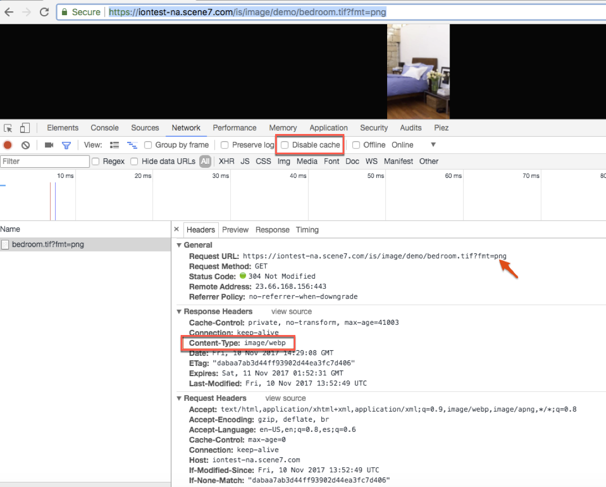

# Smart Imaging {#smart-imaging}

**Smart Imaging** with **Adobe AI** is an automated image optimization capability that tailors delivered images to each individual user's viewing conditions. Rather than serving a single fixed asset to every visitor, Smart Imaging evaluates each user's unique viewing characteristics and automatically selects the image variant best suited to that person's experience.

Smart Imaging applies each user's unique viewing characteristics to serve the right image automatically. Because viewing conditions differ from one visitor to the next — including device type, screen resolution, and network conditions — a single image cannot be ideal for everyone. Smart Imaging addresses this by evaluating those characteristics in real time and matching each request to the most appropriate optimized image. This ensures that every user receives an asset calibrated to their specific context, without requiring manual configuration for each scenario.

The automatic, per-user optimization delivered by Smart Imaging directly improves two outcomes:

- **Better performance** — Serving right-sized, optimized images reduces unnecessary data transfer, which helps pages load faster for each user's device and connection.
- **Higher engagement** — When images render quickly and appear correctly for a user's viewing environment, the experience is smoother, which supports stronger user engagement.

As a result of matching each image to the individual viewer, Smart Imaging improves both delivery performance and user engagement automatically. Because the optimization is handled by **Adobe AI** rather than by hand, teams gain the benefits of tailored image delivery at scale without maintaining separate assets for every possible viewing scenario.

## About Smart Imaging {#about-smart-imaging}

Smart Imaging technology applies Adobe AI capabilities and works with existing "image presets." It enhances image delivery performance by automatically optimizing image format, size, and quality based on client browser capabilities.

Improved Smart Imaging now delivers both **AVIF** and **WebP** support, boosting your **Google Core Web Vital score for Largest Contentful Paint (LCP)**.

>[!IMPORTANT]
>
>Smart Imaging requires that you use the out-of-the-box CDN (Content Delivery Network) that is bundled with Adobe Experience Manager - Dynamic Media. Any other custom CDN is not supported with this feature.

>[!TIP]
>
>Try out and discover the benefits of Dynamic Media image modifiers and Smart Imaging, using Dynamic Media [_Snapshot_](https://snapshot.scene7.com/).
>
>Snapshot is a visual demonstration tool, designed to illustrate the power of Dynamic Media for optimized and dynamic image delivery. Experiment with test images or Dynamic Media URLs, to observe the output of various Dynamic Media image modifiers visually, and Smart Imaging optimizations for the following:
>
>* File size (with WebP and AVIF delivery)
>* Network bandwidth
>* DPR (Device Pixel Ratio) 
>
>To learn how easy it is to use Snapshot, play the [Snapshot training video](https://experienceleague.adobe.com/en/docs/experience-manager-learn/assets/dynamic-media/images/dynamic-media-snapshot) (3 minutes and 17 seconds).

Smart Imaging benefits from the added performance boost of being fully integrated with Adobe's best-in-class premium CDN (Content Delivery Network) service. This service finds the optimal Internet route between servers, networks, and peering points. It selects a route with the lowest latency and lowest packet loss rate instead of using the default route on the Internet.

The following image asset examples depict the added Smart Imaging optimization:

| Image (URL) | Thumbnail | Size (JPEG) | Size (WebP) with Smart Imaging | Size (AVIF) with Smart Imaging | % reduction with WebP | % reduction with AVIF |
|---|---|---|---|---|---|---|
| [Image 1](https://techsupport.scene7.com/is/image/TechSupport/SmartImaging_6?hei=500&fmt=jpg&qlt=85&resmode=bisharp&op_usm=5,0.125,5,0) |  | 145 KB | 106 KB | 90.2 KB | 26.89% | 37.79% |
| [Image 2](https://techsupport.scene7.com/is/image/TechSupport/SmartImaging_3?hei=500&fmt=jpg&qlt=85&resmode=bisharp&op_usm=5,0.125,5,0) |  | 412 KB | 346 KB | 113 KB | 16.01% | 72.57% |
| [Image 3](https://techsupport.scene7.com/is/image/TechSupport/SmartImaging_2?hei=500&fmt=jpg&qlt=85&resmode=bisharp&op_usm=5,0.125,5,0) |  | 221 KB | 189 KB | 87.1 KB | 14.47% | 60.58% |
| [Image 4](https://techsupport.scene7.com/is/image/TechSupport/SmartImaging_1?hei=500&qlt=85&resmode=bisharp&op_usm=5,0.125,5,0) |  | 594 KB | 545 KB | 286 KB | 8.25% | 51.85% |

Similar to the above, Adobe also ran a test with a larger sample set. **AVIF delivers up to 41% average size reduction over JPEG.** In the larger test, AVIF provided **20% extra size reduction over WebP**, and WebP provided **27% reduction over JPEG** — all at the same visual quality.

Compare WebP and AVIF to PNG, and you can see an **84% size reduction with WebP and 87% with AVIF**. Because both WebP and AVIF formats support transparency and multiple image animations, they are a strong replacement for transparent PNG and GIF files.

See also [Image Optimization with Next-gen Image Formats (WebP and AVIF)](https://blog.developer.adobe.com/image-optimisation-with-next-gen-image-formats-webp-and-avif-248c75afacc4)

<!--
 HIDDEN ON MAY 19, 2022 BASED ON CQDOC-19280 On the mobile web, the challenges are compounded by two factors:

* Large variety of devices with different form factors and high-resolution displays.
* Constrained network bandwidth.

In terms of images, the goal is to serve the best quality images as efficiently as possible.
-->

**Benefits of Smart Imaging**

Smart Imaging enhances image delivery by automatically optimizing file size based on the user's browser, device display, and network conditions. This approach ensures faster loading times and a better viewing experience across different environments. Because images constitute most of a page's load time, faster image delivery directly improves key business performance indicators (KPIs). This leads to measurable gains such as:

* Higher conversion rates.
* Increased time spent on a site.
* Lower site bounce rates.

The newest key benefits of the latest Smart Imaging include the following:

* Supports next generation AVIF format.
* PNG to WebP and AVIF now supports lossy conversion. Because PNG is a lossless format, earlier WebP and AVIF being delivered were lossless.
* [Browser Format Conversion](#bfc)
* [Device Pixel Ratio](#dpr)
* [Network bandwidth](#bandwidth)

### About browser format Conversion {#bfc}

**Browser Format Conversion** automatically delivers modern, lossy image formats to each browser to reduce file size while preserving visual quality. Enable it by appending **`bfc=on`** to the image URL. When enabled, Smart Imaging converts **JPEG** and **PNG** source images into the optimal lossy next-generation format supported by the requesting browser.

#### How Browser Format Conversion Works

With **`bfc=on`** applied, Smart Imaging converts **JPEG** and **PNG** images to one of the following lossy formats, selected according to what the browser supports:

- **Lossy AVIF (AV1 Image File Format)**
- **Lossy WebP**
- **Lossy JPEGXR (JPEG Extended Range)**
- **Lossy JPEG2000**

Because not every browser supports these newer formats, Smart Imaging applies a built-in fallback: **when a browser does not support the target formats, Smart Imaging continues to serve the original JPEG or PNG.** This fallback ensures the image renders correctly in every browser, so enabling the feature never breaks compatibility. During each format change, Smart Imaging also recalculates the quality of the new format to match the conversion.

#### Turning Browser Format Conversion On and Off

- **Enable:** Append **`bfc=on`** to the image's URL.
- **Disable:** Append **`bfc=off`** to the image's URL.

To turn off Browser Format Conversion, append **`bfc=off`** to the image's URL, and Smart Imaging serves the original JPEG or PNG without format conversion.

See also [bfc](https://experienceleague.adobe.com/en/docs/dynamic-media-developer-resources/image-serving-api/image-serving-api/http-protocol-reference/command-reference/r-bfc) in the Dynamic Media Image Serving and Rendering API.

### About device pixel ratio optimization {#dpr}

**Device Pixel Ratio (DPR)**, also called **CSS Pixel Ratio**, is the ratio between a device's **physical pixels** and its **logical (CSS) pixels**. As widely acknowledged, modern mobile devices and high-density "retina" displays pack far more physical pixels into the same physical area, so the pixel resolution of contemporary screens has been rapidly increasing. A higher DPR therefore means that a single logical pixel is represented by multiple physical pixels, which is why images authored at a standard size can appear soft or blurry on high-density screens unless they are rendered at the screen's true resolution.

Enabling **Device Pixel Ratio optimization** renders each image at the native resolution of the screen, delivering sharp, crisp visuals. Because the image is scaled to match the display's actual pixel density, detail is preserved and pixelation is avoided on high-DPR devices.

Currently, the pixel density of the display is determined from **Akamai CDN header values**. This means the delivery layer reads the device's reported DPR from the request headers and serves an image sized appropriately for that density, without requiring manual configuration for each device.

| Permitted values in an image's URL | Description |
|---|---|
| `dpr=off` | Turn off DPR optimization at an individual image URL level.|
| `dpr=on,dprValue` | Override the DPR value detected by Smart Imaging with a custom value (as detected by any client-side logic or other means). The permitted value for `dprValue` is any number greater than 0.  |

>[!NOTE]
>
>* You can use `dpr=on,dprValue` even when the company-level DPR setting is off.
>* Because DPR optimization can enlarge an image, when the resultant image exceeds the **MaxPix** Dynamic Media setting, the MaxPix width is always applied while preserving the image's aspect ratio.

| Requested image size | Device Pixel Ratio (dpr) value | Delivered image size |
|---|---|---|
| 816 x 500 | 1 | 816 x 500 |
| 816 x 500 | 2 | 1632 x 1000 |

As shown in the table, a **DPR value of 2** doubles both the width and height of the delivered image (from **816 x 500** to **1632 x 1000**), producing twice the linear pixel density so the image remains sharp on high-density screens.

See also [When working with images](/help/assets/dynamic-media/adding-dynamic-media-assets-to-pages.md#when-working-with-images) and [When working with Smart Crop](/help/assets/dynamic-media/adding-dynamic-media-assets-to-pages.md#when-working-with-smart-crop).

### About network bandwidth optimization {#bandwidth}

**Network bandwidth optimization automatically adjusts the served image quality based on actual, real-time network bandwidth.** Enabling this feature ensures images are delivered at a quality level appropriate to each connection. When network bandwidth is poor, **DPR (Device Pixel Ratio) optimization is automatically disabled** — even if it was previously enabled — because serving high-resolution assets over a constrained connection would slow page delivery.

Your company can disable network bandwidth optimization for individual images by appending **`network=off`** to the image URL.

| Permitted value in the URL of an image | Description |
|---|---|
| `network=off` | Turns off network optimization at an individual image URL level. |

DPR and network bandwidth values are based on the detected client-side values of the bundled Content Delivery Network (CDN). These values are sometimes inaccurate. For example, iPhone5 with DPR=2 and iPhone12 with `dpr=3` both report `dpr=2`. In practice, detected values can understate the true pixel density of newer high-DPR displays, which is why the reported value may fall below a device's actual capability. Even so, for high-resolution devices, serving **`dpr=2`** delivers noticeably sharper images than serving `dpr=1`. The best way to overcome this inaccuracy, however, is to use client-side DPR, which gives you 100% accurate values. Client-side DPR works reliably across every device, whether Apple or any other manufacturer, and returns **100% accurate values**. See [Use Smart Imaging with client-side Device Pixel Ratio](/help/assets/dynamic-media/client-side-dpr.md).

**Additional key benefits of Smart Imaging**

* Improved Google SEO ranking for web pages that use the latest Smart Imaging.
* Serves optimized content immediately, at runtime.
* Uses Adobe AI technology to convert according to the quality (`qlt`) specified in the image request.
* TTL (Time To Live) independent. Previously, a minimum TTL of **12 hours** was mandatory for Smart Imaging to work.
* Previously, both the original and derivative images were cached, and cache invalidation was a two-step process. In the latest Smart Imaging, only the derivative images are cached, which enables a streamlined single-step cache invalidation process.
* Customers that use custom headers in their ruleset benefit from the latest Smart Imaging, because these headers are not blocked — unlike in the previous version of Smart Imaging.

## How Smart Imaging works{#how-smart-imaging-works}

When a consumer requests an image, **Smart Imaging** analyzes the user's characteristics and converts the image to the optimal format based on the requesting browser. These conversions preserve visual fidelity while reducing file size, ensuring faster load times without a visible loss in quality. Smart Imaging automatically converts images to different formats according to browser capability using the cascade below.

### Format conversion cascade

* Automatically converts to **AVIF (AV1 Image File Format)** if the requesting browser supports the format. AVIF typically delivers the strongest compression among the supported options, so it is preferred when available.
* Automatically converts to **WebP** if AVIF conversion was not beneficial or the browser does not support AVIF. WebP provides efficient compression with broad modern browser support, making it a reliable second choice.
* Automatically converts to **JPEG 2000** when Safari does not support WebP. This ensures Safari users still receive an optimized image format.
* Automatically converts to **JPEG XR (JPEG Extended Range)** for **Internet Explorer (IE) 9+**, or when **Microsoft Edge** does not support WebP. JPEG XR covers legacy Microsoft browsers that lack support for the newer formats.

  | Image format | Supported browsers |
  |---|---|
  | **AVIF** | [https://caniuse.com/avif](https://caniuse.com/avif) |
  | **WebP** | [https://caniuse.com/webp](https://caniuse.com/webp) |
  | **JPEG 2000** | [https://caniuse.com/jpeg2000](https://caniuse.com/jpeg2000) |
  | **JPEG XR** | [https://caniuse.com/jpegxr](https://caniuse.com/jpegxr) |

### Fallback behavior

* For browsers that do not support any of these optimized formats, Smart Imaging serves the originally requested image format. This guarantees the image always renders, regardless of browser capability.

Because serving the smaller file is always more efficient, if the original image size is smaller than what Smart Imaging produces, the original image is served instead. As a result, Smart Imaging never delivers a larger file than the source, ensuring the most efficient possible transfer for every request.

## Image format support in Smart Imaging{#image-format-support}

Smart Imaging supports **JPEG** and **PNG** as source image formats for optimized delivery.

### Supported input formats

* **JPEG** (Joint Photographic Experts Group)
* **PNG** (Portable Network Graphics)

### Output format conversion and quality handling

**Smart Imaging recalculates the quality for JPEG image file formats when converting to a new format.** This recalculation ensures the converted output is optimized for delivery rather than simply carrying over the original encoding, which helps balance visual fidelity with reduced file size.

For image file formats that support transparency, such as **PNG**, you can configure Smart Imaging to deliver **lossy AVIF** (AV1 Image File Format) and **lossy WebP**. Both AVIF and WebP are modern, next-generation formats designed to achieve smaller file sizes than legacy formats while preserving transparency, making them well suited for transparent source images.

For lossy format conversion, Smart Imaging determines the output quality using the following order of precedence:

1. **The quality specified in the image's URL** is applied first, if present.
2. **The quality configured in the Dynamic Media company account** is used as the fallback when no quality value is provided in the URL.

As a result, the quality parameter in the image URL always takes priority, while the Dynamic Media company account setting establishes the default applied whenever a URL-level quality value is absent.

## Image serving command support in Smart Imaging{#imaging-serving-command-support}

Smart Imaging supports all Image Serving commands **except two**: the **`fmt`** and **`qlt`** commands are not supported. Every other Image Serving command functions normally within Smart Imaging.

### Unsupported Image Serving commands

The following two Image Serving commands are **not supported** in Smart Imaging:

- **`fmt`** — the format command, which typically specifies the output file format of a served image (for example, converting an image to a particular encoding). Because Smart Imaging does not support `fmt`, image format cannot be controlled through this command.
- **`qlt`** — the quality command, which typically controls the compression quality of a served image. Because Smart Imaging does not support `qlt`, compression quality cannot be adjusted through this command.

### Supported Image Serving commands

All remaining Image Serving commands are supported in Smart Imaging. This means the standard set of image transformation and delivery operations—such as sizing, cropping, and other manipulations available through Image Serving—continue to work as expected. Only the format (**`fmt`**) and quality (**`qlt`**) commands are excluded from support.

## Frequently asked questions about Smart Imaging{#smart-imaging-faq}

+++**Are there licensing costs associated with Smart Imaging?**

**No.** Smart Imaging is **included at no additional cost** with your existing license. This applies to either **Dynamic Media Classic** or **Experience Manager - Dynamic Media** (On-prem, AMS, and Experience Manager as a Cloud Service).

>[!IMPORTANT]
>
>Smart Imaging is not available to Dynamic Media - Hybrid customers.

+++

<!--
 OLD VERSION BELOW AS PER CQDOC-22085>
Yes. Smart Imaging works with your existing image presets and observes all your image settings. What changes is the image format, or the quality setting, or both. For format conversion, Smart Imaging maintains full visual fidelity as defined by your image preset settings, but at a smaller file size.

For example, suppose that an image preset is defined with JPEG format, size 500 x 500, quality=85, and unsharp mask=0.1,1,5. When Smart Imaging detects that a user is on a Chrome browser, the image is converted to WebP format, with size 500 x 500. And, unsharp mask=0.1,1,5 is at a WebP quality that matches a JPEG quality of 85 as close as possible. The footprint of that WebP conversion is compared with the JPEG, and the smaller of the two is returned.
-->

<!--
 QUESTION BELOW WAS REMOVED AS PER CQDOC-22085

+++**Do I have to change any URLs, image presets, or deploy new code on my site?**

No. Smart Imaging works seamlessly with your existing image URLs and image presets. In addition, Smart Imaging does not require you to add code to your website to detect a user's browser. All of this functionality is handled automatically.

<!--
 Smart Imaging works seamlessly with your existing image URLs and image presets if you configure Smart Imaging on your existing custom domain. In addition, Smart Imaging does not require you to add any code on your website to detect a user's browser. It is all handled automatically.

In case you must configure a new custom domain to use Smart Imaging, the URLs must be updated to reflect this custom domain.

To understand pre-requisites for Smart Imaging, see [Am I eligible to use Smart Imaging?](#am-i-eligible-to-use-smart-imaging)
-->

<!--
 OLD As mentioned earlier, Smart Imaging supports only JPEG and PNG image formats. For other formats, you need to append the `bfc=off` modifier to the URL as described earlier. 

-->

<!--
 ## If Smart Imaging manages the quality settings, are there minimums and maximums I can set? For example, is it possible to set "no lower than 60" and "no greater than 80 quality"? {#minimum-maximum}

There is no such provisioning ability in the current Smart Imaging.
-->

<!--
 ## Sometimes a JPEG image is returned to Chrome instead of a WebP image. Why does that change happen? {#jpeg-webp}

Smart Imaging determines if the conversion is beneficial or not. It returns the new image only if the conversion results in a smaller file size with comparable quality.

How does Smart Imaging DPR optimization work with Adobe Experience Manager Sites components and Dynamic Media viewers?

* Experience Manager Sites Core Components are configured by default for DPR optimization. To avoid oversized images owing to server-side Smart Imaging DPR optimization, `dpr=off` is always added to Experience Manager Sites Core Components Dynamic Media images.
* Given Dynamic Media Foundation Component is configured by default for DPR optimization, to avoid oversized images owing to server-side Smart Imaging DPR optimization, `dpr=off` is always added to Dynamic Media Foundation Component images. Even if customer deselects DPR optimization in DM Foundation Component, server-side Smart Imaging DPR does not kick in. In summary, in the DM Foundation Component, DPR optimization comes into effect based on DM Foundation Component level setting only.
* Any viewer side DPR optimization works in tandem with server-side Smart Imaging DPR optimization, and does not result in over-sized images. In other words, wherever DPR is handled by the viewer, such as the main view only in a zoom-enabled viewer, the server-side Smart Imaging DPR values are not triggered. Likewise, wherever viewer elements, such as swatches and thumbnails, do not have DPR handling, the server-side Smart Imaging DPR value is triggered.

See also [When working with images](/help/assets/dynamic-media/adding-dynamic-media-assets-to-pages.md#when-working-with-images) and [When working with Smart Crop](/help/assets/dynamic-media/adding-dynamic-media-assets-to-pages.md#when-working-with-smart-crop).

>[!MORELIKETHIS]
>
>* [Image optimization with next generation image formats WebP and AVIF](https://medium.com/adobetech/image-optimisation-with-next-gen-image-formats-webp-and-avif-248c75afacc4). 
-->

+++**Can Smart Imaging be turned off for any request?**

**Yes.** You can turn off Smart Imaging on a per-request basis by adding any of the following modifiers:

* `bfc=off` to turn off **Browser Format Conversion**. See also [Browser Format Conversion](#bfc).
* `dpr=off` to turn off **Device Pixel Ratio (DPR)**. See also [Device Pixel Ratio](#dpr).
* `network=off` to turn off **network bandwidth** optimization. See also [Network Bandwidth](#network).

+++

+++**Is it possible to "tune" Smart Imaging?**

**Yes.** Smart Imaging provides **three configurable options** that you can enable or disable independently:

* [Browser Format Conversion](#bfc)
* [Device Pixel Ratio](#dpr)
* [Network Bandwidth](#network)

+++

+++**Does Smart Imaging work with my existing image presets?**

**Yes.** Smart Imaging integrates seamlessly with your existing image presets and respects all of your image settings.

The only adjustments involve the **image format, image quality, or both**. During format conversion, Smart Imaging preserves full visual fidelity according to your preset settings while delivering a **smaller file size**, which reduces bandwidth usage and speeds up page loads. Enable it by adding `bfc=on`, or `dpr=on,dprValue`, or `network=on`, or all three parameter settings to your existing URLs or presets.

For example, an image preset may specify a **JPEG format at 500 &times; 500 pixels**, with `quality=85` and `unsharp mask=0.1,1,5`. Smart Imaging detects whether the user is on a Chrome browser. It then converts the image to **WebP** — a modern, highly compressed image format — using the same dimensions (500 &times; 500) and an unsharp mask matching the JPEG's settings. The system then compares the file sizes of the WebP and JPEG versions and serves the smaller one to the user. This ensures faster delivery and reduced bandwidth consumption without any loss of visual quality.

+++

+++**Does Smart Imaging work with HTTPS? How about HTTP/2?**

**Yes to both.** Smart Imaging works with images delivered over both **HTTP and HTTPS**. In addition, it also works over **HTTP/2**.
+++

+++**Am I eligible to use Smart Imaging?**

**Smart Imaging is ready to use immediately for all customers.** To start enjoying its benefits, add `bfc=on`, or `dpr=on,dprValue`, or `network=on`, or all three parameter settings to your existing URLs or presets.

To activate Smart Imaging, your company's **Dynamic Media Classic** or **Dynamic Media on Experience Manager** account must include the **Adobe bundled CDN (Content Delivery Network)** as part of your license. A CDN distributes and delivers your images from geographically distributed servers, which is what enables Smart Imaging to optimize and serve the correct format to each user.

+++

+++**What is the process to enable Smart Imaging on an account?**

To start using Smart Imaging, append `bfc=on`, or `dpr=on,dprValue`, or `network=on`, or all three parameter settings to your existing URLs or presets. If you prefer not to make these changes manually, you can enable Smart Imaging by default by creating a support case.

When creating the support case, specify which Smart Imaging features you want activated on your account:

* **Browser Format Conversion** (WebP or AVIF — both modern, efficient image formats)
* **Network Bandwidth Optimization**

>[!NOTE]
>
>DPR (Device Pixel Ratio) requires client-side adjustments to determine the correct `dprValue`. Therefore, Adobe recommends enabling DPR through URLs by appending `dpr=on,dprValue`.

**To create a support case to enable Smart Imaging on your account:**

1. [Use the Admin Console to start the creation of a new support case](https://helpx.adobe.com/enterprise/using/support-for-experience-cloud.html).
1. Provide the following information in your support case:

    * **Primary contact details:**
    
        * Provide your name, email, and phone number.

    * **Smart Imaging features to enable:** 
    
        * List the capabilities that you want for your account:

            * Browser format conversion: WebP or AVIF
            * Network bandwidth optimization
            * DPR (Device Pixel Ratio): DPR requires client-side adjustments to determine the correct `dprValue`. Therefore, Adobe recommends enabling DPR through URLs by appending `dpr=on,dprValue`.
    
    * **Domain for Smart Imaging:** 
    
        * List all relevant domains, such as *`company.com`* or *`mycompany.scene7.com`*
        * Smart Imaging supports both generic and custom domains.
        * To identify your domains, open the [Dynamic Media Classic desktop application](https://experienceleague.adobe.com/en/docs/dynamic-media-classic/using/getting-started/signing-out#getting-started) and sign in to your company account. 

            1. Navigate to **[!UICONTROL Setup]** > **[!UICONTROL Application Setup]** > **[!UICONTROL General Settings]**.  
            1. Look for the **[!UICONTROL Published Server Name]** field to confirm your domain.
            1. Verify that you are using Adobe's CDN rather than one managed by another provider.

    * **Indicate HTTP/2 support:**
    
        * Specify if you need Smart Imaging to work over HTTP/2.

1. Adobe Customer Support enables the requested Smart Imaging features by default, eliminating the need to append parameters manually to URLs.
1. Adobe recommends setting the **Time To Live (TTL)** to at least **24 hours** to maximize performance through caching. A longer TTL keeps optimized images cached at the edge, which reduces repeated origin requests.
To adjust the TTL:

    1. **For Dynamic Media Classic:**
        1. Navigate to **[!UICONTROL Setup]** > **[!UICONTROL Application Setup]** > **[!UICONTROL Publish Setup]** > **[!UICONTROL Image Server]**. 
        1. Set the **[!UICONTROL Default Client Cache Time To Live]** value to 24 hours or more.
    1. **For Dynamic Media on Adobe Experience Manager:**
        1. Follow [these instructions](/help/assets/dynamic-media/config-dm.md).
        1. Set the **[!UICONTROL Expiration]** value for 24 hours or more.

+++

+++**When is an account enabled with Smart Imaging?**

Customer Support processes requests in the order that they receive them, following the Wait List. Lead times are often long because enabling Smart Imaging requires Adobe to clear the cache. As a result, only a few customer transitions can be handled at any given time.

>[!NOTE]
>
>There can be a long lead time because enabling Smart Imaging involves Adobe clearing the cache. Therefore, only a few customer transitions can be handled at any given time.

+++

+++**Are there risks with using Smart Imaging?**

There is no risk to a customer's live web page. However, the transition to Smart Imaging clears out your **Content Delivery Network (CDN)** cache, because Smart Imaging moves your account to a new configuration of Dynamic Media Classic or Dynamic Media on Experience Manager.

During the initial transition, the non-cached images directly hit Adobe's origin servers until the cache is rebuilt again. As such, Adobe plans to handle a few customer transitions at a time so that acceptable performance is maintained when pulling requests from the origin. For most customers, the cache is fully built up again at the CDN within about **one to two days**.

+++

+++**Can I verify if Smart Imaging works?**

Yes. You can do the following:

1. After your account is configured with Smart Imaging, load a Dynamic Media Classic or Adobe Experience Manager - Dynamic Media image URL in the browser.
1. Open the Chrome developer pane by going to **[!UICONTROL View]** > **[!UICONTROL Developer]** > **[!UICONTROL Developer Tools]** in the browser. Or, choose any browser developer tool of your choice.

1. Ensure that the cache is disabled when developer tools are open.

    * On Windows&reg;, navigate to settings in the developer tool pane, then select **[!UICONTROL Disable cache (while devtools is open)]** check box.
    * On macOS, in the Developer pane, under the **[!UICONTROL Network]** tab, select **[!UICONTROL disable cache]**.

1. Observe the Content Type is transformed to the appropriate format. The following screenshot shows a **PNG** image being converted dynamically to **WebP** on Chrome. If your domain has **AVIF (AV1 Image File Format)** enabled, you can also expect to see AVIF in the Content Type.
1. Repeat this test on different browsers and user conditions.

>[!NOTE]
>
>Not all images are converted. Smart Imaging decides if the conversion can improve performance. Sometimes, where there is no expected performance gain or the format is not JPEG or PNG, the image is not converted.

+++

+++**Is there a way to know the benefits of Smart Imaging?**

Yes. The **Smart Imaging Header** determines the benefits of Smart Imaging. When Smart Imaging is enabled, after you request an image, under the **[!UICONTROL Response Headers]** heading, you can see `-X-Adobe-Smart-Imaging` as seen in the following highlighted example:

This header tells you the following: 

* Smart Imaging is working for the company.
* A **positive value** means that the conversion is successful. In this case, a new **WebP** image is returned.
* A **negative value** means that the conversion is not successful. In such case, the original requested image is returned (**JPEG** by default, if not specified).
* A positive value shows the difference in bytes between the requested image and the new image. In the example above, the **bytes saved is `75048`**, or **approximately 75 KB for a single image**. 
* A negative value means that the requested image is smaller than the new image. The negative size difference is shown, but the image served is the original requested image only.

>[!NOTE]
>
>**X-Adobe-Smart-Imaging = -1 with WebP being delivered**
>
>If the value of `X-Adobe-Smart-Imaging` is -1 and WebP is still being delivered, Smart Imaging is active. However, the size benefits were not calculated because of outdated cache. You can use `cache=update` (one time only) in the image's URL to fix this issue. 
>An example of using the modifier:
>`https://smartimaging.scene7.com/is/image/SmartImaging/sample1?cache=update`
>To invalidate the entire cache, you must create a support case.

+++

+++**Can I disable AVIF optimization in Smart Imaging?**

Yes. **AVIF (AV1 Image File Format)** optimization is one of the Smart Imaging delivery formats, and its enablement is managed by Adobe Customer Support rather than through URL parameters. Because Adobe Customer Support enables and adjusts requested Smart Imaging features by default, you can request that AVIF optimization be turned off for your account by submitting a support case. As general guidance, note that turning off AVIF leaves other Smart Imaging conversions—such as delivery of **WebP** in place of **JPEG** or **PNG**—active, so images continue to be optimized in supported formats. Disabling a delivery format may involve clearing the cache for the affected configuration, after which the CDN cache rebuilds in the same manner described for the initial Smart Imaging transition. If you want to switch back to serving **WebP** by default, create a support case for the same request. As usual, you can turn off Smart Imaging by adding the parameter `bfc=off` to the image's URL. However, you cannot select **WebP** or **AVIF** directly in the URL modifier for Smart Imaging. This format-selection ability is controlled at your company account level rather than in the URL modifier.

+++

+++**Why does my request fail when I have a URL with fmt=tif on the Chrome web browser?**

This error does not occur if Smart Imaging is not enabled on your account. Smart Imaging works with **JPEG** and **PNG** source formats only.

To avoid this error, use one of the following approaches:

* Specify **JPEG** or **PNG**, or
* Do not use the `fmt` modifier at all, or
* Use a browser-preferred format defined by Smart Imaging. For example, you can use **WebP** for the Chrome web browser, a browser that natively supports the format.

+++

+++**Can I download a TIFF image from an image's URL?**

Yes. Add `fmt=tif` and `bfc=off` to the image's URL path.

+++

+++**Does Smart Imaging manage image format and image quality settings?**

Yes. Smart Imaging manages both image format and image quality together. The remaining parameters stay the same when requested in the image's URL.

+++

+++**Can I set a minimum and maximum quality setting?**

No. Currently there is no such provisioning.

+++

+++**Does Smart Imaging adjust the percent quality output setting?**

Yes. Smart Imaging automatically adjusts the quality percent. This quality is determined by a machine learning algorithm developed by Adobe, which analyzes each image to select an optimal compression level. This percent is not range-specific.

+++

+++**Are only JPEG and PNG replaced by Smart Imaging?**

Yes. This functionality works for **JPEG** and **PNG** only.

+++

+++**Why is JPEG sometimes returned to Chrome instead of WebP?**

Smart Imaging evaluates whether converting the image to **WebP** produces a smaller file without degrading visual quality. This ensures that users receive the most efficient format for their browser. Smart Imaging returns the converted image only when the conversion is beneficial.

+++

+++**Why does Device Pixel Ratio (dpr) not work with composite images?**

If a composite image involves too many layers, **Device Pixel Ratio (dpr)** functionality may be impacted while using a position modifier. This issue is known and will be fixed in future releases of Smart Imaging. If other Smart Imaging functionality is not working as expected, create a support case to report the issue.

+++

+++**Why does Smart Imaging PNG convert to lossless WebP/AVIF?**

Because **PNG** is inherently a lossless image format, earlier **WebP** and **AVIF** images were also delivered in lossless mode, resulting in larger file sizes than expected. Smart Imaging now supports lossy conversion. Use the modifier `cache=update` (one time only) in an image request to fix this issue. An example of using this modifier:

`https://smartimaging.scene7.com/is/image/SmartImaging/sample1?cache=update`

To invalidate the entire cache, create a support case requesting such effort.

+++

+++**Can I continue using PNG to lossless conversion in Smart Imaging?**

Yes. Smart Imaging now supports lossy conversion based on the quality level. You can continue using lossless conversion by setting the quality to **100**, either through your company's settings, or by adding `qlt=100` to the image's URL path.

+++
