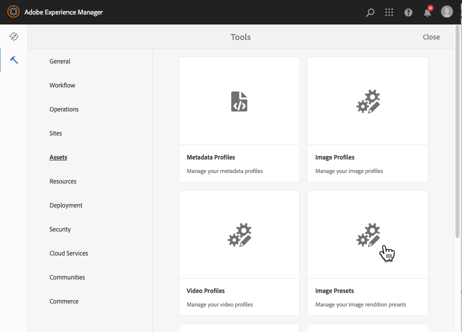
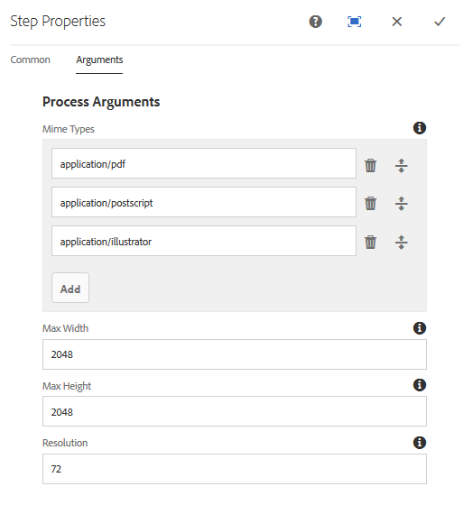
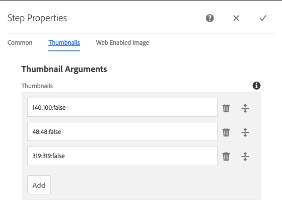
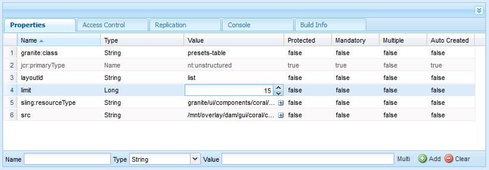
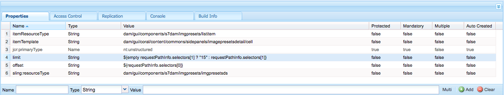
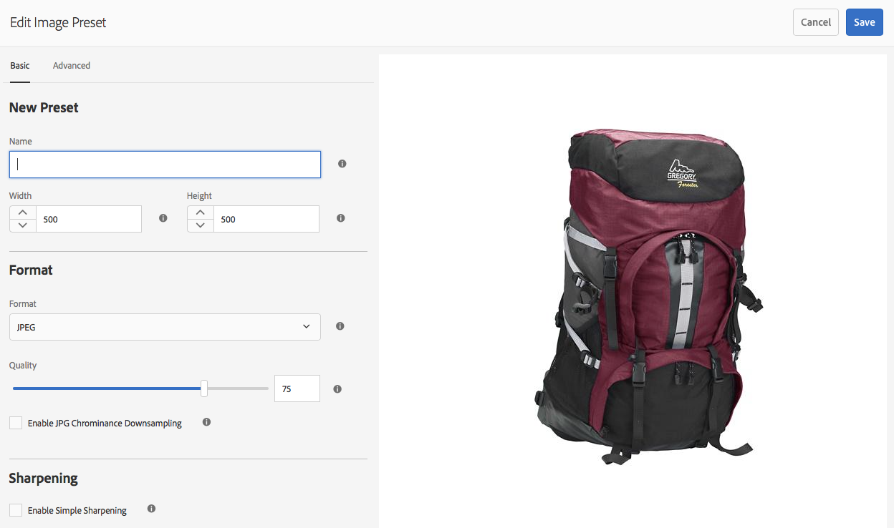
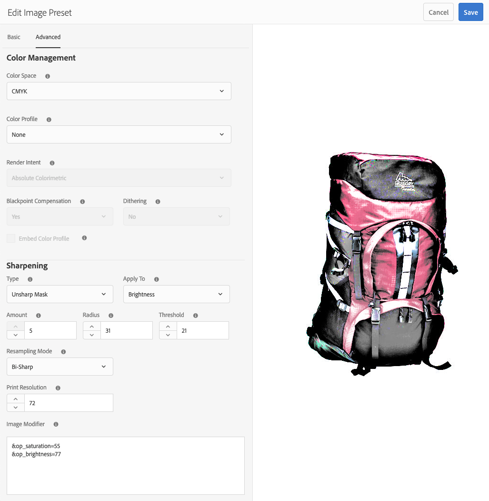
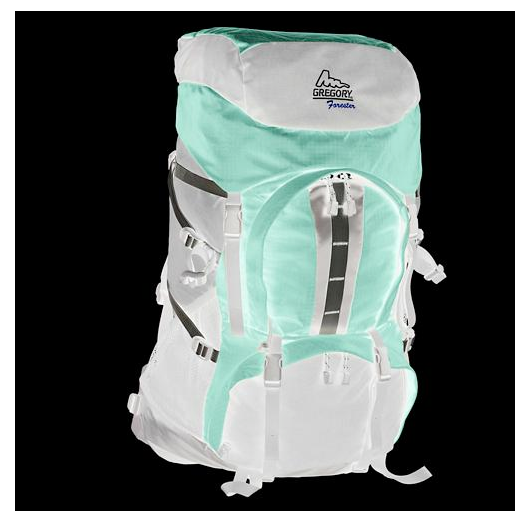
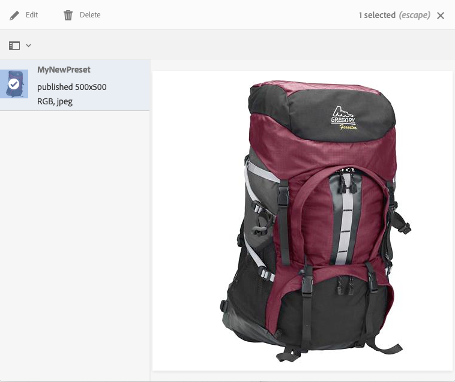

# Manage Image Presets{#managing-image-presets}

**Image Presets** are predefined, reusable collections of sizing and formatting commands that enable **Adobe Experience Manager (AEM) Assets** to deliver images dynamically. Each Image Preset controls image delivery at different sizes, in different formats, and with dynamically generated image properties such as color space, compression quality, and resolution. This means a single master asset can be delivered in many optimized variations without maintaining separate source files.

## What an Image Preset Contains

When you create an Image Preset, you define the parameters that govern how the image is generated and delivered. Each preset specifies:

- **Delivery size** — the dimensions used when the image is served for viewing.
- **Formatting commands** — the settings that optimize the appearance of the image for display.

These formatting commands ensure the appearance of the image is optimized whenever the image is delivered for viewing, so every rendition looks consistent and display-ready across the contexts in which it appears.

## Exporting Assets with Presets

Administrators can create presets specifically for exporting assets. Users then choose a preset when they export images, which reformats the images to the specifications the administrator defines. As a result, exported assets conform to consistent, centrally governed standards without requiring each user to configure formatting manually.

## Responsive Image Presets and Color Space

You can also create **responsive** Image Presets. When you apply a responsive Image Preset to your assets, the assets adapt to the device or screen size on which they are viewed. This responsive behavior helps deliver appropriately sized images to desktops, tablets, and mobile devices, improving load performance and visual quality across varied viewing environments.

Image Presets support multiple color spaces. In addition to **RGB** or **Gray**, you can configure Image Presets to use **CMYK (Cyan, Magenta, Yellow, Key/Black)** in the color space, which supports print-oriented and color-managed delivery workflows.

This section describes how to create, modify, and generally manage Image Presets. You can apply an Image Preset to an image anytime you preview it. See [Apply Image Presets](/help/assets/dynamic-media/image-presets.md).

>[!NOTE]
>
>Smart imaging works with your existing Image Presets and uses intelligence at the last millisecond of delivery to reduce image file size further based on browser or network connection speed. See [Smart Imaging](/help/assets/dynamic-media/imaging-faq.md) for more information.

## Learn about Image Presets {#understanding-image-presets}

An **Image Preset** is a predefined, reusable collection of sizing and formatting commands saved under a name, functioning much like a macro. Each preset stores the exact dimensions, format, and compression settings needed to deliver an image, allowing **Experience Manager** to generate correctly optimized versions of a source image on demand rather than requiring separate files for every size and device.

### How Image Presets Work

Consider a common scenario: a website requires each product image to appear in different sizes, formats, and compression rates for both desktop and mobile delivery. Because modern sites serve images to a wide range of screen sizes and device types, this kind of multi-format delivery is a routine requirement for responsive web experiences.

To handle this, an administrator creates two Image Presets:

- **`Enlarge`** — displays images at **500 x 500 pixels**, suited to desktop delivery.
- **`Thumbnail`** — displays images at **150 x 150 pixels**, suited to mobile delivery.

When a request is made for an image at the `Enlarge` or `Thumbnail` size, **Experience Manager** locates the matching **Image Preset** definition. It then dynamically generates an image that conforms to the size and formatting specifications defined in that preset. As a result, a single source image can be delivered in multiple optimized forms without maintaining duplicate assets.

### Maintaining Image Quality at Any Size

Reducing an image in size during dynamic delivery causes it to lose sharpness and detail. To counter this, **each Image Preset includes formatting controls that optimize an image when it is delivered at a particular size.** This ensures that the delivered output remains sharp and clear, because the preset applies the appropriate sharpening and formatting for the target dimensions rather than simply scaling the source. These controls keep your images crisp and legible when they reach your website or application.

### Creating an Image Preset

Administrators can create Image Presets. An administrator can build a preset from scratch or duplicate an existing preset and save it under a new name, reusing established settings as a starting point.

## Manage Image Presets {#managing-image-presets-1}

You manage Image Presets in Experience Manager from the **[!UICONTROL Assets]** > **[!UICONTROL Image Presets]** area of the Tools console. To reach this location, follow these steps:

1. Select the **Experience Manager logo** to open the global navigation console.
2. Select the **Tools** icon.
3. Navigate to **[!UICONTROL Assets]** > **[!UICONTROL Image Presets]**.



From this Image Presets area, you create, edit, and organize the presets that control how assets are rendered and delivered.


>[!NOTE]
>
>Any Image Presets that you create are also available as **dynamic renditions** when you preview or deliver assets. This means a preset defined once can be reused directly during preview and delivery, without redefining rendition settings each time.
>
>You do *not* need to publish Image Presets manually, because Image Presets are **automatically published**. As a result, a newly created preset becomes available for delivery without a separate publish action.
>
>See [Publish Image Presets](#publishing-image-presets).

>[!NOTE] 
>
>The system shows various renditions when you select **[!UICONTROL Renditions]** in an asset's Detail View. You can increase or decrease the number of Image Presets that display, allowing you to tailor the Detail View to show only the renditions you need. See [Increase the number of image presets that are displayed](#increasing-or-decreasing-the-number-of-image-presets-that-display).

## How Image Presets relate to renditions {#how-image-presets-relate-to-renditions}

**Image presets** define how Dynamic Media delivers images at request time, controlling the visual output that end users receive. Each preset specifies a set of display parameters, including:

- **Sizing** — the target width, height, or resolution of the delivered image
- **Formatting** — the output file format used for delivery
- **Compression** — the quality and file-size trade-off applied to the image
- **Other display parameters** — additional settings that govern how the final image appears

A **rendition** is a processed version of an asset, generated when that asset is ingested and processed by Dynamic Media. Renditions are the underlying image data on which delivery depends.

Image presets do not generate renditions themselves. This distinction is important: a preset is a set of delivery instructions, not a source of image data. Instead, presets rely on renditions that Dynamic Media creates when assets are processed. As a result, the preset applies its sizing, formatting, and compression rules on top of an existing rendition to produce the delivered image.

Because renditions are created during asset processing rather than by the preset, the presence of a suitable rendition is a prerequisite for a preset to deliver the intended output. In practice, this means asset processing establishes the available image data first, and the image preset then determines how that data is presented at delivery.

### Rendition generation in AEM as a Cloud Service{#rendition-generation-in-aemaacs}

In Adobe Experience Manager (AEM) as a Cloud Service, AEM generates renditions using [**Asset Microservices**](https://experienceleague.adobe.com/en/docs/experience-manager-cloud-service/content/assets/manage/asset-microservices-configure-and-use#), a cloud-native, scalable processing capability. The Digital Asset Management (DAM) Update Asset workflow is not available for customization in Cloud Service, because rendition processing is handled by the managed microservices layer rather than by an editable workflow model.

Important considerations include the following:

* Renditions are generated at **upload time**, meaning processing occurs automatically as each asset enters the system.
* Changes to a **Processing Profile** apply only to newly uploaded assets. As a result, existing assets must be reprocessed if new renditions are required, because a profile change does not retroactively regenerate renditions for content that already exists in the repository.
* Workflow model customization is not supported in AEM as a Cloud Service for rendition generation; rendition control is instead achieved entirely through Processing Profiles.

**Image Presets** reference available renditions at delivery time to serve dynamic, on-demand image variations. For this reason, ensure that the required renditions exist before configuring or using Image Presets, since an Image Preset cannot deliver a rendition that has not already been generated.

**To control which renditions are generated:**

1. Create or edit a [**Processing Profile**](https://experienceleague.adobe.com/en/docs/experience-manager-cloud-service/content/assets/manage/asset-microservices-configure-and-use#).
2. Configure the required rendition definitions, specifying the formats, dimensions, and output settings each rendition must produce.
3. Apply the Processing Profile to the appropriate folder so that all assets in that location inherit the defined rendition settings.

When assets are uploaded to a folder that has a Processing Profile applied, **Asset Microservices automatically generate the defined renditions**. This automation ensures consistent rendition output across the folder without manual intervention, and it means that organizing assets into folders with the correct Processing Profiles is the primary mechanism for controlling rendition generation in AEM as a Cloud Service.

<!--
### Adobe Illustrator (AI), PostScript&reg; (EPS), and PDF file formats {#adobe-illustrator-ai-postscript-eps-and-pdf-file-formats}

If you intend to support the ingestion of AI, EPS, and PDF files so that you can generate dynamic renditions of these file formats, review the following information before you create Image Presets.

Adobe Illustrator's file format is a variant of PDF. The main differences, in the context of Experience Manager Assets, are the following:

* Adobe Illustrator documents consist of a single page with multiple layers. Each layer is extracted as a PNG subasset under the main Illustrator asset.
* PDF documents consist of one or more pages. Each page is extracted as a single page PDF subasset under the main multi-page PDF document.

The `Create Sub Asset process` component creates the subassets within the overall `DAM Update Asset` workflow. To see this process component within the workflow, navigate to **[!UICONTROL Tools]** > **[!UICONTROL Workflow]** > **[!UICONTROL Models]** > **[!UICONTROL DAM Update Asset]** > **[!UICONTROL Edit]**.

See also [Viewing pages of a multi-page file](/help/assets/manage-linked-subassets.md#view-pages-of-a-multi-page-file).

You can view the subassets or the pages when you open the asset, select the Content menu, and select **[!UICONTROL Subassets]** or **[!UICONTROL Pages]**. The subassets are real assets. The `Create Sub Asset` workflow component extracts the PDF pages. They are then stored as `page1.pdf`, `page2.pdf`, and so on, below the main asset. After they are stored, the `DAM Update Asset` workflow processes them.

To use Dynamic Media to preview and generate dynamic renditions for AI, EPS or PDF files, the following processing steps are required:

1. In the `DAM Update Asset` workflow, the `Rasterize PDF/AI Image Preview Rendition` process component rasterizes the first page of the original asset &ndash; using the configured resolution &ndash; into a `cqdam.preview.png` rendition.

1. The `Dynamic Media Process Image Assets` process component within the workflow optimizes the `cqdam.preview.png` rendition into a PTIFF.

>[!NOTE]
>
>In the DAM Update Asset workflow, the **[!UICONTROL EPS thumbnails]** step generates thumbnails for EPS files.

#### PDF/AI/EPS asset metadata properties {#pdf-ai-eps-asset-metadata-properties}

| **Metadata property** |**Description** |
|---|---|
| `dam:Physicalwidthininches` |Document width in inches. |
| `dam:Physicalheightininches` |Document height in inches. |

You access `Rasterize PDF/AI Image Preview Rendition` process component options by way of the `DAM Update Asset` workflow.

Select Adobe Experience Manager in the upper left, the click **[!UICONTROL Tools]** > **[!UICONTROL Workflow]** > **[!UICONTROL Models]**. On the Workflow Models page, select **[!UICONTROL DAM Update Asset]**, then on the toolbar select **[!UICONTROL Edit]**. On the DAM Update Asset workflow page, double-select the `Rasterize PDF/AI Image Preview Rendition` process component to open its Step Properties dialog box.

#### Rasterize PDF/AI Image Preview Rendition options {#rasterize-pdf-ai-image-preview-rendition-options}



Arguments to rasterize PDF or AI workflow

|Process Argument | Default setting | Description |
|---|---|---|
| Mime Types | application/pdf<br>application/postscript<br>application/illustrator| List of document mime-types that are considered to be PDF or Illustrator documents. |
| Max Width | 2048 | Maximum width of the generated preview rendition, in pixels.|
| Max Height | 2048| Maximum height of the generated preview rendition, in pixels. |
| Resolution | 72 | Resolution to rasterize the first page, in ppi (pixels per inch). |

Using the default process arguments, the first page of a PDF/AI document is rasterized at 72 ppi and the generated preview image is sized at 2048 x 2048 pixels. For a typical deployment, you can increase the resolution to a minimum of 150 ppi or more. For example, a US letter size document at 300 ppi requires a maximum width and height of 2550 x 3300 pixels, respectively.

Max Width and Max Height limit the resolution at which to rasterize. For example, if the maximums are unchanged, and Resolution is set to 300 ppi, a US Letter document is rasterized at 186 ppi. That is, the document is 1581 x 2046 pixels.

The `Rasterize PDF/AI Image Preview Rendition` process component has a maximum defined to ensure that it does not create overly large images in memory. Such large images can overflow the memory provided to the JVM (Java&trade; Virtual Machine). Care must be taken to provide the JVM with enough memory to manage the configured number of parallel workflows, with each having the potential to create an image at the maximum configured size.
-->

<!--
### InDesign (INDD) file format {#indesign-indd-file-format}

If you intend to support the ingestion of INDD files so that you can generate dynamic rendition of this file format, review the following information before you create Image Presets.

For InDesign files, sub assets are extracted only if the Adobe InDesign Server is integrated with Experience Manager. Referenced assets are linked based on their metadata. InDesign Server is not required for linking. However, the referenced assets must be present within Experience Manager before the InDesign files are processed for the links to be created between the InDesign files and the referenced assets.

See [Integrate Experience Manager Assets with InDesign Server](/help/assets/indesign.md).

The Media Extraction process component in the `DAM Update Asset` workflow runs several pre-configured Extend Scripts to process InDesign files.


The ExtendScript paths in the arguments of the Media Extraction process component in the DAM Update Asset workflow.

The following scripts are used by Dynamic Media integration:


|ExtendScript name | Default | Description |
|---|---|---|
| ThumbnailExport.jsx | Yes  | Generates a 300 PPI `thumbnail.jpg` rendition that is optimized and turned into a PTIFF rendition by `Dynamic Media Process Image Assets` process component.  |
| JPEGPagesExport.jsx | Yes | Generates a 300 PPI JPEG subasset for each page. The JPEG subasset is a real asset stored under the InDesign asset. The `DAM Update Asset` workflow optimizes and converts it into a PTIFF. |
| PDFPagesExport.jsx | No | Generates a PDF subasset for each page. The PDF subasset gets processed as described earlier. Because the PDF contains a single page only, no subassets are generated. |
-->

<!--
### Configure the image thumbnail size {#configuring-image-thumbnail-size}

You can configure the size of thumbnails by configuring those settings in the **[!UICONTROL DAM Update Asset]** workflow. There are two steps in the workflow where you can configure the thumbnail size of image assets. One (**[!UICONTROL Dynamic Media Process Image Assets]**) is used for dynamic image assets. The other (**[!UICONTROL Process Thumbnails]**) is used for static thumbnail generation or when all other processes fail to generate thumbnails. Regardless, *both* must have the same settings.

The **[!UICONTROL Dynamic Media Process Image Assets]** step uses the image server to generate thumbnails, independently of the configuration applied to the **[!UICONTROL Process Thumbnails]** step. Generating thumbnails through the **[!UICONTROL Process Thumbnails]** step is the slowest and most memory intensive way to create thumbnails.

Thumbnail sizing is defined in the following format: **[!UICONTROL width:height:center]**, for example, `80:80:false`. The width and height determine the size in pixels of the thumbnail. The center value is either false or true. If set to true, it indicates that the thumbnail image has exactly the size given in the configuration. If the resized image is smaller, it is centered within the thumbnail.

>[!NOTE]
>
>* Thumbnail sizes for EPS files are configured in the **[!UICONTROL EPS thumbnails]** step, in the **[!UICONTROL Arguments]** tab under Thumbnails.
>
>* Thumbnail sizes for videos are configured in the **[!UICONTROL FFmpeg thumbnails]** step, in the **[!UICONTROL Process]** tab under **[!UICONTROL Arguments]**.
>

**To configure the image thumbnail size:**

1. Navigate to **[!UICONTROL Tools]** > **[!UICONTROL Workflow]** > **[!UICONTROL Models]** > **[!UICONTROL DAM Update Asset]** > **[!UICONTROL Edit]**.
1. Select the **[!UICONTROL Dynamic Media Process Image Assets]** step and select the **[!UICONTROL Thumbnails]** tab. Change the thumbnail size, as needed, then select **[!UICONTROL OK]**.

   

1. Select the **[!UICONTROL Process Thumbnails]** step, then select the **[!UICONTROL Thumbnails]** tab. Change the thumbnail size, as needed, then select **[!UICONTROL OK]**.

   >[!NOTE]
   >
   >The values in the thumbnails argument in the **[!UICONTROL Process Thumbnails]** step must match the thumbnails argument in the **[!UICONTROL Dynamic Media Process Image Assets]** step.

1. Select **[!UICONTROL Save]** to save the changes to the workflow.
-->

## Increase or decrease the number of image presets that are displayed {#increasing-or-decreasing-the-number-of-image-presets-that-display}

Image presets you create are available as **dynamic renditions** when you preview assets. A dynamic rendition is an on-the-fly variation of an asset—generated from your preset settings such as size, format, or compression—rather than a separately stored file. Experience Manager displays these dynamic renditions when you view an asset from **[!UICONTROL Detail View > Renditions]**. You can increase or decrease the limit of renditions that are displayed, which is useful when you maintain a large library of presets and want more of them visible at once, or when you prefer a shorter, more focused list.

By default, Experience Manager displays up to **15 image presets**. Adjusting the **[!UICONTROL limit]** property raises or lowers this maximum so the rendition list matches the number of presets your workflow requires.

**To increase or decrease the number of image presets that are displayed:**

1. Navigate to CRXDE Lite ([https://localhost:4502/crx/de](https://localhost:4502/crx/de)).
1. Navigate to the image preset listing node at `/libs/dam/gui/coral/content/commons/sidepanels/imagepresetsdetail/imgagepresetslist`

   

1. In the **[!UICONTROL limit]** property, change the **[!UICONTROL Value]**, which is set to **15 by default**, to the desired number.
1. Navigate to the image preset datasource at `/libs/dam/gui/coral/content/commons/sidepanels/imagepresetsdetail/imgagepresetslist/datasource`

   

1. In the limit property, change the number to the desired number—for example, `{empty requestPathInfo.selectors[1] ? "20" : requestPathInfo.selectors[1]}`. This expression sets the fallback limit (in this example, **20**) that applies when no explicit selector value is supplied in the request path.
1. Select **[!UICONTROL Save All]** to apply and persist the updated limit.

## Create Image Presets {#creating-image-presets}

An **Image Preset** is a saved, reusable group of image settings that you apply to **apply consistent settings across images when you preview or publish**. Creating **Image Presets** ensures that every asset processed through the preset shares the same dimensions, format, and rendering options, which streamlines large-scale image delivery and reduces manual configuration.

>[!NOTE]
>
>If using Internet Explorer 9 (IE9), a newly created preset does not appear in the preset list immediately after saving. To resolve this issue, disable the cache for IE9.

If you intend to support the ingestion of **Adobe Illustrator (AI), PDF, and PostScript (EPS)** files so that you can generate dynamic renditions of these file formats, review the following information before you create Image Presets.

See [Adobe Illustrator (AI), PostScript&reg; (EPS), and PDF file formats](#adobe-illustrator-ai-postscript-eps-and-pdf-file-formats).

If you intend to support the ingestion of **INDD** files so that you can generate dynamic renditions of this file format, review the following information before you create Image Presets.

See [InDesign (INDD) file format](#indesign-indd-file-format).

**To create image presets:**

1. In Experience Manager, select the Experience Manager logo to access the global navigation console, then go to **[!UICONTROL Tools]** > **[!UICONTROL Assets]** > **[!UICONTROL Image Presets]**.
1. Select **[!UICONTROL Create]**.

   

   >[!NOTE]
   >
   >To make this Image Preset responsive, erase the values in the **[!UICONTROL width]** and **[!UICONTROL height]** fields and leave them blank. Blank dimension fields allow the rendition to scale to the requesting context rather than being fixed to a single size.

1. In the **[!UICONTROL Edit Image Preset]** window, enter values into the **[!UICONTROL Basic]** and **[!UICONTROL Advanced]** tabs as appropriate, including a name. The options are outlined in [Image Preset Options](#image-preset-options). Presets appear in the left pane and can be applied on-the-fly to other assets.

   

1. Select **[!UICONTROL Save]**.

## Create a responsive Image Preset {#creating-a-responsive-image-preset}

A **responsive Image Preset** in Adobe Experience Manager is an Image Preset that delivers images without fixed pixel dimensions, allowing the rendered image to adapt automatically to the size of the requesting device or viewport. To create one, perform the steps in [Create image presets](#creating-image-presets).

The defining step is to **leave the height and width fields blank**. In the **[!UICONTROL Edit Image Preset]** window, erase any existing values in the height and width fields so that both are empty.

Leaving the **height and width fields blank** signals to Experience Manager that this Image Preset is **responsive**. As a result, the preset does not lock the asset to fixed dimensions and instead serves an image that scales to fit the target display context. You can adjust all other Image Preset values as appropriate.

>[!NOTE]
>
>To see the **[!UICONTROL URL]** and **[!UICONTROL RESS]** buttons when applying an Image Preset to an asset, the asset must be published.
>
>
>
>Image presets and image assets are automatically published.

### Image Preset options {#image-preset-options}

When you create or edit Image Presets, you have the options described in this section. In addition, Adobe recommends these "best practice" option choices to start:

* **[!UICONTROL Format]** (**[!UICONTROL Basic]** tab) - Select **[!UICONTROL JPEG]** (Joint Photographic Experts Group) or another format that meets your requirements. All web browsers support the JPEG image format, making it the most universally compatible choice for web delivery, and it offers a good balance between small file sizes and image quality. However, JPEG images use a **lossy compression scheme**, meaning some image data is discarded to reduce file size. If the compression setting is too low, this discarding process introduces unwanted visual artifacts such as blocking or banding. For this reason, Adobe recommends setting the compression quality to **75**, a value that delivers an optimal balance between visual fidelity and small file size.

* **[!UICONTROL Enable Simple Sharpening]** - Do not select **[!UICONTROL Enable Simple Sharpening]**. This sharpening filter offers less precise control than Unsharp Masking settings, so leaving it disabled preserves finer, more configurable sharpening options.

* **[!UICONTROL Sharpening: Resampling Mode]** - Select **[!UICONTROL Sharp2]**, the resampling mode Adobe recommends for high-quality output.

### Basic tab options {#basic-tab-options}

| Field | Description |
| --- | --- |
| **Name** | Enter a descriptive name without any blank spaces. To help users identify this Image Preset, include the image-size specification in the name. |
| **Width and Height** | Enter in pixels the size at which the image is delivered. Width and height must be larger than 0 pixels. If either value is 0, then no preset is created. If both values are blank, a responsive Image Preset is created, allowing the image to adapt its delivered size to the requesting context. |
| **Format** | Choose a format from the menu.<br>Choosing **JPEG** (Joint Photographic Experts Group) offers the following other options:<br>&bull; **Quality** - The JPEG quality scale ranges from **1 to 100**. The scale is visible when you drag the slider.<br>&bull; **Enable JPG Chrominance Downsampling** - The human visual system is less sensitive to high-frequency color information than to high-frequency luminance. For this reason, JPEG images divide image information into luminance and color components. When a JPEG image is compressed, the luminance component is left at full resolution, while the color components are downsampled by averaging together groups of pixels. Because the color components are averaged, downsampling reduces the data volume to half or one-third with minimal impact on perceived quality. Downsampling is not applicable to grayscale images. This technique reduces the amount of compression useful for images with high contrast (for example, images with overlaid text).<br><br>Choosing **GIF** (Graphics Interchange Format) or **GIF with alpha** provides these additional **GIF Color Quantization** options:<br>&bull; **Type** - Select **Adaptive** (default), **Web**, or **Macintosh**. If you select **GIF with Alpha**, the Macintosh option is not available.<br>&bull; **Dither** - Select **Diffuse** or **Off**.<br>&bull; **Number of Colors** - Enter a number from **2 to 256**.<br>&bull; **Color List** - Enter a comma-separated list. For example, for white, gray, and black, enter `000000,888888,ffffff`.<br><br>Choosing **PDF** (Portable Document Format), **TIFF** (Tagged Image File Format), or **TIFF with alpha** provides this additional option:<br>&bull; **Compression** - Select a compression algorithm. Algorithm options for PDF are **None**, **Zip**, and **Jpeg**; for TIFF they are **None**, **LZW** (Lempel–Ziv–Welch), **Jpeg**, and **Zip**; and for TIFF with Alpha are **None**, **LZW**, and **Zip**.<br><br>Choosing **PNG** (Portable Network Graphics), **PNG with Alpha**, or **EPS** (Encapsulated PostScript) provides no additional options. |
| **Sharpening** | Select **Enable Simple Sharpening** to apply a basic sharpening filter to the image after all scaling takes place. Sharpening compensates for blurriness that can result when an image is displayed at a different size than its original. |

### Advanced tab options {#advanced-tab-options}

The **Advanced tab** groups the additional configuration controls that are separated from the standard, everyday settings. These options give experienced users fine-grained control over behavior that most people never need to change, which is why they are placed in a dedicated tab rather than the main settings view. Keeping advanced controls in their own tab reduces clutter for typical users while still exposing powerful configuration for those who require it.

#### When to Use the Advanced Tab

Advanced options are intended for scenarios that fall outside default behavior. You should generally use the Advanced tab when:

- The default settings do not meet a specific technical or workflow requirement.
- You need to override standard behavior for troubleshooting or diagnostics.
- Custom integration, compatibility, or performance tuning is required.
- An administrator or power user is configuring the environment for a specialized use case.

Because changes made here can affect stability or behavior in ways the standard settings do not, it is best practice to review each option before modifying it.

#### Common Advanced Tab Options

While the exact controls vary by application, the Advanced tab typically consolidates settings such as:

- **Performance and resource controls** — options that adjust how the application uses memory, processing, or caching.
- **Compatibility settings** — toggles that adapt behavior for older systems, alternate formats, or specific environments.
- **Logging and diagnostics** — controls that enable detailed logs or debug output to help identify issues.
- **Security and access controls** — settings that manage permissions, encryption, or authentication behavior.
- **Custom and experimental features** — optional capabilities that are not enabled by default.
- **Reset and restore controls** — options to return advanced settings to their default state.

#### Why Advanced Options Are Separated

Advanced settings are isolated from the main interface because they carry a higher potential to change core behavior. This separation ensures that everyday users encounter a simpler experience, while power users retain full access to detailed configuration. As a result, the Advanced tab serves as a controlled space where deeper adjustments can be made deliberately rather than accidentally.

For most users, the default configuration is sufficient and the Advanced tab does not need to be modified. When customization is necessary, however, these options provide the flexibility to tailor the application precisely to a given workflow, environment, or requirement.

#### Sharpening: Definition and Overview

**Sharpening** is an image-processing technique that increases the apparent detail and clarity of an image by enhancing **edge contrast** — the difference in brightness or tone along the boundaries between adjacent regions. In technical terms, sharpening raises the **acutance** of an image, which is a measure of how abruptly tones transition at edges. As a result, edges appear crisper and fine details become more distinct to the viewer, even though sharpening does not add genuinely new information that was not already captured.

#### How Sharpening Works

Sharpening operates by amplifying the local contrast at edges rather than across an entire image uniformly. When a boundary is detected between a lighter and darker area, the process brightens the lighter side and darkens the darker side of that transition. Because the human visual system interprets high edge contrast as sharpness, this selective adjustment makes an image read as more focused and detailed.

The core steps common to most sharpening methods include:

1. **Edge detection** — identifying where significant tonal transitions occur.
2. **Contrast amplification** — increasing the difference between the lighter and darker sides of each detected edge.
3. **Control of strength and radius** — determining how strong the effect is and how far it extends around each edge.

#### Common Sharpening Methods

- **Unsharp Mask (USM):** Despite its name, the **Unsharp Mask (USM)** technique sharpens images. It works by subtracting a blurred (unsharp) copy of the image from the original to isolate edges, then boosting the contrast along those edges. USM is widely used because it offers precise control over the intensity and spread of the effect.
- **High-pass filtering:** This approach isolates the high-frequency components of an image — which correspond to fine detail and edges — and reinforces them, which increases perceived sharpness.
- **Deconvolution-based sharpening:** More advanced methods attempt to reverse specific forms of blur, recovering detail lost during capture.

#### Practical Applications

Sharpening is applied across photography, digital imaging, printing, and display technologies. It is especially valuable at two stages of a workflow:

- **Capture sharpening** compensates for the slight softening introduced by camera sensors and lenses.
- **Output sharpening** prepares an image for its final medium, since printing and downscaling can reduce apparent detail.

Applied carefully, sharpening restores the sense of crispness expected in professional images. Applied excessively, however, it produces visible artifacts such as bright or dark **halos** along edges and amplified noise, so restraint and appropriate settings are essential to a natural result.

<table>
 <tbody>
  <tr>
   <td><strong>Field</strong></td>
   <td><strong>Description</strong></td>
  </tr>
  <tr>
   <td><strong>Color Space</strong></td>
   <td>Select <strong>RGB, CMYK,</strong> or <strong>Grayscale</strong> for the color space.</td>
  </tr>
  <tr>
   <td><strong>Color Profile</strong></td>
   <td>Select the output color space profile that you want the asset converted to if it is different from the working profile.</td>
  </tr>
  <tr>
   <td><strong>Render Intent</strong></td>
   <td>You can override the default rendering intent. Rendering intents determine what happens to colors that cannot be reproduced in the target color profile (out of gamut). The Render Intent is ignored if it is not compatible with the ICC profile.
    <ul>
     <li>Select <strong>Perceptual</strong> to compress the total gamut from one color space into another color space when one or more colors in the original image is out of the gamut of the destination color space.</li>
     <li>Select <strong>Relative Colorimetric</strong> when a color in the current color space is out of gamut in the target color space. And you want to map it to the closest target color gamut without altering other colors. </li>
     <li>Select <strong>Saturation</strong> if you want to reproduce the original image color saturation when converting into the target color space. </li>
     <li>Select <strong>Absolute Colorimetric</strong> to match colors exactly with no adjustment for white point or black point that would alter the image's brightness.</li>
    </ul> </td>
  </tr>
  <tr>
   <td><strong>Blackpoint Compensation</strong></td>
   <td>Select this option if the output profile supports this feature. Blackpoint compensation is ignored if it is not compatible with the specified ICC profile.</td>
  </tr>
  <tr>
   <td><strong>Dithering</strong></td>
   <td>Select this option to avoid or reduce possible color banding artifacts. </td>
  </tr>
  <tr>
   <td><strong>Sharpening Type</strong></td>
   <td><p>Select <strong>None</strong>, <strong>Sharpen</strong>, or <strong>Unsharp Mask</strong>. </p>
    <ul>
     <li>Select <strong>None</strong> if you want to disable sharpening.</li>
     <li>Select <strong>Sharpen </strong>to apply a basic sharpening filter to the image after all scaling takes place. Sharpening can help compensate for blurriness that can result when you display an image at a different size. </li>
     <li>Select<strong> Unsharp Mask</strong> if you want to fine-tune a sharpening filter effect on the final downsampled image. You can control the intensity of the effect, radius of the effect (measured in pixels) and a threshold of contrast that is ignored. This effect uses the same options as Photoshop's "Unsharp Mask" filter.</li>
    </ul> <p>In <strong>Unsharp Mask</strong>, you have the following options:</p>
    <ul>
     <li><strong>Amount</strong> - Controls the amount of contrast applied to edge pixels. The default real number value is 1.0. For high-resolution images, you can increase it to as high as 5.0. Think of Amount as a measure of filter intensity.</li>
     <li><strong>Radius</strong> - Determines the number of pixels surrounding the edge pixels that affect the sharpening. For high-resolution images, enter a real number from 1 through 2. A low value sharpens only the edge pixels; a high value sharpens a wider band of pixels. The correct value depends on the size of the image.</li>
     <li><strong>Threshold</strong> - Determines the range of contrast to ignore when the Unsharp Mask filter is applied. In other words, this option defines how much sharpened pixels must differ from the surrounding area to be considered edge pixels and sharpened. To avoid introducing noise, experiment with integer values from 2 through 20. </li>
     <li><strong>Apply to</strong> - Determines whether the unsharpening applies to each color or brightness.</li>
    </ul>
    <div>
      Sharpening is described in
     <a href="https://experienceleague.adobe.com/en/docs/experience-manager-learn/assets/dynamic-media/images/dynamic-media-image-sharpening-feature-video-use#dynamic-media">Using Image Sharpening with Experience Manager Dynamic Media</a> video, in <a href="https://experienceleague.adobe.com/en/docs/dynamic-media-classic/using/master-files/sharpening-image#master-files">Sharpening an image</a> online Help topic, and in <a href="https://experienceleague.adobe.com/docs/dynamic-media-classic/assets/s7_sharpening_images.pdf">Best practices for sharpening images in Dynamic Media Classic</a> downloadable PDF.
    </div> </td>
  </tr>
  <tr>
   <td><strong>Resampling Mode</strong></td>
   <td>Select a <strong>Resampling mode</strong> option. These options sharpen the image when it is downsampled:
    <ul>
     <li><strong>Bi-Linear</strong> - The fastest resampling method. Some aliasing artifacts are noticeable.</li>
     <li><strong>Bi-Cubic</strong> - Increases CPU usage but yields sharper images with less noticeable aliasing artifacts.</li>
     <li><strong>Sharp2</strong> - Can produce slightly sharper results than Bi-Cubic, but at an even higher CPU cost.</li>
     <li><strong>Bi-Sharp</strong> - Selects Photoshop default resampler for reducing image size, which is called <strong>bicubic sharper</strong> in Adobe Photoshop.</li>
     <li><strong>Each Color</strong> and <strong>Brightness</strong> - each method can be based on color or brightness. By default <strong>Each Color</strong> is selected.</li>
    </ul> </td>
  </tr>
  <tr>
   <td><strong>Print resolution</strong></td>
   <td>Select a resolution for printing this image; 72 pixels is the default.</td>
  </tr>
  <tr>
   <td><strong>Image Modifier</strong></td>
   <td><p>Beyond the common image settings available in the UI, Dynamic Media supports numerous advanced image modifications that you can specify in the <strong>Image Modifiers</strong> field. These parameters are defined in the <a href="https://experienceleague.adobe.com/en/docs/dynamic-media-developer-resources/image-serving-api/image-serving-api/http-protocol-reference/syntax-and-features/image-serving-http/c-command-overview">Image Server Protocol command reference</a>.</p> <p>Important: The following functionality listed in the API is not supported:</p>
    <ul>
     <li>Basic templating and text rendering commands: <code>text= textAngle= textAttr= textFlowPath= textFlowXPath= textPath=</code> and <code>textPs=</code></li>
     <li>Localization commands: <code>locale=</code> and <code>req=xlate</code></li>
     <li><code>req=set</code> is not available for general usage.</li>
     <li><code>req=mbrset</code></li>
     <li><code>req=saveToFile</code></li>
     <li><code>req=targets</code></li>
     <li><code>template=</code></li>
     <li>Non-core Dynamic Media services: SVG, Image Rendering, and Web-to-Print</li>
    </ul> </td>
  </tr>
 </tbody>
</table>

## Define Image Preset options with image modifiers {#defining-image-preset-options-with-image-modifiers}

Image modifiers extend the options available in the Basic and Advanced tabs, giving you additional control when defining Image Presets. Image Rendering relies on the Dynamic Media Image Rendering API and is defined in detail in the [HTTP Protocol Reference](https://experienceleague.adobe.com/en/docs/dynamic-media-developer-resources/image-serving-api/image-rendering-api/http-protocol-reference/c-ir-introduction#image-rendering-api). Each modifier is an image-serving command—identified by the **`op_` prefix** for operator commands—that transforms how the rendered image appears.

The following are some basic examples of what you can do with image modifiers.

>[!NOTE]
>
>Some image modifiers [cannot be used in Experience Manager](#advanced-tab-options).

* [**op_invert**](https://experienceleague.adobe.com/en/docs/dynamic-media-developer-resources/image-serving-api/image-serving-api/http-protocol-reference/command-reference/r-op-invert) - Inverts each color component for a negative image effect. Setting the value to **1** enables inversion, producing a photographic negative.

  ```xml {.line-numbers}
  &op_invert=1
  ```

  

* [**op_blur**](https://experienceleague.adobe.com/en/docs/dynamic-media-developer-resources/image-serving-api/image-serving-api/http-protocol-reference/command-reference/r-op-blur) - Applies a blur filter to the image. A higher value produces a stronger softening effect; the example below applies a blur strength of **7**.

  ```xml {.line-numbers}
  &op_blur=7
  ```

  

* **Combined commands** - You can chain multiple image modifiers in a single request so that both effects are applied together. The following combines **op_invert** and **op_blur**, inverting the colors and applying a blur of 7 in one rendered output.

  ```xml {.line-numbers}
  &op_invert=1&op_blur=7
  ```

  

* [**op_brightness**](https://experienceleague.adobe.com/en/docs/dynamic-media-developer-resources/image-serving-api/image-serving-api/http-protocol-reference/command-reference/r-op-brightness) - Decreases or increases the brightness of the image. The supplied value adjusts luminance, so raising it lightens the image and lowering it darkens it. The example applies a brightness value of **58**.

  ```xml {.line-numbers}
  &op_brightness=58
  ```

  

* [**opac**](https://experienceleague.adobe.com/en/docs/dynamic-media-developer-resources/image-serving-api/image-serving-api/http-protocol-reference/command-reference/r-opac) - Adjusts image opacity, allowing you to decrease the foreground opacity so the image becomes more transparent. The example sets an opacity value of **29**.

  ```xml {.line-numbers}
  opac=29
  ```

  

## Edit image presets {#modifying-image-presets}

Image presets in Experience Manager are reusable, saved configurations that define how images are dynamically resized, formatted, and optimized for delivery. Editing an existing image preset lets you update these settings so that every image rendition generated from that preset reflects the new configuration.

To edit an existing image preset, follow these steps:

1. In Experience Manager, select the Experience Manager logo to access the global navigation console, then go to **[!UICONTROL Tools]** > **[!UICONTROL Assets]** > **[!UICONTROL Image Presets]**.

   

1. Select a preset and then select **[!UICONTROL Edit]**. The **[!UICONTROL Edit Image Preset]** window opens.
1. Make your changes to the preset settings, then select **[!UICONTROL Save]** to apply and save the updated configuration, or select **[!UICONTROL Cancel]** to discard the changes. Selecting **[!UICONTROL Save]** ensures every image rendition produced from the preset immediately adopts the updated settings.

## Publish image presets {#publishing-image-presets}

**Image presets** are **automatically published** for you. An **image preset** is a reusable configuration that defines how an image is processed and delivered — including settings such as sizing, cropping, format, and quality — so the same treatment can be applied consistently across many assets.

Because publishing happens automatically, no separate manual publish step is required. As a result, every image preset you create or update becomes available for use without additional action on your part. This ensures your presets remain in sync and immediately usable, reducing the risk of unpublished or outdated configurations.

### How automatic publishing works

- When an image preset is created or modified, the system **publishes it for you automatically**.
- The published preset then becomes available for delivering images according to its defined settings.
- No manual publishing workflow is needed to activate the preset.

### Benefits of automatic publishing

- **No manual step:** Presets do not need to be published individually, streamlining the workflow.
- **Consistency:** Automatic publishing keeps presets current and applied uniformly across images.
- **Reliability:** It reduces the chance of using an outdated or unpublished preset, ensuring images are delivered as configured.

## Delete image presets {#deleting-image-presets}

Deleting an image preset permanently removes it from Dynamic Media so that it is no longer available when applying preset-based rendering to assets. Because deletion is permanent, Dynamic Media requires confirmation before completing the action.

1. In Experience Manager, select the Experience Manager logo to access the global navigation console, and then select the **Tools** icon.
1. Navigate to **[!UICONTROL Assets]** > **[!UICONTROL Image Presets]**.
1. Select the preset you want to remove, and then select **[!UICONTROL Delete]**. Dynamic Media displays a confirmation prompt to verify that you want to delete the selected preset. This confirmation step exists to prevent accidental removal. Select **[!UICONTROL Delete]** to permanently remove the preset, or select **[!UICONTROL Cancel]** to return to **[!UICONTROL Image Presets]** without making changes.
