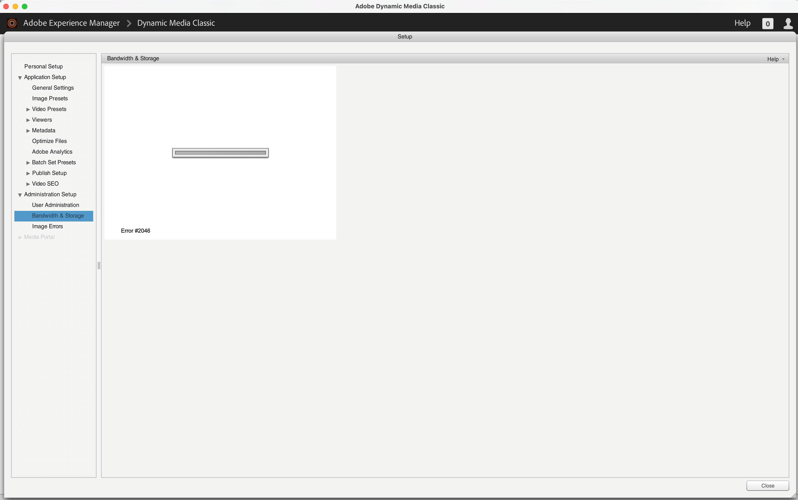

# Troubleshoot Dynamic Media {#troubleshooting-dynamic-media-scene-mode}

This topic provides troubleshooting guidance for **Dynamic Media**, covering common issues, their likely causes, and general approaches to resolving them. Dynamic Media is a capability used to create, manage, and deliver rich media assets—such as images, video, and interactive experiences—at scale, adapting content to different devices, screen sizes, and viewing conditions. Because it spans asset processing, delivery, and rendering across many environments, troubleshooting typically requires isolating whether an issue originates during asset ingestion, activation, or delivery.

## Common Dynamic Media Issue Categories

Most Dynamic Media problems fall into a small number of recognizable categories. Identifying the category first narrows the investigation and speeds up resolution:

- **Asset upload and processing failures** — assets that do not import, fail to generate renditions, or remain stuck in a processing state.
- **Activation and publishing problems** — assets that process successfully but do not become available on the delivery layer.
- **Delivery and rendering issues** — images or video that fail to load, display incorrectly, or serve at the wrong dimensions or quality.
- **Viewer and embed problems** — interactive viewers, video players, or embedded experiences that do not initialize or behave as expected.
- **Configuration and connectivity issues** — incorrect service settings, credentials, or network conditions that interrupt communication between the authoring environment and the delivery service.

## General Troubleshooting Approach

A structured approach resolves most Dynamic Media issues more reliably than trial and error. Work through the following steps in order:

1. **Confirm the asset processed correctly.** Verify that the source asset uploaded fully and generated the expected renditions, because delivery and rendering failures often trace back to incomplete processing.
2. **Verify activation status.** Ensure the asset is published or activated to the delivery service, since assets that appear correct in authoring may still be unavailable to end users if activation did not complete.
3. **Check delivery URLs and rendering parameters.** Confirm that delivery URLs are correct and that any sizing, format, or quality parameters match the intended output.
4. **Isolate the environment.** Determine whether the issue occurs in authoring, on the delivery service, or in the client browser, as this pinpoints where the failure is introduced.
5. **Review configuration and connectivity.** Validate service settings, credentials, and network connectivity between the authoring environment and the Dynamic Media delivery service.

## Where Issues Typically Occur

Understanding the typical points of failure helps target the investigation:

- **During ingestion**, unsupported file formats, corrupted source files, or interrupted uploads commonly prevent successful processing.
- **During activation**, incomplete or delayed publishing causes assets to be missing from the delivery layer even when they exist in the authoring environment.
- **During delivery**, caching, incorrect URLs, or misconfigured parameters lead to assets loading slowly, loading incorrectly, or not loading at all.

By confirming each stage in sequence—processing, activation, and delivery—you can efficiently isolate the root cause of a Dynamic Media issue and apply the appropriate resolution.

## New Dynamic Media configuration {#new-dm-config}

A **new Dynamic Media (DM) configuration** connects Adobe Experience Manager Assets to Dynamic Media so that images, video, and other rich media can be processed, optimized, and delivered at scale. Dynamic Media enables the dynamic generation of renditions, responsive image delivery, interactive viewers, and streaming video from a single master asset, which reduces the need to store and manage multiple pre-rendered variants.

### Purpose and troubleshooting scope

Setting up a new Dynamic Media configuration establishes the link between your AEM Assets environment and the Dynamic Media service, so that assets uploaded into AEM are synchronized, processed, and made available for optimized delivery. A correctly completed configuration is required before Dynamic Media features—such as Smart Imaging, dynamic renditions, and viewer embeds—function as expected.

Configuration issues typically surface when assets do not synchronize, renditions fail to generate, or delivery URLs do not resolve. Because these problems generally stem from incomplete or misapplied configuration settings, verifying the configuration is the recommended first step in diagnosing them.

For step-by-step guidance on diagnosing and resolving these issues, see [Troubleshoot a new Dynamic Media configuration](/help/assets/dynamic-media/config-dm.md#troubleshoot-dm-config).

## General (All Assets) {#general-all-assets}

The following best practices apply across all asset types. Applying these guidelines consistently improves organization, discoverability, and long-term maintainability, regardless of the specific kind of asset you are working with.

### Naming and Organization

Consistent naming and structure form the foundation of manageable assets. Key practices include:

- **Use clear, descriptive names.** Name each asset according to its purpose or content rather than using generic labels. This ensures assets remain identifiable at a glance and searchable later, even as a project grows.
- **Adopt a consistent naming convention.** Applying the same casing, separators, and prefixes across all assets reduces confusion and makes automated processing and sorting more reliable.
- **Group related assets together.** Organizing assets into logical folders or categories keeps large collections navigable and helps team members locate what they need quickly.

### Reuse and Efficiency

Reusing existing assets is more efficient than recreating them and helps maintain visual and functional consistency. Recommended approaches include:

- **Check for existing assets before creating new ones.** This avoids duplication, saves time, and prevents the accumulation of redundant files.
- **Favor shared or reusable assets** where the same element appears in multiple places. Centralizing a single source means updates propagate everywhere the asset is used, rather than requiring changes in many locations.

### Maintenance and Quality

Well-maintained assets stay usable over time and reduce technical debt. Practical steps include:

- **Remove unused assets periodically.** Clearing out assets that are no longer referenced keeps the collection lean and easier to manage.
- **Keep assets optimized.** Using appropriately sized and formatted assets improves performance and reduces unnecessary overhead.
- **Document important details.** Recording an asset's purpose, source, or any usage notes helps current and future team members understand how and where each asset should be used.

Following these general practices establishes a reliable baseline that carries over to every specific asset type, making individual assets easier to create, update, and maintain.

### Asset synchronization status properties {#asset-synchronization-status-properties}

Four asset properties confirm the successful synchronization of an asset from **Adobe Experience Manager (AEM)** to **Dynamic Media**: `dam:scene7ID`, `dam:scene7FileStatus`, `dam:scene7File`, and `dam:lastSyncStatus`. Review these properties directly in **CRXDE Lite**, the browser-based development environment used to inspect the AEM content repository (JCR) node structure. Each property provides a specific signal about the state of the asset's link to Dynamic Media.

#### How to verify synchronization in CRXDE Lite

The following asset properties are reviewed in CRXDE Lite to confirm the successful synchronization of the asset from Adobe Experience Manager to Dynamic Media:

| **Property** |**Example** |**Description** |
|---|---|---|
| `<object_node>/jcr:content/metadata/dam:scene7ID` |**`a\|364266`** |General indicator that the node is linked to Dynamic Media. The presence of this value confirms that AEM has established an association between the asset node and its Dynamic Media (Scene7) counterpart. |
| `<object_node>/jcr:content/metadata/dam:scene7FileStatus` |**PublishComplete** or error text |Status of the upload of the asset to Dynamic Media. A value of **PublishComplete** indicates the upload finished successfully; error text in this field signals that the upload did not complete. |
| `<object_node>/jcr:content/metadata/dam:scene7File`  |**myCompany/myAssetID** |Must be populated to generate URLs to the remote asset in Dynamic Media. Because delivery URLs are constructed from this value, an empty `dam:scene7File` property means no Dynamic Media URL can be generated for the asset. |
| `<object_node>/jcr:content/dam:lastSyncStatus` |**success** or **failed: `<error text>`** |Synchronization status of sets (spin sets, image sets, and so on), image presets, viewer presets, image map updates for an asset, or images that were edited. A value of **success** confirms the last synchronization operation completed, while **failed: `<error text>`** identifies the specific error that prevented synchronization. |

#### Why these properties matter

Each property serves as a distinct checkpoint in the asset delivery pipeline, so reviewing all four together provides a complete picture of an asset's synchronization state. The **`dam:scene7ID`** and **`dam:scene7File`** properties confirm that the link and file reference exist, **`dam:scene7FileStatus`** confirms the upload itself, and **`dam:lastSyncStatus`** confirms that dependent artifacts—such as spin sets, image sets, image presets, viewer presets, and image map updates—synchronized correctly. When an asset fails to deliver as expected in Dynamic Media, inspecting these properties in CRXDE Lite is the direct way to isolate which stage of the process—linking, upload, or set synchronization—did not complete.

### Synchronization logging {#synchronization-logging}

Synchronization errors and issues are recorded in the **`error.log`** file, located in the Experience Manager server directory **`/crx-quickstart/logs/`**. This log is the primary reference point for diagnosing problems with asset synchronization.

The default logging level provides sufficient detail to determine the root cause of most synchronization issues. For deeper investigation of harder-to-reproduce problems, administrators can raise the logging verbosity to **`DEBUG`** on the **`com.adobe.cq.dam.ips`** package. DEBUG-level logging surfaces more granular diagnostic events, capturing additional context around the synchronization process that is not written at the default level.

**To increase synchronization logging to DEBUG:**

1. Open the Sling Console at [https://localhost:4502/system/console/slinglog](https://localhost:4502/system/console/slinglog).
2. Locate or add a logger configuration for the **`com.adobe.cq.dam.ips`** package.
3. Set the log level to **`DEBUG`**.
4. Reproduce the synchronization issue, then review the additional detail written to **`error.log`** in **`/crx-quickstart/logs/`**.

Increasing the log level in this way gathers more information about the synchronization workflow, making it easier to isolate the underlying cause when the default logging does not provide enough detail.

### Version Control {#version-control}

When replacing an existing Dynamic Media asset that shares the **same name and location**, Adobe Experience Manager offers two distinct handling options: **keep both assets** or **replace the existing asset**. Version control determines which of these behaviors applies at upload.

* **Keeping both assets:** The newly uploaded file is stored under a **unique name** so that the published asset URL remains distinct. For example, `image.jpg` is the original asset, and `image1.jpg` is the newly uploaded asset. Because each file retains its own name, both assets remain independently addressable and deliverable, preventing the new upload from overwriting the original.

* **Creating a version:** Creating a version is **not supported** in Dynamic Media. As a result, the new upload does not append to a version history. Instead, **the new asset replaces the existing asset in delivery**, meaning the previously published file is superseded and the updated content is served in its place. Because no prior version is retained for delivery, replacement is effectively permanent for the delivered asset.

## Images and Sets {#images-and-sets}

Resolve common problems with images and sets using the troubleshooting guidance below. Image and set errors typically stem from unsupported formats, incomplete uploads, incorrect naming, cache conflicts, or configuration mismatches. Identifying the category of the issue first is the most reliable path to a quick fix, because most image and set failures fall into a small number of recurring patterns.

### Common Image and Set Issues

The most frequently encountered problems with images and sets include:

- **Images not displaying** — a broken, blank, or missing image often indicates an invalid file path, an unsupported file format, or a failed upload.
- **Incorrect or outdated images** — when an old version appears after an update, the cause is usually cached content that has not been refreshed.
- **Sets not loading fully** — a partial or incomplete set typically results from missing member items, a broken reference, or an interrupted synchronization.
- **Formatting or resolution problems** — distorted, stretched, or low-quality images generally point to size, aspect ratio, or resolution settings that do not match the requirements.
- **Permission or access errors** — an image or set that fails to load may be restricted by access permissions or an expired link.

### Step-by-Step Troubleshooting

Work through the following steps in order, because each step rules out a common cause before moving to a more involved solution:

1. **Verify the file format and size.** Confirm the image uses a supported format and falls within the accepted size limits. This ensures the system can render the file without conversion errors.
2. **Confirm the upload completed.** Re-upload any image that appears missing or corrupted, because interrupted uploads are a leading cause of broken images.
3. **Clear the cache and refresh.** Clearing the browser or application cache forces the latest version to load, resolving cases where an outdated image is displayed.
4. **Check the file path and references.** Ensure each image and set reference points to a valid, existing location, because a broken path prevents the image from loading.
5. **Review permissions and access settings.** Confirm that the image or set is accessible and that any shared link has not expired.
6. **Test in an alternate environment.** Load the image or set in a different browser, device, or session to determine whether the issue is local rather than systemic.

### Preventing Image and Set Errors

To reduce recurring problems, apply these preventive practices:

- Use consistent, supported file formats and naming conventions across all images and sets.
- Confirm each upload finishes completely before proceeding, which prevents partial or corrupted files.
- Keep image references and set members synchronized so that no member item is missing or orphaned.
- Refresh cached content after making updates to ensure the current version is always served.

<table>
 <tbody>
  <tr>
   <td><strong>Issue</strong></td>
   <td><strong>How to debug</strong></td>
   <td><strong>Solution</strong></td>
  </tr>
  <tr>
   <td>Cannot access copy URL/Embed button in asset detail view</td>
   <td>
    <ol>
     <li>
Go to CRX/DE:

      <ul>
       <li>Check whether the preset in the JCR <code>/etc/dam/presets/viewer/&lt;preset&gt; has lastReplicationAction</code> defined. This location applies if you upgraded from Experience Manager 6.x to 6.4 and opted out of migration. Otherwise, the location is <code>/conf/global/settings/dam/dm/presets/viewer</code>.</li>
       <li>Check to make sure that the asset in the JCR has <code>dam:scene7FileStatus</code><strong> </strong>under Metadata shows as <code>PublishComplete</code>.</li>
      </ul> </li>
    </ol> </td>
   <td>
Refresh page/navigate to another page and come back (side rail JSP must be recompiled)
 
If that does not work:

    <ul>
     <li>Publish asset.</li>
     <li>Reupload asset and publish it.</li>
    </ul> </td>
  </tr>
  <tr>
   <td>Carousel hotspot moves around after switching between slides</td>
   <td>
Check that all slides are the same size.
 </td>
   <td>
Use only images with the same size for the carousel.
 </td>
  </tr>
  <tr>
   <td>Image does not preview with the Dynamic Media viewer</td>
   <td>
Check that the asset contains <code>dam:scene7File</code> in the Metadata properties (CRXDE Lite)
 </td>
   <td>
Check that all assets have finished processing.
 </td>
  </tr>
  <tr>
   <td>Uploaded asset does not show in asset selector</td>
   <td>
Check asset has property <code>jcr:content</code> &gt; <strong><code>dam:assetState</code></strong> = <code>processed</code> (CRXDE Lite)
 </td>
   <td>
Check that all assets have finished processing.
 </td>
  </tr>
  <tr>
   <td>Banner on card view shows <strong>New</strong> when asset has not started processing</td>
   <td>Check asset <code>jcr:content</code> &gt; <code>dam:assetState</code> = if <code>unprocessed</code> it was not picked up by the workflow.</td>
   <td>Wait until asset is picked up by workflow.</td>
  </tr>
  <tr>
   <td>Images or sets do not display the viewer URL or embed code</td>
   <td>Check if the viewer preset has been published.</td>
   <td>
Go to <strong>Tools</strong> &gt; <strong>Assets</strong> &gt; <strong>Viewer Presets</strong> and publish the viewer preset.
 </td>
  </tr>
 </tbody>
</table>

If the problem persists after completing these troubleshooting steps, escalate the issue to support with details of the specific image or set affected, the steps already attempted, and any error messages observed. Providing this information helps identify the root cause more efficiently.

## Video {#video}

Video playback problems are among the most common technical issues, and most are resolved with a few standard troubleshooting steps. If video is not loading, appears frozen, plays without sound, or displays a black screen, use the guidance below to identify and resolve the problem.

### Common Causes of Video Problems

Most video issues stem from a small set of predictable causes. Understanding the cause helps you apply the correct fix:

- **Insufficient or unstable network connection** — Streaming video requires consistent bandwidth. A weak or fluctuating connection causes buffering, stalling, or automatic downgrades in quality.
- **Outdated browser or application** — Older software may not support current video formats or playback standards, resulting in errors or blank screens.
- **Corrupted cache or cookies** — Stored temporary data can conflict with new video content and prevent it from loading correctly.
- **Browser extensions or ad blockers** — Certain extensions interfere with video players by blocking scripts required for playback.
- **Outdated graphics drivers or hardware acceleration conflicts** — These are frequent sources of black screens, choppy playback, or crashes.
- **Audio or codec incompatibility** — Missing or unsupported codecs can cause video to play without sound or fail to render entirely.

### Step-by-Step Video Troubleshooting

Follow these steps in order. Each step addresses the most likely cause first, so the problem is often resolved before reaching the later steps:

1. **Check your internet connection.** Confirm that other websites and services load normally. A slow or dropping connection is the leading cause of buffering and playback failure. If possible, switch to a wired connection or move closer to your wireless router.
2. **Refresh the page and restart playback.** Reloading clears a temporary loading error and re-establishes the connection to the video source.
3. **Update your browser or application.** Running the latest version ensures compatibility with current video formats and playback features.
4. **Clear the cache and cookies.** Removing stored temporary data eliminates conflicts that prevent video from loading. Restart the browser afterward.
5. **Disable extensions and ad blockers.** Turn these off temporarily to determine whether one of them is blocking the video player. If the video works, re-enable extensions one at a time to identify the source.
6. **Lower the video quality.** If the video plays but stalls repeatedly, selecting a lower resolution reduces the required bandwidth and produces smoother playback.
7. **Update graphics drivers or toggle hardware acceleration.** Outdated drivers cause visual glitches and black screens. If problems persist, disabling hardware acceleration in your browser settings often resolves rendering issues.
8. **Try a different browser or device.** If the video plays elsewhere, the problem is specific to the original browser or device rather than the video source itself.

### When to Seek Further Support

If video problems continue after completing every step above, the issue may originate with the video source or a deeper system configuration. In this case, note the following details before contacting support, because they speed up diagnosis:

- The exact error message or a description of what appears on screen
- The browser or application name and version
- The operating system and device type
- Whether the problem occurs with all videos or only specific ones

<table>
 <tbody>
  <tr>
   <td><strong>Issue</strong></td>
   <td><strong>How to debug</strong></td>
   <td><strong>Solution</strong></td>
  </tr>
  <tr>
   <td>Video cannot be previewed</td>
   <td>
    <ul>
     <li>Check that the folder has a video profile assigned to it (if non-supported file format). If non-supported, only an image displays.</li>
     <li>Video profile must contain more than one encoding preset to generate an AVS set (single encodings are treated as video content for MP4 files; for non-supported files, treated the same as non-processed).</li>
     <li>Check that the video has finished processing by confirming <code>dam:scene7FileAvs</code> of <code>dam:scene7File</code> in metadata.</li>
    </ul> </td>
   <td>
    <ol>
     <li>Assign a video profile to the folder.</li>
     <li>Edit video profile to include more than one encoding preset.</li>
     <li>Wait for video to finish processing.</li>
     <li>Before you reload the video, make sure that the Dynamic Media Encode Video workflow is not running.  </li>
     <li>Reupload the video.</li>
    </ol> </td>
  </tr>
  <tr>
   <td>Video is not encoded</td>
   <td>
    <ul>
     <li>Check whether Dynamic Media Cloud Service is configured.</li>
     <li>Check whether a video profile is associated with the upload folder.</li>
    </ul> </td>
   <td>
    <ol>
     <li>Check that the Dynamic Media Configuration under Cloud Services is properly set up.</li>
     <li>Check that the folder has a video profile. Also, check the video profile.</li>
    </ol> </td>
  </tr>
  <tr>
   <td>Video processing takes too long</td>
   <td>
To determine if video encoding is still in progress or if it has entered a failure state:

    <ul>
     <li>Check the video status <code>https://localhost:4502/crx/de/index.jsp#/content/dam/folder/videomp4/jcr%3Acontent</code> &gt; <code>dam:assetState</code></li>
    </ul> </td>
   <td> </td>
  </tr>
  <tr>
   <td>Video rendition missing</td>
   <td>
When video is uploaded, but there are no encoded renditions:

    <ul>
     <li>Check that the folder has a video profile assigned to it.</li>
     <li>Check that the video has finished processing by confirming <code>dam:scene7FileAvs</code> in metadata.</li>
    </ul> </td>
   <td>
    <ol>
     <li>Assign a video profile to the folder.</li>
     <li>Wait for video to finish processing.  </li>
    </ol> </td>
  </tr>
 </tbody>
</table>

Providing this information allows support to reproduce the issue and identify whether the cause is local to your device or affects the video service itself.

## Viewers {#viewers}

Viewers can experience playback, loading, display, and compatibility issues that prevent content from rendering correctly. The troubleshooting guidance below addresses the most common viewer problems and provides a step-by-step path to resolving them.

### Common Viewer Issues

Viewer problems generally fall into a few recognizable categories:

- **Content fails to load** — the viewer opens but displays a blank screen, a spinner, or an error message instead of the expected content.
- **Playback or rendering errors** — the content loads partially, freezes, or displays incorrectly.
- **Compatibility issues** — the viewer does not function as expected in a particular browser, device, or operating system.
- **Performance problems** — slow loading, lag, or unresponsiveness during use.

Most viewer issues stem from a small set of underlying causes, including outdated software, browser cache conflicts, blocked scripts, unstable network connections, or unsupported file formats. Identifying which category applies is the first step toward a fast resolution.

### Troubleshooting Steps

Follow these steps in order, as the earlier steps resolve the most frequent problems:

1. **Refresh and reload the viewer.** A temporary loading glitch is often cleared by reloading the page or reopening the viewer.
2. **Clear the browser cache and cookies.** Stale cached data is a common cause of blank screens and outdated content, so clearing it forces the viewer to reload fresh resources.
3. **Update your browser or application.** Running the latest version ensures compatibility with the viewer's rendering requirements.
4. **Try a different browser or device.** This isolates whether the issue is specific to one environment or affects the content itself.
5. **Check the network connection.** An unstable or restricted connection prevents the viewer from retrieving content, so confirming a stable connection resolves many loading failures.
6. **Disable conflicting extensions or blockers.** Ad blockers, script blockers, and privacy extensions can interfere with viewer functionality; temporarily disabling them helps confirm whether they are the cause.

If the issue persists after completing these steps, the problem may originate with the content source or the viewer configuration rather than the local environment, and further diagnostic support may be required.

### Issue: Viewer presets are not published {#viewers-not-published}

**Symptom:** Viewer presets have not been published (activated), which prevents Dynamic Media viewers from rendering correctly for delivered assets. Resolving this requires confirming the activation status and publishing any unactivated presets.

**How to debug: Verify viewer preset activation status**

Follow these steps to identify why viewer presets are not published:

1. Proceed to the sample manager diagnostic page: `https://localhost:4502/libs/dam/gui/content/s7dam/samplemanager/samplemanager.html`.
1. Observe the computed values reported by the diagnostic page. When the system operates correctly, the diagnostic page reports the following: `_DMSAMPLE status: 0 unsyced assets - activation not necessary _OOTB status: 0 unsyced assets - 0 unactivated assets`. Here, the **DMSAMPLE** status refers to Dynamic Media sample assets, and the **OOTB** status refers to the out-of-the-box viewer assets. A count of **0 unsynced assets** and **0 unactivated assets** confirms that everything is synced and activated as expected.

   >[!NOTE]
   >
   >It can take about **10 minutes** after configuration of the Dynamic Media cloud settings for the viewer assets to sync. If the counts are not yet zero, wait for this synchronization window to complete before continuing to troubleshoot.

1. If unactivated assets remain, this indicates that one or more viewer presets were never published. Select either of the **List all Unactivated Assets** buttons to see the details of which assets still require activation.

**Solution: Publish the viewer presets**

Because unactivated assets result from presets that have not been published, the fix is to publish them explicitly:

1. Navigate to the viewer preset list in admin tools: `https://localhost:4502/libs/dam/gui/content/s7dam/samplemanager/samplemanager.html`.
1. Select all viewer presets, then select **Publish**. Publishing activates the presets so that their associated assets are synced and made available for delivery, which clears the unactivated status.
1. Navigate back to the sample manager and confirm that the unactivated asset count is now **zero**. A zero count verifies that the viewer presets are published successfully and the issue is resolved.

### Issue: Viewer preset artwork returns 404 from Preview in asset details or Copy URL/Embed code {#viewer-preset-404}

**How to debug: verifying sync status and requesting artwork directly**

In CRXDE Lite (the developer console for the Adobe Experience Manager repository), perform the following steps:

1. Navigate to `<sync-folder>/_CSS/_OOTB` folder within your Dynamic Media sync folder (for example, `/content/dam/_CSS/_OOTB`).
1. Find the metadata node of the problematic asset (for example, `<sync-folder>/_CSS/_OOTB/CarouselDotsLeftButton_dark_sprite.png/jcr:content/metadata/`).
1. Check for the presence of `dam:scene7*` properties. If the asset synced and published successfully, the **`dam:scene7FileStatus`** property is set to **PublishComplete**, confirming the asset synced and published successfully. If these `dam:scene7*` properties are absent, the asset never completed the sync-and-publish workflow, which is the underlying cause of the 404.
1. Attempt to request the artwork directly from Dynamic Media by concatenating the values of the following properties and string literals. A successful direct request confirms the artwork exists on the Dynamic Media server; a 404 confirms it was never published:

   * `dam:scene7Domain`
   * `"is/content"`
   * `dam:scene7Folder` 
   * `<asset-name>` 
    Example: `https://<server>/is/content/myfolder/_CSS/_OOTB/CarouselDotsLeftButton_dark_sprite.png`

**Solution: restarting the copy and sync process**

If the direct request fails or the `dam:scene7*` properties are missing, the sample assets or viewer preset artwork has not synced or published. As a result, restart the entire copy/sync process:

1. Navigate to CRXDE Lite. 
1. Delete `<sync-folder>/_CSS/_OOTB`. This removes the stale, unsynced artwork folder so it can be regenerated cleanly.
1. Navigate to the CRX Package Manager (the repository package installation tool): `https://localhost:4502/crx/packmgr/`.
1. Search for the viewer package in the list; it starts with `cq-dam-scene7-viewers-content`.
1. Select **Reinstall**. Reinstalling this package restores the out-of-the-box viewer preset content.
1. Under Cloud Services, navigate to the Dynamic Media Configuration page, then open the configuration dialog box for your Dynamic Media - S7 configuration.
1. Make no changes, then select **Save**.
   This save action triggers the configuration logic again, because re-saving the Dynamic Media - S7 configuration forces Experience Manager to recreate and re-sync the sample assets, viewer preset CSS, and artwork, resolving the 404 error.

### Issue: Error #2046 When Opening the Bandwidth & Storage Tab {#error-2046-bandwidth-storage}

**Cause: Expired Signing Certificate in a Cached RSL**

**Error #2046** appears when users open the **Bandwidth & Storage** tab in the **Dynamic Media Classic (Scene7)** desktop application, an Adobe asset-management tool used to host, manage, and deliver rich media. The error is caused by an **expired digital signing certificate** contained in a cached **RSL (Runtime Shared Library)** used by the **Adobe AIR (Adobe Integrated Runtime)** framework.

The failure is triggered during **local certificate re-validation**: when the application loads the cached RSL, it attempts to verify the signing certificate, and because that cached certificate has expired, the validation fails and Error #2046 is thrown. Because the problem lies in the locally stored library rather than the application itself, the fix is to remove the outdated cached files so that a current, validly signed RSL can be retrieved.

**Solution: Clear the Local Adobe AIR Cache**

Clear the local cache to force **Adobe AIR** to download the updated **RSL (Runtime Shared Library)**. Deleting the stale cached files removes the expired certificate, and on the next launch Adobe AIR downloads a freshly signed RSL that passes local certificate re-validation, resolving the error.

**macOS**

1. Navigate to:
   `~/Library/Caches/Adobe/Flash Player/AssetCache/<folder>/`
2. Delete all `.swz` and `.heu` files.

**Windows**

1. Navigate to:
   `%APPDATA%\Adobe\Flash Player\AssetCache\<folder>\`
2. Delete all files inside the folder.

**Restart the application after clearing the cache.** On restart, open the **Bandwidth & Storage** tab again to confirm that Error #2046 no longer appears, which indicates the updated RSL was successfully downloaded and validated.

### Issue: Image Preview is not loading in Viewer presets authoring {#image-preview-not-loading}

**Solution**

The **Image Preview** fails to load in Viewer presets authoring when stale sample content and cached viewer preset artifacts prevent the preview from rendering. Clear these artifacts and re-create the Dynamic Media configuration to restore the preview.

1. In Experience Manager, select the Experience Manager logo to access the global navigation console, then navigate to **[!UICONTROL Tools]** > **[!UICONTROL General]** > **[!UICONTROL CRXDE Lite]**.
1. In the left rail, navigate to the sample content folder at the following location:

   `/content/dam/_DMSAMPLE`

1. Delete the `_DMSAMPLE` folder. This removes outdated sample content that can block the preview from rendering correctly.
1. In the left rail, navigate to the presets folder at the following location:

   `/conf/global/settings/dam/dm/presets/viewer`

1. Delete the `viewer` folder. Removing this folder clears cached viewer preset settings so they are regenerated cleanly.
1. Near the upper-left corner of the CRXDE Lite page, select **[!UICONTROL Save All]** to commit the deletions to the repository.
1. In the upper-left corner of the CRXDE Lite page, select the **Back Home** icon.
1. Re-create a [Dynamic Media Configuration in Cloud Services](/help/assets/dynamic-media/config-dm.md#configuring-dynamic-media-cloud-services). This step regenerates the sample content and viewer presets that were removed, restoring the **Image Preview** in Viewer presets authoring.
