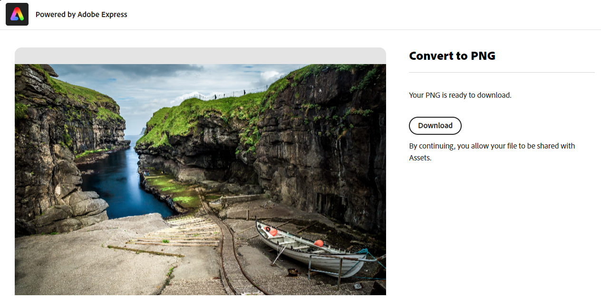
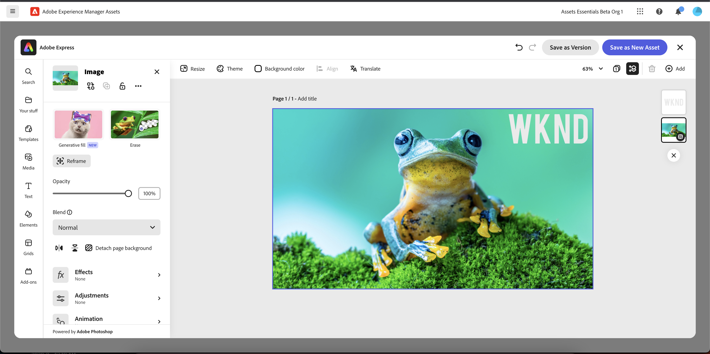

# Edit images in [!DNL Assets view] {#edit-images}

[!DNL Assets view] provides user-friendly editing options that are powered by [!DNL Adobe Express] and [!DNL Adobe Photoshop Express]. The editing actions that are available using [!DNL Adobe Express] are Resize image, Remove background, Crop image, and Convert JPEG into PNG.

After editing an image, you can save the new image as a new version. Versioning helps you to revert to the original asset later, if needed. To edit an image, [open its preview](/help/assets/navigate-assets-view.md) and click **[!UICONTROL Edit Image]**.

>[!NOTE]
>
>You can edit images of PNG and JPEG file types using [!DNL Adobe Express].

<!--The editing actions that are available are Spot healing, Crop and straighten, Resize image, and Adjust image.-->

## Edit images using Adobe Express {#edit-using-express}

>[!CONTEXTUALHELP]
>id="assets_express_integration"
>title="Adobe Express Integration"
>abstract="Easy and intuitive image editing tools powered by Adobe Express available directly within AEM Assets to increase content re-use and accelerate content velocity."

### Resize image {#resize-image-using-express}

Resizing an image to a specific size is a popular use case. [!DNL Assets view] lets you quickly resize image to fit the common photo sizes by providing pre-calculated new resolutions for specific photo sizes. To resize the image using [!DNL Assets view], follow the steps below: 

1. Select an image and click **Edit**.
2. Click **[!DNL Resize Image]** from the quick actions available in the left pane.
3. Select the appropriate social media platform from the **[!UICONTROL Resize for]** drop-down list and select the image size from the options that display. 
4. Scale the image, if necessary, using the **[!UICONTROL Image Scale]** field.
5. Click **[!DNL Apply]** to apply your changes.
   

   Your edited image is available for download. You can either save the edited asset as a new version of the same asset or save it as a new asset.
   

### Remove background {#remove-background-using-express}

You can remove background from an image in a few simple steps as mentioned below: 

1. Select an image and click **Edit**.
2. Click **[!DNL Remove Background]** from the quick actions available in the left pane. Experience Manager Assets displays the image with no background.
3. Click **[!DNL Apply]** to apply your changes.

   Your edited image is available for download. You can either save the edited asset as a new version of the same asset or save it as a new asset.

### Crop image {#crop-image-using-express}

Transforming an image into a perfect size is easy using embedded [!DNL Adobe Express] quick actions.

1. Select an image and click **Edit**.
2. Click **[!DNL Crop Image]** from the quick actions available in the left pane.
3. Drag the handles on the corners of the image to create your desired crop.
4. Click **[!DNL Apply]**.
   
   The cropped image is available for download. You can either save the edited asset as a new version of the same asset or save it as a new asset.

### Convert JPEG to PNG {#convert-jpeg-to-png-using-express}

You can quickly convert a JPEG image into a PNG format using Adobe Express. Execute the following steps:

1. Select an image and click **Edit**.
2. Click **[!DNL JPEG to PNG]** from the quick actions available in the left pane.
   
3. Click **[!UICONTROL Download]**.

### Limitations {#limitations-adobe-express}

* Supported image resolution: Minimum - 50 pixels, Maximum - 6000 pixels per dimension

* Maximum file size supported: 17MB

## Edit images using Adobe Express embedded editor {#edit-using-embedded-editor}

[!DNL Assets view] provides comprehensive editing of the images directly from your assets repository. The embedded editor allows easy and intuitive editing of an image using [!DNL Adobe Express]. It accelerates reusability of the assets by using templates or modifying the existing assets. You can use pre-defined elements to make your asset look stunning or perform quick actions to edit your image with just a few clicks.

To edit images using [!DNL Adobe Express] embedded editor, follow the steps below:

1. Select an image from your [!DNL Experience Manager] Assets repository.
1. Click **[!UICONTROL Open in Adobe Express]**. [!DNL Adobe Express] screen appears.

   

   You can leverage the functionality of [!DNL Adobe Express] to perform all the image-editing related actions, such as [resize image](https://helpx.adobe.com/in/express/using/resize-image.html), [remove or change background color](https://helpx.adobe.com/in/express/using/remove-background.html), [crop image](https://helpx.adobe.com/in/express/using/crop-image.html), and much more.

1. Once you complete image editing, you can download an asset as a new asset or save the asset as a new version. 

## Create new asset using Adobe Express {#create-new-embedded-editor}

[!DNL Assets view] provides functionality to create a new template from scratch using [!DNL Adobe Express] embedded editor. To create a new asset using [!DNL Adobe Expresss], execute the below steps:

1. Navigate to **[!UICONTROL My Workspace]** and click **[!UICONTROL Create]**. [!DNL Adobe Express] blank canvas displays within the [!DNL Assets view] user interface.
1. Create your content using [Templates](https://helpx.adobe.com/in/express/using/work-with-templates.html). Otherwise, navigate to **[!UICONTROL Your Stuff]** to modify existing content.
1. Once you complete editing, click **[!UICONTROL Save as new asset]**. 
1. Specify destination path for the created asset.

>[!NOTE]
>
>* You can only modify `JPEG` and `PNG` formats.
>* The asset size should be less than 14 MB.
>* You can save an image as `PDF`, `JPEG`, or `PNG` formats.

## Edit images using [!DNL Adobe Photoshop Express] {#edit-using-photoshop-express}

<!--
After editing an image, you can save the new image as a new version. Versioning helps you to revert to the original asset later, if needed. To edit an image, [open its preview](//help/navigate-assets-view.md#preview-assets) and click **[!UICONTROL Edit Image]**  from the rail on the right.

*Figure: The options to edit images are powered by [!DNL Adobe Photoshop Express].*
-->

### Spot heal images {#spot-heal-images-using-photoshop-express}

If there are minor spots or small objects on an image, you can edit and remove the spots using the spot healing feature provided by Adobe Photoshop.

The brush samples the retouched area and makes the repaired pixels blend seamlessly into the rest of the image. Use a brush size that is only slightly larger than the spot you want to fix.

<!-- 
TBD: See if we should give backlinks to PS docs for these concepts.
For more information about how Spot Healing works in Photoshop, see [retouching and repairing photos](https://helpx.adobe.com/photoshop/using/retouching-repairing-images.html). 
-->

### Crop and straighten images {#crop-straighten-images-using-photoshop-express}

Using the crop and straighten option that you can do basic cropping, rotate image, flip it horizontally or vertically, and crop it to dimensions suitable for popular social media websites.

To save your edits, click **[!UICONTROL Crop Image]**. After editing, you can save the new image as a version.

Many default options let you crop your image to the best proportions that fit various social media profiles and posts.

### Resize image {#resize-image-using-photoshop-express}

You can view the common photo sizes in centimeters or inches to know the dimensions. By default, the resizing method retains the aspect ratio. To manually override the aspect ratio, click .

Enter the dimensions and click **[!UICONTROL Resize Image]** to resize the image. Before you save the changes as a version, you can either undo all the changes done before saving by clicking [!UICONTROL Undo] or you can change the specific step in the editing process by clicking [!UICONTROL Revert].

### Adjust image {#adjust-image-using-photoshop-express}

[!DNL Assets view] lets you adjust the color, tone, contrast, and more, with just a few clicks. Click **[!UICONTROL Adjust image]** in the edit window. The following options are available in the right sidebar:

* **Popular**: [!UICONTROL High Contrast & Detail], [!UICONTROL Desaturated Contrast], [!UICONTROL Aged Photo], [!UICONTROL B&W Soft], and [!UICONTROL B&W Sepia Tone].
* **Color**: [!UICONTROL Natural], [!UICONTROL Bright], [!UICONTROL High Contrast], [!UICONTROL High Contrast & Detail], [!UICONTROL Vivid], and [!UICONTROL Matte].
* **Creative**: [!UICONTROL Desaturated Contrast], [!UICONTROL Cool Light], [!UICONTROL Turquoise & Red], [!UICONTROL Soft Mist], [!UICONTROL Vintage Instant], [!UICONTROL Warm Contrast], [!UICONTROL Flat & Green], [!UICONTROL Red Lift Matte], [!UICONTROL Warm Shadows], and [!UICONTROL Aged Photo].
* **B&W**: [!UICONTROL B&W Landscape], [!UICONTROL B&W High Contrast], [!UICONTROL B&W Punch], [!UICONTROL B&W Low Contrast], [!UICONTROL B&W Flat], [!UICONTROL B&W Soft], [!UICONTROL B&W Infrared], [!UICONTROL B&W Selenium Tone], [!UICONTROL B&W Sepia Tone], and [!UICONTROL B&W Split Tone].
* **Vignetting**: [!UICONTROL None], [!UICONTROL Light], [!UICONTROL Medium], and [!UICONTROL Heavy].

<!--
TBD: Insert a video of the available social media options.
-->

### Next Steps {#next-steps}

* Provide product feedback using the [!UICONTROL Feedback] option available on the Assets view user interface

* Provide documentation feedback using [!UICONTROL Edit this page]  or [!UICONTROL Log an issue]  available on the right sidebar

* Contact [Customer Care](https://experienceleague.adobe.com/?support-solution=General#support)

>[!MORELIKETHIS]
>
>* [View version history of an asset](/help/assets/navigate-assets-view.md)
