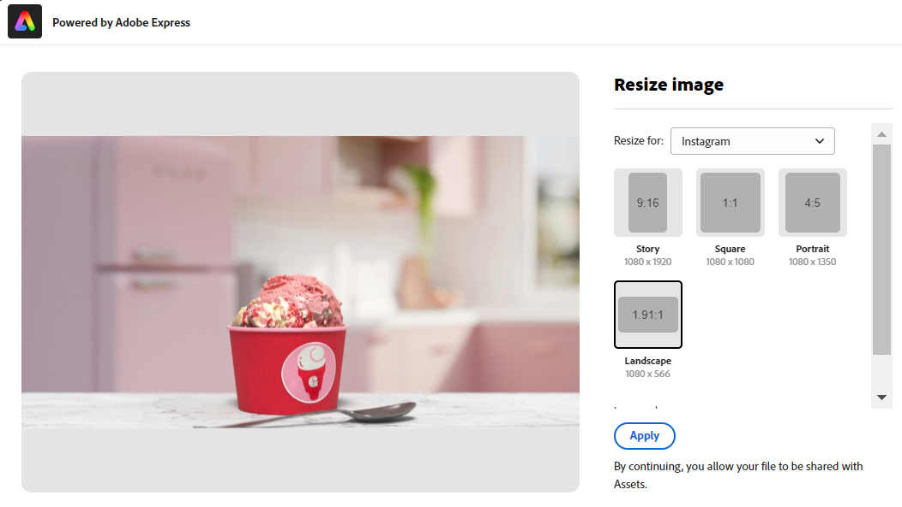
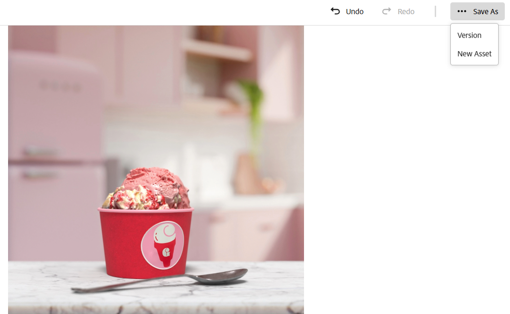
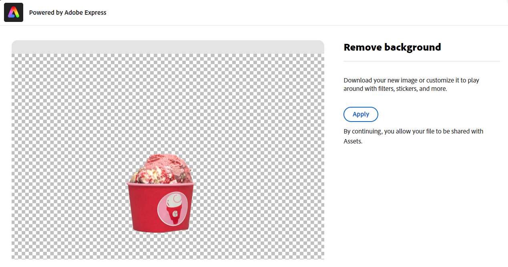
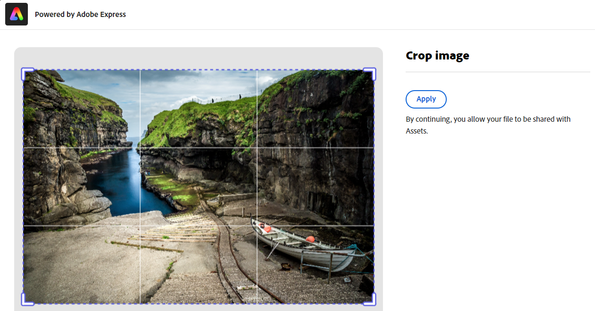
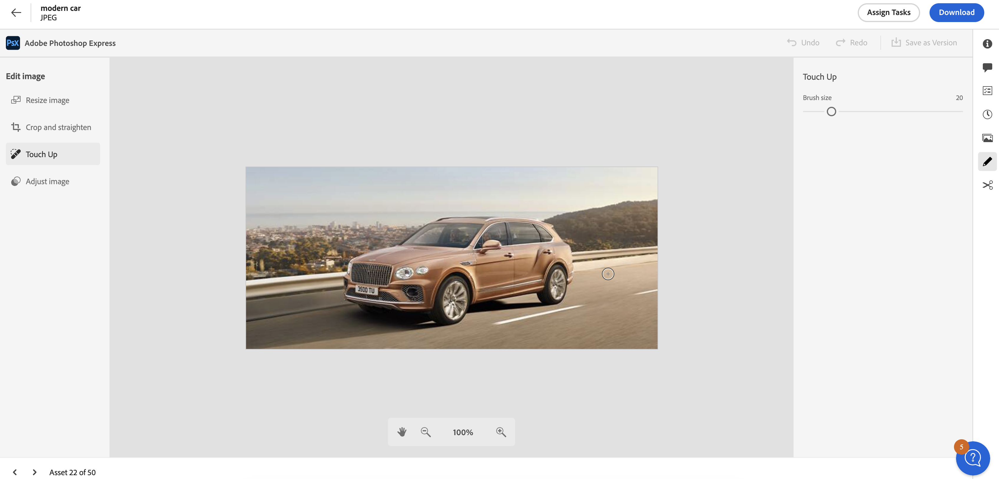
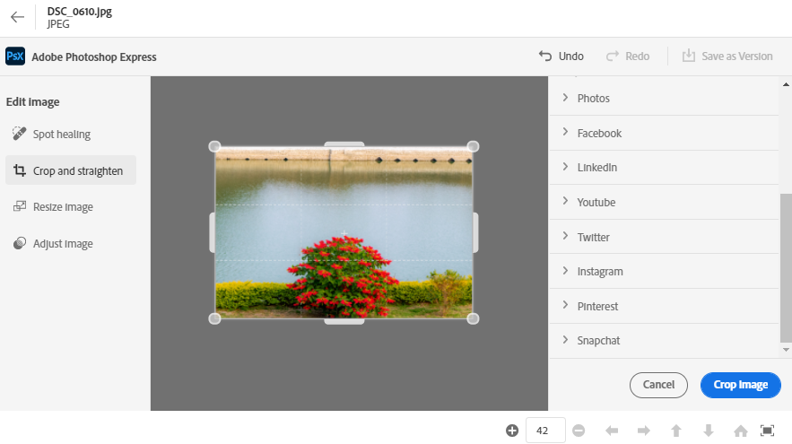
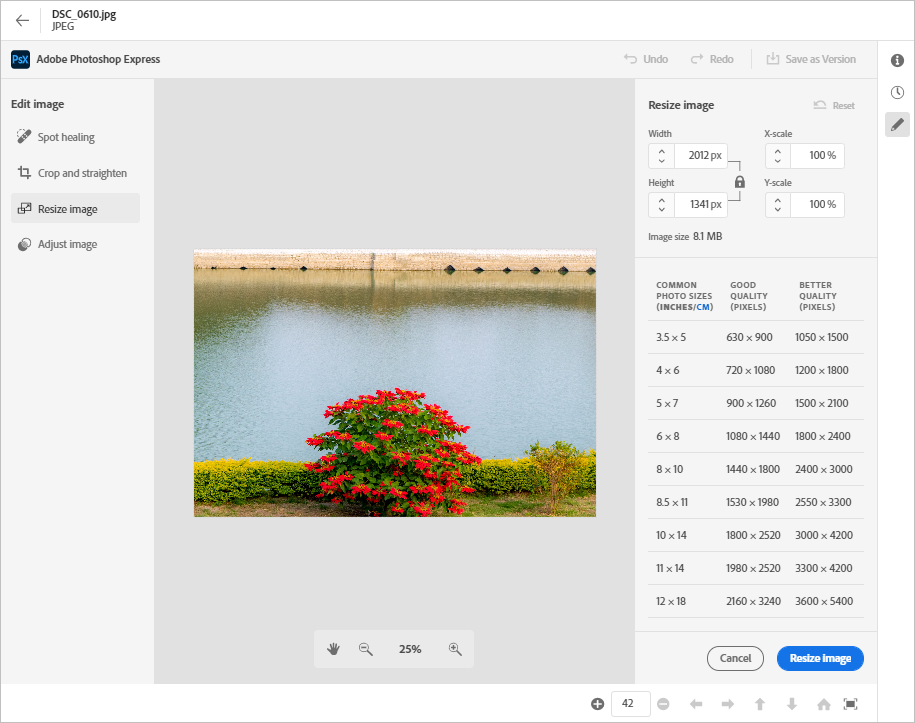
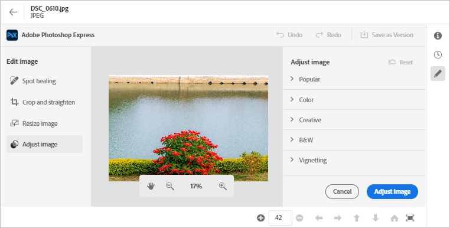

# Edit images in [!DNL Assets view] {#edit-images-in-assets-view}

| [Search Best Practices](/help/assets/search-best-practices.md) |[Metadata Best Practices](/help/assets/metadata-best-practices.md)|[Content Hub](/help/assets/product-overview.md)|[Dynamic Media with OpenAPI capabilities](/help/assets/dynamic-media-open-apis-overview.md)|[AEM Assets developer documentation](https://developer.adobe.com/experience-cloud/experience-manager-apis/)|
| ------------- | --------------------------- |---------|----|-----|

The Assets view UI enables basic image editing powered by Adobe Express, integrated to the UI. This editing includes resizing, background removal, cropping, and converting between JPEG and PNG formats. Additionally, it allows advanced editing through the Adobe Express interface Embedded within the Assets view UI. 

After editing an image, you can save the new image as a new version. Versioning helps you to revert to the original asset later if needed. To edit an image, [open its preview](https://experienceleague.adobe.com/en/docs/experience-manager-assets-essentials/help/navigate-view#preview-assets) and click **Edit Image**. 

>[!NOTE]
>
>You can edit images of PNG and JPEG file types using [!DNL Adobe Express].

<!--The editing actions that are available are Spot healing, Crop and straighten, Resize image, and Adjust image.-->

## Edit image {#edit-image}

Go to Assets view UI, using the link - [Assets View](https://experience.adobe.com/#/assets) and selecting the right repository. To receive access, contact your organization's administrator.
For any additional reference information refer - [Get started using Adobe Experience Manager Assets View](https://experienceleague.adobe.com/en/docs/experience-manager-cloud-service/content/assets/assets-view/get-started-assets-view), [Understand the Assets view user interface](https://experienceleague.adobe.com/en/docs/experience-manager-cloud-service/content/assets/assets-view/navigate-assets-view#understand-interface-navigation), and [Assets View use cases](https://experienceleague.adobe.com/en/docs/experience-manager-cloud-service/content/assets/assets-view/get-started-assets-view#use-cases).
<!--
>[!CONTEXTUALHELP]
>id="assets_express_integration"
>title="Adobe Express Integration"
>abstract="Easy and intuitive image-editing tools powered by Adobe Express available directly within AEM Assets to increase content reuse and accelerate content velocity."-->

### Edit Image on Assets View using Adobe Express {#edit-image-on-assets-view-using-adobe-express}

After navigating to Assets View, click **Assets**, select an image, and then click **Edit** from the top rail. The new screen displays the available editing options powered by Adobe Express, which includes resizing, background removal, cropping, and converting between JPEG and PNG formats.

#### Resize image {#resize-image-using-express}

Resizing an image to a specific size is a popular use case. Assets View lets you quickly resize images to fit the common photo sizes by providing pre-calculated new resolutions for specific photo sizes. To resize the image using Assets View, follow the steps below: 

1. Click **Resize Image** from the left pane. A dialog box displays the resize image capabilities powered by Adobe Express.
1. Select the appropriate social media platform from the Resize drop-down list and select the image size from the options that display. 
1. Scale the image, if required, using the **Image Scale** field.
1. Click **[!UICONTROL Apply]** to apply your changes.
   

   Your edited image is available for download. You can either save the edited asset as a new version of the same asset or save it as a new asset.
   

#### Remove background {#remove-background-using-express}

You can remove background from an image by following the steps mentioned below: 

1. Click **Remove Background** from the left pane. Experience Manager Assets displays the image with no background. 
1. Click **[!UICONTROL Apply]** to apply your changes.

   Your edited image is available for download. You can either save the edited asset as a new version of the same asset or save it as a new asset.

#### Crop image {#crop-image-using-express}

Transforming an image into a perfect size is simple using embedded [!DNL Adobe Express] quick actions.

1. Click **[!UICONTROL Crop Image]** from the left pane.
2. Drag the handles on the corners of the image to create your desired crop.
3. Click **[!UICONTROL Apply]**.
   
   The cropped image is available for download. You can either save the edited asset as a new version of the same asset or save it as a new asset.

#### Convert JPEG to PNG {#convert-image-types-using-express}

You can quickly convert between JPEG and PNG image formats using Adobe Express. Execute the following steps: 
   
1. Click **JPEG to PNG** or **PNG to JPEG** from the left pane.
   <!---->
1. Click **[!UICONTROL Download]**.

#### Limitations {#limitations-adobe-express}

* Supported image resolution: Minimum - 50 pixels, Maximum - 6000 pixels per dimension.
* Maximum file size supported: 17 MB.

### Edit images in Adobe Express embedded editor {#edit-images-in-adobe-express-embedded-editor}

Users with Express entitlement can use the embedded Express editor from within the Assets View to easily edit content and create new content with GenAI from Adobe Firefly. This feature improves content reuse and accelerates content velocity. You can also use pre-defined elements to make your asset look stunning or perform quick actions to edit your image with just a few clicks. 

To edit images using [!DNL Adobe Express] embedded editor, follow the steps below:

1. Go to AEM Assets View using the link - [AEM Assets View](https://experience.adobe.com/#/assets) and select the right repository. 
1. Click **Assets**, enter a folder, and select an image. 
1. Click **Open in Adobe Express**. The image opens on an express canvas.
1. Make the required edits to the image. 
1. If your project requires you to add more pages, click **Add**, select assets, enter a folder, select an image to bring onto the canvas page, and then perform the required edits to the image. 
1. To save one or more assets, click **Save**. The save dialogue box displays the saving options. To select between the saving options, follow one of the instructions below that aligns with your requirement: 
   1. To save a single page, click **Save as Version** to export the image as a new version (retaining the original format), and save it in the same folder.
   
   1. To save a single page, click **Save as a new Asset** to export the asset into a different format and save it to any folder as a new asset. 
   
   1. To save a single page from multiple pages, click **Save as Version** to save the asset in its original format and location.
   
   1. To save multiple pages or a single page among multiple pages, click **Save as New Asset**. This action exports the single or multiple assets to any folder and saves them as new asset or assets in the original or a different format.

1. In the Save dialog box:  
   1. Enter a name for the file in the **Save As** field. 
   1. Select a destination folder. 
   1. Optional: Provide details such as Project or Campaign name, Keywords, Channels, Time frame, and Region. 
1. Click **Save as version** or **Save as new asset** to save the asset(s). 

#### Limitations of editing images in the Express Editor {#limitations-of-editing-images-in-the-express-editor}

 * Supported file type: JPEG or PNG. 
 * Maximum file size supported: 40 MB. 
 * Supported width and height range: Between 50 to 8000 pixels.
 * Reload the page to see the latest saved new asset in the source folder.

### Create new assets using Adobe Express {#create-new-embedded-editor}

[!DNL Assets view] enables you to create a new template from scratch using [!DNL Adobe Express] embedded editor. To create a new asset using [!DNL Adobe Express], execute the below steps:

1. Navigate to **[!UICONTROL My Workspace]** and click **[!UICONTROL Create]** within the Adobe Express banner that displays at the top. [!DNL Adobe Express] blank canvas displays within the [!DNL Assets view] user interface.
1. Create your content using [Templates](https://helpx.adobe.com/in/express/using/work-with-templates.html). Otherwise, navigate to **[!UICONTROL Your Stuff]** to modify existing content.
1. Once you complete editing, click **[!UICONTROL Save]**. 
1. Specify destination path for the created asset and click **[!UICONTROL Save as new asset]**.

#### Limitations {#limitations}

* You can only modify images of `JPEG` and `PNG` format types.
* The asset size must be less than 40 MB.
* You can save an image in `PDF`, `JPEG`, or `PNG` formats.

<!--
## Edit images using [!DNL Adobe Photoshop Express] {#edit-using-photoshop-express}

<!--
After editing an image, you can save the new image as a new version. Versioning helps you to revert to the original asset later, if needed. To edit an image, [open its preview](navigate-assets-view.md#preview-assets) and click **[!UICONTROL Edit Image]**  from the rail on the right.

*Figure: The options to edit images are powered by [!DNL Adobe Photoshop Express].*
-->
<!--
### Touch up images {#spot-heal-images-using-photoshop-express}

If there are minor spots or small objects on an image, you can edit and remove the spots using the spot healing feature provided by Adobe Photoshop.

The brush samples the retouched area and makes the repaired pixels blend seamlessly into the rest of the image. Use a brush size that is only slightly larger than the spot you want to fix.

<!-- 
TBD: See if we should give backlinks to PS docs for these concepts.
For more information about how Spot Healing works in Photoshop, see [retouching and repairing photos](https://helpx.adobe.com/photoshop/using/retouching-repairing-images.html). 
-->
<!-- 
### Crop and straighten images {#crop-straighten-images-using-photoshop-express}

Using the crop and straighten option that you can do basic cropping, rotate image, flip it horizontally or vertically, and crop it to dimensions suitable for popular social media websites.

To save your edits, click **[!UICONTROL Crop Image]**. After editing, you can save the new image as a version.

Many default options let you crop your image to the best proportions that fit various social media profiles and posts.

### Resize image {#resize-image-using-photoshop-express}

You can view the common photo sizes in centimeters or inches to know the dimensions. By default, the resizing method retains the aspect ratio. To manually override the aspect ratio, click .

Enter the dimensions and click **[!UICONTROL Resize Image]** to resize the image. Before you save the changes as a version, you can either undo all the changes done before saving by clicking [!UICONTROL Undo] or you can change the specific step in the editing process by clicking [!UICONTROL Revert].

### Adjust image {#adjust-image-using-photoshop-express}

[!DNL Assets view] lets you adjust the color, tone, contrast, and more, with just a few clicks. Click **[!UICONTROL Adjust image]** in the edit window. The following options are available in the right sidebar:

* **Popular**: [!UICONTROL High Contrast & Detail], [!UICONTROL Desaturated Contrast], [!UICONTROL Aged Photo], [!UICONTROL B&W Soft], and [!UICONTROL B&W Sepia Tone].
* **Color**: [!UICONTROL Natural], [!UICONTROL Bright], [!UICONTROL High Contrast], [!UICONTROL High Contrast & Detail], [!UICONTROL Vivid], and [!UICONTROL Matte].
* **Creative**: [!UICONTROL Desaturated Contrast], [!UICONTROL Cool Light], [!UICONTROL Turquoise & Red], [!UICONTROL Soft Mist], [!UICONTROL Vintage Instant], [!UICONTROL Warm Contrast], [!UICONTROL Flat & Green], [!UICONTROL Red Lift Matte], [!UICONTROL Warm Shadows], and [!UICONTROL Aged Photo].
* **B&W**: [!UICONTROL B&W Landscape], [!UICONTROL B&W High Contrast], [!UICONTROL B&W Punch], [!UICONTROL B&W Low Contrast], [!UICONTROL B&W Flat], [!UICONTROL B&W Soft], [!UICONTROL B&W Infrared], [!UICONTROL B&W Selenium Tone], [!UICONTROL B&W Sepia Tone], and [!UICONTROL B&W Split Tone].
* **Vignetting**: [!UICONTROL None], [!UICONTROL Light], [!UICONTROL Medium], and [!UICONTROL Heavy].

<!--
TBD: Insert a video of the available social media options.
-->

### Next Steps {#next-steps}

* Provide product feedback using the [!UICONTROL Feedback] option available on the Assets view user interface.

* Provide documentation feedback using [!UICONTROL Edit this page]  or [!UICONTROL Log an issue]  available on the right sidebar.

* Contact [Customer Care](https://experienceleague.adobe.com/?support-solution=General#support)

>[!MORELIKETHIS]
>
>* [Quick actions in Adobe Express](https://helpx.adobe.com/in/express/using/resize-image.html)
>* [View version history of an asset](navigate-assets-view.md)
