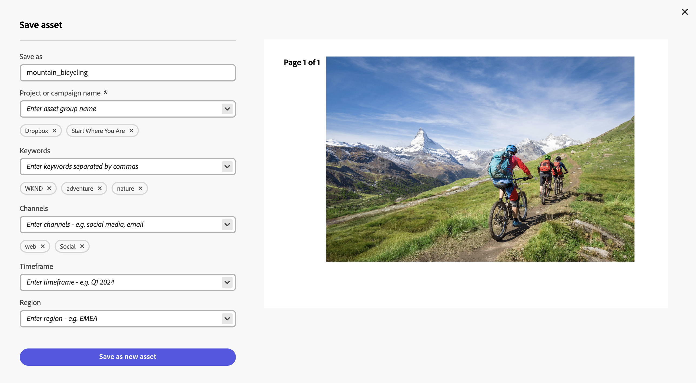

# Edit images in Content Hub {#edit-images-content-hub}

<table>
    <tr>
        <td>
            <i>New</i> <a href="/help/assets/dynamic-media/dm-prime-ultimate.md"><b>Dynamic Media Prime and Ultimate</b></a>
        </td>
        <td>
            <i>New</i> <a href="/help/assets/assets-ultimate-overview.md"><b>AEM Assets Ultimate</b></a>
        </td>
        <td>
            <i>New</i> <a href="/help/assets/integrate-aem-assets-edge-delivery-services.md"><b>AEM Assets integration with Edge Delivery Services</b></a>
        </td>
        <td>
            <i>New</i> <a href="/help/assets/aem-assets-view-ui-extensibility.md"><b>UI Extensibility</b></a>
        </td>
          <td>
            <i>New</i> <a href="/help/assets/dynamic-media/enable-dynamic-media-prime-and-ultimate.md"><b>Enable Dynamic Media Prime and Ultimate</b></a>
        </td>
    </tr>
    <tr>
        <td>
            <a href="/help/assets/search-best-practices.md"><b>Search Best Practices</b></a>
        </td>
        <td>
            <a href="/help/assets/metadata-best-practices.md"><b>Metadata Best Practices</b></a>
        </td>
        <td>
            <a href="/help/assets/product-overview.md"><b>Content Hub</b></a>
        </td>
        <td>
            <a href="/help/assets/dynamic-media-open-apis-overview.md"><b>Dynamic Media with OpenAPI capabilities</b></a>
        </td>
        <td>
            <a href="https://developer.adobe.com/experience-cloud/experience-manager-apis/"><b>AEM Assets developer documentation</b></a>
        </td>
    </tr>
</table>

>[!AVAILABILITY]
>
>Content Hub guide is now available in PDF format. Download the entire guide and use Adobe Acrobat AI Assistant to answer your queries. 
>
>[!BADGE Content Hub Guide PDF]{type=Informative url="https://helpx.adobe.com/content/dam/help/en/experience-manager/aem-assets/content-hub.pdf"}

Content Hub allows you to create new content with Adobe Express. You can edit existing content with easy to use tools, produce on-brand variations with templates and brand elements, and create new content with the latest GenAI capabilities from Adobe Firefly.

## Prerequisites {#prereqs-edit-image-content-hub}

Entitlements to access Adobe Express and [Content Hub users with rights to remix assets to new variations](/help/assets/deploy-content-hub.md#onboard-content-hub-users-remix-assets) can edit images using Content Hub.

>[!NOTE]
>
>You can edit images of PNG and JPG/JPEG file types using [!DNL Adobe Express].

## Edit images using [!DNL Adobe Express] {#edit-images-using-content-hub}

To edit images using Content Hub:

1. Click **[!DNL Open in Adobe Express]** available on the asset card of the image that you need to edit. Alternatively, click the image to open its details and then click the [!DNL Adobe Express] logo. The embedded editor for Adobe Express then loads without ever leaving Content Hub.

   You can leverage the [!DNL Adobe Express] functionality to perform all image-editing related actions, such as [resize image](https://helpx.adobe.com/express/using/resize-image.html), [remove or change background color](https://helpx.adobe.com/express/using/remove-background.html), [crop image](https://helpx.adobe.com/express/using/crop-image.html), combine the image with AI generated image or text, and much more.

1. Perform your modifications and click **[!UICONTROL Save]** to save the edited asset in either of the format types:
    
    * **[!UICONTROL PNG]** (used as a good quality image format)
    * **[!UICONTROL JPG]** (which is suitable for small files)
    * **[!UICONTROL PDF]** (which is suitable for documents)

   

1. Specify a name for the asset in the **[!UICONTROL Save as]** field.

1. Specify the campaign name for your asset using the **[!UICONTROL Campaign name]** field. You can use an existing name or create a new one. The Content Hub provides you with more options as you type the name. <!--You can define multiple Campaign names for your upload. While you are typing a name, either click anywhere else within the dialog box or press the `,` (Comma) key to register the name.-->

   As a best practice, Adobe recommends specifying values in the rest of the fields as well as it creates an enhanced search experience for your uploaded assets.

1. [Optional] Define values for the **[!UICONTROL Keywords]**, **[!UICONTROL Channels]**, **[!UICONTROL Timeframe]**, and **[!UICONTROL Region]** fields. Tagging and grouping assets by keywords, channels, and location enables everyone who uses your approved company content to find these assets and keep it organized.

1. Click **[!UICONTROL Save as new asset]** to save the asset.

Administrators can also configure the mandatory and optional fields that display while adding assets to Content Hub, such as Campaign name, Keywords, Channels, and so on. For more information, see [Configure the Content Hub user interface](configure-content-hub-ui-options.md#configure-upload-options-content-hub).
