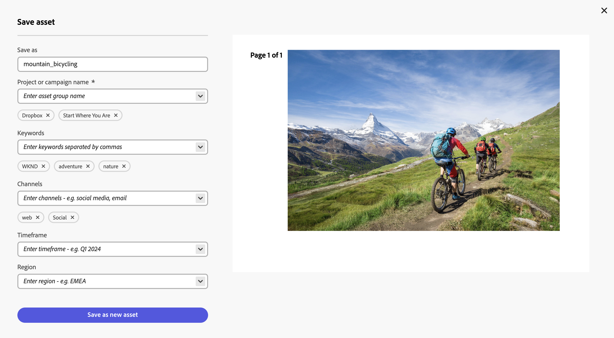

# Edit images in Content Hub {#edit-images-content-hub}

Content Hub allows you to create new content with Adobe Express. You can edit existing content with easy to use tools, produce on-brand variations with templates and brand elements, and create new content with the latest GenAI capabilities from Adobe Firefly.

>[!VIDEO](https://video.tv.adobe.com/v/3435003/?learn=on){transcript=true}

## Prerequisites {#prereqs-edit-image-content-hub}

Entitlements to access Adobe Express and [Content Hub users with rights to remix assets to new variations](/help/assets/deploy-content-hub.md#onboard-content-hub-users-remix-assets) can edit images using Content Hub.

>[!NOTE]
>
>You can edit images of PNG and JPG/JPEG file types using [!DNL Adobe Express].

## Edit images using [!DNL Adobe Express] {#edit-images-using-content-hub}

To edit images using Content Hub:

1. Click **[!DNL Open in Adobe Express]** available on the asset card of the image that you need to edit. Alternatively, click the image to open its details and then click the [!DNL Adobe Express] logo. The embedded editor for Adobe Express then loads without ever leaving Content Hub.

   You can leverage the [!DNL Adobe Express] functionality to perform all image-editing related actions, such as [resize image](https://helpx.adobe.com/express/using/resize-image.html), [remove or change background color](https://helpx.adobe.com/express/using/remove-background.html), [crop image](https://helpx.adobe.com/express/using/crop-image.html), combine the image with AI generated image or text, and much more.

1. Perform your modifications and click **[!UICONTROL Save]** to save the edited asset in either of the format types:
    
    * **[!UICONTROL PNG]** (used as a good quality image format)
    * **[!UICONTROL JPG]** (which is suitable for small files)
    * **[!UICONTROL PDF]** (which is suitable for documents)

   

1. Specify a name for the asset in the **[!UICONTROL Save as]** field.

1. Specify the campaign name for your asset using the **[!UICONTROL Campaign name]** field. You can use an existing name or create a new one. The Content Hub provides you with more options as you type the name. <!--You can define multiple Campaign names for your upload. While you are typing a name, either click anywhere else within the dialog box or press the `,` (Comma) key to register the name.-->

   As a best practice, Adobe recommends specifying values in the rest of the fields as well as it creates an enhanced search experience for your uploaded assets.

1. [Optional] Define values for the **[!UICONTROL Keywords]**, **[!UICONTROL Channels]**, **[!UICONTROL Timeframe]**, and **[!UICONTROL Region]** fields. Tagging and grouping assets by keywords, channels, and location enables everyone who uses your approved company content to find these assets and keep it organized.

1. Click **[!UICONTROL Save as new asset]** to save the asset.

Administrators can also configure the mandatory and optional fields that display while adding assets to Content Hub, such as Campaign name, Keywords, Channels, and so on. For more information, see [Configure the Content Hub user interface](configure-content-hub-ui-options.md#configure-upload-options-content-hub).

## Frequently asked questions {#faqs-edit-images-content-hub}

### Who can edit images in AEM Assets Content Hub?

Users with entitlements to access Adobe Express and AEM Assets Content Hub, and who have the rights to remix assets to new variations, can edit images using Content Hub.

### How do I edit an image using Adobe Express in AEM Assets Content Hub?

To edit an image, click **Open in Adobe Express** on the asset card of the image or open the image's details and click the Adobe Express logo. This loads the embedded Adobe Express editor within AEM Assets Content Hub, allowing you to make your edits without leaving the platform.

### What editing features does Adobe Express provide within AEM Assets Content Hub?

Adobe Express offers a variety of image-editing features, including resizing images, removing or changing background color, cropping images, and combining them with AI-generated images or text, among other capabilities.

### Which file formats can I save my edited images as in AEM Assets Content Hub?

You can save your edited images in PNG (good quality), JPG (suitable for small files), or PDF (suitable for documents) formats.

### What fields should I fill when saving an edited image in Content Hub?

When saving an edited image, you should specify a name for the asset in the **Save as** field and a campaign name in the **Campaign name** field. Adobe also recommends specifying values in additional fields such as Keywords, Channels, Timeframe, and Region to enhance searchability and organization.

### Can I save my edits as a new asset in Content Hub?

Yes, after editing, you can click **Save as new asset** to save your changes as a new asset in Content Hub.

### Can administrators customize the fields while uploading assets to AEM Assets Content Hub?

Yes, administrators can configure which fields are mandatory or optional when adding assets to AEM Assets Content Hub, such as Campaign name, Keywords, and Channels, to suit organizational needs. Use the **Import** tab on the Configuration UI to configure the fields.

