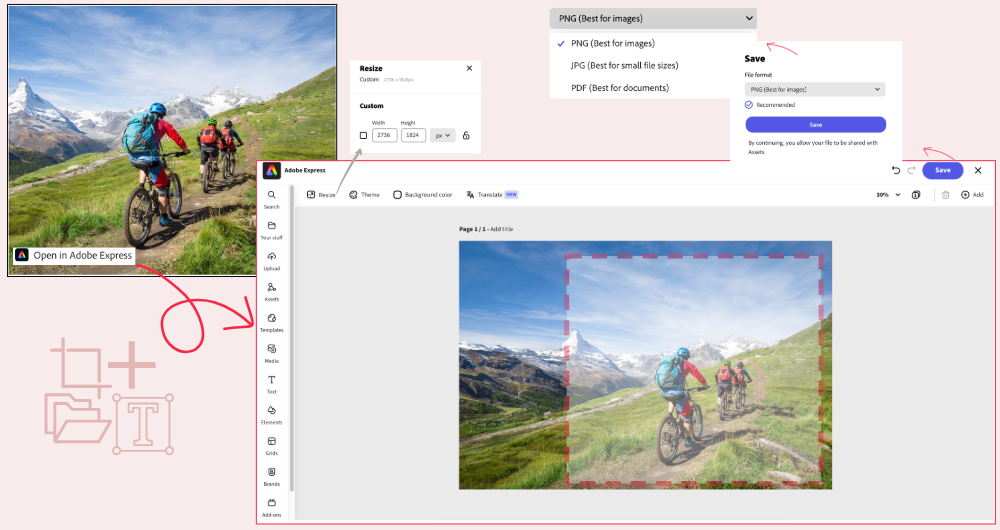

# Edit images in Content Hub {#edit-images-content-hub}

Content Hub allows you to integrate with Adobe Express and modify assets of image format type to enable various options and techniques aimed at enhancing the visual appeal, correcting flaws, or creating artistic compositions. You can use pre-defined elements to make your asset look stunning or perform quick actions to edit your image with just a few clicks.

## Prerequisites {#prereqs-edit-image-content-hub}

Entitlements to access Adobe Express and [Content Hub asset consumer users with submission permissions ](/help/assets/deploy-content-hub.md#onboard-content-hub-consumer-users-submission-rights) can edit images using Content Hub.

>[!NOTE]
>
>You can edit images of PNG and JPG/JPEG file types using [!DNL Adobe Express].

## Edit images using [!DNL Adobe Express] {#edit-images-using-content-hub}

To edit images using Content Hub:

1. Click **[!DNL Open in Adobe Express]** available in the asset card of the image that you need to edit. Alternatively, click the image to open its details and then click the [!DNL Adobe Express] logo. The embedded editor for Adobe Express displays.

   You can leverage the functionality of [!DNL Adobe Express] to perform all the image-editing related actions, such as [resize image](https://helpx.adobe.com/in/express/using/resize-image.html), [remove or change background color](https://helpx.adobe.com/in/express/using/remove-background.html), [crop image](https://helpx.adobe.com/in/express/using/crop-image.html), combine the image with AI generated image or text, and much more.

1. Perform your modifications and click **[!UICONTROL Save]** to save the edited asset in either of the formats among the following:
    
    * **[!UICONTROL PNG]** (used as a good quality image format)
    * **[!UICONTROL JPG]** (which is suitable for small files)
    * **[!UICONTROL PDF]** (which is suitable for documents)

   

   You can fill up the following fields with one or multiple options available in the drop-down:

    | Property | Description |
    |------|----------|
    | [!UICONTROL Save as] | Save the edited image under a different name to create a new version. |
    | [!UICONTROL Project or campaign name] | Choose the correct project or campaign name from the dropdown menu to save the asset with the project identifier. |
    | [!UICONTROL Keywords] | Choose keywords from the dropdown menu to categorize the asset. |
    | [!UICONTROL Channels] | Add an edited asset under the appropriate channel. |
    | [!UICONTROL Timeframe] | Choose the timeline from the dropdown to set the time span for the edited asset. |
    | [!UICONTROL Region] | Choose a location from the dropdown to categorize the edited asset by region. |
