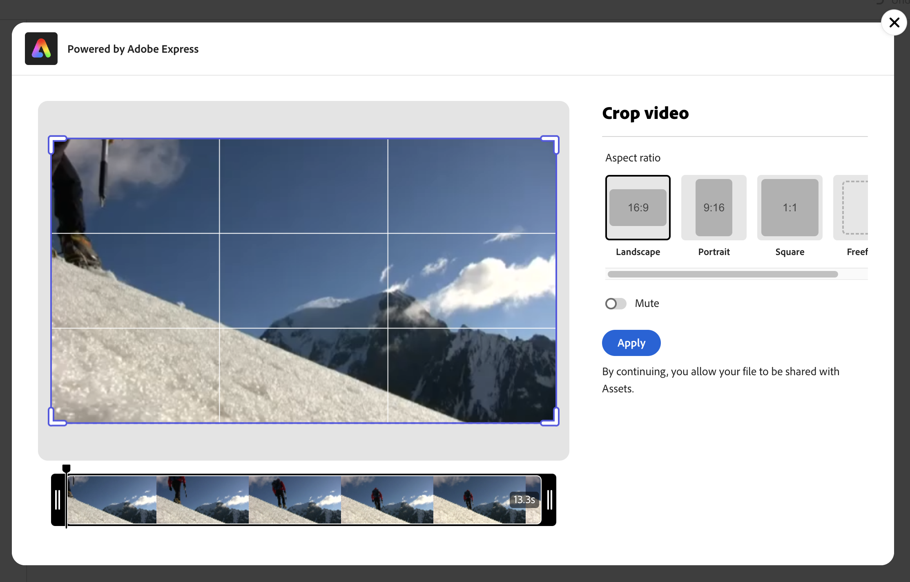
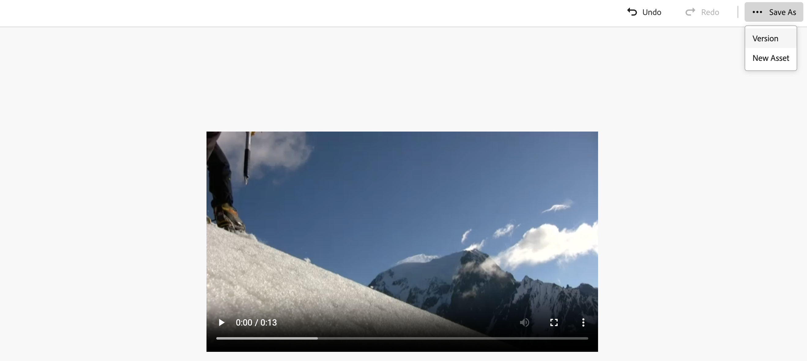
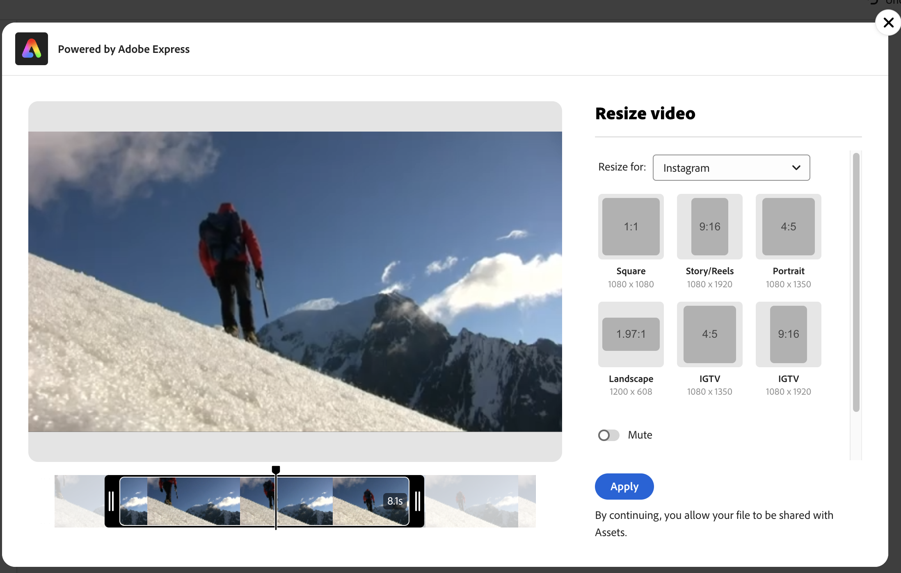
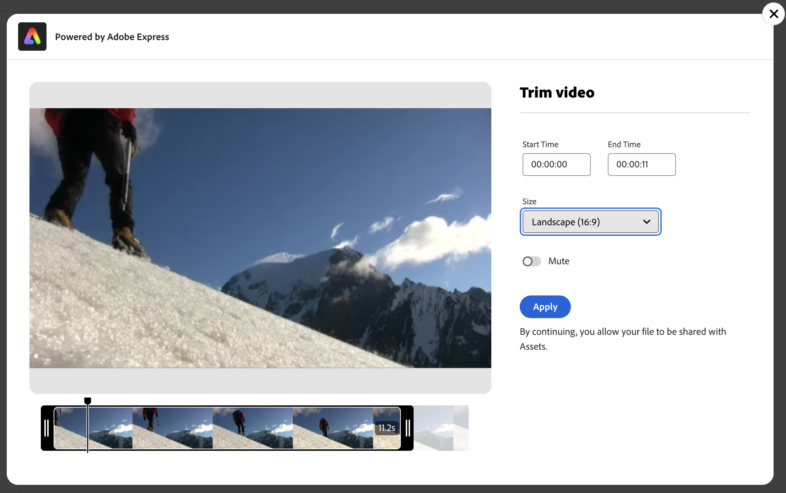
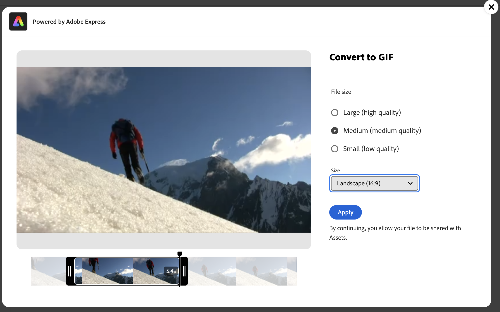

# Edit videos in [!DNL Assets view] {#edit-videos}

| [Search Best Practices](/help/assets/search-best-practices.md) |[Metadata Best Practices](/help/assets/metadata-best-practices.md)|[Content Hub](/help/assets/product-overview.md)|[Dynamic Media with OpenAPI capabilities](/help/assets/dynamic-media-open-apis-overview.md)|[AEM Assets developer documentation](https://developer.adobe.com/experience-cloud/experience-manager-apis/)|
| ------------- | --------------------------- |---------|----|-----|

Creating variations of video content is easy for Assets users with the embedded [!DNL Adobe Express] quick actions for video. Quick actions in [!DNL Assets view] powered by [!DNL Adobe Express] provides user-friendly video editing options including crop video, resize video, trim video, and convert video to GIF.

To edit a video, go to the details of the video and click [!UICONTROL Edit Video]. Alternatively, select the asset and click details then click  icon available in the right pane. After editing a video, you can save the new video as a new version or as a new asset.

## Prerequisites {#prerequisites}

Entitlements to access [!DNL Adobe Express] and at least one environment within AEM Assets. The environment can be any of the repositories within [!DNL Assets as a Cloud Service] or [!DNL Assets view].

## Edit videos using Adobe Express {#edit-video-using-express}

Transforming a video into a perfect size and orientation is easy using embedded [!DNL Adobe Express] quick actions.

### Crop video {#crop-video-using-express}

You can eliminate unwanted parts from the video using embedded [!DNL Adobe Express] quick actions. To do this, execute the steps below:

1. Select a video and click **[!UICONTROL Edit]**.
2. Click **[!UICONTROL Crop Video]** from the quick actions available in the left pane.
3. Drag the handles on the corners of the video to create your desired crop; or choose among the existing screen sizes as desired.
4. You can choose to mute or unmute the video. 
5. Click **[!UICONTROL Apply]**.
   
   
    The cropped video is available for download. You can either save the edited asset as a new version of the same asset or save it as a new asset. 

### Resize video {#resize-video-using-express} 

Final video content in the DAM often needs to be resized for distribution to specific channels. [!DNL Assets view] lets you easily resize video to fit the dimensions required by common social channels and you can also resize to custom resolutions. To resize the video using [!DNL Assets view], execute the steps below:

1. Select a video and click **[!UICONTROL Edit]**.
2. Click **[!UICONTROL Resize Video]** from the quick actions available in the left pane.
3. Select the appropriate dimensions from the social media platform under **[!UICONTROL Resize for the]** drop-down list. Alternatively, drag the handles on the corners of the video to create your desired crop.
4. Scale the video, if required, using the **[!UICONTROL Video Scale]** field.
5. You can choose to mute or unmute the video.
6. Click **[!UICONTROL Apply]** to apply your changes.
   

Your resized video is available for download. You can either save the edited asset as a new version of the same asset or save it as a new asset.

### Trim video {#trim-video-using-express}

If you need to use a clip of a larger video, you can use the **[!UICONTROL Trim Video]** function to select and trim a section of the video. Perform the steps below:

1. Select a video and click **[!UICONTROL Edit]**.
2. Click **[!UICONTROL Trim Video]** from the quick actions available in the left pane.
3. Specify the start and end time of the video to trim a particular part of it. Alternatively, drag the handles on the corners of the video to create your desired trim.
4. Select the appropriate dimensions from the **[!UICONTROL Size]** drop-down list. 
5. You can choose to mute or unmute the video.
6. Click **[!UICONTROL Apply]** to apply your changes.
   

Your trimmed video is available for download. You can either save the edited asset as a new version of the same asset or save it as a new asset.

### Convert video to GIF {#convert-mp4-to-gif-using-express}

You can quickly convert an MP4 video into a GIF format using Adobe Express. Execute the following steps:

1. Select a video and click **[!UICONTROL Edit]**.
2. Click **[!UICONTROL Convert to GIF]** from the quick actions available in the left pane.
3. Select the appropriate file size based on the desired quality. Additionally, choose the orientation of landscape, portrait, or square.
4. Drag the handles on the corners of the video to create your desired crop.
5. Click **[!UICONTROL Apply]**.

    

Your video is available in GIF format for download. You can either save the edited asset as a new version of the same asset or save it as a new asset.

## Limitations {#limitations-video-adobe-express}

* Only videos in the MP4 format are supported for editing.

* The maximum source file size supported is 1GB.

* Supported videos are larger than 46 pixels and smaller than 3840 pixels on any side.

* The supported Web browsers are Google Chrome, Firefox, Safari, and Edge.

* The functionality cannot be opened in an incognito mode of a web browser.

### Next Steps {#next-steps}

* Provide product feedback using the [!UICONTROL Feedback] option available on the Assets view user interface.

* Provide documentation feedback using [!UICONTROL Edit this page]  or [!UICONTROL Log an issue]  available on the right sidebar.

* Contact [Customer Care](https://experienceleague.adobe.com/?support-solution=General#support).

>[!MORELIKETHIS]
>
>* [Edit images in Assets view](edit-images-assets-view.md)
>* [Preview of an asset](navigate-assets-view.md)
