# Enable [!DNL Assets] as a Cloud Service Ultimate {#enable-assets-cloud-service-ultimate}

Assets as a Cloud Service Ultimate enables you to perform various key DAM capabilities, such as, asset management and library services, security and rights management, Creative and Experience Cloud connections, UI extensibility, API-driven automation, integrations with Adobe and non-Adobe applications, custom code deployment and many more. See [Assets as a Cloud Service Ultimate Overview](/help/assets/assets-ultimate-overview.md) for the complete list.

## Enable Assets Ultimate {#enable-assets-ultimate}

New Assets as a Cloud Service customers must first enable Assets Ultimate by creating a new program using Cloud Manager. 

Execute the following steps:

1. As a system administrator, log on to Cloud Manager. Ensure that you select the right organization while logging in.

   >[!NOTE]
   >
   >Ensure that you are added to the appropriate Cloud Manager product profile to add a new program. For more information, see [Role Based Permissions in Cloud Manager](/help/onboarding/cloud-manager-introduction.md#role-based-permissions).

1. [Create a new program](/help/journey-onboarding/create-program.md) and [add environments](/help/journey-onboarding//create-environments.md) to it.

   While creating the new program, in **[!UICONTROL Solutions & Add-ons]** tab, select **[!UICONTROL Assets Ultimate]**. You can also expand **[!UICONTROL Assets Ultimate]** and select **[!UICONTROL Content Hub]** to enable [Content Hub](/help/assets/product-overview.md) for asset distribution.

   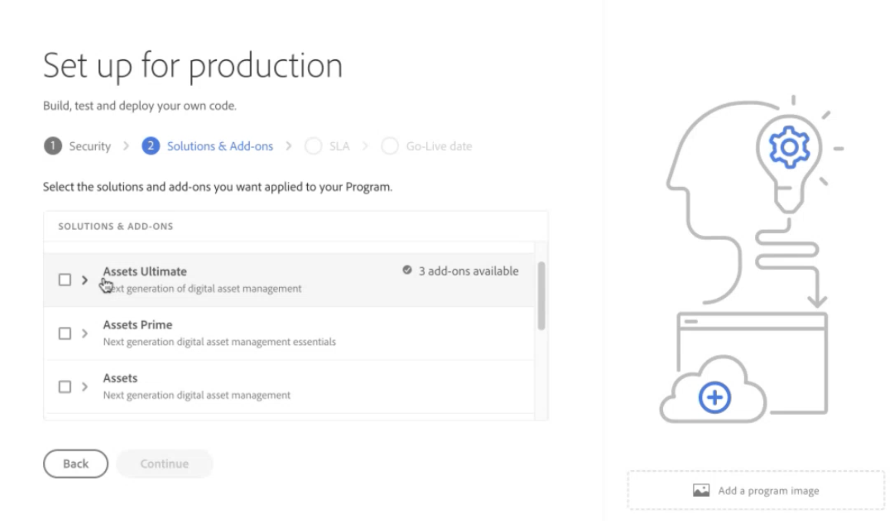

1. Click **[!UICONTROL Create]** to create the program. Assets Ultimate is now enabled for Experience Manager Assets as a Cloud Service.

The System Administrator is automatically entitled as an AEM Administrator on Assets Ultimate and receives an email to navigate to Admin Console to manage the available product profiles.

Your AEM as a Cloud Service instance on Admin Console comprises the following product profiles:

* AEM Administrators

* AEM Users

* [AEM Assets Collaborator Users](#onboard-collaborator-users)

* [AEM Assets Power Users](#onboard-power-users)

   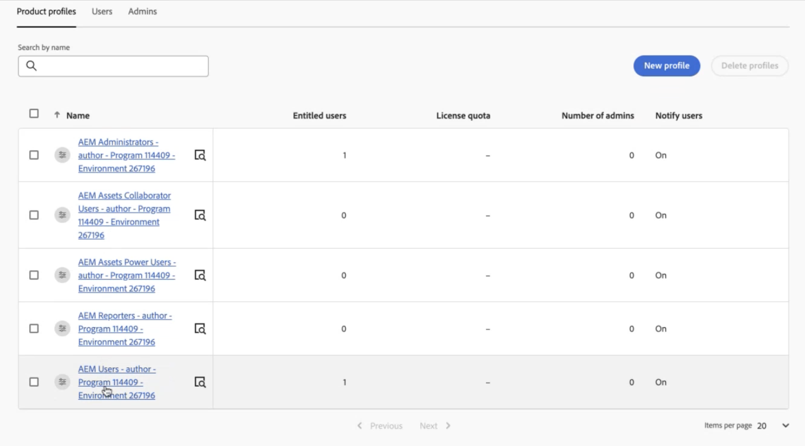

If you have enabled Content Hub for Assets as a Cloud Service, there is a new instance created within AEM Assets as a Cloud Service on Admin Console with `delivery` as the suffix:

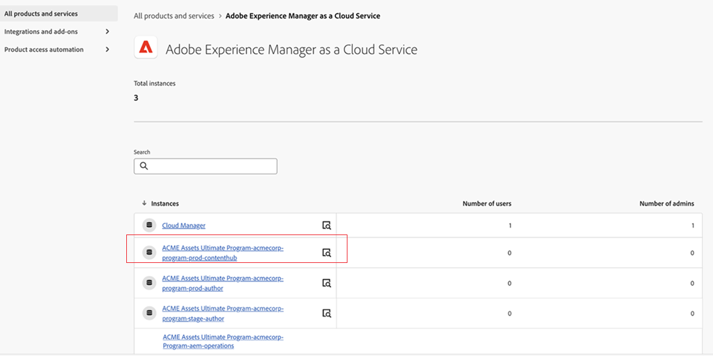

>[!NOTE]
>
>If you have provisioned Content Hub before August 14, 2024, the new instance is created with `contenthub` as the suffix.

Note that there is no `author` or `publish` in the instance name for Content Hub.

Click the instance name to view the `AEM Assets Limited Users` Content Hub product profile.

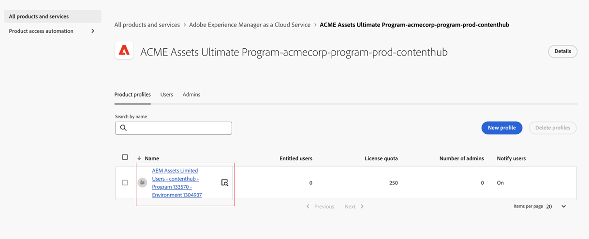

You can start adding users or user groups to this product profile to provide them access to Content Hub.

>[!NOTE]
>
>If you have provisioned Content Hub before August 14, 2024, the Content Hub product profile has `contenthub` mentioned after `Limited Users` instead of `delivery`.

## Enable Assets Ultimate for existing customers {#enable-assets-ultimate-existing-customers}

Existing Assets as a Cloud Service customers can upgrade to Assets Ultimate by executing two simple steps. You can navigate to the Assets as a Cloud Service program in Cloud Manager and see upgrade status on the Program card based on the availability of Assets Ultimate credits. If there are enough credits available for upgrade to Assets Ultimate, you can see the status as `Assets license upgrade required`, as depicted in the following image:

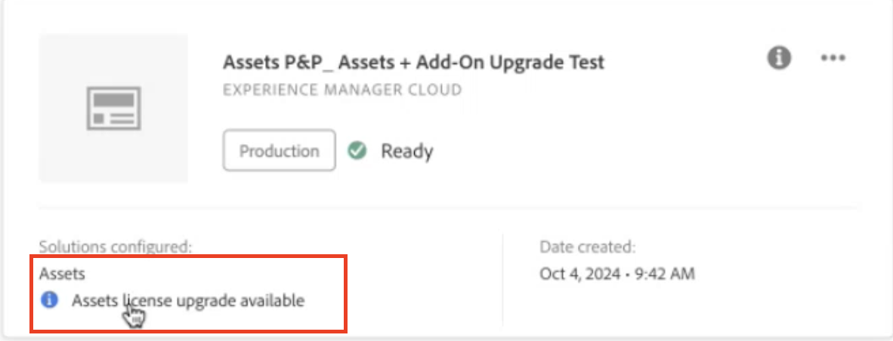

In case an existing customer purchases a new license for Assets Ultimate, the upgrade status displays as `Assets license upgrade available`.

### Prerequisites for upgrade {#prerequisites-assets-upgrade}

All environments must be upgraded to latest AEM as a Cloud Service release version or a minimum of `2024.10.18175` release version. If you do not meet the minimum requirements, contact your Adobe representative to switch to the required AEM release version.

### Upgrade to Assets Ultimate {#upgrade-assets-ultimate}

Execute the following steps:

1. After switching to the minimum requirements for the AEM release version, click the program name. An Upgrade card displays just above **[!UICONTROL Environments]** section, as depicted in the following image:

   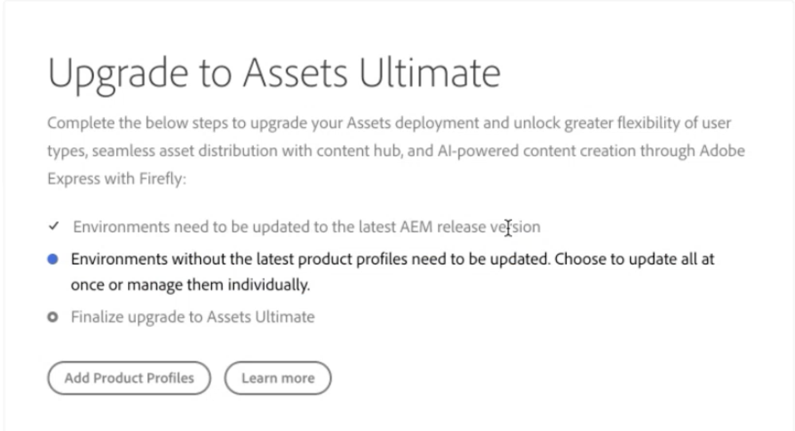

1. Click **[!UICONTROL Add Product Profiles]**. Cloud Manager displays options to add new product profiles to all environments available in the program or individual environments.

   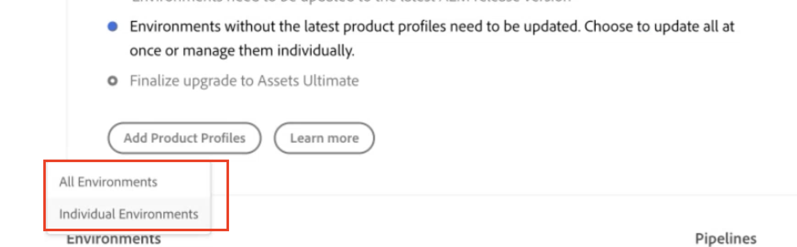

1. Click **[!UICONTROL All Environments]** to add the new product profiles to all environments in the program or **[!UICONTROL Individual Environments]** to add the new product profiles to selected environments.

   Clicking **[!UICONTROL Individual Environments]** displays the list of all environments available in the program.

1. Click the More Options icon corresponding to an environment and select **[!UICONTROL Add Product Profiles]** to add the new product profiles to the selected environment.

   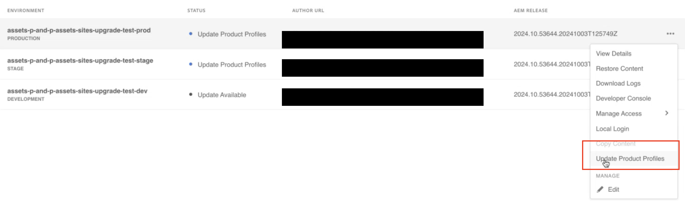

   You can also add product profiles to selected environments by navigating to the **[!UICONTROL Environments]** section, clicking the More Options icon corresponding to an environment, and selecting **[!UICONTROL Add Product Profiles]**.

   The status of the environment displays `Adding Product Profiles` while the new product profiles are being added and subsequently displays `Running` when the process is complete.

   You must add product profiles to all environments available in the program, individually or all environments together, before executing the next step.

1. Click **[!UICONTROL Upgrade]**. The **[!UICONTROL Upgrade]** option displays only when you add product profiles to all available environments. 

   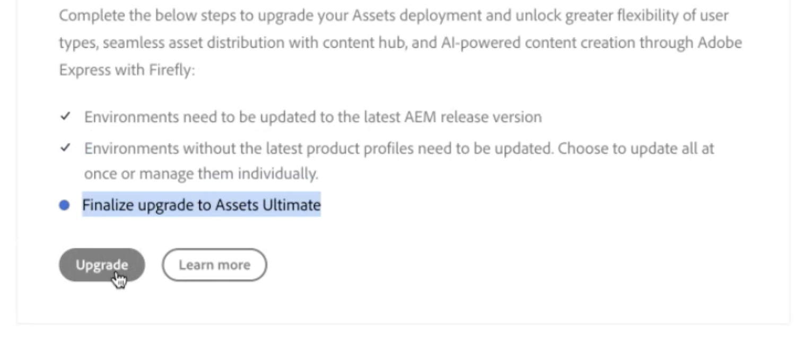

   The upgrade process is complete and you have successfully upgraded your Assets as a Cloud Service to Assets Ultimate. The status of the program displays `Assets Ultimate`.

   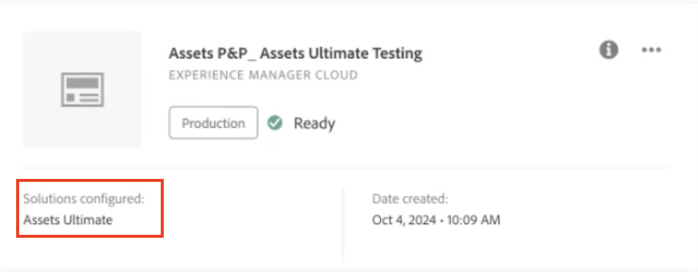

Your AEM as a Cloud Service instance on Admin Console now comprises the following product profiles:

* AEM Administrators

* AEM Users

* [AEM Assets Collaborator Users](#onboard-collaborator-users)

* [AEM Assets Power Users](#onboard-power-users)

If you need Content Hub enabled, click More options (...) icon on the program name in Cloud Manager and select **[!UICONTROL Edit Program]**. Expand **[!UICONTROL Assets Ultimate]** and click **[!UICONTROL Content Hub]**. This step enables the Content Hub for Assets Ultimate. There is a new instance created within AEM Assets as a Cloud Service on Admin Console with `delivery` as the suffix:

>[!NOTE]
>
>If you have provisioned Content Hub before August 14, 2024, the new instance is created with `contenthub` as the suffix.

Note that there is no `author` or `publish` in the instance name for Content Hub.

Click the instance name to view the `AEM Assets Limited Users` Content Hub product profile.

You can start adding users or user groups to this product profile to provide them access to Content Hub.

>[!NOTE]
>
>If you have provisioned Content Hub before August 14, 2024, the Content Hub product profile has `contenthub` mentioned after `Limited Users` instead of `delivery`.

## Onboard AEM Assets Collaborator users {#onboard-collaborator-users}

AEM Assets Collaborator users can work with assets from Experience manager via integrations of Assets available to your organization in other Adobe products and non-Adobe applications, create and edit assets using built-in Adobe Express and Firefly leveraging professionally designed templates, brand kits, Adobe Stock assets, and so on, and access and leverage approved assets from your organization using AEM Assets Content Hub portal.

To onboard Collaborator users:

1. Access Experience Manager Assets product profiles by clicking the AEM as a Cloud Service product name in the list of products on Admin Console.

1. Click the production author instance for AEM as a Cloud Service:
   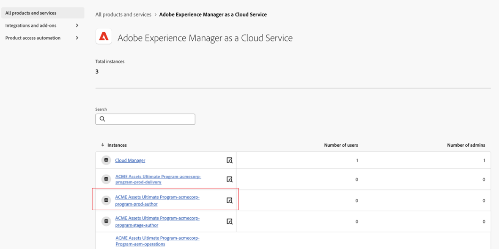

1. Click the Collaborators users product profile and click **[!UICONTROL Add users]** to add users or user groups to the product profile.
   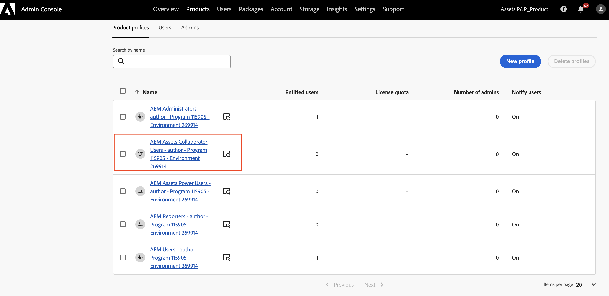

1. Click **[!UICONTROL Save]** to save the changes.

You can also access and view the services assigned to Collaborator users, as depicted in the following image:

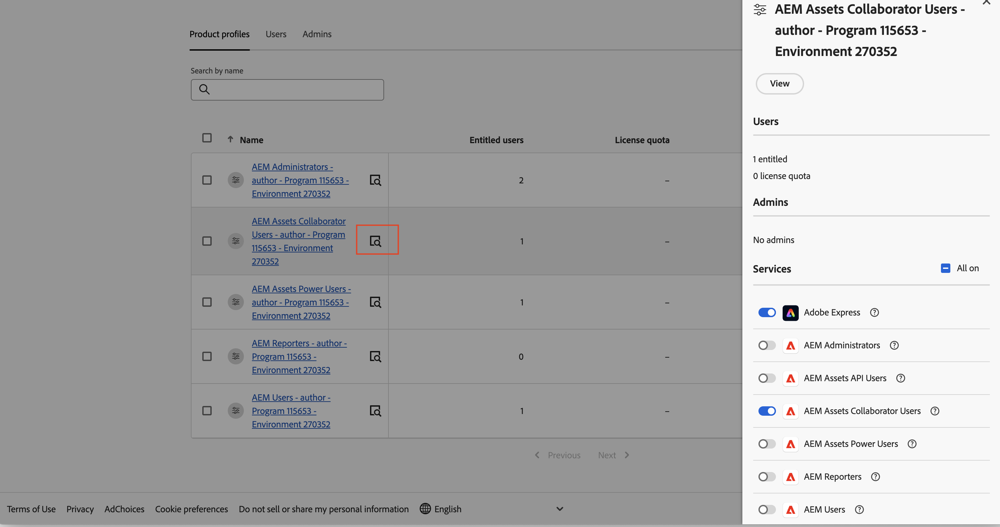

`Adobe Express` and `AEM Assets Collaborator Users` services are enabled by default.

>[!NOTE]
>
>You can turn the toggle off and on to enable or disable the available services, as per your requirements, however, Adobe recommends to use the default services enabled for the product profiles.

## Onboard AEM Assets Power users {#onboard-power-users}

AEM Assets Power users can access all AEM Assets capabilities including managing assets, permissions, metadata and the overall governance and automation around digital assets, work with assets from Experience manager via integrations of Assets available to your organization in other Adobe and non-Adobe applications, create and edit assets using built-in Adobe Express and Firefly leveraging professionally designed templates, brand kits, Adobe Stock assets, and so on, and access and leverage approved assets from your organization using AEM Assets Content Hub portal.

To onboard Power users:

1. Access Experience Manager Assets product profiles by clicking the AEM as a Cloud Service product name in the list of products on Admin Console.

1. Click the production author instance for AEM as a Cloud Service:
   

1. Click the Power users product profile and click **[!UICONTROL Add users]** to add users or user groups to the product profile.
   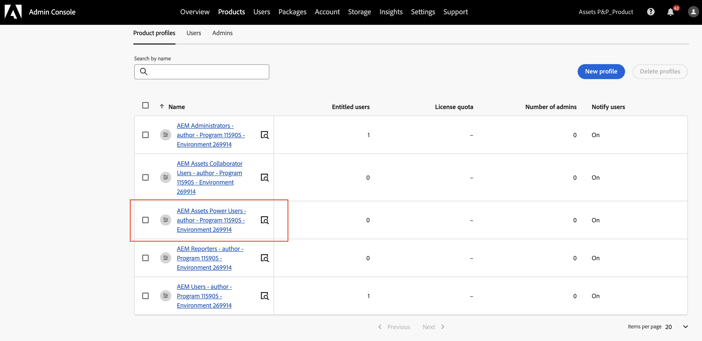

1. Click **[!UICONTROL Save]** to save the changes.

You can also access and view the services assigned to Power users, as depicted in the following image:

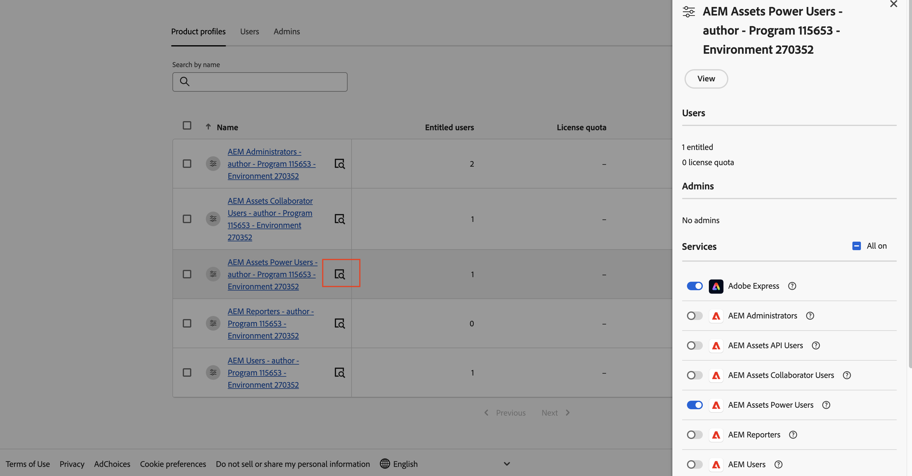

`Adobe Express` and `AEM Assets Power Users` services are enabled by default.

>[!NOTE]
>
>You can turn the toggle off and on to enable or disable the available services, as per your requirements, however, Adobe recommends to use the default services enabled for the product profiles.

## Frequently Asked Questions {#frequently-asked-questions-enable-assets-ultimate}

### How do new customers enable AEM Assets Ultimate? {#enable-assets-ultimate-new-customers}

New AEM Assets as a Cloud Service customers enable Assets Ultimate by creating a new program in Cloud Manager. Log in to Cloud Manager as a system administrator, create a new program, and in the Solutions & Add-ons tab select Assets Ultimate. Optionally expand Assets Ultimate and select Content Hub to enable asset distribution. Click Create to complete the program setup. Assets Ultimate is then enabled for the AEM Assets as a Cloud Service instance and the system administrator receives an email to manage product profiles in Admin Console.

### Can Content Hub be enabled at the same time as AEM Assets Ultimate for new customers? {#enable-content-hub-new-customers}

Content Hub can be enabled during the initial Assets Ultimate program setup in Cloud Manager. While creating the new program, select Assets Ultimate in the Solutions & Add-ons tab, expand the Assets Ultimate option, and select Content Hub. Completing the program creation enables both Assets Ultimate and Content Hub simultaneously. A new instance with a delivery suffix is created in Admin Console containing the AEM Assets Limited Users Content Hub product profile, which is used to grant users access to Content Hub.

### What product profiles are available in Admin Console after enabling AEM Assets Ultimate? {#product-profiles-assets-ultimate}

After enabling AEM Assets Ultimate, the AEM as a Cloud Service instance in Adobe Admin Console includes four product profiles: AEM Administrators, AEM Users, AEM Assets Collaborator Users, and AEM Assets Power Users. If Content Hub is also enabled, a separate delivery instance is created in Admin Console containing the AEM Assets Limited Users product profile. Users and user groups are added to each product profile to grant the corresponding level of access within AEM Assets Ultimate.

### What are the prerequisites for existing customers to upgrade to AEM Assets Ultimate? {#upgrade-assets-ultimate-prerequisites}

Existing AEM Assets as a Cloud Service customers must ensure all environments are running the latest AEM as a Cloud Service release version or a minimum of release version 2024.10.18175 before upgrading to Assets Ultimate. If the minimum release version requirement is not met, contact the Adobe representative to switch to the required AEM release version before proceeding with the upgrade.

### How do existing customers check if they are eligible to upgrade to AEM Assets Ultimate? {#check-upgrade-eligibility-assets-ultimate}

Existing AEM Assets as a Cloud Service customers can check upgrade eligibility by navigating to the Assets as a Cloud Service program in Cloud Manager and viewing the status on the Program card. If sufficient Assets Ultimate credits are available, the status displays as Assets license upgrade required. If a new license for Assets Ultimate has been purchased, the status displays as Assets license upgrade available. Both statuses indicate that the upgrade path is available for the program.

### How do existing customers upgrade to AEM Assets Ultimate? {#upgrade-steps-assets-ultimate}

After meeting the minimum AEM release version requirement, click the program name in Cloud Manager to display the Upgrade card above the Environments section. Click Add Product Profiles and choose to add new product profiles to all environments or to individual environments. Product profiles must be added to all available environments before proceeding. Once all environments show a Running status, click Upgrade to complete the process. The program status updates to Assets Ultimate confirming the upgrade is complete.

### How do I enable Content Hub after upgrading an existing program to AEM Assets Ultimate? {#enable-content-hub-existing-customers}

After upgrading an existing program to AEM Assets Ultimate in Cloud Manager, click the More Options icon on the program name and select Edit Program. Expand Assets Ultimate and click Content Hub to enable it. A new delivery instance is created in Adobe Admin Console containing the AEM Assets Limited Users Content Hub product profile. Users and user groups can then be added to this product profile to provide access to the Content Hub portal.

### How do I onboard Collaborator Users in AEM Assets Ultimate? {#onboard-collaborator-users-aem-assets}

To onboard Collaborator Users in AEM Assets Ultimate, access Adobe Admin Console and click the AEM as a Cloud Service product name in the list of products. Click the production author instance, select the AEM Assets Collaborator Users product profile, and click Add Users to add users or user groups. Click Save to apply the changes. Adobe Express and AEM Assets Collaborator Users services are enabled by default for this product profile and can be toggled on or off as needed — Adobe recommends retaining the default service configuration.

### What services are enabled by default for AEM Assets Collaborator Users? {#collaborator-user-default-services}

Two services are enabled by default for the AEM Assets Collaborator Users product profile in Adobe Admin Console: Adobe Express and AEM Assets Collaborator Users. These services give Collaborator Users access to asset creation and editing using Adobe Express and Firefly, integrations with Adobe and non-Adobe applications, and approved asset access through the AEM Assets Content Hub portal. Individual services can be toggled on or off in Admin Console, though Adobe recommends using the default configuration.

### How do I onboard Power Users in AEM Assets Ultimate? {#onboard-power-users-aem-assets}

To onboard Power Users in AEM Assets Ultimate, access Adobe Admin Console and click the AEM as a Cloud Service product name in the list of products. Click the production author instance, select the AEM Assets Power Users product profile, and click Add Users to add users or user groups. Click Save to apply the changes. Adobe Express and AEM Assets Power Users services are enabled by default for this product profile and can be toggled on or off — Adobe recommends retaining the default service configuration.

### What services are enabled by default for AEM Assets Power Users? {#power-user-default-services}

Two services are enabled by default for the AEM Assets Power Users product profile in Adobe Admin Console: Adobe Express and AEM Assets Power Users. These services give Power Users full access to AEM Assets DAM capabilities including asset management, metadata governance, permissions, and automation, as well as Adobe Express and Firefly-powered content creation, integrations with Adobe and non-Adobe applications, and access to the AEM Assets Content Hub portal. Individual services can be toggled on or off in Admin Console, though Adobe recommends using the default configuration.

### What is the difference between the delivery and contenthub suffix in the Content Hub Admin Console instance? {#content-hub-suffix-difference}

The suffix of the Content Hub instance in Adobe Admin Console depends on when Content Hub was provisioned. Customers who provisioned Content Hub after August 14, 2024 have an instance with a delivery suffix. Customers who provisioned Content Hub before August 14, 2024 have an instance with a contenthub suffix. In the earlier provisioning case, the Content Hub product profile also shows contenthub after Limited Users instead of delivery. Both configurations provide the same AEM Assets Limited Users product profile for granting Content Hub access.
