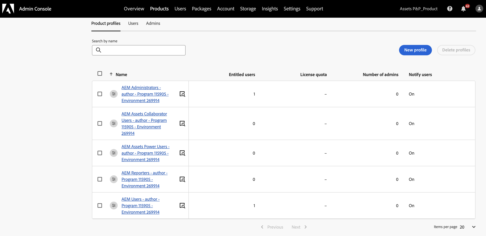

# Enable [!DNL Assets] as a Cloud Service Ultimate {#enable-assets-cloud-service-ultimate}

<table>
    <tr>
        <td>
            <i>New</i> <a href="/help/assets/dynamic-media/dm-prime-ultimate.md"><b>Dynamic Media Prime and Ultimate</b></a>
        </td>
        <td>
            <i>New</i> <a href="/help/assets/assets-ultimate-overview.md"><b>AEM Assets Ultimate</b></a>
        </td>
        <td>
            <i>New</i> <a href="/help/assets/integrate-aem-assets-edge-delivery-services.md"><b>AEM Assets integration with Edge Delivery Services</b></a>
        </td>
        <td>
            <i>New</i> <a href="/help/assets/aem-assets-view-ui-extensibility.md"><b>UI Extensibility</b></a>
        </td>
          <td>
            <i>New</i> <a href="/help/assets/dynamic-media/enable-dynamic-media-prime-and-ultimate.md"><b>Enable Dynamic Media Prime and Ultimate</b></a>
        </td>
    </tr>
    <tr>
        <td>
            <a href="/help/assets/search-best-practices.md"><b>Search Best Practices</b></a>
        </td>
        <td>
            <a href="/help/assets/metadata-best-practices.md"><b>Metadata Best Practices</b></a>
        </td>
        <td>
            <a href="/help/assets/product-overview.md"><b>Content Hub</b></a>
        </td>
        <td>
            <a href="/help/assets/dynamic-media-open-apis-overview.md"><b>Dynamic Media with OpenAPI capabilities</b></a>
        </td>
        <td>
            <a href="https://developer.adobe.com/experience-cloud/experience-manager-apis/"><b>AEM Assets developer documentation</b></a>
        </td>
    </tr>
</table>

Assets as a Cloud Service Ultimate enables you to perform various key DAM capabilities, such as, asset management and library services, security and rights management, Creative and Experience Cloud connections, UI extensibility, API-driven automation, integrations with Adobe and non-Adobe applications, custom code deployment and many more. See [Assets as a Cloud Service Ultimate Overview](/help/assets/assets-ultimate-overview.md) for the complete list.

## Enable Assets Ultimate {#enable-assets-ultimate}

New Assets as a Cloud Service customers must first enable Assets Ultimate by creating a new program using Cloud Manager. 

Execute the following steps:

1. As a system administrator, log on to Cloud Manager. Ensure that you select the right organization while logging in.

   >[!NOTE]
   >
   >Ensure that you are added to the appropriate Cloud Manager product profile to add a new program. For more information, see [Role Based Permissions in Cloud Manager](/help/onboarding/cloud-manager-introduction.md#role-based-permissions).

1. [Create a new program](/help/journey-onboarding/create-program.md) and [add environments](/help/journey-onboarding//create-environments.md) to it.

   While creating the new program, in **[!UICONTROL Solutions & Add-ons]** tab, select **[!UICONTROL Assets Ultimate]**. You can also expand **[!UICONTROL Assets Ultimate]** and select **[!UICONTROL Content Hub]** to enable [Content Hub](/help/assets/product-overview.md) for asset distribution.

   

1. Click **[!UICONTROL Create]** to create the program. Assets Ultimate is now enabled for Experience Manager Assets as a Cloud Service.

The System Administrator is automatically entitled as an AEM Administrator on Assets Ultimate and receives an email to navigate to Admin Console to manage the available product profiles.

Your AEM as a Cloud Service instance on Admin Console comprises the following product profiles:

* AEM Administrators

* AEM Users

* [AEM Assets Collaborator Users](#onboard-collaborator-users)

* [AEM Assets Power Users](#onboard-power-users)

   

If you have enabled Content Hub for Assets as a Cloud Service, there is a new instance created within AEM Assets as a Cloud Service on Admin Console with `delivery` as the suffix:

>[!NOTE]
>
>If you have provisioned Content Hub before August 14, 2024, the new instance is created with `contenthub` as the suffix.

Note that there is no `author` or `publish` in the instance name for Content Hub.

Click the instance name to view the `AEM Assets Limited Users` Content Hub product profile.

You can start adding users or user groups to this product profile to provide them access to Content Hub.

>[!NOTE]
>
>If you have provisioned Content Hub before August 14, 2024, the Content Hub product profile has `contenthub` mentioned after `Limited Users` instead of `delivery`.

## Enable Assets Ultimate for existing customers {#enable-assets-ultimate-existing-customers}

Existing Assets as a Cloud Service customers can upgrade to Assets Ultimate by executing two simple steps. You can navigate to the Assets as a Cloud Service program in Cloud Manager and see upgrade status on the Program card based on the availability of Assets Ultimate credits. If there are enough credits available for upgrade to Assets Ultimate, you can see the status as `Assets license upgrade required`, as depicted in the following image:

In case an existing customer purchases a new license for Assets Ultimate, the upgrade status displays as `Assets license upgrade available`.

### Prerequisites for upgrade {#prerequisites-assets-upgrade}

All environments must be upgraded to latest AEM as a Cloud Service release version or a minimum of `2024.10.18175` release version. If you do not meet the minimum requirements, contact your Adobe representative to switch to the required AEM release version.

### Upgrade to Assets Ultimate {#upgrade-assets-ultimate}

Execute the following steps:

1. After switching to the minimum requirements for the AEM release version, click the program name. An Upgrade card displays just above **[!UICONTROL Environments]** section, as depicted in the following image:

   

1. Click **[!UICONTROL Add Product Profiles]**. Cloud Manager displays options to add new product profiles to all environments available in the program or individual environments.

   

1. Click **[!UICONTROL All Environments]** to add the new product profiles to all environments in the program or **[!UICONTROL Individual Environments]** to add the new product profiles to selected environments.

   Clicking **[!UICONTROL Individual Environments]** displays the list of all environments available in the program.

1. Click the More Options icon corresponding to an environment and select **[!UICONTROL Add Product Profiles]** to add the new product profiles to the selected environment.

   

   You can also add product profiles to selected environments by navigating to the **[!UICONTROL Environments]** section, clicking the More Options icon corresponding to an environment, and selecting **[!UICONTROL Add Product Profiles]**.

   The status of the environment displays `Adding Product Profiles` while the new product profiles are being added and subsequently displays `Running` when the process is complete.

   You must add product profiles to all environments available in the program, individually or all environments together, before executing the next step.

1. Click **[!UICONTROL Upgrade]**. The **[!UICONTROL Upgrade]** option displays only when you add product profiles to all available environments. 

   

   The upgrade process is complete and you have successfully upgraded your Assets as a Cloud Service to Assets Ultimate. The status of the program displays `Assets Ultimate`.

   

Your AEM as a Cloud Service instance on Admin Console now comprises the following product profiles:

* AEM Administrators

* AEM Users

* [AEM Assets Collaborator Users](#onboard-collaborator-users)

* [AEM Assets Power Users](#onboard-power-users)

If you need Content Hub enabled, click More options (...) icon on the program name in Cloud Manager and select **[!UICONTROL Edit Program]**. Expand **[!UICONTROL Assets Ultimate]** and click **[!UICONTROL Content Hub]**. This step enables the Content Hub for Assets Ultimate. There is a new instance created within AEM Assets as a Cloud Service on Admin Console with `delivery` as the suffix:

>[!NOTE]
>
>If you have provisioned Content Hub before August 14, 2024, the new instance is created with `contenthub` as the suffix.

Note that there is no `author` or `publish` in the instance name for Content Hub.

Click the instance name to view the `AEM Assets Limited Users` Content Hub product profile.

You can start adding users or user groups to this product profile to provide them access to Content Hub.

>[!NOTE]
>
>If you have provisioned Content Hub before August 14, 2024, the Content Hub product profile has `contenthub` mentioned after `Limited Users` instead of `delivery`.

## Onboard AEM Assets Collaborator users {#onboard-collaborator-users}

AEM Assets Collaborator users can work with assets from Experience manager via integrations of Assets available to your organization in other Adobe products and non-Adobe applications, create and edit assets using built-in Adobe Express and Firefly leveraging professionally designed templates, brand kits, Adobe Stock assets, and so on, and access and leverage approved assets from your organization using AEM Assets Content Hub portal.

To onboard Collaborator users:

1. Access Experience Manager Assets product profiles by clicking the AEM as a Cloud Service product name in the list of products on Admin Console.

1. Click the production author instance for AEM as a Cloud Service:
   

1. Click the Collaborators users product profile and click **[!UICONTROL Add users]** to add users or user groups to the product profile.
   

1. Click **[!UICONTROL Save]** to save the changes.

You can also access and view the services assigned to Collaborator users, as depicted in the following image:

`Adobe Express` and `AEM Assets Collaborator Users` services are enabled by default.

>[!NOTE]
>
>You can turn the toggle off and on to enable or disable the available services, as per your requirements, however, Adobe recommends to use the default services enabled for the product profiles.

## Onboard AEM Assets Power users {#onboard-power-users}

AEM Assets Power users can access all AEM Assets capabilities including managing assets, permissions, metadata and the overall governance and automation around digital assets, work with assets from Experience manager via integrations of Assets available to your organization in other Adobe and non-Adobe applications, create and edit assets using built-in Adobe Express and Firefly leveraging professionally designed templates, brand kits, Adobe Stock assets, and so on, and access and leverage approved assets from your organization using AEM Assets Content Hub portal.

To onboard Power users:

1. Access Experience Manager Assets product profiles by clicking the AEM as a Cloud Service product name in the list of products on Admin Console.

1. Click the production author instance for AEM as a Cloud Service:
   

1. Click the Power users product profile and click **[!UICONTROL Add users]** to add users or user groups to the product profile.
   

1. Click **[!UICONTROL Save]** to save the changes.

You can also access and view the services assigned to Power users, as depicted in the following image:

`Adobe Express` and `AEM Assets Power Users` services are enabled by default.

>[!NOTE]
>
>You can turn the toggle off and on to enable or disable the available services, as per your requirements, however, Adobe recommends to use the default services enabled for the product profiles.
