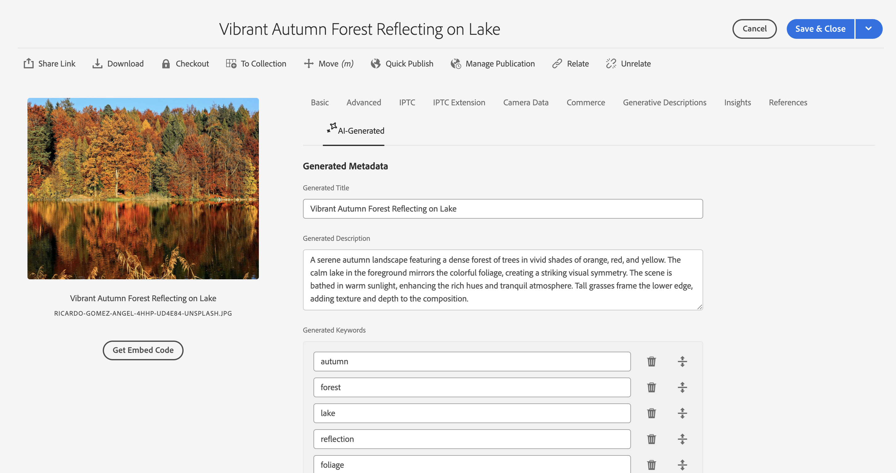
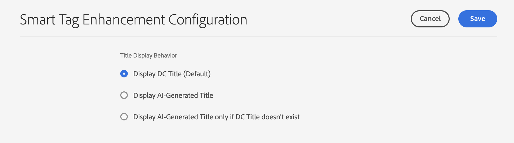

# Enhancing content discovery with AI-Generated metadata {#ai-smart-tags}

| UIs | Article link |
| -------- | ---------------------------- |
| Assets View  |    [Click here](/help/assets/ai-generated-metadata-assets-view.md)                  |
| Admin View     | This article         |

Instead of relying on manual input, AI automatically assigns descriptive tags to digital assets. These AI-generated tags enhance metadata quality, making the assets easier to search, categorize, and recommend. This approach not only improves efficiency by eliminating manual tagging but also ensures consistency and scalability across large volumes of digital content. For example, if the asset is an image, AI can identify objects, scenes, emotions, or even brand logos within it and generate relevant tags such as "sunset," "beach," "vacation," or "smiling." AI-generated content can enhance the search for assets by leveraging both semantic and lexical search techniques. See more [Search Assets](search-assets.md). <!--If the asset is a document, AI reads and interprets the text to assign meaningful keywords that summarize its content—such as "climate change," "policy," or "renewable energy.-->

  

## How to enable AI-generated metadata? {#enable-ai-generated-metadata}

To enable AI-generated metadata:

* Minimum required AEM release version is `20626`.

## Configure AI-generated titles {#configure-ai-generated-titles}

AEM enables you to configure the display of asset titles in Card view or List view on the Asset Browse page. You can choose to display the asset title defined by you, title generated using AI, or use AI-generated title only if there is no existing title for the asset.

To configure AI-generated titles:

1. Navigate to **[!UICONTROL Tools > Assets > Assets Configurations > Smart Tag Enhancement Configuration]**.

1. Select one of the following options:

   * **Display DC Title (Default)**: Specify the title in the **[!UICONTROL Title]** field available in asset properties to display it in Card view or List view. If the asset title is not defined, AEM Assets displays the file name.

   * **Display AI-Generated Title**: Displays the AI-generated title and ignores the title specified in asset properties. If AI-generated title is not available for an asset, AEM Assets displays the default asset title available in its properties.

   * **Display AI-Generated Title only if DC Title doesn't exist**: AEM Assets displays the AI-generated title only if asset title is not defined for an asset.  

     

## Using AI-Generated metadata {#using-ai-generated-smart-tags}

<!--
[!NOTE]
>
>The enhanced smart tags capability is available only for the newly uploaded assets.
-->

To use the enhanced smart tags feature, execute the following steps:

1. In the [!DNL Experience Manager] interface, go to the desired folder and click **[!UICONTROL Add Assets]**. <!--Alternatively, to update enhanced smart tags in an existing content, click **[!UICONTROL reprocess]**.--> The compatible image file formats are `png`, `jpg`, `jpeg`,`psd`, `tiff`, `gif`, `webp`, `crw`, `cr2`, `3fr`, `nef`, `arw`, and `bmp`.

1. Wait until the newly uploaded asset is processed. Once done, go to asset properties.

1. Go to **[!UICONTROL AI-Generated]** tab. If [!DNL Experience Manager] version is incompatible or not updated, then this tab is not visible. The following fields are there:

    * **[!UICONTROL Generated title]:** The title provides a clear and concise headline that captures the core idea of an uploaded asset, making it easy to understand at a glance. When adding an asset, if you provide a title (in `dc:title`), it will be displayed in the assets browse view. If left blank, an AI-generated title will be assigned automatically.
    * **[!UICONTROL Generated description]:** The description gives a brief yet informative summary of what the asset is about, helping users and search module to quickly grasp its relevance.
    * **[!UICONTROL Generated keywords]:** The keywords are targeted terms that represent the main themes of an asset, aiding in tagging and content filtering.

1. [Optional] You may add additional tags or create your own if you feel any relevant tags are missing. To do this, write your tags in the  **[!UICONTROL Generated keywords]** field and click **[!UICONTROL Save]**.

## Disable AI-generated metadata {#disable-ai-generated-metadata}

You can disable AI-generated metadata for your AEM as a Cloud Service environment or you can disable it at a folder-level.

To disable AI-generated metadata for AEM as a Cloud Service environment:

1. Navigate to **[!UICONTROL Tools > Assets > Assets Configurations > Smart Tag Enhancement Configuration]**.

1. Select **[!UICONTROL Disable Smart Tag Enhancements]**.

1. Click **[!UICONTROL Save]** .

The AI-generated metadata is disabled for the new assets or folders that you upload to AEM Assets. The existing assets or folders that have AI-generated metadata fields already generated still continue to display these fields.

### Disable AI-generated metadata for folders {#disable-ai-generated-metadata-folder-level}

To disable AI-generated metadata at a folder-level:

1. Select the folder and click **[!UICONTROL Properties]**.

1. Select **[!UICONTROL Asset Processing]** tab.

1. In the **[!UICONTROL Smart Tags Enhancements for images]** section, select **[!UICONTROL Disable]** from the drop-down menu.

1. Click **[!UICONTROL Save & Close]** to disable AI-generated metadata for the selected folder.
