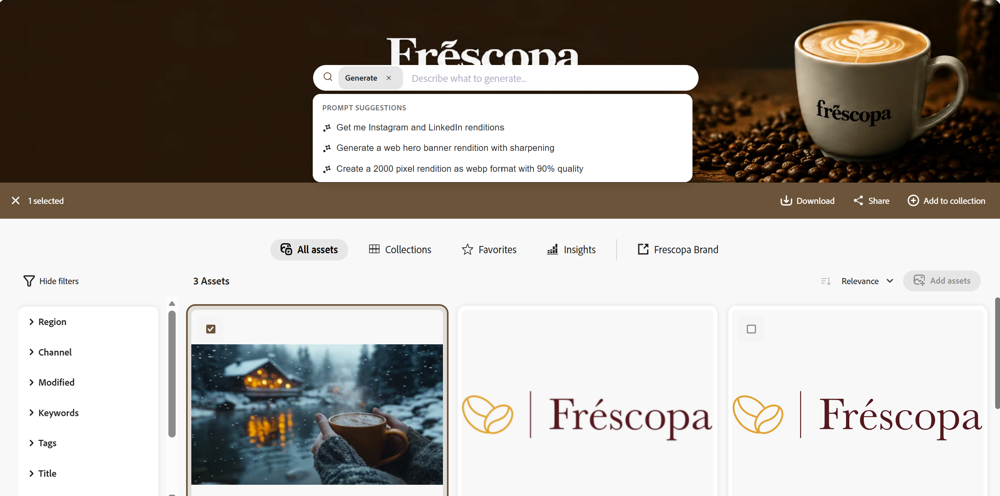
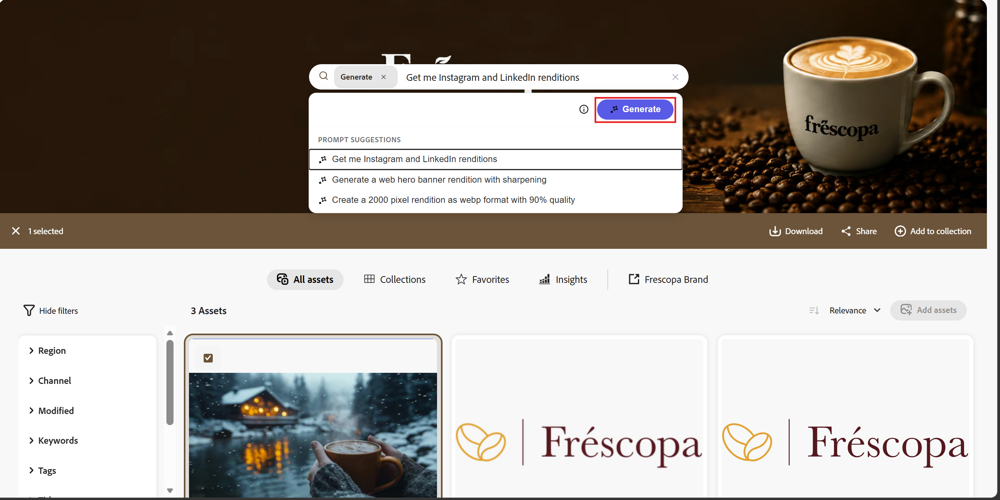
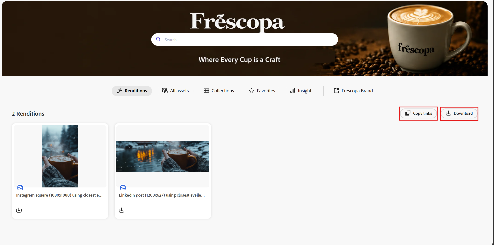

# Generate on the fly Dynamic Media renditions {#generate-on-the-fly-dynamic-media-renditions}

You can generate channel-specific Dynamic Media renditions directly from the Content Hub Search bar using natural language prompts. Content Hub creates optimized renditions on demand for different channels by applying transformations such as resize, smart crop, compression, reformatting, and composite images. These transformations help optimize assets for different channels and improve delivery performance.

Generated renditions are displayed in the **[!UICONTROL Renditions]** tab. You can download a generated rendition or copy its Dynamic Media URL for use in downstream applications and channels.

## Generate Dynamic Media renditions {#generate-renditions}

To generate Dynamic Media renditions:

1. Navigate to **Content Hub** and search for the assets that you want to use.
1. Select one or more assets.

   

1. The Search bar expands and displays suggested prompts for generating channel-specific Dynamic Media renditions.
1. Select one of the suggested prompts or enter your own prompt using natural language.
1. Click **[!UICONTROL Generate]**.

   Content Hub generates the requested renditions on demand and displays them in the **[!UICONTROL Renditions]** tab.

   

## Download or share renditions {#download-share-renditions}

From the **[!UICONTROL Renditions]** tab, you can:

* Download a generated rendition.
* Copy the Dynamic Media URL to use the rendition in downstream applications or channels.

## Limitations {#limitations}

* Generated renditions are created on demand and are not saved back to Content Hub.
* Generated renditions are temporary.
* Only one generated rendition session is active at a time.
* Generating renditions for a new set of assets replaces the renditions generated for the previous session.
* To retain a generated rendition, download it or copy its Dynamic Media URL before generating renditions for another set of assets.