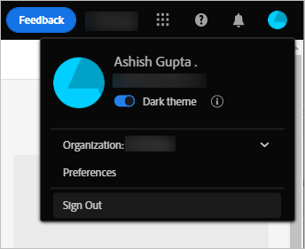

# Get started with Assets view {#assets-view-get-started}

| [Search Best Practices](/help/assets/search-best-practices.md) |[Metadata Best Practices](/help/assets/metadata-best-practices.md)|[Content Hub](/help/assets/product-overview.md)|[Dynamic Media with OpenAPI capabilities](/help/assets/dynamic-media-open-apis-overview.md)|[AEM Assets developer documentation](https://developer.adobe.com/experience-cloud/experience-manager-apis/)|
| ------------- | --------------------------- |---------|----|-----|

<!-- TBD: Make links for these steps. -->

Managing your digital assets using [!DNL Assets View] requires only three simple steps:

* **Step 1**: [Upload](/help/assets/add-delete-assets-view.md) and [view](/help/assets/navigate-assets-view.md) assets.
* **Step 2**: [Search](/help/assets/search-assets-view.md) and [download](/help/assets/manage-organize-assets-view.md#download) assets.
* **Step 3**: [Manage and organize](/help/assets/manage-organize-assets-view.md) the assets.

To use [!DNL Assets View], log in at [https://experience.adobe.com/#/assets](https://experience.adobe.com/#/assets). When logging in, select `Company or School Account`. To receive access, contact your organization's administrator.

<!--In addition, more reference information that can be helpful is [understanding of the user interface](/help/assets/navigate-assets-view.md), [list of use cases](#use-cases), [supported file types](/help/assets/supported-file-formats-assets-view.md), and [known issues](/help/assets/release-notes.md#known-issues).
-->

## Access Assets view {#access-assets-view}

See [How to access Assets view](/help/assets/assets-view-introduction.md#how-to-access-assets-view) for the detailed instructions on how to access Assets view.

## Configure [!DNL Assets View] {#configuration}

To open preferences, click the avatar in the upper-right corner of the user interface. You can switch between the light and the dark themes in the solution preferences.

If you are part of different organizations, you can also change the organization and access your accounts across various organizations.

To change your [!UICONTROL Experience Cloud preferences], Click [!UICONTROL Preferences].

>[!NOTE]
>
>If you navigate to Assets view and see a `Network Error` message, ensure that you execute the instructions mentioned in [Cross-Origin Resource Sharing (CORS) configuration](/help/headless/deployment/cross-origin-resource-sharing.md) article.

## [!DNL Assets View] use cases {#use-cases}

The various digital asset management (DAM) tasks that you can accomplish using [!DNL Assets View] are below.

| User tasks | Functionality and how-to information |
|-----|------|
| Browse and view assets | <ul> <li>[Browse the repository](/help/assets/navigate-assets-view.md#view-assets-and-details) </li> <li> [Preview an asset](/help/assets/navigate-assets-view.md#preview-assets) <li> [View renditions of an asset](/help/assets/add-delete-assets-view.md#renditions) </li> <li>[View versions of an asset](/help/assets/manage-organize-assets-view.md#view-versions)</li></ul> |
| Add new assets | <ul> <li>[Upload new assets and folders](/help/assets/add-delete-assets-view.md)</li> <li>[Monitor upload progress and manage uploads](/help/assets/add-delete-assets-view.md#upload-progress)</li> <li>[Resolve duplicates](/help/assets/add-delete-assets-view.md)</li> </ul> |
| Update assets or related information | <ul> <li>[Edit images](/help/assets/edit-images-assets-view.md)</li> <li>[Create versions](/help/assets/manage-organize-assets-view.md#create-versions) and [view versions](/help/assets/manage-organize-assets-view.md#view-versions)</li> <li>[Edit images](/help/assets/edit-images-assets-view.md)</li> </ul> |
| Edit assets | <ul> <li>[In-browser edits using Adobe Photoshop Express](/help/assets/edit-images-assets-view.md)</li> <li>[Crop for a social media profile](/help/assets/edit-images-assets-view.md#crop-straighten-images)</li> <li>[View and manage versions](/help/assets/manage-organize-assets-view.md#view-versions)</li></ul></ul> |
| Search for assets in the repository | <ul> <li>[Search within a specific folder](/help/assets/search-assets-view.md#refine-search-results)</li> <li>[Saved searches](/help/assets/search-assets-view.md#saved-search)</li> <li>[Search for recently viewed assets](/help/assets/search-assets-view.md)</li> <li>[Full-text search](/help/assets/search-assets-view.md) |
| Download assets | <ul> <li> [Preview asset](/help/assets/navigate-assets-view.md#preview-assets) </li> <li> [Download assets](/help/assets/manage-organize-assets-view.md#download) <li> [Download renditions](/help/assets/add-delete-assets-view.md#renditions) </li></ul> |
| Metadata operations | <ul> <li>[View detailed metadata](/help/assets/metadata-assets-view.md) </li> <li> [Update metadata](/help/assets/metadata-assets-view.md#update-metadata)</li> <li> [Create new metadata form](/help/assets/metadata-assets-view.md#metadata-forms) </li> </ul> |

## Next Steps {#next-steps}

* [Watch a video to get started with Assets View](https://experienceleague.adobe.com/docs/experience-manager-learn/assets-essentials/getting-started.html)

* Provide product feedback using the [!UICONTROL Feedback] option available on the Assets View user interface

* Provide documentation feedback using [!UICONTROL Edit this page]  or [!UICONTROL Log an issue]  available on the right sidebar

* Contact [Customer Care](https://experienceleague.adobe.com/?support-solution=General#support)

<!--TBD: Merge the below rows in the table when the use cases are documented/available.

| How do I delete assets? | <ul> <li>[Delete assets](/help/assets/manage-organize.md)</li> <li>Recover deleted assets</li> <li>Permanently delete assets</li> </ul> |
| How do I share assets or find shared assets? | <ul> <li>Shared by me</li> <li>Shared with me</li> <li>Share for comments and review</li> <li>Unshare assets</li> </ul> |
| How do I collaborate with others and get my assets reviewed | <ul> <li>Share for review</li> <li>Provide comments. Resolve and filter comments</li> <li>Annotations on images</li> <li>Assign tasks to specific users and prioritize</li> </ul> |

-->

<!-- 

##  Provide product feedback {#provide-feedback}

Adobe welcomes feedback about the solution. To provide feedback without even switching your working application, use the [!UICONTROL Feedback] option in the user interface. It also lets you attach files such as screenshots or video recording of an issue.

  

To provide feedback for documentation, click [!UICONTROL Edit this page]  or [!UICONTROL Log an issue]  from the right sidebar. You can do one of the following: 

* Make the content updates and submit a GitHub pull request.
* Create an issue or ticket in GitHub. Retain the automatically populated article name when creating an issue.

-->
<!--
>[!MORELIKETHIS]
>
>* [Understand the user interface](/help/assets/navigate-asssets-view.md).
>* [Release notes and known issues](/help/assets/release-notes.md).
>* [Supported file types](/help/assets/supported-file-formats.md).
-->
