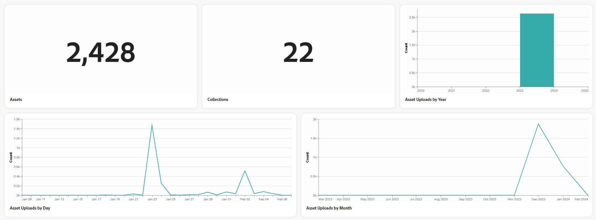
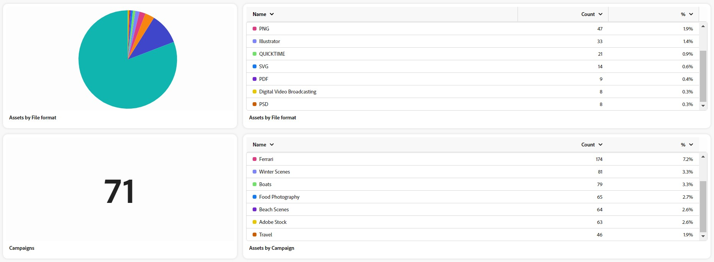

# Assets Insights in [!DNL Content Hub] {#assets-insights}

| [Search Best Practices](/help/assets/search-best-practices.md) |[Metadata Best Practices](/help/assets/metadata-best-practices.md)|[Content Hub](/help/assets/product-overview.md)|[Dynamic Media with OpenAPI capabilities](/help/assets/dynamic-media-open-apis-overview.md)|[AEM Assets developer documentation](https://developer.adobe.com/experience-cloud/experience-manager-apis/)|
| ------------- | --------------------------- |---------|----|-----|

 

 >[!AVAILABILITY]
 >
 >Content Hub guide is now available in PDF format. Download the entire guide and use Adobe Acrobat AI Assistant to answer your queries. 
 >
 >[!BADGE Content Hub Guide PDF]{type=Informative url="https://helpx.adobe.com/content/dam/help/en/experience-manager/aem-assets/content-hub.pdf"}

[!DNL Content Hub] provides valuable insights into assets, addressing a common challenge that marketing stakeholders often encounter - asset usage statistics used in marketing campaigns, channels, and different regions. By gaining a clear understanding of the performance and popularity of the assets, it delivers actionable insights essential for enhancing user experience.

## Prerequisites {#prerequisites}

[Content Hub users](deploy-content-hub.md#onboard-content-hub-users) can perform actions mentioned in this article.

## View statistics for uploaded assets{#view-statistics-for-uploaded-assets}

You can view statistics of the uploaded assets and collections by navigating to the **[!UICONTROL Insights]** tab. Track the upload history of your assets with the yearly, monthly, and daily asset uploads view.
   
   

<!-- You can track the upload history of your assets over the past 30 days or gain a more comprehensive view with data spanning the last 12 months. This feature enables you to evaluate the upload count of assets.  -->

<!-- Go to the **[!UICONTROL [!DNL Insights]]** tab.

2. Select the desired time frame to view the statistics; you can opt for either last 30 days or last 12 months.

Data for the selected time frame is displayed, including the upload count for the specified duration. -->

## View detailed statistical analysis{#view-detailed-statistical-analysis}

Content Hub lets you view statistics of the asset counts based on their file format, campaigns, channels, and regions. You can gain valuable insights into asset distribution facilitating informed decision-making and strategic planning.

The table presents a detailed overview of various assets, including their count and the respective percentage within the repository. You can adjust column sizes and sort assets by asset name, count, and percentage.

The pie chart visually represents the total count of assets by file format, providing a clear illustration of individual asset counts and their corresponding percentages.

 

You can also view:

* **Active Users by Day and Month**: Number of active users by day or by month represented using a line graph.
* **[!UICONTROL Assets by Campaigns]**: Asset count and respective percentage based on campaigns.
* **[!UICONTROL Assets by Channels]**: Asset count and respective percentage based on channels used.
* **[!UICONTROL Assets by Regions]**: Asset count and respective percentage based on regions of asset usage.
