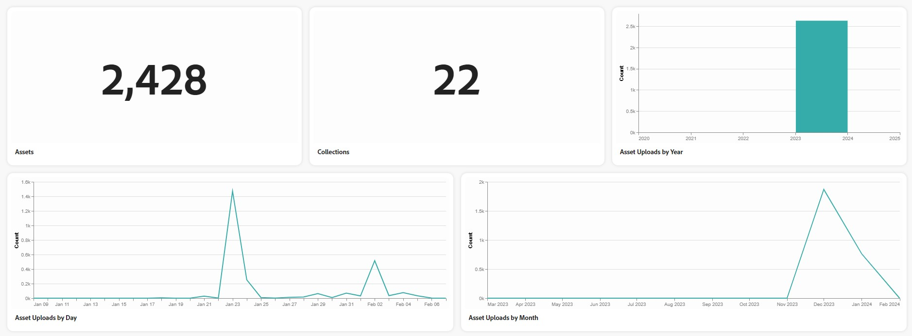
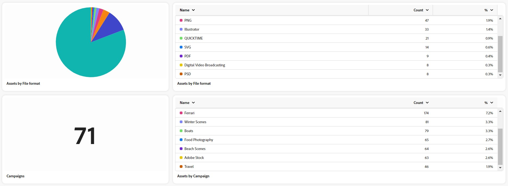

# Assets [!DNL Insights] in [!DNL Content Hub] {#assets-insights}

**Assets [!DNL Insights]** in [!DNL Content Hub] delivers a clear, data-driven view of how digital assets perform across marketing campaigns, channels, and regions. It directly addresses a common challenge for marketing stakeholders: understanding **asset usage statistics** so teams can see which content is actually being adopted and where.

## What Assets [!DNL Insights] Delivers

Assets [!DNL Insights] tracks **asset performance** and **asset popularity** across the key dimensions marketing teams care about:

- **Marketing campaigns** — Identify which assets are downloaded, shared, and reused most across active campaigns.
- **Channels** — Measure how assets perform across different distribution channels to understand where content resonates.
- **Regions** — Compare asset adoption across geographies to reveal regional preferences and localization needs.

By surfacing these usage statistics in one place, [!DNL Content Hub] eliminates the guesswork that stakeholders typically face when trying to evaluate content investments.

## Why Asset [!DNL Insights] Matter

A clear understanding of asset performance and popularity produces actionable insights that improve the overall user experience. Because teams can see which assets drive engagement, they can prioritize high-performing content, retire or refresh underperforming assets, and allocate creative resources more effectively. This leads to more relevant, on-brand experiences for end users, because decisions are grounded in measured usage rather than assumption.

As digital asset management increasingly depends on measurable outcomes, insights of this kind help marketing organizations connect content strategy to real audience behavior — turning raw usage data into a foundation for smarter, more efficient campaigns.

## Prerequisites {#prerequisites}

Only onboarded [Content Hub users](deploy-content-hub.md#onboard-content-hub-users) can perform the actions described in this article. Being provisioned as a [!DNL Content Hub] user is the required prerequisite, because access to [!DNL Content Hub] actions is governed by role-based permissions rather than granted automatically.

As a result, before attempting any of the procedures that follow, confirm that the relevant account has been onboarded as a [!DNL Content Hub] user. Users who have not completed onboarding cannot execute the actions covered here, so completing the onboarding step first ensures that every subsequent task can be performed without interruption. For details on how accounts are added, see the onboarding guidance linked above.

## View statistics for uploaded assets{#view-statistics-for-uploaded-assets}

The **[!UICONTROL Insights]** tab provides statistics for your uploaded assets and collections in one centralized view. Navigate to the **[!UICONTROL Insights]** tab to access these statistics and monitor how your asset library grows over time.

Use the [!DNL Insights] tab to **track the complete upload history of your assets**. This visibility helps you understand upload trends, identify periods of high or low activity, and make informed decisions about content management and storage planning.

   

<!-- You can track the upload history of your assets over the past 30 days or gain a more comprehensive view with data spanning the last 12 months. This feature enables you to evaluate the upload count of assets.  -->

<!--
 Go to the **[!UICONTROL [!DNL Insights]]** tab.

2. Select the desired time frame to view the statistics; you can opt for either last 30 days or last 12 months.

Data for the selected time frame is displayed, including the upload count for the specified duration.
-->

### Asset upload tracking views

Track your asset uploads across three levels of granularity:

- **Yearly asset uploads** — review long-term upload trends and compare activity year over year.
- **Monthly asset uploads** — monitor upload volume across individual months to spot seasonal or campaign-driven patterns.
- **Daily asset uploads** — examine day-by-day upload activity for detailed, short-term insight.

Because the **[!UICONTROL Insights]** tab presents upload data at yearly, monthly, and daily levels, you can move from a broad overview to a granular breakdown without leaving the dashboard. This layered reporting makes it easier to audit asset intake, verify that expected uploads have completed, and communicate library growth to stakeholders.

## View detailed statistical analysis{#view-detailed-statistical-analysis}

[!DNL Content Hub] reports asset counts across four analysis dimensions: **file format**, **campaigns**, **channels**, and **regions**. This detailed statistical analysis surfaces how assets are distributed throughout the repository. Reviewing these distributions drives informed decision-making and strategic planning, because it reveals which formats, campaigns, channels, and regions account for the largest share of assets.

The table presents a detailed overview of various assets, including their count and the respective percentage within the repository. You can adjust column sizes and sort assets by asset name, count, and percentage, allowing quick identification of the highest- and lowest-volume asset groups.

 

The pie chart displays the total count of assets by file format, clearly illustrating each individual asset count and its corresponding percentage. This visual breakdown makes it easy to compare the relative weight of each file format at a glance.

You can also view the following analyses, each useful for tracking usage patterns and optimizing asset strategy:

* **Active Users by Day and Month**: Number of active users by day or by month represented using a line graph.
* **[!UICONTROL Assets by Campaigns]**: Asset count and respective percentage based on campaigns.
* **[!UICONTROL Assets by Channels]**: Asset count and respective percentage based on channels used.
* **[!UICONTROL Assets by Regions]**: Asset count and respective percentage based on regions of asset usage.

## Frequently asked questions {#faqs-assets-insights-content-hub}

### What do we need Assets [!DNL Insights] in AEM Assets [!DNL Content Hub]?

**Assets [!DNL Insights]** in **Adobe Experience Manager (AEM) Assets [!DNL Content Hub]** deliver data-driven visibility into **asset usage statistics**, enabling marketing teams to measure how their digital assets perform once they are distributed and reused. Rather than guessing which creative content resonates, teams gain measurable evidence of asset performance and popularity.

Assets [!DNL Insights] track asset usage across three key dimensions:

- **Campaigns** — reveal which assets are being pulled into active marketing initiatives and how frequently they are reused.
- **Channels** — show where assets are deployed, such as social, web, email, or paid media, highlighting channel-level demand.
- **Regions** — surface geographic patterns in asset consumption, indicating which markets favor specific creative content.

Assets [!DNL Insights] help marketing stakeholders understand asset performance and popularity by turning distributed content into quantifiable signals. Because the data connects individual assets to their real-world usage, stakeholders can identify high-performing assets, retire underused ones, and prioritize the creation of content that consistently drives engagement. This leads to more informed, evidence-based decisions across the creative and marketing lifecycle.

By consolidating usage data in one place, Assets [!DNL Insights] support several practical outcomes:

- **Optimizing asset investment** — teams can direct budget and effort toward the creative styles, formats, and themes that demonstrate the strongest uptake.
- **Improving reuse and efficiency** — visibility into which assets are already performing well reduces duplicate creation and accelerates campaign delivery.
- **Enhancing the user experience** — surfacing the most effective and popular assets ensures audiences consistently encounter relevant, high-quality content across touchpoints.
- **Aligning global and regional strategy** — regional consumption trends allow marketers to tailor content to local preferences while maintaining brand consistency.

In practice, Assets [!DNL Insights] transform the [!DNL Content Hub] from a storage and distribution layer into a strategic analytics resource, giving marketing stakeholders a clear, comprehensive view of asset value across campaigns, channels, and regions.

### Who can access the features described in Assets [!DNL Insights] within AEM Assets [!DNL Content Hub]?

**[!DNL Content Hub] users can perform all actions and access every feature described in the Assets [!DNL Insights] section** of Adobe Experience Manager (AEM) Assets [!DNL Content Hub]. Access to the **Assets [!DNL Insights]** capabilities is granted specifically to **[!DNL Content Hub] users**, meaning that anyone provisioned with [!DNL Content Hub] access is entitled to use the full set of Assets [!DNL Insights] functionality without additional feature-level restrictions.

Because these capabilities are scoped to the [!DNL Content Hub] user population, access aligns with how the [!DNL Content Hub] is provisioned within an organization. In practice, this means:

- **Eligibility follows [!DNL Content Hub] access.** If a person is a [!DNL Content Hub] user, they can perform the actions and reach the features documented in the Assets [!DNL Insights] section.
- **No separate entitlement is required.** The features described in Assets [!DNL Insights] are available as part of the standard [!DNL Content Hub] user experience rather than being locked behind a distinct permission set.
- **Consistent feature availability.** Every action and feature outlined in the Assets [!DNL Insights] section is accessible to the [!DNL Content Hub] user, ensuring a uniform experience across those with [!DNL Content Hub] access.

This scoping approach is common in enterprise digital asset management, where access to insight and analytics features is tied to the user's provisioned role. As a result, granting a user access to the [!DNL Content Hub] inherently enables the Assets [!DNL Insights] features described, because the two are governed by the same access boundary.

### What asset insights are available in the [!DNL Insights] tab of AEM Assets [!DNL Content Hub]?

The **[!DNL Insights] tab** of Adobe Experience Manager (AEM) Assets [!DNL Content Hub] provides a centralized analytics dashboard that reports on asset volume, collection counts, upload activity, user engagement, and file-format distribution. Administrators and users can monitor the following key metrics:

- **Total number of assets** in the repository — a real-time count of all digital assets stored in [!DNL Content Hub], useful for tracking overall repository growth.
- **Total number of collections** — the count of organized asset groupings, which helps assess how content is being curated and structured.
- **Asset uploads by year, month, or day** — upload trends across selectable time intervals, allowing teams to identify peak contribution periods and measure content-production velocity.
- **Active users by day or month** — engagement metrics that show how many users are actively working within [!DNL Content Hub] over a given period, supporting adoption and usage analysis.
- **Asset classification based on file formats** — a breakdown of assets by file type, which helps administrators understand the composition of the repository and plan for storage, governance, or format standardization.

Together, these insights give teams a clear, quantitative view of repository size, content activity, and user behavior. Because the metrics can be filtered by time period, they enable trend analysis over time rather than a single snapshot, making the [!DNL Insights] tab a practical tool for governance, capacity planning, and measuring platform adoption within AEM Assets [!DNL Content Hub].

### How can I view statistics for uploaded assets in AEM Assets [!DNL Content Hub]?

To view statistics for uploaded assets and collections in **Adobe Experience Manager (AEM) Assets [!DNL Content Hub]**, navigate to the **[!DNL Insights] tab**. This tab is the central location for tracking asset activity and reporting on your organization's upload history.

The **[!DNL Insights] tab** provides visibility into both individual assets and collections uploaded to [!DNL Content Hub]. It functions as an analytics dashboard, consolidating upload activity into a single, scannable view. From here, you can monitor how assets are being added to the platform over time.

The [!DNL Insights] tab tracks upload history across multiple time granularities, allowing you to view statistics at the level of detail that suits your reporting needs:

- **By year** — for a high-level overview of long-term upload trends
- **By month** — for identifying seasonal or campaign-driven activity
- **By day** — for granular, day-to-day tracking of recent uploads

Tracking upload history through the [!DNL Insights] tab helps teams measure how actively their asset library is growing and how frequently new content is contributed. Because upload activity can be reviewed by year, month, or day, administrators and content managers can spot usage patterns, verify that assets are being added as expected, and report on [!DNL Content Hub] adoption over time. This makes the [!DNL Insights] tab a practical tool for monitoring digital asset management workflows and supporting data-driven decisions about content operations.

### Which metrics can I analyze regarding user activity in AEM Assets [!DNL Content Hub]?

Adobe Experience Manager (AEM) Assets [!DNL Content Hub] lets administrators and content managers analyze **user activity metrics** based on the number of active users. Specifically, you can track **active users by day** and **active users by month**, both visually represented through a **line graph** within the [!DNL Content Hub] interface.

- **Active users by day** — the count of distinct users engaging with [!DNL Content Hub] on a daily basis.
- **Active users by month** — the count of distinct users engaging with [!DNL Content Hub] across each month.
- **Line graph visualization** — both daily and monthly figures are plotted on a line graph, making usage patterns easy to read at a glance.

This time-based visualization makes it straightforward to identify usage trends, activity spikes, and periods of lower engagement over time. Because the data is presented as a **line graph**, administrators can quickly compare short-term (daily) and longer-term (monthly) patterns side by side. Monitoring these active-user metrics helps teams gauge [!DNL Content Hub] adoption, measure ongoing engagement, and support data-driven decisions about content strategy and platform usage.

**See also**

* [Translate Assets](/help/assets/translate-assets.md)
* [Assets HTTP API](/help/assets/mac-api-assets.md)
* [Assets supported file formats](/help/assets/file-format-support.md)
* [Search assets](/help/assets/search-assets.md)
* [Connected assets](/help/assets/use-assets-across-connected-assets-instances.md)
* [Asset reports](/help/assets/asset-reports.md)
* [Metadata schemas](/help/assets/metadata-schemas.md)
* [Download assets](/help/assets/download-assets-from-aem.md)
* [Manage metadata](/help/assets/manage-metadata.md)
* [Manage Dynamic Media templates](/help/assets/dynamic-media/manage-dynamic-media-templates.md)
* [Manage reports in Assets view](/help/assets/manage-reports-assets-view.md)
* [Search facets](/help/assets/search-facets.md)
* [Manage collections](/help/assets/manage-collections.md)
* [Bulk metadata import](/help/assets/metadata-import-export.md)
* [Publish Assets to AEM and Dynamic Media](/help/assets/publish-assets-to-aem-and-dm.md)
