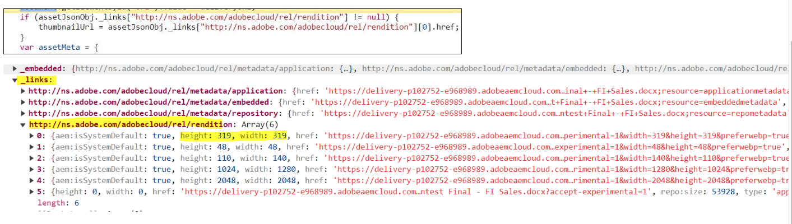
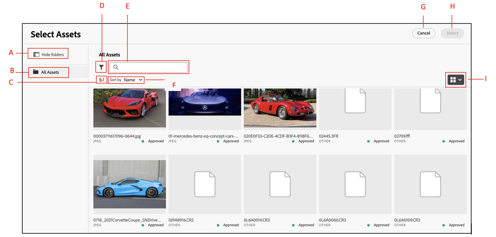

# Integration for Dynamic Media with OpenAPI capabilities {#integrate-asset-selector-dynamic-media-open-apis}

| [Search Best Practices](/help/assets/search-best-practices.md) |[Metadata Best Practices](/help/assets/metadata-best-practices.md)|[Content Hub](/help/assets/product-overview.md)|[Dynamic Media with OpenAPI capabilities](/help/assets/dynamic-media-open-apis-overview.md)|[AEM Assets developer documentation](https://developer.adobe.com/experience-cloud/experience-manager-apis/)|
| ------------- | --------------------------- |---------|----|-----|

Asset Selector allows you to integrate using various Adobe applications to enable them to work together seamlessly.


## Prerequisites {#prereqs-polaris}

Use the following prerequisites if you are integrating Asset Selector with Dynamic Media with OpenAPI capabilities:

* [Communication methods](/help/assets/overview-asset-selector.md#prereqs)
* To access Dynamic Media with OpenAPI capabilities, you must have licenses for:
    * Assets repository (for example, Experience Manager Assets as a Cloud Service).
    * AEM Dynamic Media.
* Only [approved assets](/help/assets/approve-assets.md) are available for use ensuring brand consistency.

## Integration for Dynamic Media with OpenAPI capabilities {#adobe-app-integration-polaris}

Integration of Asset Selector with Dynamic Media OpenAPI process involves various steps that includes creating a customized dynamic media URL or ready to pick dynamic media URL, etc.

### Integrate Asset Selector for Dynamic Media with OpenAPI capabilities {#integrate-dynamic-media}

The `rootPath` and `path` properties should not be a part of the Dynamic Media with OpenAPI capabilities. Instead, you can configure the `aemTierType` property. Following is the syntax of configuration:

```
aemTierType:[1: "delivery"]
```

This configuration allows you to view all the approved assets without folders or as a flat structure. For more information, navigate to `aemTierType` property under [Asset Selector properties](/help/assets/asset-selector-properties.md).


### Create a Dynamic Delivery URL from approved assets {#create-dynamic-media-url}

Once you set up Asset Selector, a schema of objects is used to create a Dynamic Delivery URL from the selected assets.
For example, a schema of one object from an array of objects that is received upon the selection of an asset:

```
{
"dc:format": "image/jpeg",
"repo:assetId": "urn:aaid:aem:xxxxxxxx-xxxx-xxxx-xxxx-xxxxxxxxxxxx",
"repo:name": "image-7.jpg",
"repo:repositoryId": "delivery-pxxxx-exxxxxx.adobe.com",
...
}
```

All the selected assets are carried by `handleSelection` function that acts as a JSON object. For example, `JsonObj`. The dynamic delivery URL is created by combining the below carriers:

| Object | JSON |
|---|---|
|Host | `assetJsonObj["repo:repositoryId"]`|
|API root | `/adobe/dynamicmedia/deliver` |
|asset-id | `assetJsonObj["repo:assetId"]`|
|seo-name |`assetJsonObj["repo:name"].split(".").slice(0,-1).join(".")`|
|format|`.jpg`|

#### Approved assets delivery API specification {#approved-assets-delivery-api-specification}

URL format:
`https://<delivery-api-host>/adobe/dynamicmedia/deliver/<asset-id>/<seo-name>.<format>?<image-modification-query-parameters>`

Where,

* Host is `https://delivery-pxxxxx-exxxxxx.adobe.com`
* API root is `"/adobe/dynamicmedia/deliver"`
* `<asset-id>` is Asset identifier
* `<seo-name>` is name of an asset
* `<format>` is the output format
* `<image modification query parameters>` as support by the approved assets' delivery API specification

#### Approved assets delivery API {#approved-assets-delivery-api}

The dynamic delivery URL possesses the following syntax:
`https://<delivery-api-host>/adobe/assets/deliver/<asset-id>/<seo-name>`, where,

* Host is `https://delivery-pxxxxx-exxxxxx.adobe.com`
* API root for Original Rendition Delivery is `"/adobe/assets/deliver"`
* `<asset-id>` is asset identifier
* `<seo-name>`is name of the asset that may or may not have an extension

### Ready to pick dynamic delivery URL {#ready-to-pick-dynamic-delivery-url}

All the selected assets are carried by `handleSelection` function that acts as a JSON object. For example, `JsonObj`. The dynamic delivery URL is created by combining the below carriers:

| Object | JSON |
|---|---|
|Host | `assetJsonObj["repo:repositoryId"]`|
|API root | `/adobe/assets/deliver` |
|asset-id | `assetJsonObj["repo:assetId"]`|
|seo-name |`assetJsonObj["repo:name"]`|

Below are the two ways to traverse the JSON object:



* **Thumbnail:** Thumbnails can be images and assets are PDF, video, images, and so on. Although, you can use the height and width attributes of an asset's thumbnail as the dynamic delivery rendition.
The following set of renditions can be used for the PDF type assets:
Once a pdf is selected in sidekick, the selection context offers the below information. Below is the way to traverse the JSON object:

    <!---->

    You can refer to `selection[0].....selection[4]` for the array of rendition link from the above screenshot. For example, the key properties of one of the thumbnail renditions include: 
    
    ```
    { 
        "height": 319, 
        "width": 319, 
        "href": "https://delivery-pxxxxx-exxxxx-cmstg.adobeaemcloud.com/adobe/assets/urn:aaid:aem:8560f3a1-d9cf-429d-a8b8-d81084a42d41/as/algorithm design.jpg?accept-experimental=1&width=319&height=319&preferwebp=true", 
        "type": "image/webp" 
    } 
    ```

In the above screenshot, the delivery URL of the PDF's original rendition needs to be incorporated in the target experience if PDF is required and not its thumbnail. For example, `https://delivery-pxxxxx-exxxxx-cmstg.adobeaemcloud.com/adobe/assets/urn:aaid:aem:8560f3a1-d9cf-429d-a8b8-d81084a42d41/original/as/algorithm design.pdf?accept-experimental=1`

* **Video:** You can use video player URL for the video type assets which uses an embedded iFrame. You can use the following array renditions in the target experience:
    <!---->
   
    ```
    { 
        "height": 319, 
        "width": 319, 
        "href": "https://delivery-pxxxxx-exxxxx-cmstg.adobeaemcloud.com/adobe/assets/urn:aaid:aem:2fdef732-a452-45a8-b58b-09df1a5173cd/as/asDragDrop.2.jpg?accept-experimental=1&width=319&height=319&preferwebp=true", 
        "type": "image/webp" 
    } 
    ```

    You can refer to `selection[0].....selection[4]` for the array of rendition link from the above screenshot. For example, the key properties of one of the thumbnail renditions include:

    The code snippet in the above screenshot is an example of a video asset. It includes renditions links array. The `selection[5]` in the excerpt is the example of image thumbnail which can be used as the placeholder of video thumbnail in the target experience. The `selection[5]` in the renditions' array is for the video player. This serves an HTML, and can be set as `src` of the iframe. It supports adaptive bitrate streaming which is web-optimized delivery of the video. 
    
    In the above example, the video player URL is `https://delivery-pxxxxx-exxxxx-cmstg.adobeaemcloud.com/adobe/assets/urn:aaid:aem:2fdef732-a452-45a8-b58b-09df1a5173cd/play?accept-experimental=1` 

### Configure custom filters {#configure-custom-filters-dynamic-media-open-api}

Asset Selector for Dynamic Media with OpenAPI capabilities allows you to configure custom properties and the filters based on them. The `filterSchema` property is used to configure such properties. The customization can be exposed as `metadata.<metadata bucket>.<property name>.` against which the filters can be configured, where,

* `metadata` is the information of an asset
* `embedded` is the static parameter used for configuration, and
* `<propertyname>` is the filter name that you are configuring

For the configuration, properties that are defined at `jcr:content/metadata/` level are exposed as `metadata.<metadata bucket>.<property name>.` for the filters that you want to configure.

For example, in Asset Selector for Dynamic Media with OpenAPI capabilities, a property on `asset jcr:content/metadata/client_name:market` is converted into `metadata.embedded.client_name:market` for filter configuration.

To get the name, a one-time activity must be done. Make a search API call for the asset and get the property name (the bucket, essentially).

### Asset Selector user interface for Dynamic Media with OpenAPI capabilities {#interface-dynamic-media-open-api}

After integration with the Adobe's Micro-Frontend Asset Selector, you can see the assets only structure of all the approved assets available in Experience Manager assets repository. 



* **A**: [Hide/Show panel](#hide-show-panel)
* **B**: [Assets](#repository)
* **C**: [Sorting](#sorting)
* **D**: [Filters](#filters)
* **E**: [Search bar](#search-bar)
* **F**: [Sorting in ascending or descending order](#sorting)
* **G**: Cancel Selection
* **H**: Select single or multiple assets

>[!MORELIKETHIS]
>
>* [Integrate Asset Selector with various applications](/help/assets/integrate-asset-selector.md)
>* [Asset Selector properties](/help/assets/asset-selector-properties.md)
>* [Asset Selector customizations](/help/assets/asset-selector-customization.md)
