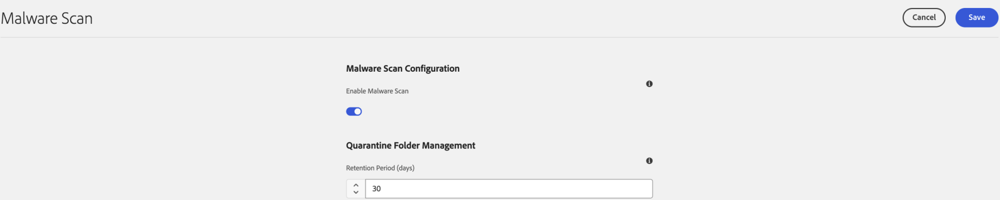
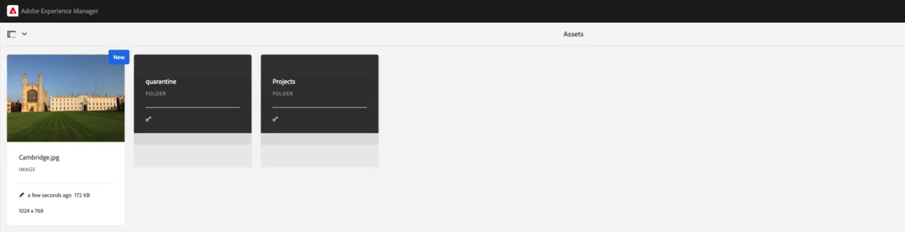

# Malware Detection {#malware-detection-overview}

Malware detection during asset uploads is crucial for maintaining the security of your Digital Asset Management (DAM) system. When you upload assets, such as images, videos, documents, and other files, they are scanned for potential threats before being processed. AEM Assets automatically scans uploaded files for malware and quarantines any suspicious assets, preventing unsafe content from entering the DAM. Assets through [bulk import](/help/assets/bulk-import-assets-view.md), [Assets View](/help/assets/assets-view-introduction.md), and [Content Hub](/help/assets/product-overview.md) are scanned during preprocessing, ensuring consistent malware protection across all upload methods. Administrators can [manage quarantine settings and retention policies](#malware-detection-configuration) to [maintain](#quarantine-folder-actions) security.

## Key capabilities {#key-capabilities-malware-detection}

Safeguarding assets involves the following features:

* **Pre-Upload Checks:** Validate file types, size, and integrity to prevent corrupted or incompatible files.
* **Real-Time Scanning:** Detect suspicious or unusual file structures that could indicate malware.
* **Incident Response:** If malware is detected, the asset is quarantined in an isolated folder to prevent it from being uploaded to DAM.

## Prerequisites {#prerequisites-malware-detection}

Malware detection in AEM Assets requires AEM Administrator permissions. In addition, you must have a valid license for either [AEM Assets as a Cloud Service](https://helpx.adobe.com/enterprise/using/support-for-experience-cloud.html) or [Assets Ultimate](/help/assets/assets-ultimate-overview.md).

## Malware Detection Configuration {#malware-detection-configuration}

Follow the steps below to configure malware detection in AEM Assets:

1. Log in to AEM Assets Admin view.

1. Navigate to **[!UICONTROL Tools]** > **[!UICONTROL Assets]** > **[!UICONTROL Assets Configurations]** and select **[!UICONTROL Malware Scan Configuration]**. Malware Scan configuration screen appears.

1. Enable malware scanning by turning on the **[!UICONTROL Enable Malware Scan]** toggle.

1. In the **[!UICONTROL Quarantine Folder Management]** section, use the **[!UICONTROL Retention Period]** setting to specify how many days assets should remain in quarantine before they are automatically deleted. By default, assets are retained for 30 days. Refer to [quarantine folder management](#quarantine-folder-management).

1. Click **[!UICONTROL Save]** to apply the configuration.

    

## Malware Detection Process in AEM Assets {#process-of-malware-detection}

AEM Assets scans all uploaded files for potential threats by following the steps mentioned below:

1. Upload an asset to the DAM.

1. The malware scanning process starts automatically in a preprocessing state.

1. If flagged as suspicious or infected, the asset is placed in the **[!UICONTROL Quarantine]** folder. Whereas, clean assets proceed into the DAM for storage and processing. Though administrators can [review quarantined assets and manage cleanup](#quarantine-folder-management) based on retention settings. 

    

1. The following notifications are sent to the user who uploaded the asset:

    * **Asset Quarantined:** Triggered when an uploaded asset is detected as infected and moved to the quarantine folder.
    * **Asset Unquarantined:** When an administrator restores an asset from quarantine.
    * **Scan Skipped:** Sent when an asset exceeds the 2GB file size limit, preventing the scanner from determining its safety.
    * **Scan Failed:** When the scanner encounters an unexpected error and cannot verify the safety of an asset.

### Quarantine folder management {#quarantine-folder-management}

During the malware-detection process, any infected or suspicious assets are automatically moved to the **[!UICONTROL Quarantine]** folder to ensure they are not uploaded to the DAM. In [!DNL Experience Manager Assets], you can [configure](#malware-detection-configuration) how long these quarantined assets should be kept before they are removed. Additionally, the quarantine folder is only visible to administrators.

#### Quarantine folder actions {#quarantine-folder-actions}

Assets in the quarantine folder cannot be modified, and no new assets can be uploaded or created in the folder. However, administrators can select the asset(s) in a quarantine folder to perform the following actions:

* **View metadata:** Review the asset's properties or metadata to determine the appropriate next steps.
* **Unquarantine asset:** Select a quarantined asset and choose **[!UICONTROL Unquarantine]** to restore it to its original location. Administrators can also view details of assets that are unquarantined.
* **Delete asset:** Permanently remove an asset from the quarantine folder. Deleted assets cannot be recovered.

## Malware scan limitations {#malware-scan-limitations}

The following are the limitations of the malware scanning process for assets:

* Assets larger than 2GB are skipped, as the scanner cannot process files beyond this size.

* You cannot scan the existing assets for malware detection. 

